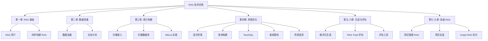

# RAG 技术面试 Concept Cards

> **版本:** 1.0
> **路径:** `D:\GitRepo-My\GameDevVault\Career\Kimi\RAG\`
> **适用场景:** RAG 技术面试前 30 分钟速读
> **原始资料:** [datawhalechina/all-in-rag](https://github.com/datawhalechina/all-in-rag)

---

## 总纲：RAG 技术体系脑图

---

## 第一章：RAG 基础入门

> 🎤 **打油诗：**
> RAG 系统四步走，加载分块加向量。
> 检索生成连一体，幻觉问题不用慌。

### Q1：什么是 RAG？
> **答：** RAG（Retrieval-Augmented Generation）是一种通过检索外部知识库来增强大语言模型生成能力的技术框架，解决 LLM 知识固化和幻觉问题。  
> **详情：** [Detail §1.1 RAG 简介](RAG_Detail.md)

### Q2：RAG 的最小可行系统包含哪四步？
> **答：** 数据准备（加载 + 分块）→ 索引构建（嵌入 + 向量存储）→ 检索优化（相似度搜索）→ 生成集成（LLM 生成答案）。  
> **详情：** [Detail §1.2 四步构建 RAG](RAG_Detail.md)

### Q3：LangChain 和 LlamaIndex 的核心区别是什么？
> **答：** LangChain 提供细粒度的组件编排能力（Chain + Agent），适合深度定制；LlamaIndex 提供高层的索引抽象（Index + Query Engine），适合快速原型。  
> **详情：** [Detail §1.3 框架对比](RAG_Detail.md)

### Q4：为什么 RAG 能解决 LLM 幻觉问题？
> **答：** RAG 通过检索外部知识库获取真实上下文，将 LLM 的生成范围约束在检索到的文档内容内，减少模型自由发挥。  
> **详情：** [Detail §1.4 幻觉与 RAG](RAG_Detail.md)

### 判断题锚定点
- ❌ 常见误解：RAG 能完全消除幻觉（→ 只能约束，不能根除）
- ❌ 常见误解：RAG 不需要 LLM，只用向量检索就能回答（→ 检索只召回上下文，生成仍需 LLM）

### 源码速查表
| 类/函数 | 文件/模块 | 作用 |
|---------|----------|------|
| `TextLoader` | `langchain_community.document_loaders` | 加载文本文件 |
| `RecursiveCharacterTextSplitter` | `langchain_text_splitters` | 递归字符分块 |
| `HuggingFaceEmbeddings` | `langchain_huggingface` | HuggingFace 嵌入模型 |
| `InMemoryVectorStore` | `langchain_core.vectorstores` | 内存向量存储 |
| `ChatPromptTemplate` | `langchain_core.prompts` | 提示词模板 |
| `VectorStoreIndex` | `llama_index.core` | LlamaIndex 向量索引 |
| `SimpleDirectoryReader` | `llama_index.core` | 目录文档加载 |

---

## 第二章：数据准备

> 🎤 **打油诗：**
> 分块策略千万种，语义完整是关键。
> 递归字符最常见，语义分块更高端。

### Q5：文本分块的目的是什么？
> **答：** 将长文档切分为适合嵌入模型上下文窗口和 LLM 输入限制的小单元，同时保持语义完整性。  
> **详情：** [Detail §2.1 文本分块](RAG_Detail.md)

### Q6：为什么 chunk 不是越大越好？
> **答：** 过大块会导致：① 嵌入信息稀释（Pooling 压缩损失）② LLM "Lost in the Middle" 效应 ③ 主题稀释降低检索精度。  
> **详情：** [Detail §2.2 块大小权衡](RAG_Detail.md)

### Q7：`CharacterTextSplitter` 和 `RecursiveCharacterTextSplitter` 的核心区别？
> **答：** `CharacterTextSplitter` 按固定分隔符分割后合并，遇超长段落只能保留；`RecursiveCharacterTextSplitter` 使用分隔符层级递归，遇超长会继续用更细粒度分隔符切分。  
> **详情：** [Detail §2.3 分块器对比](RAG_Detail.md)

### Q8：语义分块（Semantic Chunking）的原理是什么？
> **答：** 计算相邻句子嵌入向量的余弦距离，在语义跳跃显著的位置（超过统计阈值）进行切分。  
> **详情：** [Detail §2.4 语义分块](RAG_Detail.md)

### Q9：`MarkdownHeaderTextSplitter` 的优势是什么？
> **答：** 保留标题层级作为元数据注入，让 LLM 理解信息片段的来源和背景，适合结构化文档。  
> **详情：** [Detail §2.5 结构化分块](RAG_Detail.md)

### Q10：Sentence Window Retrieval 的核心思想？
> **答：** 检索时用单个句子做精确匹配，但返回给 LLM 时附带前后窗口句子，兼顾检索精度和上下文完整性。  
> **详情：** [Detail §2.6 句子窗口](RAG_Detail.md)

### 判断题锚定点
- ❌ 常见误解：`chunk_size` 应该尽可能接近嵌入模型的最大 Token 限制（→ 过大会导致信息稀释）
- ❌ 常见误解：`chunk_overlap` 越大越好（→ 重叠过多增加冗余，降低多样性）
- ❌ 常见误解：语义分块一定比递归字符分块好（→ 各有适用场景，语义分块计算成本高）

### 源码速查表
| 类/函数 | 文件/模块 | 作用 |
|---------|----------|------|
| `CharacterTextSplitter` | `langchain.text_splitter` | 固定大小分块 |
| `RecursiveCharacterTextSplitter` | `langchain.text_splitter` | 递归字符分块 |
| `SemanticChunker` | `langchain_experimental.text_splitter` | 语义分块 |
| `MarkdownHeaderTextSplitter` | `langchain.text_splitter` | Markdown 结构分块 |
| `SentenceWindowNodeParser` | `llama_index` | 句子窗口节点解析 |
| `Unstructured` | `unstructured` | 文档分区与分块 |

---

## 第三章：索引构建

> 🎤 **打油诗：**
> 嵌入模型选得好，检索质量差不了。
> BGE 模型是首选，归一化后更稳定。

### Q11：什么是 Embedding？
> **答：** 将高维非结构化数据（文本、图像）映射到低维稠密连续向量空间的技术，语义相似的对象向量距离更近。  
> **详情：** [Detail §3.1 向量嵌入基础](RAG_Detail.md)

### Q12：Embedding 在 RAG 中的作用？
> **答：** ① 离线索引：将文档块转为向量存入向量库；② 在线检索：将用户查询转为向量，计算相似度召回 Top-K 文档。  
> **详情：** [Detail §3.2 Embedding 作用](RAG_Detail.md)

### Q13：静态词嵌入（Word2Vec）和动态上下文嵌入（BERT）的核心区别？
> **答：** Word2Vec 为每个词生成固定向量，无法处理一词多义；BERT 基于 Transformer 编码器，通过自注意力动态生成上下文相关的向量。  
> **详情：** [Detail §3.3 嵌入技术演进](RAG_Detail.md)

### Q14：BERT 的 MLM 和 NSP 训练任务是什么？
> **答：** MLM（掩码语言模型）随机遮盖 15% 的 token 让模型预测；NSP（下一句预测）判断两个句子是否连续。RoBERTa 发现 NSP 可能损害性能，已移除。  
> **详情：** [Detail §3.4 BERT 训练](RAG_Detail.md)

### Q15：对比学习（Contrastive Learning）和度量学习（Metric Learning）的区别？
> **答：** 对比学习通过拉近正样本、推远负样本优化相对距离；度量学习以相似度为优化目标，优化排序关系而非追求绝对相似度值。  
> **详情：** [Detail §3.5 训练策略](RAG_Detail.md)

### Q16：MTEB 排行榜评估模型时需要关注哪些维度？
> **答：** 任务类型（Retrieval）、语言支持、模型大小、嵌入维度、最大 Token 数、得分排名、发布机构。  
> **详情：** [Detail §3.6 模型选型](RAG_Detail.md)

### Q17：向量数据库和传统数据库（MySQL）的本质区别？
> **答：** 向量数据库专用于高维向量的相似性搜索（ANN），采用 HNSW/IVF/LSH 等索引；传统数据库擅长结构化数据的精确匹配，采用 B-Tree/Hash 索引。  
> **详情：** [Detail §3.7 向量数据库](RAG_Detail.md)

### Q18：FAISS 和 Milvus 的适用场景分别是什么？
> **答：** FAISS 是轻量级本地算法库，适合原型开发和小规模应用；Milvus 是分布式向量数据库，适合生产环境和大规模部署。  
> **详情：** [Detail §3.8 向量库选型](RAG_Detail.md)

### 判断题锚定点
- ❌ 常见误解：向量数据库可以替代传统数据库（→ 是互补关系，非替代关系）
- ❌ 常见误解：FAISS 是一个数据库服务（→ 是算法库，索引保存为本地文件）
- ❌ 常见误解：嵌入模型越大越好（→ 需权衡显存、速度和场景需求）
- ❌ 常见误解：BERT 的 NSP 任务是现代模型标配（→ RoBERTa 已移除，发现有害）

### 源码速查表
| 类/函数 | 文件/模块 | 作用 |
|---------|----------|------|
| `HuggingFaceEmbeddings` | `langchain_huggingface` | 加载 HuggingFace 嵌入模型 |
| `FAISS.from_documents` | `langchain_community.vectorstores` | FAISS 索引创建 |
| `FAISS.load_local` | `langchain_community.vectorstores` | 加载本地 FAISS 索引 |
| `Collection` | `pymilvus` | Milvus 集合操作 |
| `AnnSearchRequest` | `pymilvus` | Milvus 近似搜索请求 |
| `BGEM3EmbeddingFunction` | `pymilvus.model.hybrid` | BGE-M3 混合嵌入 |

---

## 第四章：检索优化

> 🎤 **打油诗：**
> 稀疏密集两手抓，RRF 融合效果佳。
> 重排压缩再校正，检索质量顶呱呱。

### Q19：什么是混合检索（Hybrid Search）？
> **答：** 结合稀疏向量（关键词精确匹配，如 BM25）和密集向量（语义理解，如 BGE）两种检索方式，通过 RRF 或加权融合提升召回率和准确性。  
> **详情：** [Detail §4.1 混合检索](RAG_Detail.md)

### Q20：RRF（Reciprocal Rank Fusion）的核心思想？
> **答：** 不关心原始相似度分数，只根据文档在多个检索器结果列表中的排名计算融合分数：score = Σ 1/(rank_i + c)，c 通常取 60。  
> **详情：** [Detail §4.2 RRF 融合](RAG_Detail.md)

### Q21：Cross-Encoder 和 Bi-Encoder 的区别？
> **答：** Bi-Encoder 独立编码查询和文档，速度快适合召回；Cross-Encoder 拼接查询和文档联合编码，精度高适合重排（但需 N 次推理，延迟大）。  
> **详情：** [Detail §4.3 重排模型](RAG_Detail.md)

### Q22：ColBERT 的"后期交互"机制是什么？
> **答：** 查询和文档独立编码得到每个 token 的向量，查询时计算查询 token 与文档 token 的最大相似度（MaxSim），再求和得到最终分数。  
> **详情：** [Detail §4.4 ColBERT](RAG_Detail.md)

### Q23：上下文压缩（Contextual Compression）的目的是什么？
> **答：** 从检索到的文档中过滤或提取与查询最相关的部分，减少噪音、降低 LLM 调用成本、提升生成质量。  
> **详情：** [Detail §4.5 上下文压缩](RAG_Detail.md)

### Q24：C-RAG（Corrective RAG）的核心流程？
> **答：** "检索→评估→行动"三步：评估器判断文档相关性，正确则精炼知识，不正确/模糊则触发 Web 搜索获取外部信息。  
> **详情：** [Detail §4.6 C-RAG](RAG_Detail.md)

### 判断题锚定点
- ❌ 常见误解：混合检索总是优于单一检索（→ 计算成本翻倍，小规模场景可能不必要）
- ❌ 常见误解：Cross-Encoder 可以替代 Bi-Encoder 做召回（→ 计算成本太高，只适合做 Top-K 重排）
- ❌ 常见误解：RRF 需要原始分数归一化（→ RRF 只关心排名，不需要归一化）
- ❌ 常见误解：C-RAG 的评估器需要人工标注（→ 可以用 LLM 自动评估文档相关性）

### 源码速查表
| 类/函数 | 文件/模块 | 作用 |
|---------|----------|------|
| `RRFRanker` | `pymilvus` | RRF 排序融合器 |
| `AnnSearchRequest` | `pymilvus` | 近似搜索请求构建 |
| `ContextualCompressionRetriever` | `langchain.retrievers` | 上下文压缩检索器 |
| `LLMChainExtractor` | `langchain.retrievers` | LLM 内容提取压缩器 |
| `DocumentCompressorPipeline` | `langchain.retrievers` | 压缩管道组合器 |
| `BaseDocumentCompressor` | `langchain.schema` | 自定义压缩器基类 |

---

## 第五-六章：生成与评估

> 🎤 **打油诗：**
> RAG Triad 三维度，上下文、忠实、答案。
> ROUGE 召回 BLEU 准，METEOR 平衡最全面。

### Q25：RAG Triad 包含哪三个评估维度？
> **答：** 上下文相关性（Context Relevance）评估检索质量；忠实度（Faithfulness）评估生成是否基于上下文；答案相关性（Answer Relevance）评估最终答案是否完整回答问题。  
> **详情：** [Detail §5.1 RAG Triad](RAG_Detail.md)

### Q26：上下文精确率（Precision@k）和召回率（Recall@k）的区别？
> **答：** Precision@k = 检索到的前 k 个结果中相关文档的比例（衡量准确性）；Recall@k = 检索到的相关文档占所有真实相关文档的比例（衡量完整性）。  
> **详情：** [Detail §5.2 检索评估指标](RAG_Detail.md)

### Q27：MRR 和 MAP 分别衡量什么？
> **答：** MRR（平均倒数排名）衡量第一个相关文档排在靠前位置的能力；MAP（平均准确率均值）综合评估精确率和相关文档的排名质量。  
> **详情：** [Detail §5.3 排序指标](RAG_Detail.md)

### Q28：ROUGE、BLEU、METEOR 的核心区别？
> **答：** ROUGE 侧重召回率（说全了没），BLEU 侧重精确率+长度惩罚（说对了没+长度合适），METEOR 综合精确率召回率+同义词匹配（最平衡）。  
> **详情：** [Detail §5.4 生成评估指标](RAG_Detail.md)

### Q29：基于 LLM 的评估和基于词汇重叠的评估各自优缺点？
> **答：** LLM 评估语义理解深、质量高但成本高且有偏见；词汇重叠指标客观快速但无法理解语义，可能误判同义词。  
> **详情：** [Detail §5.5 评估方法对比](RAG_Detail.md)

### 判断题锚定点
- ❌ 常见误解：忠实度高意味着答案相关性也高（→ 忠实度关注是否基于上下文，答案相关性关注是否完整回答问题）
- ❌ 常见误解：BLEU 只关注精确率，不考虑长度（→ BLEU 有长度惩罚机制 Brevity Penalty）
- ❌ 常见误解：ROUGE 和 BLEU 都同时衡量精确率和召回率（→ ROUGE 侧重召回，BLEU 侧重精确率）

### 源码速查表
| 类/函数 | 文件/模块 | 作用 |
|---------|----------|------|
| `rouge_score` | `rouge` | ROUGE 评估指标 |
| `sentence_bleu` | `nltk.translate.bleu_score` | BLEU 评估指标 |
| `meteor_score` | `nltk.translate.meteor_score` | METEOR 评估指标 |
| `TruLens` | `trulens_eval` | RAG 评估框架 |

---

## 第七-九章：高级 RAG 与实战

> 🎤 **打油诗：**
> 知识图谱结构清，Graph RAG 更智能。
> 查询路由分场景，多路召回保太平。

### Q30：知识图谱 RAG 相比传统向量 RAG 的优势？
> **答：** 知识图谱保留了实体关系和结构化推理能力，能回答需要多跳推理的问题，而传统向量 RAG 只能基于语义相似度匹配。  
> **详情：** [Detail §6.1 知识图谱 RAG](RAG_Detail.md)

### Q31：Graph RAG 的核心架构包含哪些组件？
> **答：** 图数据建模（实体-关系-属性）→ 图数据准备（抽取 + 存储到 Neo4j）→ 索引构建（Milvus 向量 + 图索引）→ 智能查询路由（向量检索 / 图遍历 / 混合）。  
> **详情：** [Detail §6.2 Graph RAG 架构](RAG_Detail.md)

### Q32：智能查询路由（Query Routing）的作用？
> **答：** 根据查询类型自动选择最优检索策略（向量检索、图遍历、Text2SQL、Web 搜索），提升系统灵活性和回答质量。  
> **详情：** [Detail §6.3 查询路由](RAG_Detail.md)

### 判断题锚定点
- ❌ 常见误解：Graph RAG 完全替代向量 RAG（→ 是互补关系，适合结构化推理场景）
- ❌ 常见误解：知识图谱构建是全自动的（→ 需要实体抽取、关系识别，质量依赖抽取模型）

---

## 综合 Mock 面试题

### M1：如果 RAG 系统回答质量差，你会如何排查？
> **答：** 按 RAG Triad 三步排查：① 检查上下文相关性（检索是否召回正确文档）→ ② 检查忠实度（LLM 是否基于上下文回答）→ ③ 检查答案相关性（是否完整回答问题）。常见根因：分块策略不当、嵌入模型不匹配、检索 k 值太小、提示词设计缺陷。

### M2：如何设计一个支持多语言的 RAG 系统？
> **答：** ① 选择多语言嵌入模型（如 BGE-M3、E5-multilingual）；② 语言检测路由到不同处理管道；③ 考虑混合检索（BM25 对未登录词更鲁棒）；④ 评估时用多语言测试集。

### M3：RAG 系统中的 "Lost in the Middle" 问题怎么解决？
> **答：** ① 控制 chunk 大小和数量；② 使用重排序（Re-ranking）将最相关文档放在前面；③ 上下文压缩减少噪音；④ 采用 Sentence Window 或 Recursive Retrieval 提升上下文质量。

### M4：生产环境中如何平衡 RAG 的召回率和延迟？
> **答：** ① 两阶段检索：Bi-Encoder 快速召回大候选集 → Cross-Encoder/ColBERT 精确重排 Top-K；② 向量索引优化（HNSW 参数调优）；③ 缓存热门查询结果；④ 异步预加载高频文档嵌入。

### M5：如何评估 RAG 系统是否比纯 LLM 效果更好？
> **答：** ① 构建对比测试集（包含需要外部知识的问题）；② 用 RAG Triad 三维度分别评估；③ A/B 测试：对比纯 LLM 和 RAG 在忠实度、答案相关性上的差异；④ 人工评估边界案例。

---

**创建时间:** 2025-06-25
**版本历史:**
- v1.0 (2025-06-25): 初始版本，覆盖 all-in-rag 全部十章内容
