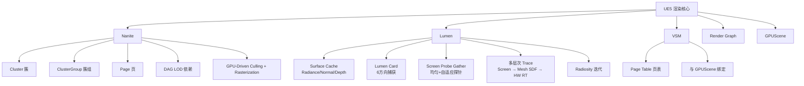

# UE5 面试速查卡片（轻量索引版）

> **用法：** 面试前 30 分钟快速扫一遍，用 打油诗 锚定记忆。每个问题只有一句话答案，所有细节见 `UE5_Detail.md`。  
> **路径：** `C:\Git-repo-my\GameDevVault\Career\Kimi\`  
> **来源：** timlly 源码分析 + Epic 白皮书 + 知乎源码分析

---

## 卡片 1：UE5 三大核心 打油诗

```
Nanite 微多边形，页级虚拟内存搞，
GPU 裁剪光栅化，LOD 美术不用劳。

Lumen 光照实时跑，缓存传播无限跳，
屏幕探针锥追踪，MipMap 模糊远距描。

VSM 页表按需要，像素反推标记妙，
方向光用 Clipmap，阴影内存省不少。
```

| 特性 | 一句话 | 替代了 UE4 的什么？ |
|------|--------|-------------------|
| **Nanite** | 虚拟微多边形，GPU-Driven 裁剪和光栅化，无需传统 LOD | 传统 Static Mesh LOD + CPU Draw Call |
| **Lumen** | 全实时全局光照，多层次 Trace + 缓存传播，无需预计算 | Lightmap + DFAO + SSGI + SSR |
| **VSM** | Virtual Shadow Maps，Camera 像素驱动按需分配物理页 | CSM 级联阴影 |

---

## 卡片 2：Nanite 速答（6 问）

```
虚拟几何像内存，页级加载按需寻，
Cluster 组 DAG 连，GPU 决策无级临。

硬件光栅大三角，软件光栅小微歼，
Early-Z 无效时变，Compute Shader 精确填。
```

### Q1：为什么叫 "Virtualized Geometry"？
> **答：** Page 级管理，类似虚拟内存，GPU 运行时动态加载/卸载，LOD 决策在 GPU。  
> **详情：** [Detail §1.1 Nanite 虚拟内存机制](UE5_Detail.md)

### Q2：Cluster / Page / ClusterGroup 关系？
> **答：** Cluster ∈ ClusterGroup ∈ Page，DAG 描述 ClusterGroup 的 LOD 依赖。  
> **详情：** [Detail §1.2 数据结构](UE5_Detail.md)

### Q3：为什么需要硬件 + 软件光栅化？
> **答：** 硬件光栅化大三角效率高，软件光栅化（CS）处理亚像素微多边形，避免 overdraw 和精度崩溃。  
> **详情：** [Detail §1.3 混合光栅化](UE5_Detail.md)

### Q4：Nanite vs UE4 传统 LOD？
> **答：** Nanite 用计算替代美术劳动，GPU 实时无级连续 LOD，无 popping、无 Draw Call 瓶颈。  
> **详情：** [Detail §1.4 本质区别](UE5_Detail.md)

### Q5：什么情况下 fallback？
> **答：** Translucent（仍不支持）、Morph Targets、Cloth、自定义 Vertex Factory、移动端限制。  
> **详情：** [Detail §1.5 Fallback 条件](UE5_Detail.md)

### Q6：Nanite 当前限制与未来？
> **答：** 不支持 Morph/Cloth/Translucent，移动端受限；未来扩展材质、Skinned Nanite、移动端优化。  
> **详情：** [Detail §1.6 限制与未来](UE5_Detail.md)

---

## 卡片 3：Lumen 速答（6 问）

```
Surface Cache 降维妙，Radiance 法线深度照，
纹理采样替代求交，O(数十亿) 变 O(百万) 少。

Screen Trace 近处妙，Mesh SDF 中距跳，
Hardware RT 远处到，三级回退层层套。

Radiosity 迭代跑，Gather Scatter 来回摇，
无限反弹不发射新射线，缓存传递能量巧。

屏幕探针 Cone 追踪妙，MipMap 模糊远距描，
八面体方向均匀放，自适应探针暗边找。
```

### Q1：Surface Cache 存什么？为什么大幅降低复杂度？
> **答：** Radiance/Normal/Depth，降维到 2D 纹理随机访问，替代 3D 射线-三角形求交。  
> **详情：** [Detail §2.1 Surface Cache 降维](UE5_Detail.md)

### Q2：Screen Trace / Mesh SDF / Hardware RT 分别什么时候用？
> **答：** 近处 Screen Trace（零开销）→ 中距 Mesh SDF（体积查询）→ 远处 Hardware RT（精确）。  
> **详情：** [Detail §2.2 三级 Trace 回退](UE5_Detail.md)

### Q3：为什么不需要预计算 Lightmap？
> **答：** Surface Cache 增量更新 + Screen Probe 实时追踪，无需烘焙。  
> **详情：** [Detail §2.3 增量更新机制](UE5_Detail.md)

### Q4：Screen Probe Gather 流程？
> **答：** Uniform 放置 → Adaptive 加密 → Cone Tracing 采样 → Composite → Filter → ComputeIndirect。  
> **详情：** [Detail §2.4 Screen Probe Gather](UE5_Detail.md)

### Q5：Lumen Card 是什么？
> **答：** 每个 Mesh 表面 6 方向的光照捕获单元，存储 Radiance Atlas，是 Surface Cache 的最小更新单位。  
> **详情：** [Detail §2.5 Lumen Card](UE5_Detail.md)

### Q6：Lumen vs UE4 RTGI？
> **答：** RTGI 纯屏幕空间、指数增长、无屏幕外；Lumen 缓存传播、固定 Pass 结构、无限反弹。  
> **详情：** [Detail §2.6 算法/性能/局限性对比](UE5_Detail.md)

---

## 卡片 4：VSM 速答（3 问）

```
VSM 虚拟页表妙，Camera 像素反推标记到，
Clipmap 方向光分层套，按需分配内存少。

Nanite 数据复用巧，图元级共享不用劳，
视图裁剪各自跑，同一套数据换视角照。
```

### Q1：Virtual 体现在哪里？
> **答：** Camera 像素反推标记 REQUESTED 虚拟页，只给被采样的 page 分配物理内存，缓存复用 + LRU。  
> **详情：** [Detail §3.1 按需分配机制](UE5_Detail.md)

### Q2：VSM vs CSM？
> **答：** CSM 预分配固定级联，VSM Camera 驱动按需分配，动态分辨率，内存节省。  
> **详情：** [Detail §3.2 VSM vs CSM](UE5_Detail.md)

### Q3：为什么配合 Nanite 更好？
> **答：** 共享 GPUScene 图元数据 + Nanite 几何数据，VSM 从 Light Camera 视角独立裁剪渲染，无需 CPU 重建。  
> **详情：** [Detail §3.3 Nanite + VSM 数据共享](UE5_Detail.md)

---

## 卡片 5：UE4 → UE5 架构对比（一表）

| 维度 | UE4 | UE5 | 关键变化 |
|------|-----|-----|----------|
| Static Mesh | `FStaticMesh` / `FStaticMeshRenderData` | `Nanite::FResources` / `Nanite::FSceneProxy` | CPU LOD → GPU-Driven |
| 全局光照 | Lightmap / RTGI / DFAO | Lumen | 预计算 → 全实时缓存传播 |
| 阴影 | `FShadowCascade` (CSM) | `VirtualShadowMaps` | 级联预分配 → 虚拟页按需 |
| 渲染架构 | Immediate RHI | **Render Graph (RDG)** | 显式依赖 + 自动屏障 |
| 场景管理 | `FPrimitiveSceneInfo` | `FPrimitiveSceneInfo` + `GPUScene` | 实例数据 GPU Resident |
| 材质系统 | 传统管线 | **Strata** | 统一可扩展 |
| 抗锯齿 | TAA | TSR | 扩展到超分辨率 |
| 绘制指令 | `FMeshDrawCommand` (CPU) | `GPUScene` + `InstanceCulling` (GPU) | CPU Draw Call → GPU-Driven |

---

## 卡片 6：源码速查（类名/文件/作用）

### Nanite 关键类

| 类/结构 | 文件 | 作用 |
|---------|------|------|
| `Nanite::FResources` | `NaniteResources.h` | 资源数据（Cluster/Page） |
| `Nanite::FSceneProxy` | `NaniteSceneProxy.h` | 场景代理 |
| `FNaniteCommandInfo` | `NaniteRender.h` | 绘制命令索引 |
| `FNaniteMeshProcessor` | `NaniteRender.h` | 网格处理器 |
| `FNaniteUniformParameters` | `NaniteRender.h` | 全局 Shader 参数 |
| `FRasterParameters` | `NaniteRender.h` | 光栅化参数 |
| `FCullingContext` | `NaniteRender.h` | 裁剪上下文 |
| `FRasterContext` | `NaniteRender.h` | 光栅化上下文 |

### Lumen 关键类

| 类/结构 | 文件 | 作用 |
|---------|------|------|
| `FLumenSceneData` | `LumenSceneRendering.h` | 场景数据管理器 |
| `FLumenMeshCards` | `LumenSceneData.h` | 图元级别的 Mesh Cards |
| `FLumenCard` | `LumenSceneData.h` | 单张 Lumen Card |
| `FScreenProbeParameters` | `LumenScreenProbeGather.h` | 屏幕探针参数 |
| `FLumenCardTracingInputs` | `LumenCardTracing.h` | Card 追踪输入 |
| `FLumenMeshSDFGridParameters` | `LumenMeshSDFTracing.h` | Mesh SDF 追踪参数 |
| `RenderLumenScreenProbeGather` | `LumenScreenProbeGather.cpp` | 核心间接光照 Pass |
| `BeginUpdateLumenSceneTasks` | `LumenSceneRendering.cpp` | 更新 Lumen 场景 |

### VSM 关键类

| 类/结构 | 文件 | 作用 |
|---------|------|------|
| `FVirtualShadowMap` | `VirtualShadowMaps.h` | VSM 管理器 |
| `FVirtualShadowMapArray` | `VirtualShadowMaps.h` | VSM 数组 |
| `BuildPageAllocations` | `VirtualShadowMapArray.cpp` | 核心页分配函数 |
| `GeneratePageFlagsFromPixels` | `VirtualShadowMapArray.cpp` | 屏幕像素驱动标记 |
| `AllocateNewPageMappings` | `VirtualShadowMapArray.cpp` | 物理页分配 |
| `ShadowDecodePageTable` | Shader | 解码页表物理地址 |

---

## 卡片 7：面试 Mock（自问自答）

```
UE4 升级 UE5 挑战多，Shader 管线要适配，
移动端能力评估做，Cook 管线整合过，
性能基线重测播，工具链升级不错过。
```

### Mock 1：火炬之光从 UE4.26 升级到 UE5，渲染层挑战？
> **答：** 自定义 HLSL 适配 → 移动端 Nanite/Lumen 可用性评估 → Cook 管线整合 → 性能基线重测 → 工具链升级。  
> **详情：** [Detail §4.1 升级挑战](UE5_Detail.md)

### Mock 2：GPU-Driven Pipeline 具体指什么？
> **答：** Cluster Culling → Instance Culling → Draw Command Generation → Rasterization，全部 GPU 完成，CPU 不介入。  
> **详情：** [Detail §4.2 GPU-Driven](UE5_Detail.md)

### Mock 3：Surface Cache 增量更新流程？
> **答：** 脏检测 → 优先级排序 → 限制更新数量 → 异步并行捕获 → Atlas 管理。  
> **详情：** [Detail §4.3 Surface Cache 更新](UE5_Detail.md)

---

## 卡片 8：核心概念脑图（Mermaid）



---

## 完整详情索引

| 模块 | 文件 | 内容 |
|------|------|------|
| **Nanite 详情** | `UE5_Detail.md` §1 | 源码位置、代码片段、所有追问详解 |
| **Lumen 详情** | `UE5_Detail.md` §2 | 源码位置、代码片段、所有追问详解 |
| **VSM 详情** | `UE5_Detail.md` §3 | 源码位置、代码片段、所有追问详解 |
| **面试扩展** | `UE5_Detail.md` §4 | 升级挑战、GPU-Driven 细节、Surface Cache 更新源码 |

---

**整理完成时间：** 2026-06-20  
**原始来源：** timlly《剖析虚幻渲染体系》UE5 特辑 Part 1 & 2 + Epic 白皮书 + 知乎源码分析  
**整理者：** 俞航（用于 JD：游戏开发专家 AI 训练方向）
