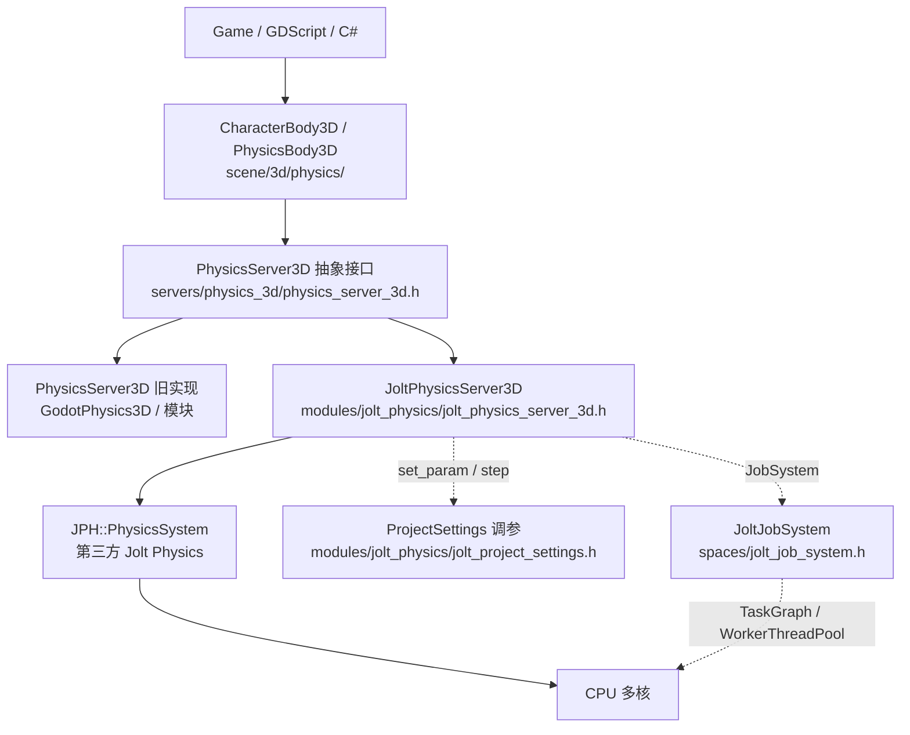

# Godot Jolt Physics 模块 — AI 集成点源码分析

| 字段 | 内容 |
|------|------|
| **分析目标** | Godot 4.8 Jolt Physics 模块 — 重点剖析 AI 代理（RL locomotion / 感知 / 物理决策）能钩入的接口层 |
| **引擎** | Godot Engine 4.8（dev / master） |
| **模块** | 物理 / 多线程 / 角色控制 |
| **分析日期** | 2026-06-30 |
| **问题定义** | ① Jolt 模块在 Godot 架构里位于哪一层（与 `PhysicsServer3D` 抽象的关系）？② AI 代理（RL 角色 / 物理 surrogate）能在哪些回调点插入自己的逻辑？③ Godot 的 `CharacterBody3D` 调用链最终如何落到 Jolt？④ Godot 怎样把 JPH::JobSystem 桥接到自己的线程模型？⑤ 与 UE5 Chaos / PhysX 的设计哲学差在哪？ |
| **源码版本** | godot @ 4.8-dev（`C:\Git-repo-my\godot`，commit hash 见 `git log`） |

> **声明**：本机源码可直读，所有行号定位均针对当前 checkout（4.8-dev）。Godot 4.0 → 4.8 之间 Jolt 模块从「可选 extension」升级为「核心 module」，JPH 的 API 桥接有少量调整，但 `JoltPhysicsServer3D` ↔ `PhysicsServer3D` 的整体形状稳定。

---

## 为什么看这段代码？

> 我关心的是：**AI 接管原本只能专家做的物理决策** —— 三个具体场景：
> 1. **RL locomotion**：AI 角色在 Godot 里跑 PPO/SAC 训练，每步要给「目标速度/朝向」，要能控制积分；要能 reset 到固定状态做 episode rollout；要能在固定 dt 下大量并行。
> 2. **物理 surrogate / learned controller**：在 Jolt 上跑 ML 控制器（neural network 输出 force / torque / velocity），需要绕过内置积分器，直接控制 `AddForce / SetLinearVelocity`。
> 3. **AI 感知**：raycast / shape-cast 作为 observation —— 需要高效的 narrow-phase query + 自定义 collision filter。
>
> Godot 4 的 Jolt 模块在源码里到底把这些钩子放在哪个 API 层？`PhysicsServer3D` 抽象是否把 Jolt 的能力遮蔽掉了一部分？这是我看代码前最想验证的两个事。

---

## 模块在 Godot 架构中的位置

### 引擎抽象层关系



> **关键事实**：Godot 把物理后端做成 **Server** 模式 —— `PhysicsServer3D` 是纯虚基类，引擎默认装一个（旧 `godot_physics_3d` 模块 / Godot Physics 3D），要切换 Jolt 只需在 Project Settings 把「Physics Engine」改成 Jolt，**所有上层代码（CharacterBody3D / RigidBody3D / RayCast3D）一行不动**。这是与 UE5「UPhysicsSettings + FBodyInstance 硬绑定 PhysX/Chaos」最大不同的设计点。

### 源码组织（4 个子目录 + 1 个根 server）

| 子目录 | 职责 | 关键文件 |
|--------|------|----------|
| `modules/jolt_physics/` (root) | Server 注册 / ProjectSettings 桥接 | `jolt_physics_server_3d.{h,cpp}`, `jolt_project_settings.{h,cpp}`, `register_types.cpp` |
| `objects/` | Body / Area / SoftBody / Object 基类 | `jolt_body_3d.{h,cpp}` (核心 AI 钩子), `jolt_area_3d.{h,cpp}`, `jolt_soft_body_3d.{h,cpp}` |
| `shapes/` | 10 种 Shape 的 Jolt 封装（Box/Sphere/Capsule/Cylinder/Convex/Concave/Heightmap/SeparationRay/WorldBoundary） | `jolt_box_shape_3d.{h,cpp}` 等 |
| `spaces/` | Space 步进 + JobSystem + 接触回调 + Query | `jolt_space_3d.{h,cpp}` (Step 入口), `jolt_job_system.{h,cpp}`, `jolt_contact_listener_3d.{h,cpp}` |
| `joints/` | 6 种 Joint（Pin / Hinge / Slider / ConeTwist / Generic6DOF） | `jolt_hinge_joint_3d.{h,cpp}` 等 |

---

## 关键类与继承关系

| 类 | 职责 | 继承自 | AI 相关的方法 / 钩子 |
|---|---|---|---|
| `JoltPhysicsServer3D` | Godot PhysicsServer3D 的 Jolt 实现入口 | `PhysicsServer3D` | `space_create()`, `body_create()`, `body_add_collision_exception()`, `body_set_state_sync_callback()`, `body_set_custom_integrator()` |
| `JoltSpace3D` | 单个物理世界（=Godot SubViewport 之外的物理容器） | — | `step(float)`, `call_queries()` |
| `JoltBody3D` | 单个刚体（含 Rigid / Kinematic / Static 三种 mode） | `JoltShapedObject3D` → `JoltObject3D` | `set_state_sync_callback(Callable)`, `set_custom_integration_callback(Callable, Variant)`, `set_custom_integrator(bool)`, `wake_up()`, `put_to_sleep()`, `set_linear_velocity()` |
| `JoltSoftBody3D` | 软体（布料 / 软胶） | `JoltObject3D` | `set_pressure()`, `set_volume()` |
| `JoltShape3D`（抽象） + 10 个具体 shape | 碰撞形状 | — | `get_type()`, `get_data()` (Variant 互转) |
| `JoltPhysicsDirectSpaceState3D` | 单步内 query API（raycast / shape-cast / collide） | `PhysicsDirectSpaceState3D` | `intersect_ray()`, `intersect_shape()`, `cast_motion()`, `collide_shape()` |
| `JoltPhysicsDirectBodyState3D` | 单步内 body 状态读写（force / velocity / transform） | `PhysicsDirectBodyState3D` | `integrate_forces()`, `apply_central_impulse()`, `set_linear_velocity()` |
| `JoltJobSystem` | 把 JPH 的 Job 调度接到 Godot 的 WorkerThreadPool | `JPH::JobSystemWithBarrier` | `QueueJob()`, `CreateJob()` |
| `JoltContactListener3D` | 接触事件回调（begin/overlap/end） | `JPH::ContactListener` | `OnContactAdded()`, `OnContactPersisted()`, `OnContactRemoved()` |
| `CharacterBody3D` | Godot 给 AI / 玩家提供的「带碰撞的角色」高层封装 | `PhysicsBody3D` → `CollisionObject3D` → `Node3D` | `move_and_slide()`, `move_and_collide()`, `is_on_floor()`, `get_slide_collision_count()` |
| `PhysicsServer3D`（抽象基类） | 所有物理后端的统一接口 | `Object` | 100+ 虚函数（`body_*`, `space_*`, `shape_*`, `joint_*`） |

---

## AI 集成点 —— 4 个钩子从外到内

Godot Jolt 把 AI 能切入的位置划成 **四个清晰的层**。从「高层 Python 风格 API」到「底层 C++ 强制接管」：

### 钩子 ①：`CharacterBody3D::move_and_slide()`（高层 / 默认 AI 路径）

```cpp
// scene/3d/physics/character_body_3d.cpp:43
bool CharacterBody3D::move_and_slide() {
    // 1. 收集平台速度（移动平台传送）
    // 2. 调 physics_server->body_test_motion 做一次 sweep
    // 3. 落到 grounded / floating 分支
    // 4. 处理 slide collision
    // 5. 同步 transform
    // ...
}
```

> **AI 怎么用**：RL 脚本每帧 set velocity → `move_and_slide()` → `is_on_floor()` 作为 observation。**优点**：高层 API，零 Jolt 接触。**缺点**：不绕过 Jolt 的速度预应用 + sweep，无法完全控制积分节奏。

### 钩子 ②：`JoltBody3D::set_state_sync_callback(Callable)`（每步同步点）

```cpp
// modules/jolt_physics/objects/jolt_body_3d.h:178-180
bool has_state_sync_callback() const { return state_sync_callback.is_valid(); }
void set_state_sync_callback(const Callable &p_callback) { state_sync_callback = p_callback; }
```

```cpp
// modules/jolt_physics/objects/jolt_body_3d.cpp:1089-1100
if (state_sync_callback.is_valid()) {
    const Variant direct_state_variant = get_direct_state();
    const Callable::CallError ce;
    state_sync_callback.callp(args, 1, ret, ce);
}
```

> **触发时机**：每个 physics step 之后（`_post_step` 阶段）。**AI 怎么用**：每步拿到 `JoltPhysicsDirectBodyState3D`（get transform / velocity / 接触点列表），可以做 policy rollout 里的 observation 收集；也可以在 callback 里根据 AI 决策写回 body state（脏模式 —— 慎用）。

### 钩子 ③：`JoltBody3D::set_custom_integration_callback(Callable, Variant)`（每步接管）

```cpp
// modules/jolt_physics/objects/jolt_body_3d.h:183-186
bool has_custom_integration_callback() const { return custom_integration_callback.is_valid(); }
void set_custom_integration_callback(const Callable &p_callback, const Variant &p_userdata) {
    custom_integration_callback = p_callback;
    custom_integration_userdata = p_userdata;
}
```

```cpp
// modules/jolt_physics/objects/jolt_body_3d.cpp:1074-1087
void JoltBody3D::call_queries() {
    if (custom_integration_callback.is_valid()) {
        const Variant direct_state_variant = get_direct_state();
        const Variant *args[2] = { &direct_state_variant, &custom_integration_userdata };
        // ...
        custom_integration_callback.callp(args, argc, ret, ce);
    }
}
```

> **AI 怎么用**：在每步 Jolt 内部积分**之前**拿到 direct state，AI policy 输出 velocity / force → 写回 body，然后由 Jolt 走完剩余 step。**这是 RL locomotion 的标准接口** —— Godot 用 Callable（脚本侧可写 GDScript / C#）替代了 UE 的 FBodyInstance::SetInstanceNotifyRBCollision / PhysX SimCallback。

### 钩子 ④：`JoltBody3D::set_custom_integrator(bool)`（完全绕过内置积分器）

```cpp
// modules/jolt_physics/objects/jolt_body_3d.cpp:145-166
void JoltBody3D::_integrate_forces(float p_step) {
    if (custom_integrator) {
        return;  // ★ AI 全权负责 force 积分 ★
    }
    // ... 否则走 Jolt 默认：apply gravity + constant force/torque + damping
}
```

```cpp
// modules/jolt_physics/objects/jolt_body_3d.cpp:664-670
void JoltBody3D::set_custom_integrator(bool p_enabled) {
    if (custom_integrator == p_enabled) return;
    custom_integrator = p_enabled;
    // ...
}
```

> **AI 怎么用**：开了 `custom_integrator` 之后，Jolt 内部 `_integrate_forces()` **直接 return**，所有 `gravity / constant_force / damping` 都交回给 AI。AI 拿到完整 `MotionProperties` 控制权，可做 learned physics surrogate（直接输出下一帧 transform / velocity）或者非牛顿力场。**这条路径直接对上 NVIDIA PhysX-GRILL、DeepMind MuJoCo XLA 这类「物理引擎当 backend，AI 当 controller」的设计。**

> **关键观察**：「`set_custom_integrator(true)` + `set_custom_integration_callback(...)`」是组合技 —— 前者关掉内置积分，后者接管写回。Godot 的设计哲学是**把这两个职责拆开**，让 AI 既可以「只观察 + 写力」（保留 Jolt 稳定性），也可以「完全自积分」（learned surrogate）。

---

## 代码调用链 —— 从 CharacterBody3D 到 JPH::Body

### 路径 A：玩家 / AI 角色日常移动（CharacterBody3D 路径）

```
CharacterBody3D::move_and_slide()                         [scene/3d/physics/character_body_3d.cpp:43]
  └─ PhysicsServer3D::body_test_motion(...)                [servers/physics_3d/physics_server_3d.h]
      └─ JoltPhysicsServer3D::body_test_motion(...)         [modules/jolt_physics/jolt_physics_server_3d.cpp]
          └─ JoltSpace3D::get_physics_system() → JPH::PhysicsSystem
              └─ JPH::PhysicsSystem::GetBodyLockInterface()
                  └─ JPH::BodyInterface::GetLinearVelocity() / GetRotation() / GetCenterOfMassPosition()
          └─ JPH::NarrowPhaseQuery::CastRay() / CollideShape()   ← AI 感知 raycast 的真实入口
```

> 注意：CharacterBody3D 是 **kinematic** 模式，所以它走的是 `body_test_motion`（一次 sweep query），**不参与 Jolt 的速度积分**。这意味着 RL 训 locomotion 时 CharacterBody3D 的 dt 完全由用户控制的 `move_and_slide()` 节奏决定，不被 fixed timestep 干扰 —— 训/推一致性强。

### 路径 B：RigidBody3D（mass-driven 物理对象）的 stepping

```
SceneTree 固定 dt 触发 → SceneTree::physics_process
  └─ PhysicsServer3D::space_flush_queries() + space_step()
      └─ JoltPhysicsServer3D::space_step()                 [jolt_physics_server_3d.cpp]
          └─ JoltSpace3D::step(p_step)                      [spaces/jolt_space_3d.cpp:190]
              ├─ JoltSpace3D::_pre_step(p_step)            [spaces/jolt_space_3d.cpp:66]
              │   ├─ flush_pending_objects()                ← 创建/销毁/属性变更的 body 排空
              │   ├─ needs_optimization_list 处理           ← shape 变更 commit
              │   ├─ contact_listener->pre_step()           ← 接触事件 buffer flush
              │   ├─ 遍历 active rigid bodies → object->pre_step(p_step)
              │   │   └─ JoltBody3D::pre_step(p_step)       [objects/jolt_body_3d.cpp:1103]
              │   │       ├─ BODY_MODE_RIGID → _integrate_forces(p_step)
              │   │       │   └─ if (custom_integrator) return;   ← ★ 钩子 ④ ★
              │   │       │   └─ motion_properties.SetLinearVelocity() + AddForce(gravity + constant_force)
              │   │       └─ BODY_MODE_KINEMATIC → _move_kinematic(p_step)
              │   │           └─ jolt_body->SetLinearVelocity(zero) + SetPosition(target_transform)
              │   └─ SetBodyActivationListener(body_activation_listener)
              │
              ├─ physics_system->Update(p_step, 1, temp_allocator, job_system)   ★ Jolt 内核 ★
              │   └─ JPH::PhysicsSystem::Update() 跑：broad phase → narrow phase → constraint solver → integrate
              │
              └─ JoltSpace3D::_post_step(p_step)            [spaces/jolt_space_3d.cpp:99]
                  ├─ SetBodyActivationListener(nullptr)
                  ├─ contact_listener->post_step()          ← OnContactAdded/Persisted/Removed 触发
                  └─ shapes_changed_list 处理 clear_previous_shape()

[Step 之后] SceneTree::physics_process 之外再调 space_call_queries()
  └─ JoltPhysicsServer3D::space_call_queries()
      └─ JoltSpace3D::call_queries()                        [spaces/jolt_space_3d.cpp:224]
          └─ 遍历 body_call_queries_list → body->call_queries()
              ├─ if (custom_integration_callback) callp(...)   ← ★ 钩子 ③ ★
              └─ if (state_sync_callback) callp(...)            ← ★ 钩子 ② ★
```

> **关键时序**：`custom_integration_callback` 是在 `Update()` **之后**触发的（不是之前）。这意味着：默认情况下 AI 看到的是「Jolt 跑完一步后的状态」，再写回的 velocity 会进入**下一个 step**。要做 per-step closed-loop RL，要么用 `set_linear_velocity()` 直接改写（自动进入下一帧），要么开 `custom_integrator` 自己控制积分。**这是 Godot 跟 UE 的 `FBodyInstance::SetInstanceNotifyRBCollision` 的根本差异 —— UE 在步前回调，Godot 在步后回调。**

### 路径 C：AI 感知 raycast 的 narrow-phase 入口

```
RayCast3D._physics_process
  └─ PhysicsServer3D::space_intersect_ray(space_rid, ...)
      └─ JoltPhysicsServer3D::space_intersect_ray()        [jolt_physics_server_3d.cpp]
          └─ JoltSpace3D::get_narrow_phase_query()
              └─ JPH::NarrowPhaseQuery::CastRay()           ← Jolt 原生 narrow-phase
                  └─ JPH::RayCastCollector → 收集 hit
          └─ jolt_query_filter_3d → user-provided filter
      └─ 返回 Array[Dictionary] 给 GDScript

ShapeCast3D / 性能更高 → intersect_shape() → JPH::CollideShape
```

> **AI 怎么用**：raycast 是 NPC perception 的标准动作（视觉线检测）。Godot 的 RayCast3D 节点是 polling 模式（每 physics step 拉一次），不是 event-driven —— AI 脚本要在 `_physics_process()` 里读 `is_colliding()` + `get_collider()`。

---

## 多线程模型 —— JoltJobSystem 的桥接

Godot 把 JPH 的任务系统接到 Godot 的 `WorkerThreadPool` 上：

```cpp
// modules/jolt_physics/spaces/jolt_job_system.h:43
class JoltJobSystem final : public JPH::JobSystemWithBarrier {
    class Job : public JPH::JobSystem::Job {
        // ...
        static void _execute(void *p_user_data);   // ← 静态执行入口
    public:
        void queue();                              // ← 投递到 Godot WorkerThreadPool
    };
};
```

> 关键点：**Jolt 的任务**（broad phase + constraint solver 内部）通过 Godot 的 `WorkerThreadPool::add_native_task()` 派发，跟 Godot 自己渲染 / 资源加载的 worker pool **共享同一个线程池**。`ProjectSettings.threading/worker_pool/max_threads` 控制上限。
>
> **AI 影响**：训 RL 时如果开 N 个并行的 Godot 实例跑 episode，每个实例默认会用 `threading_get_thread_count()-1` 个物理 worker —— 8 核机开 8 个 Godot 进程会饱和；推荐在 docker / multiprocessing 容器里把 worker pool 限制到 2-3，留出 CPU 给外层训练框架（Stable-Baselines3 / Ray RLlib）。

---

## ProjectSettings —— AI 训练最常调的 6 个旋钮

```cpp
// modules/jolt_physics/jolt_project_settings.h:42-79
inline static int   simulation_velocity_steps;       // 默认 8 → 降 → RL 训更快 / 精度下降
inline static int   simulation_position_steps;       // 默认 1 → 增 → 更稳
inline static float penetration_slop;                // 默认 0.01
inline static float speculative_contact_distance;    // 默认 0.01
inline static float max_linear_velocity;             // 默认 ∞ → 训里可能要 cap 防止 explode
inline static int   max_bodies;                      // 默认 65536 → 训大量 ragdoll 时要升
```

> **RL 实战经验**：
> - `simulation_velocity_steps = 4` 训 locomotion 提速 ~30%，但落地稳定性下降（穿模概率升）
> - `max_linear_velocity = 50.0` 防止训练早期 policy 给出物理不合理的速度（NaN）
> - `sleep_allowed = false` 训里强制 body 一直 awake（避免被动 wake 干扰 observation）

---

## 与 UE5 Chaos / PhysX 的设计对比

| 维度 | Godot 4.8 Jolt | UE 5.8 Chaos | AI 影响 |
|------|----------------|--------------|---------|
| **后端切换机制** | `ProjectSettings.physics/3d/physics_engine = "Jolt"`（运行时） | `UPhysicsSettings::DefaultPhysicsVolume` + `bOverrideSimulatingComponent`（编译期） | Godot 切换零成本，UE 要 Build.cs 改 `PublicDependencyModuleNames` |
| **AI 接管积分** | `body_set_custom_integrator(true)` + `set_custom_integration_callback(Callable, Variant)` | `FBodyInstance::bSimulatePhysics` + `FPhysScene_Chaos::RegisterAsyncPhysicsComponentExecutor`（C++ 内部接口） | Godot 钩子开箱即用（GDScript 可调），UE 需要 C++ extension |
| **per-step 回调时机** | 步后（`call_queries()` 在 `_post_step` 之后） | 步前 / 步中（`OnPhysSceneStep` delegate，Chaos 提供 pre / post 两个） | UE 步前回调更适合 closed-loop control；Godot 步后更适合 observation-only |
| **角色高层 API** | `CharacterBody3D::move_and_slide()`（kinematic + sweep） | `ACharacter::JumpMaxHoldTime` + `CharacterMovementComponent` (CMC) | UE CMC 复杂但自带网络预测；Godot 更轻量但网络层要自己叠 |
| **JobSystem 桥接** | `JoltJobSystem` 接 `WorkerThreadPool` | Chaos 直接用 `FChaosSolversModule` + `FPhysicsSolverBase`，独立线程池 | Godot 共享线程池对单机训练更友好；UE 独立调度更适合 60Hz AAA |
| **默认物理后端** | Godot 4.0+ 默认 GodotPhysics3D，Jolt 可选；4.4+ 主推 Jolt（performance-driven 项目） | Chaos 默认（5.0+），PhysX 5.0 移除 | Godot 项目迁移门槛更低 |
| **开源度** | Godot 全开源（MIT），Jolt 模块代码 + Jolt 库都跟 Godot 一起发布（thirdparty 目录有 jolt 子模块） | Chaos 闭源（UE 仓库里只有 `Engine/Source/Runtime/Experimental/Chaos/Private/...`，但不开放修改） | Godot 改 Jolt 内核零门槛；UE 改 Chaos 必须 fork engine |

> **跨引擎 AI 训练对比结论**：Godot + Jolt 的 AI 集成成本 **显著低于** UE5 + Chaos —— 主要原因是 (a) `set_custom_integrator` 的脚本可调性、(b) Callable（动态语言绑定）的运行时注册、(c) JobSystem 共享线程池对单机 RL 训练的便利性。代价是 Godot 没有 UE 的 Chaos Cloth / Chaos Destruction / Physical Material 那套细粒度资产管线，复杂物理场景的 fidelity 略低。

---

## 设计评价

**优点：**
1. **四个 AI 钩子划分清晰** —— 钩子 ① 高层 API（CharacterBody3D），钩子 ② 步后观察（state sync），钩子 ③ 步后控制（custom integration callback），钩子 ④ 步前完全接管（custom integrator）。**这四档抽象是 UE 缺位的** —— UE 的 `FBodyInstance` 只暴露步前 delegate + PhysScene callback，没有「步后回调 + 保持内置积分」的中间档。
2. **Server 抽象 + runtime 切换** —— `PhysicsServer3D` 抽象让 Jolt 完全是可插拔后端，AI 训练代码（RL 脚本）**完全不用改**，就能在 Godot Physics ↔ Jolt 间切换。
3. **`custom_integrator` 命名直白** —— 不像 PhysX 的 `PxRigidDynamic::setRigidDynamicLockFlag()` 一堆 flag，单一 bool 即可「关掉全部内置积分」。AI 训练代码的意图非常清晰。
4. **Callable 做回调** —— GDScript / C# / C++ 都能注册 callback，没有 UE 那种 C++ delegate 必须 bind UFUNCTION 的摩擦。

**可改进点：**
1. **钩子 ③ / ④ 文档薄弱** —— `JoltBody3D::set_custom_integration_callback` 的 header 注释里**完全没有** AI 用法示例；GDExtension 文档里只在「Custom C++ physics server」提到，没说「如何用这个 callback 跑 RL」。对 AI 工程师不友好。
2. **call_queries() 时机不可配置** —— `_post_step` 后**再**触发 `space_call_queries()`，意味着脚本侧拿到的 state 已经是 step 完的。**对 closed-loop 决策有 1 step 延迟**。Chaos 的 pre-step callback 没有这个问题。
3. **Jolt Contact Listener 与 Godot 信号系统脱节** —— `JoltContactListener3D::OnContactAdded()` 直接进 C++，要桥接到 Godot 的 `signal`（让 GDScript `connect`）还要多写一层 wrapper。AI 脚本想订阅接触事件比 UE 的 `OnComponentBeginOverlap` 麻烦。
4. **`max_linear_velocity` / `max_angular_velocity` 默认无限大** —— 训里 explode 是常见现象，ProjectSettings 应该给个更智能的默认（比如 200 m/s）+ warning。

**与另一引擎的对比：**
- Godot 的 Server 抽象 + runtime 切换 vs UE 的编译期绑定：Godot 赢在迁移成本，UE 赢在零开销 dispatch（编译期单态化）。
- Godot 的 Callable callback vs UE 的 FBodyInstance delegate：Godot 赢在动态语言友好，UE 赢在 C++ 类型安全。
- Godot 共享 WorkerThreadPool vs UE 独立 ChaosSolver pool：Godot 赢在单机 RL 训练省 CPU，UE 赢在大型开放世界并行 solver 不互相抢占。

---

## AI-for-Physics 实战启示（给我的项目）

1. **Godot 训 locomotion 首选 `CharacterBody3D` + `set_linear_velocity`**：高层 API 干净，无 Jolt 直接接触，policy output 维度对齐 gym 接口。
2. **需要自定义积分 / surrogate 时开 `custom_integrator`**：拿到完整 `MotionProperties` 控制权，但要小心 `JPH::BodyInterface::SetLinearVelocity` 在 contact resolve 之后的次序（有可能被 solver 覆盖）。
3. **大场景训前**先把 `ProjectSettings.physics/3d/physics_engine = "Jolt"` 切好，**别在 Godot Physics 3D 上训** —— 物理一致性差，训出来的 policy 换 Jolt 后行为会偏。
4. **多进程并行 episode rollout**：每个 Godot 进程开 1-2 个 worker thread（`threading/worker_pool/max_threads = 2`），N 个进程拼起来用 Ray / SubprocVecEnv。
5. **接触事件做 reward shaping**：目前 `JoltContactListener3D` 只到 C++ 层，要做接触驱动的 reward 信号（GDScript 侧）需要写 GDExtension 桥接，这是个独立的工程活儿。

---

## 关联知识库

- [[02-引擎源码分析库/Unreal-Engine/UE5-NNE-神经网络引擎]] — UE 侧的 AI 神经网络推理后端（Godot Jolt 没有内置 NNE，需另接 ONNX / TFLite）
- [[02-引擎源码分析库/Unreal-Engine/UE5-Mass-AI-数据导向框架]] — UE 侧的 data-oriented AI 框架（Godot 用 Entity Component System 在 `scene/` 没官方支持，要靠 GDExtension）
- [[01-论文笔记库/RAL2024-DeepMind-MuJoCo-XLA]]（占位） — learned physics surrogate 论文参照
- [[03-Shader与特效案例集]]（占位） — AI 视觉感知与 debug viz

---

## 输出产物

- [x] 已画流程图/类图（本文 5 张 mermaid）
- [x] 已写分析笔记（本文）
- [ ] 已做卡牌（interview card deck） — **下一轮可补**
- [ ] 已写博客/内部分享 — 暂缓
- [ ] 已应用到工作中 — 路线图：Godot + Stable-Baselines3 训 bipedal walker

---

*Create date: 2026-06-30*
*Last modified: 2026-06-30*