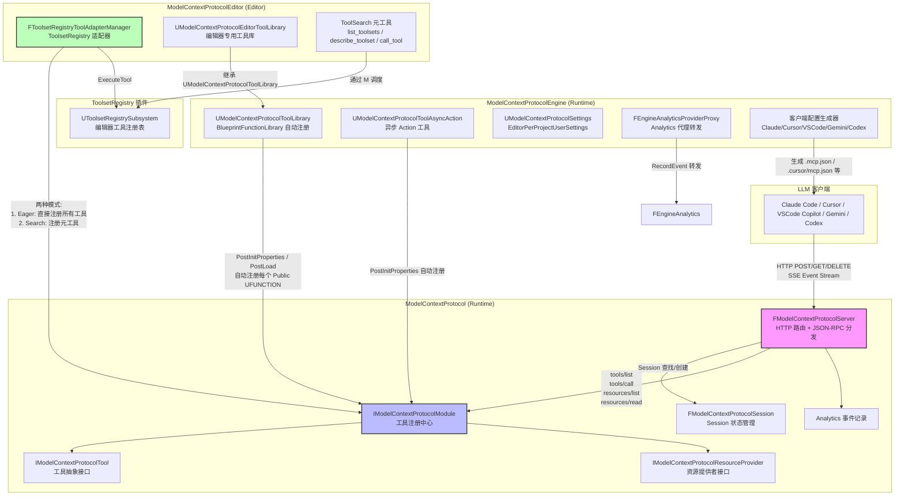

# UE5 ModelContextProtocol 插件完整调用链路分析

| 字段 | 内容 |
|------|------|
| **分析目标** | UE5 `ModelContextProtocol` 插件（Experimental） |
| **引擎** | Unreal Engine 5.8+ |
| **模块** | 工具 / 网络 / 编辑器集成 |
| **分析日期** | 2026-06-27 |
| **问题定义** | 理解 UE5 中 Anthropic MCP (Model Context Protocol) 的完整 HTTP 服务端架构、JSON-RPC 请求分发链路、工具注册与执行机制、Session 生命周期管理 |

---

## 为什么看这段代码？

> 我正在调研 UE5 与外部 AI 编码助手（Claude Code / Cursor / Copilot / Gemini / Codex）的集成方式。Epic 在 UE5.8 中实验性地引入了 MCP 服务器插件，允许 LLM 客户端通过标准化的 HTTP + JSON-RPC 协议调用 UE 编辑器中的工具。需要精确理解：HTTP 请求如何进入引擎、如何被路由到具体的工具执行、工具结果如何回传、以及工具注册的全生命周期。

---

## 模块交互图



> **模块职责概述：**
> - `ModelContextProtocol`：纯协议层，无引擎/编辑器依赖。负责 HTTP 服务器生命周期、JSON-RPC 解析与分发、Session 管理、工具与资源注册表。是 MCP spec 的 UE 实现核心。
> - `ModelContextProtocolEngine`：Runtime 层集成。提供基于 `UBlueprintFunctionLibrary` 的自动工具注册（反射扫描 UFUNCTION）、异步 Action 工具、项目设置（`UDeveloperSettings`）、Analytics 代理、客户端配置生成。
> - `ModelContextProtocolEditor`：Editor 层集成。将 `ToolsetRegistry` 插件中的编辑器工具桥接到 MCP 协议。支持两种模式：Eager（全部预注册）和 Search（按需发现，通过 `list_toolsets`/`describe_toolset`/`call_tool` 元工具）。

---

## 关键类与继承关系

| 类名 | 职责 | 继承/实现自 | 关键方法 |
|------|------|-------------|----------|
| `FModelContextProtocolServer` | HTTP 服务器，JSON-RPC 请求分发 | 无（POD-like） | `StartServer()`, `StopServer()`, `ProcessPostRequest()`, `ProcessJsonRpcCall()`, `Tick()` |
| `FModelContextProtocolSession` | 客户端会话状态 | `TSharedFromThis` | 持有 `ID`, `Status`, `ClientCapabilities`, `ActiveRequests` |
| `IModelContextProtocolModule` | 模块接口，工具/资源注册中心 | `IModuleInterface` | `GetTools()`, `AddTool()`, `FindTool()`, `GetResourceProviders()`, `StartServer()`, `StopServer()` |
| `IModelContextProtocolTool` | 工具抽象接口 | `TSharedFromThis` | `GetName()`, `GetDescription()`, `GetInputJsonSchema()`, `Run()`, `RunAsync()`, `CancelAsync()` |
| `IModelContextProtocolResourceProvider` | 资源提供者接口 | `TSharedFromThis` | `ListResources()`, `ReadResource()` |
| `FModelContextProtocolLibraryTool` | 从 `UFUNCTION` 反射生成的同步工具 | `IModelContextProtocolTool` | `Run()`（调用 `UFunction::ProcessEvent`） |
| `FModelContextProtocolAsyncActionTool` | 从 `UModelContextProtocolToolAsyncAction` 生成的异步工具 | `IModelContextProtocolTool` | `RunAsync()`（返回新的 AsyncAction 实例） |
| `FToolsetRegistryToolAdapter` | ToolsetRegistry 工具桥接器 | `IModelContextProtocolTool` | `RunAsync()`（调用 `ToolsetRegistry->ExecuteTool()`） |
| `UModelContextProtocolSettings` | 插件配置 | `UDeveloperSettings` | `ServerPortNumber`, `ServerUrlPath`, `bAutoStartServer`, `bEnableToolSearch` |
| `FEngineAnalyticsProviderProxy` | Analytics 代理 | `IAnalyticsProviderET` | `RecordEvent()`（转发到 `FEngineAnalytics`） |

---

## 内存布局分析

```cpp
// FModelContextProtocolSession — 会话状态
struct FModelContextProtocolSession : TSharedFromThis<FModelContextProtocolSession>
{
    FString ID;                                    // 会话 GUID (36 bytes + SSO)
    EModelContextProtocolSessionStatus Status;     // Initializing / Initialized (1 byte)
    FString NegotiatedProtocolVersion;             // 协商的协议版本 (e.g. "2025-11-25")
    TSharedPtr<FInternetAddr> ClientAddress;       // 客户端地址
    FModelContextProtocolClientCapabilities ClientCapabilities;
    // 核心: 活跃请求映射表，Key 为 RequestId，Value 包含 Tool 指针 + SSE 回调 + Progress 状态
    TMap<FModelContextProtocolToolRequestId, FModelContextProtocolToolContext> ActiveRequests;
};

// FModelContextProtocolToolContext — 单个工具请求的执行上下文
struct FModelContextProtocolToolContext
{
    TSharedPtr<IModelContextProtocolTool> Tool;     // 指向具体工具实现
    TSharedPtr<FJsonValue> ProgressToken;          // 进度令牌（来自 _meta.progressToken）
    FHttpResultCallback EventStreamWrite;            // SSE 流写入回调（HTTP 响应的后续写入）
    double LastProgressSeconds = 0.0;              // 上次进度报告时间戳
    int32 LastProgressValue = 0;                   // 累计进度值（心跳计数器）
};
```

**关键设计点：** `EventStreamWrite` 被保存在 `ActiveRequests` 中，这意味着每个正在执行的 tool call 都持有对 HTTP 响应流的引用。工具完成后，通过同一个 `FHttpResultCallback` 回写 SSE 消息。这是 MCP Streamable HTTP 传输层的核心机制。

---

## 代码调用链

### 1. 服务器启动与 HTTP 路由绑定

```
IModelContextProtocolModule::StartServer(Port, UrlPath)
  → FModelContextProtocolModule::StartServer()
    → FModelContextProtocolServer::StartServer(Port, UrlPath)
      → FHttpServerModule::Get().GetHttpRouter(Port)
        → IHttpRouter::BindRoute(UrlPath, VERB_POST,  &ProcessPostRequest)
        → IHttpRouter::BindRoute(UrlPath, VERB_GET,   &ProcessGetRequest)
        → IHttpRouter::BindRoute(UrlPath, VERB_DELETE, &ProcessDeleteRequest)
      → FHttpServerModule::Get().StartAllListeners()
      → FTSTicker::AddTicker(&ModelContextProtocolServer::Tick)
```

**文件位置：**
1. `ModelContextProtocol/Private/ModelContextProtocolModule.cpp:216` — `FModelContextProtocolModule::StartServer()`
2. `ModelContextProtocol/Private/ModelContextProtocolServer.cpp:416` — `FModelContextProtocolServer::StartServer()`
3. `ModelContextProtocol/Private/ModelContextProtocolServer.cpp:435` — `BindRoute` POST/GET/DELETE

> **默认配置：** Port = 8000 (`DefaultServerPort`)，UrlPath = `/mcp` (`DefaultServerUrlPath`)。可通过 `UModelContextProtocolSettings` (EditorPerProjectUserSettings) 或命令行 `-ModelContextProtocolPort=N` 覆盖。

---

### 2. HTTP POST 请求 → JSON-RPC 解析 → 方法分发

```
FModelContextProtocolServer::ProcessPostRequest(Request, OnComplete)
  → ValidateOriginHeader()           // 仅允许 localhost / 127.0.0.1 / [::1]
  → GetJsonObjectFromRequestBody()   // 解析 JSON body
  → 验证 jsonrpc == "2.0"
  → 提取 id, method, params
  → FModelContextProtocolServer::ProcessJsonRpcCall(Request, RequestId, Method, Params, OnComplete)
    ├─ Method == "ping" → ProcessPingJsonRpcCall()
    ├─ Method == "initialize" → ProcessInitializeJsonRpcCall()
    │   → 创建新 Session，分配 GUID，协商 ProtocolVersion
    │   → 返回 ServerCapabilities（Tools + Resources）
    ├─ 其他方法 → 需验证 Session（Mcp-Session-Id Header）
    │   ├─ 无 Header → 400 BadRequest
    │   ├─ 未知 Session → 404 NotFound（客户端应重新 initialize）
    │   └─ ProtocolVersion 不匹配 → 400 BadRequest
    ├─ "notifications/initialized" → Session.Status = Initialized
    ├─ "notifications/cancelled" → 查找 ActiveRequests → Tool->CancelAsync()
    ├─ "tools/list" → ProcessListToolsJsonRpcCall()
    ├─ "tools/call" → ProcessToolCallJsonRpcCall()
    ├─ "resources/list" → ProcessListResourcesJsonRpcCall()
    └─ "resources/read" → ProcessReadResourceJsonRpcCall()
```

**文件位置：**
1. `ModelContextProtocol/Private/ModelContextProtocolServer.cpp:518` — `ProcessPostRequest()`
2. `ModelContextProtocol/Private/ModelContextProtocolServer.cpp:558` — `ProcessJsonRpcCall()`
3. `ModelContextProtocol/Private/ModelContextProtocolServer.cpp:646` — `ProcessInitializeJsonRpcCall()`

> **DNS Rebinding 防护：** `ValidateOriginHeader()` 严格拒绝非 localhost 的 Origin 请求。浏览器客户端必须来自 `http://localhost:PORT` 或 `http://127.0.0.1:PORT`；非浏览器客户端（无 Origin Header）则直接允许。

---

### 3. `tools/call` 完整调用链（核心路径）

```
FModelContextProtocolServer::ProcessToolCallJsonRpcCall(Request, RequestId, Params, Session, OnComplete)
  → 验证 Params 存在且包含非空 "name" 字段
  → 提取 "arguments"（可选）和 "_meta.progressToken"（可选）
  → IModelContextProtocolModule::GetChecked().FindTool(ToolName)
    → 在 Tools 数组中线性搜索（大小写不敏感）
  → 创建 FModelContextProtocolToolContext，存入 Session->ActiveRequests[RequestId]
  → 发送初始 SSE 响应（Content-Type: text/event-stream，设置 Connection: keep-alive）
  → 调用 Tool->RunAsync(RequestId, ToolArguments, HandleToolResult)
    ├─ 同步工具（FModelContextProtocolLibraryTool）:
    │   → RunAsync 默认实现:
    │     → Run() → UFunction::ProcessEvent() → 蓝图中定义的函数执行
    │     → OnComplete(Result) 立即调用
    ├─ 异步工具（FModelContextProtocolAsyncActionTool）:
    │   → RunAsync() → UFunction::ProcessEvent() → 返回新的 AsyncAction 实例
    │   → 监听 AsyncAction->OnAsyncToolComplete
    │   → 完成后从 Action 的 ResultProperty 提取结果 → OnComplete(Result)
    └─ ToolsetRegistry 工具（FToolsetRegistryToolAdapter）:
        → RunAsync() → ToolsetRegistry->ExecuteTool(Descriptor, ArgumentsJson)
        → TFuture 完成后 → OnComplete(MakeTextResult(Result))

  → HandleToolResult（GameThread 上执行）:
    → 检查 AliveGuard（防止 use-after-free）
    → FindSession(SessionId) → 验证 ActiveRequests 仍包含该 RequestId
    → 若已取消或 Session 销毁 → 静默丢弃（MCP spec 要求）
    → Analytics::RecordToolCallEvent(SessionId, ToolName, Duration, bSuccess)
    → 构造 JSON-RPC result 响应
    → Session->ActiveRequests.Remove(RequestId)
    → OnComplete(SSEMessage) 回写最终结果
```

**文件位置：**
1. `ModelContextProtocol/Private/ModelContextProtocolServer.cpp:778` — `ProcessToolCallJsonRpcCall()`
2. `ModelContextProtocol/Private/ModelContextProtocolServer.cpp:851` — `HandleToolResult` Lambda
3. `ModelContextProtocolEngine/Private/ModelContextProtocolToolLibrary.cpp:248` — `FModelContextProtocolLibraryTool::Run()`
4. `ModelContextProtocolEngine/Private/ModelContextProtocolToolAsyncAction.cpp:247` — `FModelContextProtocolAsyncActionTool::RunAsync()`
5. `ModelContextProtocolEditor/Private/ModelContextProtocolToolsetRegistryAdapter.cpp:36` — `FToolsetRegistryToolAdapter::RunAsync()`

> **线程安全契约：** `IModelContextProtocolTool::RunAsync()` 的 `OnComplete` 回调可以从任意线程调用。`HandleToolResult` Lambda 在 `ProcessToolCallJsonRpcCall` 中明确检查 `IsInGameThread()`，若不在则通过 `AsyncTask(ENamedThreads::GameThread, ...)` 跳转。这是 UE 的硬约束——所有 UObject 操作和后续 HTTP 响应写入必须在 GameThread 上执行。

> **SSE 流机制：** 工具调用响应采用 HTTP 200 + `text/event-stream` 格式。第一次 `OnComplete` 发送初始响应（带 `MultipleWriteStream | HasAdditionalWrites` 标志），后续 `OnComplete` 调用写入 `event: message\r\ndata: <json>\r\n\r\n` 格式的 SSE 数据帧。`SkipHeaderWrite` 标志确保后续写入不会重复发送 HTTP 头。

---

### 4. 工具注册链路（三种来源）

#### 4a. BlueprintFunctionLibrary 自动注册（同步工具）

```
UModelContextProtocolToolLibrary::PostInitProperties()   [Native CDO]
UModelContextProtocolToolLibrary::PostLoad()             [Blueprint CDO]
  → RegisterTools()
    → DeregisterTools()  // 先清理旧注册
    → 遍历 Class 的所有 Public UFUNCTION（排除 ExecuteUbergraph）
    → 为每个 UFUNCTION 创建 FModelContextProtocolLibraryTool
    → IModelContextProtocolModule::AddTool(Tool)
      → ValidateToolName()  // MCP spec: 1-128 chars, [A-Za-z0-9_.-]
      → 检查名称唯一性（大小写不敏感）
      → Tools.Add(Tool)
    → 订阅 OnRefreshTools() → 重新 RegisterTools()

UModelContextProtocolToolLibrary::FinishDestroy()
  → DeregisterTools()
    → 遍历 Tools → IModelContextProtocolModule::RemoveTool()
```

**文件位置：**
1. `ModelContextProtocolEngine/Private/ModelContextProtocolToolLibrary.cpp:22` — `PostInitProperties()`
2. `ModelContextProtocolEngine/Private/ModelContextProtocolToolLibrary.cpp:68` — `RegisterTools()`
3. `ModelContextProtocol/Private/ModelContextProtocolModule.cpp:109` — `AddTool()`

> **WorldContext 自动注入：** 若 UFUNCTION 有 `WorldContext` 元数据标记的参数，`FModelContextProtocolLibraryTool::Run()` 会自动从 `GWorld` 获取当前 World 并注入到参数容器中。这是 Blueprint 函数库在 Editor 环境中正确运行的关键。

> **Schema 生成：** `GetInputJsonSchema()` 和 `GetOutputJsonSchema()` 使用 `FJsonSchemaGenerator::UStructToJsonSchemaObject()` 从 UFUNCTION 的反射信息生成 JSON Schema。对于 cooked 版本，Schema 在 Editor 中预计算并缓存到 `FunctionMetaData` 中。

#### 4b. AsyncAction 工具注册（异步工具）

```
UModelContextProtocolToolAsyncAction::PostInitProperties()
  → RegisterTool()
    → 查找类中名为 GetToolFunctionName() 的 UFUNCTION
    → 创建 FModelContextProtocolAsyncActionTool
    → IModelContextProtocolModule::AddTool()

FModelContextProtocolAsyncActionTool::RunAsync(RequestId, Params, OnComplete)
  → 准备参数容器（同 LibraryTool）
  → UFunction::ProcessEvent() → 返回 UObject*（应为 UModelContextProtocolToolAsyncAction 子类）
  → 将返回的 AsyncAction 加入 InProgressActions
  → 监听 OnAsyncToolComplete
  → 完成后从 Action 的 ResultProperty 提取值 → OnComplete(Result)

FModelContextProtocolAsyncActionTool::CancelAsync(RequestId)
  → 在 InProgressActions 中查找匹配的 Action → Action->Cancel()
```

**文件位置：**
1. `ModelContextProtocolEngine/Private/ModelContextProtocolToolAsyncAction.cpp:25` — `PostInitProperties()`
2. `ModelContextProtocolEngine/Private/ModelContextProtocolToolAsyncAction.cpp:247` — `RunAsync()`

> **异步模型与同步模型的关键区别：** 同步工具 `Run()` 返回后结果立即可用；异步工具 `RunAsync()` 返回一个新的 `UAsyncAction` 实例，该实例通过 `OnAsyncToolComplete` 委托在后续某个时刻完成。这允许工具执行长时间操作（如 Editor 中的异步资产导入、关卡构建等）。

#### 4c. ToolsetRegistry 适配器注册（编辑器工具）

```
FToolsetRegistryToolAdapterManager::RegisterTools()
  ├─ bEnableToolSearch == true (Search 模式):
  │   → 注册 3 个 Meta-Tool:
  │     1. list_toolsets    → 返回所有可用 toolset 的目录文本
  │     2. describe_toolset → 返回指定 toolset 的 JSON Schema
  │     3. call_tool        → 通过 ToolsetRegistry 执行工具（支持跨 toolset 调用）
  │   → 日志: "registered N meta-tools (X toolsets discoverable)"
  │
  └─ bEnableToolSearch == false (Eager 模式):
      → ToolsetRegistry->ForEachToolset()
        → RegisterToolsFromSchema(Toolset.GetJsonSchema())
          → 解析 JSON Schema 中的 tools[] 数组
          → 为每个 tool 创建 FToolsetRegistryToolAdapter
          → IModelContextProtocolModule::AddTool(Adapter)
      → 日志: "registered N ToolsetRegistry tool adapters"

FToolsetRegistryToolAdapter::RunAsync(RequestId, Params, OnComplete)
  → 解析 ToolName 为 FToolDescriptor
  → 将 Params 序列化为 JSON 字符串
  → ToolsetRegistry->ExecuteTool(Descriptor, ArgumentsJson)
    → TFuture<TValueOrError<FString, FString>>
  → 完成后 → OnComplete(MakeTextResult() 或 MakeErrorResult())
```

**文件位置：**
1. `ModelContextProtocolEditor/Private/ModelContextProtocolToolsetRegistryAdapter.cpp:140` — `RegisterTools()`
2. `ModelContextProtocolEditor/Private/ModelContextProtocolToolsetRegistryAdapter.cpp:36` — `RunAsync()`
3. `ModelContextProtocolEditor/Private/ModelContextProtocolToolsetRegistryAdapter.cpp:233` — `DispatchToolCall()`

> **Search vs Eager 模式对比：** Search 模式（默认）将工具发现的责任交给 LLM 客户端——客户端先调用 `list_toolsets` 获取目录，再调用 `describe_toolset` 获取具体工具的输入 Schema，最后通过 `call_tool` 执行。这显著减少了 `tools/list` 的初始响应体积，避免 LLM 的上下文窗口被大量工具定义占满。Eager 模式则将所有工具预注册为原生 MCP 工具，适合工具数量较少的场景。

---

### 5. Session 生命周期与 SSE 通知

```
// 创建
ProcessInitializeJsonRpcCall()
  → MakeShared<FModelContextProtocolSession>()
  → Session->ID = FGuid::NewGuid().ToString()
  → Session->Status = Initializing
  → Sessions.Add(Session)
  → 返回 InitializeResult（含 ServerCapabilities 和 Session ID）

// 激活
ProcessInitializedNotificationJsonRpcCall()
  → Session->Status = Initialized
  → Analytics::RecordSessionStartEvent(SessionId, ProtocolVersion)

// 工具列表变更广播
FModelContextProtocolServer::ScheduleToolsListChangedBroadcast()
  → bToolsListChangedBroadcastScheduled = true

FModelContextProtocolServer::Tick(DeltaTime)
  → 若 bToolsListChangedBroadcastScheduled:
    → 遍历所有 Initialized Session
    → 找到有 ActiveRequest 且 EventStreamWrite 有效的 Session
    → 发送 notifications/tools/list_changed SSE 通知
    → 每个 Session 最多一次（同一客户端的所有 SSE 流属于同一 Session）

// 销毁
ProcessDeleteRequest()
  → 提取 Mcp-Session-Id Header
  → Sessions.RemoveAll(Matching ID)
  → 若 Session 曾 Initialized → Analytics::RecordSessionEndEvent(SessionId)

// 服务器停止
FModelContextProtocolServer::StopServer()
  → 遍历所有 Initialized Session → RecordSessionEndEvent()
  → 移除 Ticker
  → UnbindRoute POST/GET/DELETE
  → HttpRouter.Reset()
```

**文件位置：**
1. `ModelContextProtocol/Private/ModelContextProtocolServer.cpp:646` — `ProcessInitializeJsonRpcCall()`
2. `ModelContextProtocol/Private/ModelContextProtocolServer.cpp:1006` — `Tick()`（广播逻辑）
3. `ModelContextProtocol/Private/ModelContextProtocolServer.cpp:1078` — `ProcessDeleteRequest()`

> **Tick 中的进度心跳：** 若 `ProgressIntervalSeconds > 0`（默认由 CVar 控制），Tick 会遍历所有 ActiveRequest，对拥有 `ProgressToken` 的请求发送 `notifications/progress` SSE 消息。由于工具执行时间未知，进度值仅作为心跳计数器递增，不提供百分比。`LastProgressSeconds` 防止过于频繁的发送。

---

### 6. Analytics 事件链路

```
FModelContextProtocolEngineModule::StartupModule()
  → FCoreDelegates::OnPostEngineInit += RegisterDefaultAnalyticsProvider()
    → 若 AnalyticsProvider 未设置:
      → 创建 FEngineAnalyticsProviderProxy
      → IModelContextProtocolModule::SetAnalyticsProvider(Proxy)

Analytics::RecordToolCallEvent(SessionId, ToolName, Duration, bSuccess)
  → ParseToolsetName(ToolName)  // 从 "Toolset.Tool" 提取 ToolsetName
  → HashToolIdentifier(ToolName)  // FBlake3 哈希（隐私保护，不暴露原始工具名）
  → IModelContextProtocolModule::RecordAnalyticsEvent("ToolCall", Attributes)
    → 加前缀（默认 "ModelContextProtocol.ToolCall"）
    → Provider->RecordEvent() → FEngineAnalytics::GetProvider().RecordEvent()

Analytics::RecordSessionStartEvent(SessionId, ProtocolVersion)
  → RecordAnalyticsEvent("SessionStart", ...)

Analytics::RecordSessionEndEvent(SessionId)
  → RecordAnalyticsEvent("SessionEnd", ...)
```

**文件位置：**
1. `ModelContextProtocolEngine/Private/ModelContextProtocolEngineModule.cpp:76` — `StartupModule()`
2. `ModelContextProtocol/Private/ModelContextProtocolAnalytics.cpp:86` — `RecordToolCallEvent()`
3. `ModelContextProtocol/Private/ModelContextProtocolAnalytics.cpp:22` — `HashToolIdentifier()`（FBlake3）

> **隐私设计：** 工具名和 Toolset 名通过 FBlake3 哈希后上报，原始字符串不离开本地。这符合 UE EULA 第 6(e) 条的要求——"你负责确保你的 LLM 提供商不会将其用作训练输入"。Analytics 是可选的，可通过 `ModelContextProtocol.EnableAnalytics=0` CVar 禁用。

---

### 7. 资源提供链路

```
ProcessListResourcesJsonRpcCall()
  → 遍历所有 IModelContextProtocolResourceProvider
    → Provider->ListResources(LastResourceDescriptorList)
  → 对结果应用分页（ApplyPagination）
  → 返回 { resources: [...], nextCursor? }

ProcessReadResourceJsonRpcCall()
  → 提取 "uri" 参数
  → 先查 LastResourceDescriptorList 缓存（上次 list 的结果）
  → 若未找到 → 遍历所有 Provider → 逐个 ListResources → 匹配 URI
  → Provider->ReadResource(Uri)
    → 返回 TValueOrError<FModelContextProtocolResource, FString>
  → 成功 → 返回 { contents: [Resource] }
  → 失败 → ResourceNotFound (-32002) 或 InternalError
```

**文件位置：**
1. `ModelContextProtocol/Private/ModelContextProtocolServer.cpp:916` — `ProcessListResourcesJsonRpcCall()`
2. `ModelContextProtocol/Private/ModelContextProtocolServer.cpp:953` — `ProcessReadResourceJsonRpcCall()`

> **资源缓存策略：** `LastResourceDescriptorList` 在 `ProcessListResourcesJsonRpcCall` 时重建，在 `ProcessReadResourceJsonRpcCall` 时优先查询。若客户端直接调用 `resources/read` 而未先 `list`，则回退到全量查询。这是合理的乐观缓存——资源列表在单次请求-响应周期内通常不变。

---

### 8. 客户端配置生成链路

```
Console: ModelContextProtocol.GenerateClientConfig <ClientName|All>
  → ParseClientName() → ClaudeCode / Cursor / VSCode / Gemini / Codex
  → GetServerPortNumber() / GetServerUrlPath()
  → WriteClientConfiguration(Client, Port, UrlPath)
    → 构造 ServerUrl = http://127.0.0.1:PORT/PATH
    → 根据 Client 类型写入对应配置文件:
      ├─ ClaudeCode:  .mcp.json            (mcpServers, url, type: http)
      ├─ Cursor:      .cursor/mcp.json      (mcpServers, url)
      ├─ VSCode:      .vscode/mcp.json      (servers, url, type: http)
      ├─ Gemini:      .gemini/settings.json (mcpServers, httpUrl)
      └─ Codex:       .codex/config.toml    ([mcp_servers.unreal-mcp], url)
    → 对于 JSON 格式: 读取现有文件 → 更新/插入服务器条目 → 写回
    → 对于 TOML 格式: 若文件不存在则创建；否则报错（不支持安全 upsert）
```

**文件位置：**
1. `ModelContextProtocolEngine/Private/ModelContextProtocolClientConfig.cpp:149` — `WriteClientConfiguration()`
2. `ModelContextProtocolEngine/Private/ModelContextProtocolClientConfig.cpp:177` — `WriteAllClientConfigurations()`

> **配置路径选择：** Source build 使用 `FPaths::RootDir()`（Engine 目录的父目录）；Installed/Launcher build 使用 `FPaths::ProjectDir()`。这确保了开发者和终端用户的配置都落在合理的位置。

---

## 设计评价

### 优点

1. **分层清晰，职责分离良好。** 协议层 (`ModelContextProtocol`)、引擎集成层 (`ModelContextProtocolEngine`)、编辑器集成层 (`ModelContextProtocolEditor`) 三个模块的依赖关系明确，Editor 模块不污染 Runtime 模块。符合 UE 的模块设计哲学。

2. **SSE 流的实现正确且高效。** 使用 `EHttpServerResponseFlags::MultipleWriteStream | HasAdditionalWrites` 标志，在 UE 的 HTTP Server 框架内实现了标准的 Server-Sent Events 推送。`EventStreamWrite` 保存在 `ActiveRequests` 中的设计使得异步工具可以跨 GameThread 回调回写结果。

3. **ToolsetRegistry 的 Search 模式是聪明的工程权衡。** 默认 `bEnableToolSearch=true` 避免了 LLM 上下文窗口被大量编辑器工具定义淹没（UE 编辑器可能有数百个工具）。通过 `list_toolsets`/`describe_toolset`/`call_tool` 三元组实现了按需发现，这是 MCP 生态中的最佳实践。

4. **安全设计到位。** `ValidateOriginHeader()` 严格限制 localhost 来源，防止 DNS Rebinding 攻击。`AliveGuard`（`TSharedPtr<bool>`）防止在 `~FModelContextProtocolServer()` 析构后，异步工具回调发生 use-after-free。

5. **隐私保护意识。** 工具名通过 Blake3 哈希后上报 Analytics，原始标识符不离开本地。配置生成器明确提示用户 LLM 提供商不应将传输数据用作训练输入。

6. **多协议版本兼容。** 支持 `2025-11-25`（最新）、`2025-06-18`、`2024-11-05` 三个协议版本，通过协商机制向后兼容。Streamable HTTP 传输（2025-06-18 引入）已完整实现。

### 可改进点

1. **Tools 数组线性搜索（`FindTool`）。** `IModelContextProtocolModule::FindTool()` 在 `TArray<Tools>` 中线性遍历，时间复杂度 O(N)。当工具数量较多时（Eager 模式下可能有数百个），应考虑使用 `TMap<FString, TSharedRef<IModelContextProtocolTool>>` 做索引。当前的大小写不敏感匹配也加重了每次比较的开销。

2. **`Session->ActiveRequests` 的 O(N) 遍历。** `Tick()` 中的进度心跳和 `ProcessDeleteRequest` 中的清理都需要遍历 `TMap`，但这在通常的并发数下（<10 个活跃 Session，每个 <5 个活跃请求）不构成瓶颈。可接受。

3. **`LastResourceDescriptorList` 的全局单缓存。** 资源列表缓存在 `FModelContextProtocolServer` 实例级别，而非按 Session 隔离。多客户端场景下，一个客户端的 `list` 结果可能被另一个客户端的 `read` 误用（虽然 Provider 匹配逻辑会回退到全量查询，但缓存命中率下降）。更安全的做法是将缓存按 Session 隔离，或者完全不缓存（当前行为是合理的 pragmatic 选择）。

4. **Progress 心跳的语义薄弱。** `LastProgressValue` 仅作为自增计数器，不反映实际完成百分比。对于长时间工具（如关卡构建、光照烘焙），LLM 客户端无法从进度值判断还需等待多久。可考虑在 `IModelContextProtocolTool` 接口中增加显式的进度报告 API。

5. **工具取消的粒度不足。** `CancelAsync()` 目前仅对 `FModelContextProtocolAsyncActionTool` 有实际实现（调用 `Action->Cancel()`）。`FModelContextProtocolLibraryTool` 的同步 `Run()` 和 `FToolsetRegistryToolAdapter` 的 `RunAsync()` 中 `CancelAsync()` 为空实现。这意味着某些工具在收到 `notifications/cancelled` 后仍会继续执行到完成，只是结果会被丢弃。对于真正的长时间操作（如 Editor 的构建），这可能导致资源浪费。

### 与另一引擎/生态的对比

- **Unity MCP：** Unity 社区的 MCP 实现通常是独立的 C# 进程，通过 `UnityEditor.EditorApplication` 的反射调用编辑器 API。UE 的插件优势在于**原生集成到编辑器进程**——没有跨进程 IPC 开销，且可以直接调用 `UFunction::ProcessEvent()` 和 `ToolsetRegistry::ExecuteTool()`。劣势在于当前仅支持 HTTP 传输（MCP 标准还支持 stdio 传输），stdio 模式对于本地 AI 编码助手（如 Claude Code 的默认模式）更轻量。

- **Godot MCP：** Godot 社区实现多通过 GDScript 或 C# 插件，架构简单但缺乏分层。UE 的 `ToolsetRegistry` 集成是独特优势——UE 编辑器本身已有强大的工具注册框架，MCP 插件只是增加了一个协议层适配器。

- **VSCODE 的 MCP 客户端：** 作为参考，VSCode 的 `mcp.json` 配置支持 `type: http` 和 `type: stdio` 两种传输。UE 插件当前仅支持 HTTP，但 Epic 的内部 Roadmap 可能在未来引入 stdio 支持（当前实现中没有相关代码）。

---

## 关联知识库

- [[MCP Specification]] — Anthropic 的 Model Context Protocol 官方规范，定义了 JSON-RPC 方法、工具Schema、资源URI、SSE 传输
- [[ToolsetRegistry]] — UE 编辑器内部的工具注册框架，提供 `FToolset`, `FToolDescriptor`, `ExecuteTool()` 等 API
- [[UE HTTP Server]] — `FHttpServerModule`, `IHttpRouter`, `FHttpServerResponse` 的底层 HTTP 服务端实现
- [[JSON Schema Generator]] — `FJsonSchemaGenerator::UStructToJsonSchemaObject()`，从 UPROPERTY 反射生成 JSON Schema
- [[FJsonDomBuilder]] — UE 的 JSON 对象构建辅助类，MCP 响应构造大量使用 `FJsonDomBuilder::FObject` 和 `FJsonDomBuilder::FArray`

---

## 输出产物

- [x] 已画流程图/类图（Mermaid 模块交互图）
- [x] 已写分析笔记（本文）
- [ ] 已写博客/内部分享
- [ ] 已应用到工作中（调研中，尚未在项目中启用 MCP 集成）

---

*Create date: 2026-06-27*  
*Last modified: 2026-06-27*
*Source: `Engine/Plugins/Experimental/ModelContextProtocol/`*
