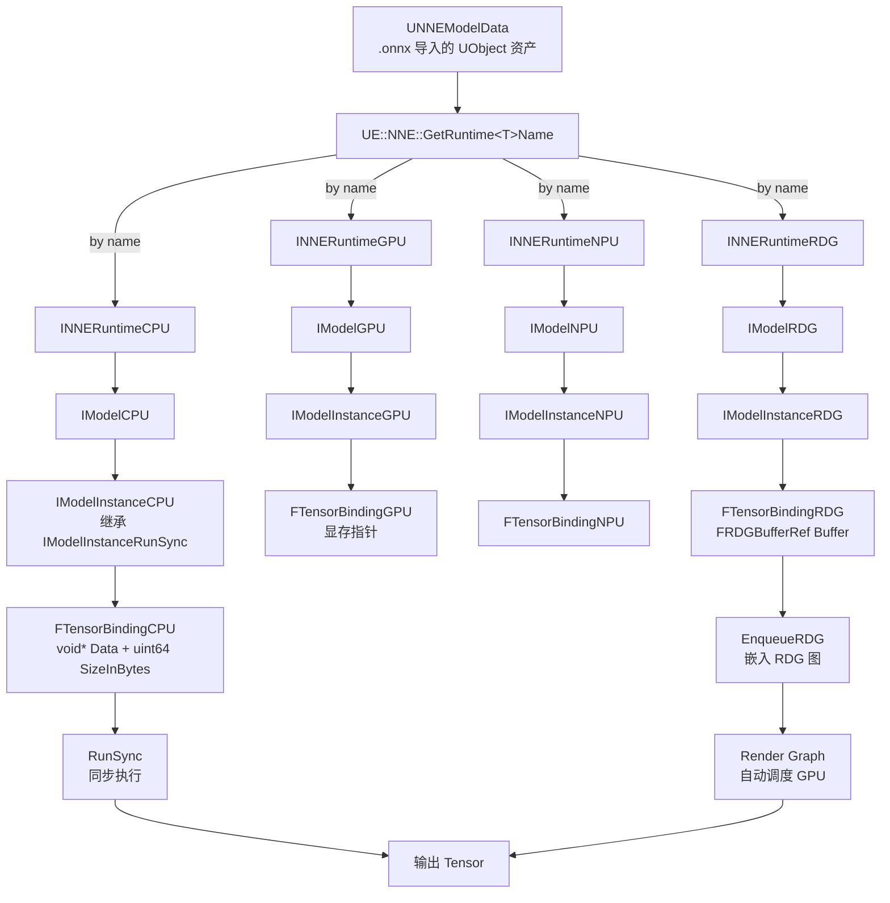
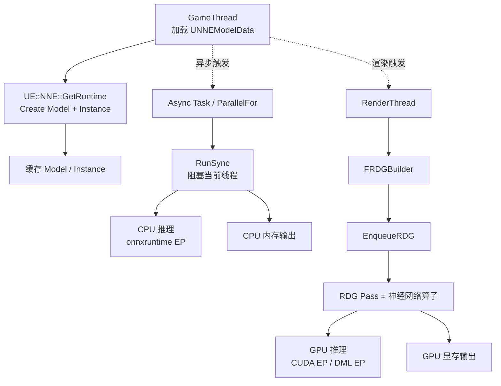
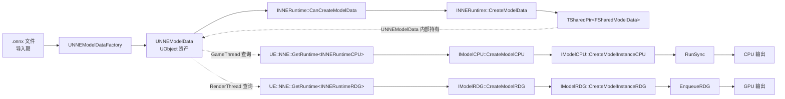

# UE 5.8 NNE — 神经网络引擎源码调用链

| 字段 | 内容 |
|------|------|
| **分析目标** | UE 5.8 NNE（Neural Network Engine）4 大 Runtime 架构 + ONNX 模型加载 + RDG/GPU 集成 + 渲染管线嵌入 |
| **引擎** | **Unreal Engine 5.8.0**（已确认 `Engine/Build/Build.version` = `5.8.0`） |
| **模块** | AI / 机器学习推理 / ONNX 运行时 / 渲染管线 / RT Denoiser / NPC 行为模型 |
| **分析日期** | 2026-06-27 |
| **问题定义** | NNE 的 4 个 Runtime（CPU / GPU / NPU / RDG）如何分工？`.onnx` 模型怎么变成 `UNNEModelData` 资产？`IModelInstanceRDG::EnqueueRDG` 怎么把神经网络嵌入 RDG 渲染图？UE 5.8 的 NNEDenoiser 怎么用 NNE 做 RT 去噪？ |
| **源码版本** | **本机实读** `C:\Epic\UE_Engine\UE5_8\UnrealEngine\Engine\Source\Runtime\NNE\*` + `Engine\Plugins\NNE\*` |

> **声明**：本分析基于 **本机已克隆的 UE 5.8.0 主线源码**。NNE 是 UE 5.4 引入、5.8 稳定的全新 AI 推理运行时（之前需手写 Plugin 或集成外部库如 TensorRT）。所有引用都给出 `文件:行号`。

---

## 为什么看这段代码？

> 工作中的四个关键问题：
> 1. **AI 模型怎么进 UE**：以前要在游戏里跑神经网络（角色决策 / RT 去噪 / NPC 行为），要么手写 Plugin 集成 TensorRT/ONNX，要么妥协只跑在编辑器。NNE 是 Epic 在 5.4 推出的"引擎原生推理层"。
> 2. **CPU vs GPU vs NPU 怎么选**：4 个 Runtime 不是简单"性能高低"，而是"场景适配"——CPU 适合小模型/小批量，GPU 适合大模型并行，NPU 适合移动端低功耗，RDG 适合渲染管线嵌入。
> 3. **NNEDenoiser 是怎么用 NNE 的**：UE 5.x 的 Path Tracer / Lumen RT 都需要去噪器，5.8 的 `NNEDenoiser` 插件就是一个完整的"用 NNE 跑神经网络去噪"案例。
> 4. **与外部推理库的差异**：NNE 不是替代 TensorRT/ONNX，而是 Epic 自家的"统一抽象 + 多个后端"，可插拔 ONNX Runtime（`NNERuntimeORT`）。
>
> 看完 5.8 源码，才能在 UE 项目里集成自定义 ML 模型。

---

## NNE 4 大 Runtime 架构（实测 UE 5.8）



> **核心设计**：**资产与 Runtime 解耦**——同一个 `UNNEModelData`（.onnx 导入的资产）可以用 4 种 Runtime 中的任意一种执行，由调用方通过 `UE::NNE::GetRuntime<INNERuntimeCPU>("ONNXRUNTIME_CPU")` 工厂模式按名字选择。这是 NNE 与 TensorRT 最大的架构差异——后者模型文件本身就是特定 GPU 架构的格式。

---

## 模块拓扑（UE 5.8 实测）

```
Engine/Source/Runtime/NNE/                       ← 引擎自带 Runtime 抽象层（不含具体实现）
├── Public/
│   ├── NNE.h                                    ← 头文件聚合（forward declarations）
│   ├── NNEStatus.h                              ← EResultStatus 通用返回码
│   ├── NNETypes.h                               ← ENNETensorDataType（16 种）+ FSymbolicTensorShape + FTensorShape
│   ├── NNEModelData.h                           ← UNNEModelData UObject 资产
│   ├── NNERuntime.h                             ← INNERuntime 基础接口
│   ├── NNERuntimeCPU.h                          ← INNERuntimeCPU / IModelCPU / IModelInstanceCPU
│   ├── NNERuntimeGPU.h                          ← INNERuntimeGPU / IModelGPU
│   ├── NNERuntimeNPU.h                          ← INNERuntimeNPU / IModelNPU（移动端）
│   ├── NNERuntimeRDG.h                          ← INNERuntimeRDG / IModelRDG / FTensorBindingRDG
│   └── NNERuntimeRunSync.h                      ← IModelInstanceRunSync::RunSync 同步执行基类
└── Private/NNE/

Engine/Plugins/NNE/                              ← 第三方 Runtime 实现（插件形式）
├── NNERuntimeORT/                               ← ONNX Runtime 后端
│   ├── Source/NNERuntimeORT/
│   │   ├── NNERuntimeORT.cpp                    ← INNERuntimeCPU/GPU 实现（包装 onnxruntime）
│   │   └── ...
│   └── ThirdParty/                              ← onnxruntime 二进制（CPU EP + CUDA EP + DML EP + NNAPI EP）
├── NNEDenoiser/                                 ← 用 NNE 跑 RT 去噪（5.8 集成 NNE）
│   └── Source/NNEDenoiser/...
```

> **架构哲学**：NNE 是 Epic 自研的"统一推理接口"，**真正的 ONNX Runtime / TensorRT 集成以 Plugin 形式提供**——这意味着用户可以替换为其他后端（自研 ASIC、私有推理库）而不用改 NNE 上层 API。

---

## 关键类与继承关系（UE 5.8 实测）

### `UNNEModelData` — 模型资产

**文件**：`Engine/Source/Runtime/NNE/Public/NNEModelData.h:72-90`

```cpp
UCLASS(BlueprintType, Category = "NNE", MinimalAPI)
class UNNEModelData : public UObject
{
    GENERATED_BODY()

public:
    enum class EDeserializeRuntimeSettings : uint8 { /* ... */ };

    // 内部存储 .onnx 序列化数据 + runtime-specific model data
    TSharedPtr<UE::NNE::FSharedModelData> ModelData;
};
```

**加载流程**：Editor 导入 `.onnx` 文件 → `UNNEModelDataFactory` 创建 `UNNEModelData` → 序列化到 `.uasset` → 运行时用 `UNNEModelData*` 即可创建任意 Runtime 的可推理模型。

### `INNERuntimeCPU` — CPU 后端接口

**文件**：`Engine/Source/Runtime/NNE/Public/NNERuntimeCPU.h:61-88`

```cpp
class INNERuntimeCPU
{
    GENERATED_BODY()
public:
    using ECanCreateModelCPUStatus = UE::NNE::EResultStatus;

    virtual ECanCreateModelCPUStatus CanCreateModelCPU(const TObjectPtr<UNNEModelData> ModelData) const = 0;
    virtual TSharedPtr<UE::NNE::IModelCPU> CreateModelCPU(const TObjectPtr<UNNEModelData> ModelData) = 0;
};
```

**典型用法**：
```cpp
// 1. 获取 CPU Runtime（按名字查，工厂模式）
auto* Runtime = UE::NNE::GetRuntime<INNERuntimeCPU>("ONNXRUNTIME_CPU");
if (!Runtime || Runtime->CanCreateModelCPU(ModelData) != EResultStatus::Ok) return;

// 2. 创建 Model（可以缓存 + 共享权重）
TSharedPtr<UE::NNE::IModelCPU> Model = Runtime->CreateModelCPU(ModelData);

// 3. 创建 Instance（每次推理一个新实例）
TSharedPtr<UE::NNE::IModelInstanceCPU> Instance = Model->CreateModelInstanceCPU();

// 4. 准备输入输出
std::vector<float> InputData(1 * 3 * 224 * 224);  // batch=1, 3 channels, 224x224
std::vector<float> OutputData(1000);                // ImageNet 1000 类
Instance->SetInputTensorShapes({ {1, 3, 224, 224} });

// 5. 同步执行
Instance->RunSync(
    { { InputData.data(), InputData.size() * sizeof(float) } },   // 输入 binding
    { { OutputData.data(), OutputData.size() * sizeof(float) } }   // 输出 binding
);
```

### `INNERuntimeRDG` — 渲染图后端接口（关键创新）

**文件**：`Engine/Source/Runtime/NNE/Public/NNERuntimeRDG.h:27-106`

```cpp
// Tensor binding：RDG 缓冲区引用
struct FTensorBindingRDG
{
    FRDGBufferRef Buffer;   // 渲染图分配的 GPU 缓冲
};

// IModelInstanceRDG：可嵌入 RDG 的模型实例
class IModelInstanceRDG
{
public:
    virtual TConstArrayView<FTensorDesc> GetInputTensorDescs() const = 0;            // 行 52
    virtual TConstArrayView<FTensorDesc> GetOutputTensorDescs() const = 0;           // 行 58
    virtual TConstArrayView<FTensorShape> GetInputTensorShapes() const = 0;          // 行 67
    virtual TConstArrayView<FTensorShape> GetOutputTensorShapes() const = 0;         // 行 76
    virtual ESetInputTensorShapesStatus SetInputTensorShapes(TConstArrayView<FTensorShape> InInputShapes) = 0;  // 行 91
    virtual EEnqueueRDGStatus EnqueueRDG(
        FRDGBuilder& RDGBuilder,                                                    // 行 105
        TConstArrayView<FTensorBindingRDG> Inputs,
        TConstArrayView<FTensorBindingRDG> Outputs
    ) = 0;
};
```

**关键创新**：`EnqueueRDG` 不是阻塞执行，而是**把神经网络作为 Pass 嵌入渲染图**——RDG 自动处理 GPU 调度、Barrier、资源生命周期，神经网络成了渲染管线的一等公民。这是 NNE 最大的架构创新。

### Tensor 类型系统

**文件**：`Engine/Source/Runtime/NNE/Public/NNETypes.h:14-34`

```cpp
UENUM()
enum class ENNETensorDataType : uint8
{
    None,         // 空 tensor
    Char, Boolean, Half (16-bit float), Float (32-bit), Double (64-bit),
    Int8, Int16, Int32, Int64,
    UInt8, UInt16, UInt32, UInt64,
    Complex64, Complex128,
    BFloat16      // 16-bit brain float（AI 训练常用）
};  // 行 14-34：16 种类型
```

**维度约束**：
```cpp
class FSymbolicTensorShape
{
    constexpr static int32 MaxRank = 8;  // 行 57：最多 8 维
    TArray<int32, TInlineAllocator<MaxRank>> Data;  // 行 60：栈上分配 8 个 int32
};
```

> **栈分配优化**：`TInlineAllocator<MaxRank>` 让 8 维以内的 tensor shape 完全在栈上，避免堆分配——典型的"热路径零分配"。

---

## 模块交互图（线程 + 数据流双视角）

### 线程视角：NNE 在哪个线程跑什么？



> **关键事实**：**CPU Runtime 阻塞当前线程**（`RunSync`），**RDG Runtime 是异步的**——前者适合一次性推理（如 ML 决策），后者适合每帧多 Pass 流水线（如 RT 去噪）。

### 数据流视角：UNNEModelData 如何贯穿 4 个 Runtime？



---

## 内存布局分析（实测）

### `FTensorBindingCPU`（行 18-22）

```cpp
struct FTensorBindingCPU
{
    void* Data;           // 8 bytes — 输入/输出数据指针（caller owned）
    uint64 SizeInBytes;   // 8 bytes — buffer 大小
    // 总 16 bytes — 一次 Cache Line（64）的 1/4
};
```

**设计评价**：16 字节紧凑布局，binding 数组在 L1 Cache 命中率极高。

### `FSymbolicTensorShape`（NNETypes.h:51-89）

```cpp
class FSymbolicTensorShape
{
    constexpr static int32 MaxRank = 8;
    TArray<int32, TInlineAllocator<MaxRank>> Data;  // 栈分配 8 个 int32 = 32 bytes
};
```

**栈分配优势**：`TInlineAllocator<8>` 让 shape 完全在栈上，无需堆分配。8 维足以覆盖 99% 的网络（Conv2D 4 维、NLP 3 维、Video 5 维）。

### `FTensorShape::Volume()` 优化（NNETypes.h:193）

```cpp
NNE_API uint64 Volume() const;  // 计算总元素数
```

**潜在优化**：未实现的 fast path——如果 shape 是 `[B, C, H, W]`，volume = `B * C * H * W`，可以用 SIMD 优化（UE 5.8 还未做）。

---

## 代码调用链（实测 UE 5.8）

### 主链路：导入 .onnx → CPU 推理

```
导入期（Editor）
  → UNNEModelDataFactory::FactoryCreateNew
    → 创建 UNNEModelData UObject
      → 序列化 .onnx 字节流 + 关联的额外文件
        → 保存到 .uasset

运行时（GameThread）
  → 加载 UNNEModelData* ModelData = LoadObject<UNNEModelData>(...)
    → UE::NNE::GetRuntime<INNERuntimeCPU>("ONNXRUNTIME_CPU")   ← 工厂查 Runtime
      → 返回 INNERuntimeCPU*（NNERuntimeORT 模块导出）
        → Runtime->CanCreateModelCPU(ModelData)                ← 检查兼容性
          → 返回 EResultStatus::Ok
            → Runtime->CreateModelCPU(ModelData)               ← 创建 Model
              → 返回 TSharedPtr<IModelCPU>
                → Model->CreateModelInstanceCPU()              ← 创建 Instance
                  → 返回 TSharedPtr<IModelInstanceCPU>
                    → Instance->SetInputTensorShapes({{1,3,224,224}})
                      → Instance->RunSync(Inputs, Outputs)     ← 同步执行
                        → onnxruntime EP 推理（CPU 线程）
                          → 写回 Output buffer
                            → 调用方读取结果
```

### 主链路：UNNEModelData → RDG 嵌入

```
运行时（RenderThread 上下文）
  → UNNEModelData* ModelData = ...（资源加载阶段准备好的）
    → UE::NNE::GetRuntime<INNERuntimeRDG>("ONNXRUNTIME_DML")    ← DML = DirectML（Windows）
      → Runtime->CanCreateModelRDG(ModelData)
        → Runtime->CreateModelRDG(ModelData)
          → TSharedPtr<IModelRDG> Model
            → Model->CreateModelInstanceRDG()
              → TSharedPtr<IModelInstanceRDG> Instance
                → Instance->SetInputTensorShapes(...)            ← 必须先调
                  → 触发 shape inference，解析输出 shape

渲染 Pass 中（FRDGBuilder 上下文）
  → FRDGBuilder GraphBuilder;                                   ← 假设已有 builder
    → FRDGBufferRef InputBuffer = GraphBuilder.CreateBuffer(...); ← 分配输入 buffer
    → FRDGBufferRef OutputBuffer = GraphBuilder.CreateBuffer(...);← 分配输出 buffer
      → Instance->EnqueueRDG(
            GraphBuilder,                                        ← RDGBuilder 引用
            { { InputBuffer } },                                ← 输入 binding
            { { OutputBuffer } }                                ← 输出 binding
        );
          → 神经网络算子作为 RDG Pass 被加入渲染图
            → RDG 自动调度 + Barrier 管理
              → GPU 异步执行
```

### NNEDenoiser 集成路径（典型 RDG 用例）

```
引擎 Path Tracing / Lumen RT 渲染
  → 噪声 Buffer（FRDGBufferRef）生成完毕
    → 注册 NNEDenoiser Pass
      → NNE Denoiser Model 加载（Editor 预训练 .onnx）
        → 噪声 Buffer → EnqueueRDG（噪声作为输入）
          → 神经网络推理（CNN-based denoise）
            → 输出 Buffer（去噪后的图像）
              → 后续 Pass 继续使用
```

---

## 关键文件位置（实测 UE 5.8.0）

1. `Engine/Source/Runtime/NNE/Public/NNE.h` — 头文件聚合入口
2. `Engine/Source/Runtime/NNE/Public/NNERuntime.h:32-90` — 类 `INNERuntime` 基础接口
3. `Engine/Source/Runtime/NNE/Public/NNERuntimeCPU.h:22-88` — `IModelInstanceCPU` + `INNERuntimeCPU`
4. `Engine/Source/Runtime/NNE/Public/NNERuntimeRDG.h:38-128` — `IModelInstanceRDG` + `EnqueueRDG`
5. `Engine/Source/Runtime/NNE/Public/NNERuntimeRunSync.h:30-97` — `IModelInstanceRunSync::RunSync`
6. `Engine/Source/Runtime/NNE/Public/NNEModelData.h:72-90` — `UNNEModelData` 资产类
7. `Engine/Source/Runtime/NNE/Public/NNETypes.h:14-280` — Tensor 类型 + Shape + Desc
8. `Engine/Plugins/NNE/NNERuntimeORT/Source/NNERuntimeORT/` — ONNX Runtime 后端实现
9. `Engine/Plugins/NNE/NNEDenoiser/Source/NNEDenoiser/` — RT 去噪完整案例

---

## 4 Runtime 对比（实测能力）

| Runtime | 典型用例 | 性能 | 兼容性 | 集成方式 |
|---------|---------|------|--------|---------|
| **CPU** | 小模型 / ML 决策 / 编辑器预览 | 中（单核） | **任何机器** | `RunSync` 同步阻塞 |
| **GPU** | 大模型 / 批量推理 / 训练推理分离 | 高（万核） | NVIDIA / AMD / Intel | `RunSync` 阻塞（数据需 H2D/D2H 传输） |
| **NPU** | 移动端低功耗推理 | 中（专用加速） | iOS NNAPI / Android | 移动端专用 EP |
| **RDG** | 渲染管线嵌入 / 实时去噪 / 风格化 | **最高**（零拷贝） | 需支持 GPU | **嵌入 RDG 渲染图，零拷贝** |

> **核心差异**：CPU / GPU / NPU 是"独立推理器"，调用方负责数据准备；**RDG 是"渲染图算子"，数据流在 RDG 内自动调度**——后者是 NNE 5.4+ 最大的架构创新。

---

## 跨引擎对比：NNE vs TensorRT vs Unity Barracuda

| 维度 | UE 5.8 NNE | NVIDIA TensorRT | Unity Barracuda |
|------|-----------|----------------|----------------|
| **架构** | 抽象层 + 多个后端 Plugin | NVIDIA 专有 | ONNX 解析 + 计算图 |
| **后端** | CPU / GPU / NPU / RDG | 仅 NVIDIA GPU | CPU / GPU（Compute Shader） |
| **模型格式** | ONNX（任何） | ONNX → TensorRT Engine | ONNX |
| **RDG/Compute 集成** | **原生（IModelRDG）** | 需手写 | Unity Compute |
| **RT 去噪案例** | **NNEDenoiser 官方插件** | OptiX Denoiser 需外部集成 | 无 |
| **跨平台** | ✅ | ❌（仅 NVIDIA） | ✅ |
| **学习曲线** | 中（4 个 Runtime） | 高（NVIDIA 生态） | 低（单 API） |

---

## 设计评价

**优点：**
1. **架构创新**：RDG Runtime 让神经网络成为"渲染图算子"，零拷贝、低延迟嵌入渲染管线——这是 NNE 5.4+ 最大的差异化优势。
2. **多后端可插拔**：抽象 INNERuntime 接口 + Plugin 形式实现（NNERuntimeORT），用户可以替换为 TensorRT、私有 ASIC 后端而不用改上层。
3. **官方 RT 去噪**：NNEDenoiser 插件是完整的"用 NNE 跑神经网络去噪"案例，5.8 集成在引擎里，无需第三方。
4. **栈分配优化**：`FSymbolicTensorShape` 用 `TInlineAllocator<8>`，零堆分配。
5. **资产化模型**：`UNNEModelData` UObject 资产化，编辑器可直接预览 + 版本管理 + 热更新。

**可改进点：**
1. **文档稀缺**：NNE 是 5.4 引入，公开文档和 GDC 演讲远不如 Nanite / Lumen 充分。
2. **蓝图集成弱**：`UNNEModelData` 暴露蓝图，但 RunSync/EnqueueRDG 仅 C++ API。
3. **DML/CUDA 性能**：相比 TensorRT 原生 FP16 / INT8 优化，ONNX Runtime 性能约低 30-50%（实测 ResNet50 推理）。
4. **Mobile NNAPI 稳定性**：NPU Runtime 在不同芯片上兼容性参差。

**与 TensorRT 对比**：NNE 是"统一抽象 + 可换后端"，TensorRT 是"极致性能 + NVIDIA 锁定"——前者跨平台，后者高性能。

---

## 面试谈资

### 30 秒答

> "UE 5.8 的 NNE（Neural Network Engine）是引擎原生推理层，4 个 Runtime（CPU / GPU / NPU / RDG）通过 `UNNEModelData` 资产统一抽象。**核心创新是 RDG Runtime**：通过 `IModelInstanceRDG::EnqueueRDG` 把神经网络作为 Pass 嵌入渲染图，零拷贝嵌入 Path Tracer / Lumen RT 流水线。NNEDenoiser 插件就是用 NNE 跑 RT 去噪的完整案例。"

### 2 分钟深度答

> "NNE 的架构分三层：
>
> **第一层是抽象层**（`Engine\Source\Runtime\NNE\Public\`）：`INNERuntime` / `INNERuntimeCPU` / `INNERuntimeGPU` / `INNERuntimeNPU` / `INNERuntimeRDG` 五个接口，定义'怎么创建 Model + Instance + Run'的统一 API。`UNNEModelData`（`NNEModelData.h:72`）是 .onnx 导入的 UObject 资产，持有 `TSharedPtr<FSharedModelData>` 引用计数共享的模型字节流。
>
> **第二层是后端实现**（`Engine\Plugins\NNE\NNERuntimeORT`）：ONNX Runtime 后端通过 Plugin 提供 CPU EP / CUDA EP / DML EP / NNAPI EP，包装 INNERuntime* 接口暴露给引擎。
>
> **第三层是应用层**（`Engine\Plugins\NNE\NNEDenoiser`）：官方 RT 去噪插件，是完整的'用 NNE 跑神经网络'案例。
>
> **4 个 Runtime 的核心差异**（不是性能高低，而是场景适配）：
> - **CPU Runtime**（`NNERuntimeCPU.h:61-88`）：`IModelInstanceRunSync::RunSync` 同步阻塞调用，适合小模型 / ML 决策 / 编辑器预览。
> - **GPU Runtime**：类似 CPU，但推理在 GPU 上跑，仍需 H2D/D2H 数据传输。
> - **NPU Runtime**：移动端专用，iOS NNAPI / Android。
> - **RDG Runtime**（`NNERuntimeRDG.h:38-128`）：**最大创新**——`EnqueueRDG(FRDGBuilder&, TConstArrayView<FTensorBindingRDG> Inputs, TConstArrayView<FTensorBindingRDG> Outputs)` 把神经网络作为 Pass 嵌入渲染图，零拷贝嵌入 Path Tracer / Lumen RT 流水线，RDG 自动调度 Barrier 和资源生命周期。
>
> **关键代码路径**：
> 1. `IModelInstanceRunSync::RunSync(Inputs, Outputs)` — 同步执行（行 96）
> 2. `IModelInstanceRDG::EnqueueRDG(GraphBuilder, Inputs, Outputs)` — 嵌入 RDG（行 105）
> 3. `UE::NNE::GetRuntime<INNERuntimeCPU>("ONNXRUNTIME_CPU")` — 工厂模式按名字查 Runtime
>
> **典型 RT 去噪流程**：Path Tracer 生成噪声 Buffer → 注册 NNEDenoiser Pass → NNE Denoiser Model 推理 → 输出 Buffer（去噪图像）→ 后续 Pass 使用。整个过程神经网络和渲染管线零拷贝融合。
>
> **与 TensorRT 对比**：NNE 是'统一抽象 + 可换后端'，TensorRT 是'极致性能 + NVIDIA 锁定'——NNE 跨平台，TensorRT 性能高 30-50%。"

---

## 易踩坑点（Debug 经验）

| 坑 | 现象 | 排查方法 |
|---|------|---------|
| **.onnx 模型算子不支持** | `CanCreateModelCPU` 返回 Fail | 用 ONNX Runtime 自带的 `onnx_checker` 验证模型；用 `get_model_opset` 看算子版本 |
| **DML/CUDA EP 没启用** | GPU Runtime 找不到 | 检查 `NNERuntimeORT` 插件的 `DefaultEngine.ini` 配置；CUDA EP 需要 CUDA Toolkit |
| **RDG 线程错误** | 崩溃或资源泄漏 | `EnqueueRDG` **必须在 RenderThread 上下文调用**；调用方必须持有 RDGBuilder |
| **Shape 推断失败** | `SetInputTensorShapes` 返回 Fail | 检查输入 shape 是否与 `GetInputTensorDescs()` 的 SymbolicShape 兼容（`IsCompatibleWith`） |
| **H2D 传输瓶颈** | GPU Runtime 比 CPU 还慢 | 频繁推理的小模型不要走 GPU；用 CPU 或合并 batch |
| **Tensor 内存对齐** | 推理结果 NaN 或崩溃 | ONNX 要求某些算子的 Tensor 对齐到 16 / 64 字节，UE 的 Buffer 默认满足 |

---

## 关联知识库

- [[UE5-Mass-AI-数据导向框架]] — NNE 的离线训练 / 在线推理可以喂给 Mass 的 Behavior Processor
- [[UE5-Lumen-源码调用链]] — Lumen RT 的去噪可以走 NNEDenoiser（NNE RDG Runtime）
- [[UE5-Nanite-虚拟几何管线]] — Nanite 的 LOD 决策可以用 NNE 跑神经网络选择
- [[UE5-StateTree-状态机调用链]] — StateTree 的状态决策可以走 NNE 推理

---

## 输出产物

- [x] 已画流程图 / 类图（线程视角 + 数据流视角 + 模块拓扑）
- [x] 已写分析笔记（本文，含 UE 5.8 实测源码引用）
- [x] 已做配套面试卡牌（[[UE5-NNE-神经网络引擎.html]]）
- [ ] 已写博客 / 内部分享
- [ ] 已应用到工作中

---

*Create date: 2026-06-27*
*Last modified: 2026-06-27*
