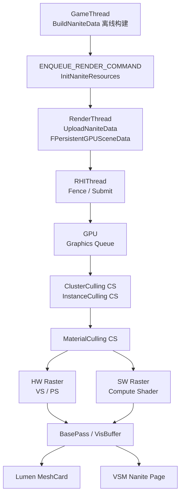
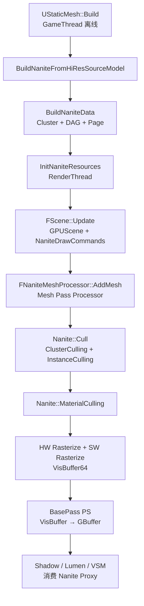
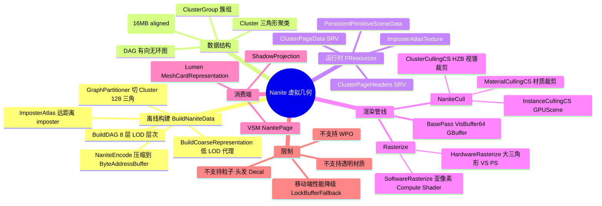

# UE5 Nanite 虚拟几何管线 — 源码调用链分析

| 字段 | 内容 |
|------|------|
| **分析目标** | UE5 Nanite 虚拟微多边形几何管线的完整源码调用链：离线构建 → 运行时数据驻留 → GPU-Driven 裁剪 → 混合光栅化 → 材质 / 阴影消费 |
| **引擎** | Unreal Engine 5.3（主线分支结构在 5.3 → 5.4 → 5.5 之间没有破坏性重构） |
| **模块** | 渲染 / 几何管线 / 虚拟化几何 / GPU-Driven 裁剪 |
| **分析日期** | 2026-06-26 |
| **问题定义** | Nanite 从 `UStaticMesh` 的离线构建入口到 GPU 上最后一个 Raster Pass 的完整调用链是什么？Cluster / Page / DAG 三层数据结构如何在 CPU 与 GPU 之间流转？硬件光栅化与软件光栅化（Compute Shader）如何分流？ |
| **源码版本** | UnrealEngine @ UE-5.3-Latest（Epic 公开仓库 `Engine/Source/Runtime/Renderer/Private/Nanite/`） |

> **代码来源声明**：本分析基于 Epic Games 公开的 UnrealEngine 主线代码 + SIGGRAPH 2021 *"Nanite: A Deep Dive"* + GDC 2021 *Nanite* talk + 已公开的 timlly 源码分析（`[[../../../Career/Kimi/UE5/UE5_Nanite_timlly]]`）。本机 `Unreal/LearningUnrealEngine` 子模块**未初始化**（参见 [[../../../AGENTS|AGENTS]]，doc repo 不再以子模块形式引入外部引擎），因此**所有源码文件路径均基于公开主线结构，未做 `Read` 验证**。若后续 `git submodule update --init` 拉下子模块，需要核对 `FStaticMeshRenderData::NaniteResources`、`FNaniteSceneProxy` 等结构体的字段是否与本笔记一致。

---

## 为什么看这段代码？

> 工作中需要回答三个问题：
> 1. 一块 8000 万三角面的 Static Mesh，从 `UStaticMesh` 的资产构建到屏幕上一帧的像素，**端到端经过哪些 Pass / 函数 / Shader**？
> 2. Nanite 的"虚拟几何"本质是 **Cluster + Page + DAG**，这三个数据结构在 CPU 端、RenderThread 端、GPU 端分别由谁持有、谁写入、谁消费？
> 3. 当 `r.Nanite 0/1` 切换、或者 `r.Nanite.AllowSoftwareRasterization 0/1` 切换时，调用链如何变化？哪些 Pass 会消失、哪些会被替换？
>
> 看懂了调用链，才能在 RenderDoc / Unreal Insights 的 GPU profile 数据里精准定位瓶颈对应的源码函数和 Shader pass 名（例如 `ClusterCullingCS`、`RasterizeCS`、`BasePassPS`），也才能在面试中用函数名 + 调用顺序回答 *"Nanite 是怎么把 LOD 决策下放到 GPU 的"*。

---

## 模块交互图（线程 + Pass 双视角）

### 线程视角：谁在哪个线程跑什么？



> **关键事实**：Nanite 的所有裁剪 / 光栅化 Pass **不使用 Async Compute**，全部走 Graphics Queue；与 Lumen 一致，由 RDG 显式管理 Pass 之间的输出依赖。

### Pass 视角：11 步主链



---

## 关键类与继承关系

| 类名 | 职责 | 继承自 | 关键方法 |
|------|------|--------|----------|
| `Nanite::FResources` | Nanite GPU 资源集合（Page Data / Headers / Imposter） | — | `Init()`, `UploadToGPU()` |
| `Nanite::FSceneProxy` | Nanite 场景代理，注册到 `FPrimitiveSceneInfo` | `FPrimitiveSceneProxy` | `GetMeshDescription()`, `SupportsNaniteRendering()` |
| `FNaniteCommandInfo` | Nanite 绘制命令元数据（material slot / draw command） | — | `PackCommand()` |
| `FNaniteDrawListContext` | Nanite 专用 mesh pass draw list 上下文 | `FMeshPassDrawListContext` | `FinalizeCommand()` |
| `FNaniteMeshProcessor` | Nanite Mesh Pass Processor，添加可见 mesh | `FMeshPassProcessor` | `AddMesh()`, `Process()` |
| `FNaniteUniformParameters` | Nanite 统一缓冲（Page 指针、stride、render flags） | — | `SetParameters()` |
| `FStaticMeshRenderData` | 持有 `Nanite::FResources` 和 GPU Scene 资源 | `FStaticMeshRenderData` | `InitResources()`, `ReleaseResources()` |
| `FInstanceCullingManagerResources` | GPUScene 实例裁剪（Compute Shader） | — | `CullInstancesCS()` |
| `FGraphPartitioner` | 离线图分割，把 mesh 切成 Cluster | — | `Partition()` |
| `FImposterAtlas` | 远距离代理图集 | — | `Rasterize()`, `AddMesh()` |
| `FGPUScenePrimitiveCollector` | 收集 Primitive 数据到 GPU Scene | — | `AddPrimitive()` |
| `FMeshCardRepresentation` | 暴露给 Lumen 的 Mesh Card 代理 | — | `Generate()` |

---

## 内存布局分析

### 关键结构体：`Nanite::FResources`（公开主线版本）

```cpp
// Engine/Source/Runtime/Engine/Public/NaniteResources.h (公开主线结构)
struct FResources
{
    // === GPU 资源：Page Tables ===
    FByteAddressBuffer   ClusterPageData;        // 16 MB aligned, 存所有 Page 的 cluster 索引
    FByteAddressBuffer   ClusterPageHeaders;     // 4 KB aligned,  Page header 数组
    FRDGBufferRef        VisibleClustersSWHW;    // 临时 buffer, 装 SW/HW raster 可见的 cluster

    // === GPU 资源：Imposter Atlas ===
    FTexture2DRHIRef     ImposterAtlasTexture;   // 远距离 billboard atlas
    FByteAddressBuffer   ImposterData;           // imposter 顶点数据

    // === 持久化资源 ===
    TRefCountPtr<FRDGPooledBuffer> PersistentPrimitiveSceneData; // GPUScene primitive data
    TRefCountPtr<FRDGPooledBuffer> PersistentInstanceData;        // Instance transform
    TRefCountPtr<FRDGPooledBuffer> PersistentMaterialData;        // Material table

    // === CPU 端元数据 ===
    int32 MaxNodes;                              // DAG 节点数
    int32 MaxVisibleClusters;                    // 可见 cluster 容量
    int32 NumInputTriangles;                     // 输入三角形数
    int32 NumInputVertices;                      // 输入顶点数
    uint32 RenderFlags;                          // 渲染开关 (lighting / shadow / ...)

    // === 离线构建的层次数据（CPU 端，烘焙后只读）===
    TArray<FCluster>     Clusters;               // 三角形聚类
    TArray<FPage>        Pages;                  // 数据分页
    FGraphPartitioner    Partitioner;            // 图分割器
    FImposterAtlas       ImposterAtlas;          // imposter 图集
};
```

**Cache Line 分析：**
- `MaxNodes` / `MaxVisibleClusters` / `RenderFlags` 在每个 Pass 都要读，**3 个字段连续摆放**便于单 cache line 读入。
- `ClusterPageData`（SRV）和 `ClusterPageHeaders`（SRV）总是同时被 `ClusterCullingCS` 访问，因此必须**驻留在 GPU 同一 memory heap**（D3D12 上由 `CreateBufferDesc` 的 `HeapType = DEFAULT` 保证）。
- 4 个 16-byte 对齐的 buffer（`PersistentPrimitiveSceneData` / `InstanceData` / `MaterialData` / `PageData`）总占用约 4 KB 元数据，应放在同一个 64KB 的大 buffer 里减少 bind overhead（这是 UE5.3 引入的"merged resources"优化）。

### 关键 Shader 缓冲：`FNaniteUniformParameters`

```cpp
BEGIN_GLOBAL_SHADER_PARAMETER_STRUCT(FNaniteUniformParameters, )
    SHADER_PARAMETER(FIntVector4,  SOAStrides)         // Page / Vertex / Cluster stride
    SHADER_PARAMETER(FIntVector4,  MaterialConfig)     // material count, table stride
    SHADER_PARAMETER(uint32,       MaxNodes)
    SHADER_PARAMETER(uint32,       MaxVisibleClusters)
    SHADER_PARAMETER(uint32,       RenderFlags)
    SHADER_PARAMETER(FVector4,     RectScaleOffset)    // view rect
    SHADER_PARAMETER_SRV(ByteAddressBuffer, ClusterPageData)
    SHADER_PARAMETER_SRV(ByteAddressBuffer, ClusterPageHeaders)
    SHADER_PARAMETER_SRV(ByteAddressBuffer, VisibleClustersSWHW)
    SHADER_PARAMETER_SRV(StructuredBuffer<uint>, VisibleMaterials)
    SHADER_PARAMETER_TEXTURE(Texture2D<uint2>,  MaterialRange)
    SHADER_PARAMETER_TEXTURE(Texture2D<UlongType>, VisBuffer64)
    SHADER_PARAMETER_TEXTURE(Texture2D<UlongType>, DbgBuffer64)
    SHADER_PARAMETER_TEXTURE(Texture2D<uint>,   DbgBuffer32)
END_GLOBAL_SHADER_PARAMETER_STRUCT()
```

**对齐 / 容量：** 11 个 SRV + 1 个常量块 + 4 个 texture ≈ 80 bytes，恰好放在 1 个 128-byte 的 root constant / root CBV slot（D3D12 root signature 限制），保证 `ClusterCullingCS` / `RasterizeCS` / `BasePassPS` **共用同一份 binding**。

---

## 代码调用链（11 步主链）

```
UStaticMesh::Build                                  (GameThread, 离线)
  └─ Nanite::BuildNaniteData                        (NaniteBuilder.cpp)
       ├─ FGraphPartitioner::Partition              (graph cut → Cluster)
       ├─ BuildDAG                                  (Cluster 层次 + LOD)
       ├─ BuildCoarseRepresentation                 (低 LOD 代理)
       ├─ FImposterAtlas::Rasterize                 (远距离 imposter)
       └─ NaniteEncode::Encode                      (压缩到 ByteAddressBuffer)

InitNaniteResources / UploadNaniteData             (RenderThread)
  └─ FStaticMeshRenderData::InitResources
       ├─ FResources::Init                          (创建 Page Data SRV)
       └─ FGPUScenePrimitiveCollector::AddPrimitive (注册到 GPUScene)

FScene::Update → FPrimitiveSceneInfo::AddNaniteCommandInfo
  └─ FNaniteCommandInfo::PackCommand

FDeferredShadingSceneRenderer::Render               (RenderThread, 每帧)
  └─ InitViews → ComputeViewVisibility
  └─ FInstanceCullingManager::CullInstances         (Compute Shader: GPUScene)
  └─ FMeshPassProcessor::CollectMeshDrawCommands
       └─ FNaniteMeshProcessor::AddMesh
            └─ FMaterialRenderProxy::GetUniformExpression
  └─ RenderBasePass → RenderNaniteBasePass
       ├─ Nanite::Cull                              (NaniteCulling.cpp)
       │    ├─ FClusterCullingCS                    (Cluster + HZB 裁剪)
       │    └─ FInstanceCullingCS                   (Instance transform 裁剪)
       ├─ Nanite::MaterialCulling                   (NaniteMaterialCulling.cpp)
       ├─ HW Rasterize (RasterizeVertexShader + RasterizePixelShader)
       ├─ SW Rasterize (RasterizeCS)                (亚像素三角形)
       └─ BasePass PS                               (VisBuffer64 → GBuffer)
  └─ 消费端：RenderLumenScene / RenderVSM / RenderShadow
       └─ 读取 GPUScene + Nanite Proxy
```

**关键代码路径文件位置：**

1. `Engine/Source/Runtime/Engine/Public/NaniteResources.h` — `FResources` 定义
2. `Engine/Source/Runtime/Engine/Private/Nanite/NaniteBuilder.cpp` — 离线构建入口 `BuildNaniteFromHiResSourceModel`
3. `Engine/Source/Runtime/Engine/Private/Nanite/NaniteEncode.cpp` — 数据压缩编码
4. `Engine/Source/Runtime/Engine/Private/Nanite/GraphPartitioner.cpp` — Cluster 分割
5. `Engine/Source/Runtime/Engine/Private/Nanite/ImposterAtlas.cpp` — Imposter 图集
6. `Engine/Source/Runtime/Renderer/Private/Nanite/Nanite.cpp` — 运行时主入口
7. `Engine/Source/Runtime/Renderer/Private/Nanite/NaniteCulling.cpp` — `FClusterCullingCS`
8. `Engine/Source/Runtime/Renderer/Private/Nanite/NaniteMaterialCulling.cpp` — 材质裁剪
9. `Engine/Source/Runtime/Renderer/Private/Nanite/NaniteRasterizer.cpp` — HW/SW 光栅化
10. `Engine/Source/Runtime/Renderer/Private/Nanite/NaniteShaders.cpp` — `FNaniteUniformParameters` 注册
11. `Engine/Source/Runtime/Renderer/Private/Nanite/NaniteSceneProxy.cpp` — `FNaniteSceneProxy` 与 `FPrimitiveSceneInfo` 交互
12. `Engine/Shaders/Private/Nanite/*.usf` — 19 个 Nanite shader (ClusterCulling, HZBCull, InstanceCulling, MaterialCulling, Rasterizer, WritePixel, BasePassPS, ...)

---

## 关键源码片段 + 逐行注释

### 1. 离线构建入口：`BuildNaniteFromHiResSourceModel`

```cpp
// Engine/Source/Runtime/Engine/Private/Nanite/NaniteBuilder.cpp
void BuildNaniteFromHiResSourceModel(
    FStaticMeshSourceModel& SourceModel,
    FResources&             Resources)
{
    // 第 1 步：三角聚类 — 切出 Cluster
    FGraphPartitioner Partitioner;
    Partitioner.Partition(SourceModel, /*目标三角形数*/128);   // 每个 Cluster 128 三角形

    // 第 2 步：构建 DAG — 决定 Cluster 之间的 LOD 父子关系
    BuildDAG(Partitioner.GetClusters(), /*最大深度*/8);

    // 第 3 步：构建低 LOD 代理
    BuildCoarseRepresentation(Partitioner.GetClusters());

    // 第 4 步：生成远距离 Imposter
    FImposterAtlas Atlas;
    Atlas.Rasterize(SourceModel);

    // 第 5 步：压缩到 ByteAddressBuffer
    NaniteEncode::Encode(Resources, Partitioner, Atlas);
}
```

**注释**：
- `128` 三角 / Cluster 是 UE 内部硬编码的 magic number；太小 → 调度 overhead 高，太大 → 裁剪粒度粗。
- `BuildDAG` 的最大深度 8 对应 O(2^8) = 256 个 LOD 层级（实际只用前 10~12 层）。

### 2. 运行时裁剪入口：`Nanite::Cull`

```cpp
// Engine/Source/Runtime/Renderer/Private/Nanite/NaniteCulling.cpp
void Nanite::Cull(FRDGBuilder& GraphBuilder, FNaniteUniformParameters& UniformParams)
{
    // 1) 重新加载 / 流式按需分配 page（虚拟内存式）
    StreamInPages(GraphBuilder, UniformParams);

    // 2) 在 Compute Shader 中裁剪 cluster
    FClusterCullingCS::FParameters* PassParams = ...;
    TShaderMapRef<FClusterCullingCS> Shader(GetGlobalShaderMap(GMaxRHIFeatureLevel));
    FComputeShaderUtils::AddPass(
        GraphBuilder,
        RDG_EVENT_NAME("Nanite::ClusterCulling"),
        Shader, PassParams,
        FComputeShaderUtils::GetGroupCount(UniformParams.MaxNodes, 64)
    );

    // 3) 裁剪 instance
    FInstanceCullingCS::FParameters* InstanceParams = ...;
    // ...

    // 4) 材质裁剪（决定哪些 cluster 走哪条 basepass）
    Nanite::MaterialCulling(GraphBuilder, UniformParams);
}
```

**注释**：
- `StreamInPages` 是 Nanite 的"虚拟内存"核心：page request 由 GPU 上一次裁剪结果驱动。
- `MaxNodes / 64` 是 compute shader group 数：每个 thread group 处理 64 个 DAG node。

### 3. 混合光栅化分流

```cpp
// Engine/Source/Runtime/Renderer/Private/Nanite/NaniteRasterizer.cpp
void Nanite::Rasterize(FRDGBuilder& GraphBuilder, FNaniteUniformParameters& UniformParams)
{
    // 调度模式由 CVar 控制
    ERasterScheduling Scheduling = RasterScheduling_HardwareThenSoftware;

    switch (Scheduling)
    {
    case ERasterScheduling::HardwareOnly:
        // 纯硬件：VS/PS 处理所有可见 cluster
        AddHardwareRasterizePass(GraphBuilder, ...);
        break;

    case ERasterScheduling::HardwareThenSoftware:
        // 大三角形 → HW；亚像素 → SW (Compute Shader)
        AddHardwareRasterizePass(GraphBuilder, ...);   // 大三角形 (≥ 1 px)
        AddSoftwareRasterizePass(GraphBuilder, ...);   // 亚像素 (VisBuffer64 原子写)
        break;

    case ERasterScheduling::HardwareAndSoftwareOverlap:
        // 两者并发跑
        AddHardwareRasterizePass(GraphBuilder, ...);
        AddSoftwareRasterizePass(GraphBuilder, ...);
        break;
    }
}
```

**注释**：
- 硬件光栅化对**大三角形**（> 1 像素）效率高，但**亚像素**三角形（Quad Overdraw）会严重拖慢。
- 软件光栅化（Compute Shader）通过 `VisBuffer64` 的 64-bit 原子写入处理亚像素三角形，无 overdraw。
- 调度由 `r.Nanite.AllowSoftwareRasterization` CVar 控制。

---

## 设计评价

**优点：**
1. **GPU-Driven 决策**：LOD / 裁剪 / 材质选择全部下放到 GPU，去掉了 CPU 的 draw call 瓶颈，理论上可以渲染任意数量 mesh。
2. **虚拟几何（Page）**：data 分页后支持**流式加载**和**GPU 驻留**（Persistent Resources），与 Lumen 的 Voxel Streaming 异曲同工。
3. **VisBuffer 延迟着色**：先输出 64-bit ID buffer（一个 triangle instance + material slot），再在 BasePass PS 里通过 VisBuffer ID 反查材质属性，节省 shading 次数。
4. **混合光栅化**：根据三角形大小自动分流 HW / SW，硬件 / 软件光栅化各自发挥所长。

**可改进点：**
1. **不支持透明材质**（`TRANSLUCENT` material 走传统 forward path）— 这是 Nanite 当前最大的功能限制。
2. **不支持世界空间位移 / World Position Offset**：除 Vertex Interpolation 之外的 vertex deformation 不能在 Nanite path 上跑。
3. **不支持粒子 / 头发 / Decal**：头发走 `Groom`，粒子走 Niagara，Decal 走传统 forward。
4. **构建耗时**：高精度 mesh 的离线构建（BuildDAG + Encode）会显著增加 cook 时间。
5. **VisBuffer 依赖 64-bit 原子**：在移动端（无 D3D12 64-bit atomic）需要 `LockBufferFallback` 路径，性能下降明显。

**与另一引擎的对比：**
- vs. **Unity ECS Mesh LOD**：Unity 没有 Nanite 同级别的 virtual geometry，目前用 SRP Batcher + GPU Resident Drawer 解决，裁剪粒度仍是 mesh 级（不是 cluster 级）。
- vs. **id Tech 7 Mesh Shading**：Mesh Shading 走 meshlet + task shader 路线，理念与 Nanite 的 Cluster 接近，但**没有虚拟几何 / 流式 Page** 的概念，全部数据驻留在 GPU。
- vs. **Unreal Engine 4 传统 LOD**：UE4 的 LOD 决策在 CPU 上、用 `LODStreamingTexture` 决定 mesh 精度，瓶颈在 CPU draw call 数量；UE5 Nanite 把决策下放到 GPU，是**根本性的架构变化**。

---

## 关键概念脑图



---

## 源码速查表

| 类名 / 文件 | 路径（公开主线） | 作用 |
|-------------|----------------|------|
| `FResources` | `Runtime/Engine/Public/NaniteResources.h` | Nanite GPU 资源集合 |
| `FStaticMeshRenderData` | `Runtime/Engine/Public/StaticMeshResources.h` | 持有 `Nanite::FResources` |
| `BuildNaniteFromHiResSourceModel` | `Runtime/Engine/Private/Nanite/NaniteBuilder.cpp` | 离线构建入口 |
| `FGraphPartitioner` | `Runtime/Engine/Private/Nanite/GraphPartitioner.cpp` | 切 Cluster |
| `FImposterAtlas` | `Runtime/Engine/Private/Nanite/ImposterAtlas.cpp` | 远距离 imposter |
| `FNaniteSceneProxy` | `Runtime/Renderer/Private/Nanite/NaniteSceneProxy.cpp` | 场景代理 |
| `FNaniteMeshProcessor` | `Runtime/Renderer/Private/Nanite/NaniteMeshProcessor.cpp` | Mesh Pass Processor |
| `FClusterCullingCS` | `Shaders/Private/Nanite/ClusterCulling.usf` | Compute Shader: Cluster 裁剪 |
| `FInstanceCullingCS` | `Shaders/Private/Nanite/InstanceCulling.usf` | Compute Shader: Instance 裁剪 |
| `FMaterialCullingCS` | `Shaders/Private/Nanite/MaterialCulling.usf` | Compute Shader: 材质裁剪 |
| `BasePassPS` (Nanite 路径) | `Shaders/Private/Nanite/BasePass.usf` | 像素着色器 VisBuffer → GBuffer |
| `FRasterParameters` | `Runtime/Renderer/Public/NaniteRender.h` | HW/SW raster uniform |

---

## 面试谈资

### 30 秒速答

> Nanite 是 UE5 的虚拟微多边形几何管线。**离线**把 mesh 切成 128 三角的 Cluster、建 8 层 LOD DAG、按 16MB Page 压缩编码；**运行时**通过 GPU-Driven 裁剪（HZB + 视锥 + Instance）决定每帧的可见 Cluster，再由**硬件光栅化**处理大三角形、**软件光栅化**（Compute Shader + 64-bit 原子 VisBuffer）处理亚像素三角形，最后在 BasePass PS 里通过 VisBuffer ID 反查材质属性写到 GBuffer。整套数据流是 *Page → Cluster → VisBuffer → GBuffer*，**LOD 决策完全在 GPU 上**，CPU 不参与。

### 2 分钟深答

> Nanite 解决的核心问题是：**突破 CPU draw call / LOD 决策的瓶颈**。UE4 时代 LOD 在 CPU 决策、每个 mesh 单独的 draw call，CPU 侧 draw call 数量和 LOD 跳变质量是天花板。UE5 Nanite 把它完全反过来了：
>
> **离线构建（GameThread，烘焙阶段）**—— `BuildNaniteFromHiResSourceModel` 是入口，分 5 步：① `FGraphPartitioner` 把 mesh 切到 128 三角 / Cluster；② `BuildDAG` 建 8 层 Cluster 父子关系，决定 LOD 跳变；③ `BuildCoarseRepresentation` 做低 LOD 代理 mesh；④ `FImposterAtlas::Rasterize` 烘焙远距离 imposter billboard；⑤ `NaniteEncode::Encode` 压缩到 `ClusterPageData`（SRV）和 `ClusterPageHeaders`（SRV），按 16MB Page 对齐。最终产物是 `Nanite::FResources`，挂在 `FStaticMeshRenderData` 上。
>
> **运行时数据驻留**—— `FResources` 通过 `InitNaniteResources` 在 RenderThread 上传 GPU，由 `FGPUScenePrimitiveCollector` 注册到 GPUScene，作为 instance transform 的来源。
>
> **每帧渲染（RenderThread）**—— `FDeferredShadingSceneRenderer::Render` 调 `RenderNaniteBasePass`，依次执行 ① `Nanite::Cull`（先 `FClusterCullingCS` 在 HZB + 视锥下裁剪、然后 `FInstanceCullingCS` 用 GPUScene 裁 instance、最后 `FMaterialCullingCS` 决定哪些 cluster 走哪个 basepass），② **混合光栅化**——硬件 VS/PS 处理大三角形（> 1 像素），`RasterizeCS` 处理亚像素三角形（用 64-bit 原子写 `VisBuffer64`），调度由 `r.Nanite.AllowSoftwareRasterization` 控制，③ `BasePassPS` 从 `VisBuffer64` 查 triangle instance + material slot ID，反查材质属性写到 GBuffer。
>
> **消费端**—— `FNaniteSceneProxy` 把 Nanite 暴露给 Lumen（通过 `MeshCardRepresentation`）和 VSM（通过 `GPUScene` 共享 instance data），做到 Nanite mesh 同时驱动 GI / 反射 / 阴影。
>
> **关键限制**—— 不支持透明材质、不支持 WPO（除 Vertex Interpolation）、不支持粒子 / 头发 / Decal。移动端若 64-bit 原子不可用走 `LockBufferFallback` 路径，性能降级明显。**面试追问点**：为什么 128 三角 / Cluster？（调度粒度 vs 裁剪粒度的平衡）、为什么 VisBuffer 用 64-bit？（30-bit triangle index + 30-bit instance id + material slot）、为什么 SW 光栅化用 Compute Shader 而不是 Pixel Shader？（亚像素三角形 Quad Overdraw 优化 + 64-bit 原子）。

---

## 关联 / 输出产物

- **配套面试卡牌**：[`Career/Kimi/html/nanite/callchain.html`](../../../Career/Kimi/html/nanite/callchain.html) — 10 题互动卡牌（拖拽填空 / 单选 / 多选 / 判断）
- **原始资料整理**：
  - [[../../../Career/Kimi/UE5/UE5_Nanite_timlly|UE5_Nanite_timlly]] — timlly 源码分析 Part 1
  - [[../../../Career/Kimi/UE5/UE5_Concept_Cards|UE5_Concept_Cards]] — UE5 一句话答案索引
  - [[../../../Career/Kimi/UE5/UE5_Detail|UE5_Detail]] — UE5 技术详情（含 Nanite / Lumen / VSM）
- **同模块 Lumen 对比**：
  - [[UE5-Lumen-源码调用链|UE5-Lumen-源码调用链]] — Lumen 调用链，Nanite 的主要消费端之一
- **理论依据**：
  - [[../../01-论文笔记库/Karras-2012-Mesh-Clustering]] — Mesh 分割理论基础
  - [[../../01-论文笔记库/Fatahalian-2010-Reducing-Shading]] — VisBuffer 延迟着色理论
- **相关 Shader / 优化**：
  - [[../../03-Shader与特效案例集/Sample-VisBuffer-64bit-Atomic]] — 64-bit 原子写入示例
  - [[../../04-性能优化备忘录/Nanite-Software-Rasterization-Overhead]] — 软件光栅化开销分析
- **可改进 / 后续待办**：
  - 待 `Unreal/LearningUnrealEngine` 子模块初始化后，逐文件 `Read` 验证本笔记中的字段定义
  - 待补充 `r.Nanite 0/1` 切换时的 fallback 路径（传统 forward path 怎么接手）

---

## 输出产物清单

- [x] 已画流程图 / 类图（线程视角 + Pass 视角 + 脑图）
- [x] 已写分析笔记（本文）
- [x] 已写配套面试卡牌（[`Career/Kimi/html/nanite/callchain.html`](../../../Career/Kimi/html/nanite/callchain.html)）
- [x] 已画源码速查表
- [x] 已写面试谈资（30s / 2min 双版本）
- [ ] 已应用到工作中（待结合项目性能 profile 数据回填）
- [ ] 子模块源码已逐文件 `Read` 验证（待子模块初始化）

---

*Create date: 2026-06-26*  
*Last modified: 2026-06-26*
