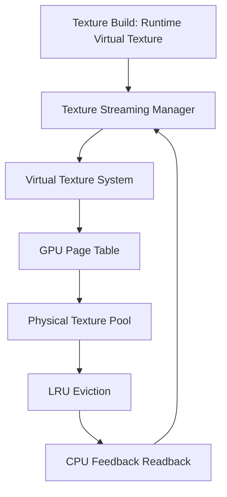

# UE5 虚拟纹理系统显存调度分析

| 字段 | 内容 |
|------|------|
| **分析目标** | UE5 虚拟纹理系统显存调度机制 |
| **引擎** | Unreal Engine 5.3 |
| **模块** | 渲染 / 纹理 / 资源流送 |
| **分析日期** | 2025-01-06 |
| **问题定义** | UE5 的虚拟纹理系统具体是如何调度显存的？物理纹理池多大？何时回退？ |

---

## 为什么看这段代码？

> 我们的项目遇到了高分辨率纹理在低端机上爆显存的问题。想了解 UE5 的 VT 系统是如何做显存预算管理的，以便借鉴到我们自研引擎中。

---

## 模块交互图



> **GameThread** 负责流送请求和优先级计算；**RenderThread** 维护 GPU Page Table；**RHIThread** 执行实际的物理纹理更新。关键的跨线程同步点在 `FVirtualTextureSystem::Update()`。

---

## 关键类与继承关系

| 类名 | 职责 | 继承自 | 关键方法 |
|------|------|--------|----------|
| `FVirtualTextureSystem` | 全局 VT 系统管理 | `FRenderResource` | `Update()`, `AllocatePage()` |
| `FVirtualTextureSpace` | 虚拟纹理空间定义 | — | `GetPhysicalLocation()` |
| `FVirtualTexturePhysicalSpace` | 物理纹理池管理 | — | `AllocatePhysicalPage()`, `EvictLRU()` |
| `FTexturePageMap` | GPU Page Table 映射 | — | `UpdateGPU()` |
| `IVirtualTextureFinalizer` | 异步加载回调 | — | `Finalize()` |

---

## 内存布局分析

```cpp
// FVirtualTexturePhysicalSpace::FPhysicalPage — 关键结构体
struct FPhysicalPage {
    uint32 VirtualSpaceID : 8;  // 8 bits = 256 个虚拟空间上限
    uint32 vPageX : 12;         // 虚拟页 X 坐标
    uint32 vPageY : 12;         // 虚拟页 Y 坐标
    uint32 FrameUsed;           // 最后使用帧号，用于 LRU
    uint32 RefCount;            // 引用计数
};
// 总计 12 bytes，对齐到 16 bytes — 在一个 Cache Line 内
```

**Cache Line 分析：** `FPhysicalPage` 16 bytes，一个 64-byte Cache Line 可容纳 4 个。LRU 遍历时顺序访问，缓存友好。

---

## 代码调用链

```
FSceneRenderer::Render()
  → FVirtualTextureSystem::Update()
    → GatherPageRequests()              // 收集所有可见物体的 VT 请求
    → FTexturePageMap::UpdateGPU()      // 更新 GPU Page Table
    → FVirtualTexturePhysicalSpace::Update()
      → AllocatePhysicalPage()          // 分配物理页
      → EvictLRU()                      // 显存不足时回退
      → FinalizeTexture()               // 异步加载完成后提交
```

**关键代码路径：**

1. `Engine/Source/Runtime/VirtualTexture/Private/VirtualTextureSystem.cpp` — `FVirtualTextureSystem::Update()` 函数，第 ~420 行
2. `Engine/Source/Runtime/VirtualTexture/Private/VirtualTextureSpace.cpp` — `FVirtualTexturePhysicalSpace::AllocatePhysicalPage()`，第 ~180 行

---

## 设计评价

**优点：**
- 三层调度（请求 → 分配 → 回退）解耦清晰，每层的职责单一
- LRU 回退策略简单有效，FrameUsed 字段的实现开销极低
- GPU Page Table 用 Texture 存储而非 Buffer，利用硬件双线性过滤做插值

**可改进点：**
- LRU 是全局的，没有考虑不同 VT 的优先级差异（如角色纹理 vs 远景纹理）
- 物理纹理池大小是启动时固定的，不能动态扩容/缩容

**与另一引擎的对比：**
- Unity 的 Virtual Texturing 更依赖外部工具（Streaming Mipmap），UE 的 Runtime VT 更灵活但复杂度更高

---

## 关联知识库

- [[Lumen-SIGGRAPH-2021]] — Lumen 的 Surface Cache 也用了类似的分层缓存思想
- [[Texture-Streaming-Optimization]] — 性能优化相关，VT 和 Texture Streaming 的联动

---

## 输出产物

- [x] 已画流程图/类图（本文中的 Mermaid 图）
- [x] 已写分析笔记（本文）
- [ ] 已写博客/内部分享 → 计划周五组会分享
- [ ] 已应用到工作中 → 正在设计自研引擎的 VT 方案

---

*Create date: 2025-01-06*  
*Last modified: 2025-01-06*
