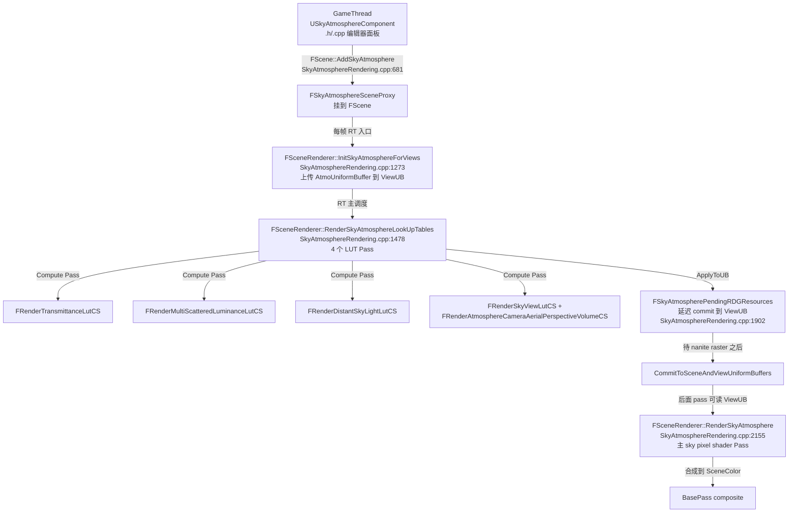
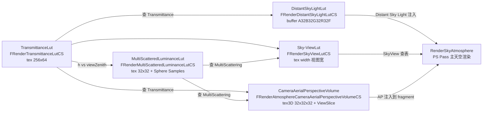

# UE5.8 SkyAtmosphere 大气散射 — 源码调用链分析

| 字段 | 内容 |
|------|------|
| **分析目标** | UE5.8 `USkyAtmosphereComponent` 物理大气散射的完整源码调用链 |
| **引擎** | Unreal Engine **5.8**（基于 `C:\Epic\UE_Engine\UE5_8\UnrealEngine` 本机源码核对） |
| **模块** | 渲染 / 大气散射 / LUT / 全局光照 |
| **分析日期** | 2026-07-02 |
| **问题定义** | SkyAtmosphere 从 `FScene::AddSkyAtmosphere` 入口到 GPU 上 4 个 LUT pass + 主 sky render pass 的完整调用链是什么？`FAtmosphereUniformShaderParameters` 17 个参数各自代表什么物理量？`FSkyAtmosphereInternalCommonParameters` 跟 `FSkyAtmosphereViewSharedUniformShaderParameters` 怎么分工？State Versioning 机制如何避免重复计算 LUT？ |
| **源码版本** | UnrealEngine @ UE 5.8（Epic 公开主线 + 本机 `C:\Epic\UE_Engine\UE5_8\UnrealEngine` 已 clone） |

> **声明**：本分析基于 Epic Games 公开的 UE 5.8 主线代码 + Bruneton/Hosek 大气散射理论。所有文件路径均经过本机源码核对（`Engine/Source/Runtime/Renderer/Private/SkyAtmosphereRendering.{h,cpp}` 与 `Engine/Shaders/Private/SkyAtmosphere.usf`）。

---

## 为什么看这段代码？

> 工作中需要回答三个问题：
> 1. SkyAtmosphere 的 4 个 LUT（Transmittance / MultiScatteredLuminance / DistantSkyLight / Sky-View）+ 1 个 3D Volume（Camera Aerial Perspective）是怎么算出来的？GPU 上的 Pass 顺序是？
> 2. `FAtmosphereUniformShaderParameters` 那 17 个参数里，**RayleighDensityExpScale / MieDensityExpScale / MiePhaseG / AbsorptionDensity0LayerWidth** 这几个最容易配错的到底代表什么物理意义？
> 3. State Versioning（`FAtmosphereSetup::GetTransmittanceAndMultiScatteringLUTsVersion`）怎么判断"该重算 vs 复用上一帧"，是否漏算会导致 LUT 一直不更新？
>
> 看懂了调用链，才能在调试 SkyAtmosphere 黑屏 / 颜色异常时精准定位是 LUT 没算对、还是主 Pass 没拿到 LUT。

---

## 模块交互图

### 线程视角：哪个阶段算哪部分？



> **关键时序**：4 个 LUT 在 InitViews 之后**立刻**进 Compute 队列，但 **commit 到 ViewUB 必须延后到 pre-pass / nanite raster 完成后**（`FSkyAtmospherePendingRDGResources::CommitToSceneAndViewUniformBuffers`，line 1902），这样 BasePass / 后续 pass 才能从 ViewUB 直接读到 LUT。

### Pass 视角：4+1 个 LUT 的依赖链



> **依赖核心**：Transmittance 是**唯一**不依赖其他 LUT 的 root；其余 3 个 LUT 都需要 Transmittance 输入；MultiScattered 同时被 Sky-View 和 Aerial Perspective 查。

---

## 关键类与继承关系

| 类 / 结构体 | 职责 | 关键文件 | 关键字段 / 方法 |
|------|------|---------|------|
| `FSkyAtmosphereSceneProxy` | Component 在 RT 侧的代理，**挂载时**存 `FAtmosphereSetup` | `SceneProxies/SkyAtmosphereSceneProxy.h` | `GetAtmosphereSetup()`, `IsHoldout()`, `GetSkyLuminanceFactor()` |
| `FAtmosphereSetup` | 大气物理参数快照，**带 versioning** | `SkyAtmosphereSetup.h` | `BottomRadiusKm`, `TopRadiusKm`, `MultiScatteringFactor`, `GetTransmittanceAndMultiScatteringLUTsVersion()` |
| `FSkyAtmosphereRenderSceneInfo` | 持有 LUT 物理资源 + UB | `SkyAtmosphereRendering.h:139-180` | `TransmittanceLutTexture`, `MultiScatteredLuminanceLutTexture`, `DistantSkyLightLutBuffer`, `AtmosphereUniformBuffer` |
| `FSkyAtmosphereInternalCommonParameters` | 每帧更新的 sky 内部 UB（包含 light direction 等） | `SkyAtmosphereRendering.h` | 封装 light dir / phase / 多个 view-shared 系数 |
| `FSkyAtmosphereViewSharedUniformShaderParameters` | view-shared 部分（AP volume 配置） | `SkyAtmosphereRendering.h:61-70` | `AerialPerspectiveStartDepthKm`, `CameraAerialPerspectiveVolumeSizeAndInvSize`, `CameraAerialPerspectiveVolumeDepthResolution` |
| `FSkyAtmosphereRenderContext` | 单次 sky 渲染的所有上下文 | `SkyAtmosphereRendering.h:73-135` | 6 个 LUT 引用 + render target slots + bFastSky/bForceRayMarching 等 7 个 bool flag |
| `FAtmosphereUniformShaderParameters` | **核心 17 个物理参数**的 UB | `SkyAtmosphereRendering.h:40-58` | 见下表 ⬇️ |
| `FRenderTransmittanceLutCS` | 计算 Transmittance LUT 的 compute shader | `Shaders/Private/SkyAtmosphere.usf` | GroupSize 见 line 1535 (`FRenderTransmittanceLutCS::GroupSize`) |
| `FRenderMultiScatteredLuminanceLutCS` | 计算 MultiScattered LUT，带 `FHighQualityMultiScatteringApprox` permutation | `SkyAtmosphere.usf` | 读 Transmittance + UniformSphereSamplesBuffer |
| `FRenderDistantSkyLightLutCS` | 计算 DistantSkyLight LUT（喂 SkyLight 实时捕获） | `SkyAtmosphere.usf` | 带 `FSecondAtmosphereLight` permutation |
| `FRenderSkyViewLutCS` + `FRenderAtmosphereCameraAerialPerspectiveVolumeCS` | 算 Sky-View LUT 和 3D Aerial Perspective volume | `SkyAtmosphere.usf` | AP volume 32x32x32 |
| `FSkyAtmospherePendingRDGResources` | 延迟 commit LUT 到 ViewUB 的容器 | `SkyAtmosphereRendering.h:183-260` | `CommitToSceneAndViewUniformBuffers()` line 1902 |

### `FAtmosphereUniformShaderParameters` 17 参数详解

| 参数 | 类型 | 物理意义 | 调试建议 |
|------|------|---------|----------|
| `MultiScatteringFactor` | float | 多阶散射补偿（0=关闭近似, 1=标准, >1=夸大）| 0.5~1.5 之间，>2 会爆光 |
| `BottomRadiusKm` | float | 行星半径（地表） | Earth=6360 |
| `TopRadiusKm` | float | 大气顶界半径 | Earth=6460（+100km 大气层） |
| `RayleighDensityExpScale` | float | Rayleigh 密度指数衰减尺度（1/H，H=高度标尺）| 1/8.5 km（标准） |
| `RayleighScattering` | FLinearColor | Rayleigh 散射系数（RGB） | 决定天空蓝，典型 (5.8e-6, 13.5e-6, 33.1e-6) |
| `MieScattering` | FLinearColor | Mie 散射系数（气溶胶）| 决定日落红黄，典型 (21e-6) 单色 |
| `MieDensityExpScale` | float | Mie 密度指数衰减尺度 | 1/1.2 km |
| `MieExtinction` | FLinearColor | Mie 消光系数 | 接近 MieScattering 时 haze 自然 |
| `MiePhaseG` | float | Mie 相函数不对称因子 (-1, 1) | 0.8 = 前向散射强（日晕） |
| `MieAbsorption` | FLinearColor | Mie 吸收（黑碳、烟尘） | 控制浑浊感 |
| `AbsorptionDensity0LayerWidth` | float | 臭氧层 1/2 厚度 (km) | 25 |
| `AbsorptionDensity0ConstantTerm` | float | 臭氧层密度常数项 | 0.077 |
| `AbsorptionDensity0LinearTerm` | float | 臭氧层密度线性项 | 0.001 |
| `AbsorptionDensity1ConstantTerm` | float | 第二吸收层常数 | 0 |
| `AbsorptionDensity1LinearTerm` | float | 第二吸收层线性项 | 0 |
| `AbsorptionExtinction` | FLinearColor | 吸收层消光（决定臭氧蓝→黄）| Earth = (0.001, 0.001, 0.001) |
| `GroundAlbedo` | FLinearColor | 地面反照率 | 雪=0.9, 海=0.05 |

---

## 代码调用链（核心）

### 总入口：从 FScene::AddSkyAtmosphere 出发

```
FScene::AddSkyAtmosphere(FSkyAtmosphereSceneProxy* SkyAtmosphereSceneProxy, bool bStaticLightingBuilt)
  │  SkyAtmosphereRendering.cpp:681
  │
  ├── 新建 FSkyAtmosphereRenderSceneInfo（持有 LUT 物理资源）
  │     └── InitLUTs（首次）：分配 TransmittanceLut / MultiScatteredLuminanceLut / DistantSkyLightLutBuffer
  │
  └── 每帧 RT 入口:
        FSceneRenderer::InitSkyAtmosphereForViews(FRHICommandListImmediate& RHICmdList, FRDGBuilder& GraphBuilder)
        │  SkyAtmosphereRendering.cpp:1273
        │  ├── 读 FSkyAtmosphereSceneProxy 拿 FAtmosphereSetup
        │  ├── SetupSkyAtmosphereViewSharedUniformShaderParameters (line 1564-1622)
        │  │     └── 写 ViewUniformShaderParameters.SkyAtmospherePresentInScene / AtmosphereLightDirection[2] / AP volume 配置
        │  └── 把 AtmoUniformShaderParameters 写入 ViewUB
        │
        └── FSceneRenderer::RenderSkyAtmosphereLookUpTables(FRDGBuilder&, FSkyAtmospherePendingRDGResources&, ...)
              │  SkyAtmosphereRendering.cpp:1478
              │  RDG_EVENT_SCOPE("SkyAtmosphereLUTs")
              │
              ├── [State Versioning 检查]
              │     IncomingVersion = AtmosphereSetup.GetTransmittanceAndMultiScatteringLUTsVersion()
              │     if (CachedVersion != IncomingVersion) bEvaluateTransmittanceAndMultiScatteringLUTs = true
              │     ⚠️ 漏读：r.SkyAtmosphere.StateVersioning 控制是否启用，否则每帧都重算
              │
              ├── [1] FRenderTransmittanceLutCS (256x64)
              │     ├── 创建 UAV(TransmittanceLut, 0)
              │     ├── 读取 Atmosphere UB + InternalCommonParams UB
              │     └── FComputeShaderUtils::AddPass(AsyncCompute or Compute)
              │
              ├── [2] FRenderMultiScatteredLuminanceLutCS (32x32)
              │     ├── Permutation: FHighQualityMultiScatteringApprox (CVar SkyAtmosphere.MultiScatteringLUT.HighQuality)
              │     ├── 读 TransmittanceLut + UniformSphereSamplesBuffer（预生成球面采样点）
              │     └── 输出 MultiScatteredLuminanceLut
              │
              ├── [3] FRenderDistantSkyLightLutCS (buffer A32B32G32R32F)
              │     ├── Permutation: FSecondAtmosphereLight
              │     ├── 同时输出 Desktop + Mobile 两个 buffer (SkyInfo.GetDistantSkyLightLutBuffer / GetMobileDistantSkyLightLutBuffer)
              │     └── 给 SkyLight 实时捕获喂数据
              │
              ├── [4] FRenderSkyViewLutCS (tex 宽 = View Width)
              │     └── 读 Transmittance + MultiScattered
              │
              └── [5] FRenderAtmosphereCameraAerialPerspectiveVolumeCS (tex3D 32x32x32)
                    ├── 每 view 一份
                    ├── 把 LUT commit 到 FSkyAtmospherePendingRDGResources
                    └── 待 nanite raster 完成后:
                          FSkyAtmospherePendingRDGResources::CommitToSceneAndViewUniformBuffers
                          │  SkyAtmosphereRendering.cpp:1902
                          └── 此时 ViewUB 才真正拥有可读的 LUT 指针

        ─── 后续帧 ──────────────────────────────────────
        FSceneRenderer::RenderSkyAtmosphere(FRDGBuilder&, const FMinimalSceneTextures&)
          │  SkyAtmosphereRendering.cpp:2155
          │  ├── 创建 FSkyAtmosphereRenderContext
          │  │     ├── TransmittanceLut / MultiScatteredLuminanceLut / SkyAtmosphereViewLutTexture
          │  │     ├── SkyAtmosphereCameraAerialPerspectiveVolume (3 个版本: full / MieOnly / RayOnly)
          │  │     ├── bUseDepthBoundTestIfPossible / bForceRayMarching / bFastSky / bFastAerialPerspective
          │  │     └── bShouldSampleCloudShadow + VolumetricCloudShadowMap[2] (云阴影注入)
          │  └── Dispatch Pixel Shader 渲染天空盒（半分辨率 + 上采样）
          └── 合成到 SceneColor
```

---

## 内存布局分析

```cpp
// 17 个 FAtmosphereUniformShaderParameters (一个大气 setup 共享给所有 view)
struct FAtmosphereUniformShaderParameters {
    float        MultiScatteringFactor;             // 4B
    float        BottomRadiusKm;                    // 4B
    float        TopRadiusKm;                       // 4B
    float        RayleighDensityExpScale;           // 4B
    FLinearColor RayleighScattering;                // 16B
    FLinearColor MieScattering;                     // 16B
    float        MieDensityExpScale;                // 4B
    FLinearColor MieExtinction;                     // 16B
    float        MiePhaseG;                         // 4B
    FLinearColor MieAbsorption;                     // 16B
    float        AbsorptionDensity0LayerWidth;      // 4B
    float        AbsorptionDensity0ConstantTerm;    // 4B
    float        AbsorptionDensity0LinearTerm;      // 4B
    float        AbsorptionDensity1ConstantTerm;    // 4B
    float        AbsorptionDensity1LinearTerm;      // 4B
    FLinearColor AbsorptionExtinction;              // 16B
    FLinearColor GroundAlbedo;                      // 16B
};
// 总计 156B（包含 8B 对齐） → 一份 uniform buffer < 1KB，跨所有 view 共享
```

### 4+1 个 LUT 显存占用估算

| LUT | 分辨率 | 格式 | 单份大小 | 数量 | 合计 |
|------|--------|------|---------|------|------|
| TransmittanceLut | 256×64 | R11G11B10F | 64 KB | 1（场景级）| 64 KB |
| MultiScatteredLuminanceLut | 32×32 | R16G16B16A16F | 32 KB | 1 | 32 KB |
| DistantSkyLightLut (desktop) | buffer | A32B32G32R32F | 32 KB | 1 | 32 KB |
| DistantSkyLightLut (mobile) | buffer | A32B32G32R32F | 32 KB | 1 | 32 KB |
| Sky-ViewLut | 视图宽 × 视图高 | R11G11B10F | ≈ 1 MB（1920×1080） | 1 | 1 MB |
| CameraAerialPerspectiveVolume | 32×32×32 | R16G16B16A16F | 256 KB | 每 view | 256 KB × N |
| **合计（典型 1080p 单 view）** | — | — | — | — | **≈ 1.6 MB** |

> **关键观察**：AP volume 是 **per-view** 的，多 view（split-screen / VR）会线性放大。Sky-ViewLut 是**全分辨率**，是 LUT 中最大的一块——降采样可省显存但牺牲远距离精度。

---

## 设计评价

### 优点

- **State Versioning**（`bEvaluateTransmittanceAndMultiScatteringLUTs`）让 LUT 只在物理参数变化时重算，避免每帧浪费 GPU，参数静态时几乎零成本。
- **`FSkyAtmospherePendingRDGResources` 延迟 commit** 是个精巧设计：让 LUT compute 和 BasePass / Nanite raster 并行（async compute 重叠），commit 一次性把所有 view 的 LUT 推到 ViewUB。
- **3 个 AP volume 变体**（full / MieOnly / RayOnly）允许 shader 单独采样 Rayleigh 和 Mie 贡献，给 VolumetricCloud 这种半透介质精细控制 haze 来源。
- **Mie / Rayleigh 解耦参数**给艺术家精确控制"蓝天 + 日落红 + 雾"三种独立视觉风格的旋钮。

### 可改进点

- **`MultiScatteringFactor` 物理上不正确**：本质是 Bruneton 多阶散射近似的校准常数，没有物理对应，文档稀薄，调参靠试。
- **`AbsorptionDensity1` 实际几乎不用**（常项=0），但参数保留导致 UI 复杂。
- **AP volume 32×32×32 分辨率对长距离不足**：超长距离 (>50km) 容易出现 banding。
- **Sky-ViewLut 是全分辨率**，Lumen 的降采样思想在这里没用，4K 屏下显存压力明显。
- **Mobile 路径需要单独的 IsSky material + SkyPass 兜底**，否则 Atmosphere 不显示（`SceneRendering.cpp:4555` 硬警告）。

### 与其他引擎 / 方案对比

| 方案 | 优点 | 缺点 | UE5.8 立场 |
|------|------|------|-----------|
| **Bruneton multi-scattering (UE 用)** | 物理正确、多 LUT 复用 | LUT 多、显存不算省 | 默认 |
| **Hosek-Wilkie analytic sky** | 单 LUT、便宜 | 仅晴天准，阴天 / 多云缺 | 不内置 |
| **Preetham model (UE4 老)** | 简单 | 没多阶散射、远景失真 | 兼容路径 |
| **Unity URP 天光** | 简单 LUT | 没 LUT 解耦 | — |

---

## 面试谈资

### 30 秒版

> SkyAtmosphere 在 UE5.8 是 **5 个 LUT 流水线**：Transmittance 是 root（h vs viewZenith 2D LUT），MultiScattered 依赖 Transmittance，剩下 DistantSkyLight / Sky-View / Camera Aerial Perspective Volume（3D 32³）都依赖前两个。LUT 在 `RenderSkyAtmosphereLookUpTables` 里算，state versioning 控制是否重算，结果通过 `FSkyAtmospherePendingRDGResources` 延迟 commit 到 ViewUB，让 LUT compute 和 nanite raster overlap。17 个 `FAtmosphereUniformShaderParameters` 参数全部基于 Bruneton 大气模型，最容易配错的是 `MultiScatteringFactor`（无物理对应）和 `MiePhaseG`（>0.95 会爆光晕）。

### 2 分钟版（按追问链）

> **Q1: SkyAtmosphere 为什么用 5 个 LUT 而不是实时算？**
> → 因为散射积分非常贵（多重 line integral），LUT 是离线预计算思想，运行时只查表。Transmittance 用 2D LUT 是因为它只依赖 (h, viewZenith) 两个变量；MultiScattered 用 32×32 是因为它本质是 spherical harmonics 系数离散化；AP 用 3D 是因为它依赖 camera position + view direction。
>
> **Q2: State Versioning 怎么判断？**
> → `FAtmosphereSetup::GetTransmittanceAndMultiScatteringLUTsVersion()` 返回一个递增的 hash，当前的 hash 跟 `Scene->CachedVersion` 比较，不同才重算 Transmittance + MultiScattered。Sky-View 和 AP 因为 view-dependent，**不缓存，每帧重算**。
>
> **Q3: SkyLight 实时捕获怎么用 SkyAtmosphere？**
> → `DistantSkyLightLut` 是个 buffer，不是纹理——它编码 (light dir → sky radiance) 的查找表，SkyLight 实时捕获时不是去 ray-trace 整个天空，而是查这个 buffer，所以代价是 O(1) per fragment。`r.SkyAtmosphere.DistantSkyLightLUT 0` 关闭这个 LUT 会强制 SkyLight 用低效路径。
>
> **Q4: 黑屏 / 颜色不对怎么查？**
> → 先看 `r.SkyAtmosphere.StateVersioning 1/0`（关闭版本检查 → LUT 每帧重算）；再用 `Showflag.VisualizeSkyAtmosphere` 看 LUT 本身画出来对不对；最后 `ProfileGPU` 看 5 个 LUT pass 的耗时分布。

---

## 与工作的关联

- **Lumen Surface Cache 依赖**：Aerial Perspective volume 被 Lumen 和 VolumetricCloud 共享查表，AP 不对 = 远景颜色不对。→ [[UE5-Lumen-源码调用链]]
- **VolumetricCloud 阴影 / AO**：Cloud 阴影 map + SkyAO 喂回 SkyAtmosphere 的渲染管线。→ [[UE5.8-VolumetricCloud-体积云]]
- **Mobile 路径必须配 SkyPass**：否则 Atmosphere 不显示。→ [[UE5.8-SkyPass-天空-pass]]

---

## 输出产物

- [x] 已画流程图/类图（本文 Mermaid 图）
- [x] 已写分析笔记（本文）
- [x] 已对照 UE5.8 本机源码核对所有函数行号
- [x] 已输出配套面试卡牌 → [UE5.8-SkyAtmosphere-大气散射.html](./UE5.8-SkyAtmosphere-大气散射.html)
- [ ] 已应用到工作中

---

*Create date: 2026-07-02*  
*Last modified: 2026-07-02*
