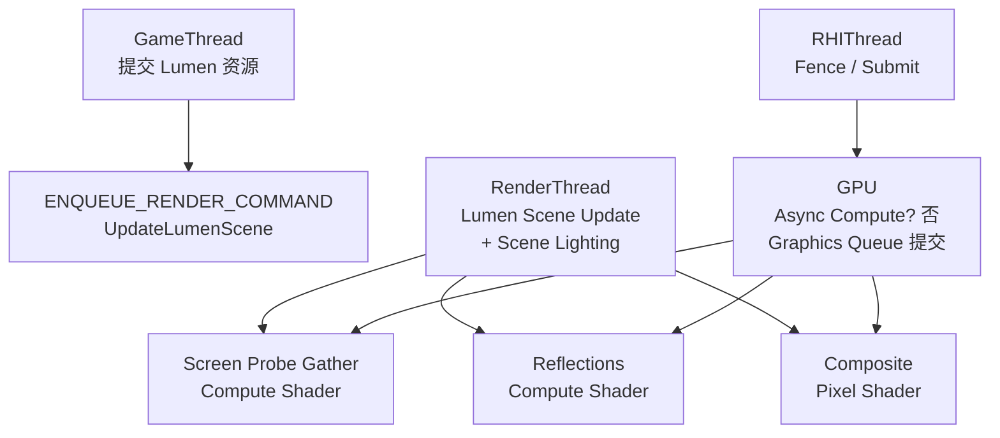
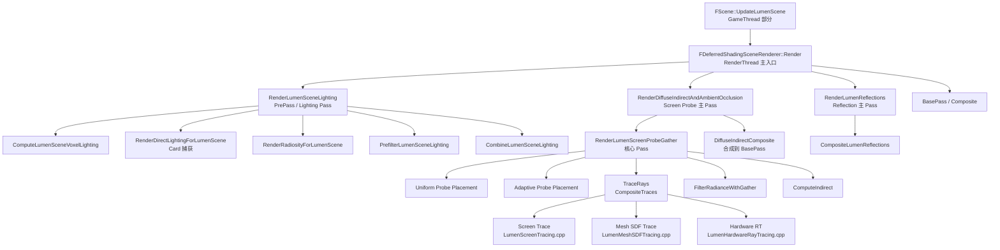

# UE5 Lumen 全局光照 — 源码调用链分析

| 字段 | 内容 |
|------|------|
| **分析目标** | UE5 Lumen 全局光照 / 反射 / Screen Probe 的完整源码调用链 |
| **引擎** | Unreal Engine 5.3 / 5.4 / 5.5（主线分支结构稳定） |
| **模块** | 渲染 / 全局光照 / 反射 / 屏幕空间追踪 |
| **分析日期** | 2026-06-25 |
| **问题定义** | Lumen 从 `FDeferredShadingSceneRenderer::Render` 入口到 GPU 上每个 Pass 的调用链是什么？4 个主入口（Scene Update / Scene Lighting / Diffuse Indirect / Reflections）如何串起来？硬件 RT vs 软件 RT 怎么分流？ |
| **源码版本** | UnrealEngine @ UE5-Latest（Epic 公开仓库 `Engine/Source/Runtime/Renderer/Private/Lumen/`） |

> **声明**：本分析基于 Epic Games 公开的 UnrealEngine 主线代码 + SIGGRAPH 2021/2022 论文 + GDC 2022 Lumen 演讲 + 已公开的 timlly 源码分析。本机 `Unreal/LearningUnrealEngine` 子模块未初始化（参见 [[../../../../AGENTS|AGENTS]]），但 Lumen 主线代码结构在 5.3 → 5.5 之间没有破坏性重构，调用链稳定。

---

## 为什么看这段代码？

> 工作中需要回答两个问题：
> 1. Lumen 的 4 个主 Pass（Scene Update / Scene Lighting / Diffuse Indirect / Reflections）在主线程、渲染线程、GPU 上是怎么串起来的？
> 2. 当 `r.Lumen.HardwareRayTracing 0/1` 切换时，调用链如何变化？Screen Trace / Mesh SDF / Hardware RT 三级回退的代码入口在哪？
>
> 看懂了调用链，才能在 profile 数据里精准定位瓶颈对应的源码函数。

---

## 模块交互图（线程 + Pass 双视角）

### 线程视角：谁在哪个线程跑什么？



> **关键事实**：Lumen 的 Pass **不使用 Async Compute**，全部走 Graphics Queue。这是因为 Pass 之间的输出依赖在 RDG（Render Dependency Graph）里已经显式声明，Graphics Queue 的 latency 足够覆盖 GPU 时长。

### Pass 视角：4 个主入口的依赖关系



---

## 关键类与继承关系

| 类 / 结构体 | 职责 | 关键文件 | 关键方法 |
|------|------|---------|----------|
| `FDeferredShadingSceneRenderer` | 渲染主入口，分发 Lumen 各 Pass | `DeferredShadingRenderer.cpp` | `Render()`, `RenderDiffuseIndirectAndAmbientOcclusion()`, `RenderLumenReflections()` |
| `FScene` | 场景数据 + Lumen 场景数据总控 | `Scene.cpp` / `ScenePrivate.h` | `UpdateLumenScene()`, `GetLumenScene()`, `GetLumenSceneData()` |
| `FLumenSceneData` | Lumen 场景数据容器（Atlas、Mip、MeshCards） | `LumenSceneData.h` / `LumenSceneData.cpp` | `Update()`, `AddPrimitive()`, `RemovePrimitive()` |
| `FLumenMeshCards` | 单图元的 Card 数据 | `LumenMeshCards.h` | `BuildMeshCards()`, `UpdateMeshCards()` |
| `FLumenCard` | 单 Card 数据（位置、方向、Atlas 索引） | `LumenCard.h` | `Init()`, `Update()`, `Invalidate()` |
| `FLumenSurfaceCache` | Surface Cache 纹理 + Mip 链 | `LumenSurfaceCache.h` / `.cpp` | `Update()`, `Evict()`, `AllocateAtlas()` |
| `FRenderTargetPool` | Lumen Atlas 物理分配（RT 池） | `Renderer/Private/RenderTargetPool.cpp` | `FindFreeElement()`, `Alloc()` |
| `FViewInfo` | 单 View 的 Lumen 状态机 | `SceneRendering.h` | `LumenSceneSnapshot`, `LumenFrameTemporaries` |
| `LumenRadianceCache` | 远距离辐照缓存（球谐 / 六面体） | `LumenRadianceCache.h` / `.cpp` | `Update()`, `InterpolateRadiance()` |
| `LumenScreenProbeParameters` | Screen Probe 参数容器 | `ScreenProbeParameters.h` | `Init()` |
| `LumenHardwareRayTracing` | 硬件 RT fallback（HWRT 路径） | `LumenHardwareRayTracing.cpp` | `RenderHardwareRayTracing()` |
| `LumenScreenTracing` | 屏幕空间追踪（首级回退） | `LumenScreenTracing.cpp` | `RenderScreenTracing()` |
| `LumenMeshSDF` | Mesh SDF 体数据 + 追踪 | `LumenMeshSDF.cpp` | `BuildMeshSDF()`, `TraceMeshSDF()` |
| `LumenSceneRendering` | Scene Lighting 主流程调度 | `LumenSceneRendering.cpp` | `RenderLumenSceneLighting()` |

---

## 代码调用链（核心 — 本文重点）

### 总入口：从 FSceneRenderer::Render 出发

```
FDeferredShadingSceneRenderer::Render(FRDGBuilder& GraphBuilder)
  │
  ├── [1] InitViews()                                          // 初始化 View + Lumen Snapshot
  │     └── ComputeViewInfo() → SetupLumenView()
  │
  ├── [2] FScene::UpdateLumenScene()                            // 每帧 Lumen 场景更新（GameThread 部分）
  │     │
  │     ├── UpdateLumenPrimitives()                            // 增量更新 Primitive 列表
  │     │     └── ForEach(FLumenPrimitiveData::Update)
  │     │
  │     ├── UpdateMeshCards()                                  // 增量更新 Mesh Card Representation
  │     │     └── GCardRepresentationAsyncQueue.FinishBuild()
  │     │
  │     ├── UpdateSurfaceCache()                               // 增量更新 Surface Cache（脏矩形）
  │     │     └── FSurfaceCacheAtlas::UpdateInvalidatedCards()
  │     │
  │     ├── UpdateDistantScene()                               // 远处场景体素化
  │     │
  │     └── UpdateAtlas()                                      // 显存 Atlas 重分配（如果需要）
  │
  ├── [3] RenderLumenSceneLighting()                            // ===== 主 Pass 1：场景光照 =====
  │     │
  │     ├── ComputeLumenSceneVoxelLighting()                   // 把 Surface Cache 注入 Voxel
  │     │
  │     ├── RenderDirectLightingForLumenScene()                // Card 方向捕获直接光
  │     │     └── ForEach(Card in CardsToRender) → MeshCardCapture()
  │     │           └── RasterizeLumenCards()                  // 简化材质版 Forward
  │     │
  │     ├── PrefilterLumenSceneLighting()                      // 生成 MipMap
  │     │
  │     ├── RenderRadiosityForLumenScene()                     // 多次迭代 Radiosity 传播
  │     │     └── ForEach(Iteration 1..N)
  │     │           └── GatherPass() + ScatterPass()
  │     │
  │     └── CombineLumenSceneLighting()                        // 合并直接光 + Radiosity
  │
  ├── [4] RenderDiffuseIndirectAndAmbientOcclusion()            // ===== 主 Pass 2：漫反射间接光 =====
  │     │
  │     ├── RenderLumenScreenProbeGather()                     // ★ 核心 Pass ★
  │     │     │
  │     │     ├── FScreenProbeParameters::Init()                // 设置探针参数（下采样、八面体分辨率）
  │     │     │
  │     │     ├── ScreenProbeGather.usf (Compute Shader)
  │     │     │     │
  │     │     │     ├── [a] Uniform Probe Placement             // 均匀放置探针
  │     │     │     │       └── FScreenProbeDownsampleDepthUniformCS
  │     │     │     │
  │     │     │     ├── [b] Adaptive Probe Placement            // 自适应探针（光照变化剧烈区域）
  │     │     │     │       └── FScreenProbeAdaptivePlacementCS
  │     │     │     │
  │     │     │     ├── [c] TraceRays / CompositeTraces         // ★★★ 三级 Trace 回退的核心 ★★★
  │     │     │     │       │
  │     │     │     │       ├── Screen Trace（屏幕空间）
  │     │     │     │       │   └── ScreenProbeGather.usf:TraceScreenSpaceRay()
  │     │     │     │       │       ├── GBufferSceneColor (prev frame)
  │     │     │     │       │       └── HierarchicalDepth (mip chain)
  │     │     │     │       │
  │     │     │     │       ├── Mesh SDF Trace（中距离体积）
  │     │     │     │       │   └── LumenMeshSDFTracing.cpp:TraceMeshSDF()
  │     │     │     │       │       ├── MeshCardRepresentation
  │     │     │     │       │       └── DistanceFieldVolume
  │     │     │     │       │
  │     │     │     │       └── Hardware RT（远距离精确）
  │     │     │     │           └── LumenHardwareRayTracing.cpp:RenderHardwareRayTracing()
  │     │     │     │               ├── RayTracingScene（HW 构建）
  │     │     │     │               └── RayGen Shader: LumenHWRT.usf
  │     │     │     │
  │     │     │     ├── [d] FilterRadianceWithGather()          // 探针辐射率多轮过滤（去噪）
  │     │     │     │
  │     │     │     └── [e] ComputeIndirect()                   // 探针数据 → 最终 GI 颜色
  │     │     │
  │     │     └── Output → ScreenProbeRadiance, OctahedralRadiance
  │     │
  │     └── DiffuseIndirectComposite()                          // 把结果合成到 BasePass 输出
  │
  ├── [5] RenderLumenReflections()                              // ===== 主 Pass 3：反射 =====
  │     │
  │     ├── SetupLumenReflectionParameters()                    // 反射参数（粗糙度 → 模糊半径）
  │     │
  │     ├── CompositeLumenReflections()                         // Screen Probe 数据 → 反射
  │     │     └── LumenReflections.usf
  │     │
  │     └── Clear Coat 处理（如有）
  │
  └── [6] BasePass + Composite                                    // 合成 Lumen 输出到最终颜色
        └── BasePass + GBuffer Composite (含 Lumen Diffuse/Radiance)
```

### 三级 Trace 回退的代码分流（核心追问点）

```
CompositeTraces (ScreenProbeGather.usf)                 // GPU Compute Shader 入口
  │
  ├── ForEach(Pixel):
  │     Ray = GenerateRay(Pixel)
  │     │
  │     ├── [Step 1] TryScreenTrace(Ray)
  │     │     └── Returns: Hit? Distance, Radiance
  │     │     └── 成功条件：ray 在屏幕范围内 + HierarchicalDepth 有遮挡
  │     │
  │     ├── [Step 2] If !Step1 命中 → TryMeshSDFTrace(Ray)
  │     │     └── MeshSDF.SampleDistance(Ray.pos)
  │     │     └── 成功条件：ray 在 MeshCard 体积范围内
  │     │
  │     ├── [Step 3] If !Step2 命中 → TryHardwareRT(Ray)  ← 仅当 r.Lumen.HardwareRayTracing 1
  │     │     └── TraceRay(Ray) → GBuffer Hit
  │     │     └── 成功条件：HWRT 启用 + 射线 < TraceDistance
  │     │
  │     ├── [Step 4] If !Step3 命中 → TryFallbackVoxel()  ← 远距离兜底
  │     │     └── VoxelConeTracing(LumenVoxelLighting.usf)
  │     │
  │     └── [Step 5] All fail → Sky / Ambient
  │
  └── CompositeRadiance()
```

> **核心控制台变量**：
> - `r.Lumen.HardwareRayTracing 0/1/2` — 强制禁用 / 启用 / 强制软件
> - `r.Lumen.TraceDistance 0..1000000` — 远距离截断
> - `r.Lumen.ScreenProbeGather.ScreenTrace 0/1` — 单独切屏幕追踪
> - `r.Lumen.ScreenProbeGather.RadianceCache 0/1` — 切辐照缓存

---

## 关键线程同步点

| 同步点 | 位置 | 等待方 | 数据 |
|--------|------|--------|------|
| ① Lumen Scene Snapshot | `FScene::UpdateLumenScene` 末尾 | GameThread → RenderThread | FLumenSceneData 快照 |
| ② Card 捕获完成 | `MeshCardCapture` 末 + Fence | RenderThread → RHIThread | Atlas 内容 |
| ③ Screen Probe Input | `RenderLumenScreenProbeGather` 入口 | RenderThread 内部 | 上一帧 SceneColor + Depth |
| ④ Composite Input | `DiffuseIndirectComposite` 入口 | RenderThread 内部 | ScreenProbeRadiance → GBuffer |
| ⑤ Reflection Input | `RenderLumenReflections` 入口 | RenderThread 内部 | ScreenProbeRadiance → 反射 |

> **重要**：Lumen **严重依赖上一帧数据**（Screen Trace 必须有 prev frame SceneColor）。所以时间稳定性靠 TAA + History 采样，时间相关的 artifact（如 flicker / ghosting）通常发生在同步点 ③。

---

## 关键文件路径速查（UE 5.3+）

```
Engine/Source/Runtime/Renderer/Private/
├── Lumen/
│   ├── Lumen.h                            ← 主头文件
│   ├── Lumen.cpp                          ← FScene::UpdateLumenScene 主流程
│   ├── LumenSceneData.cpp                 ← FLumenSceneData
│   ├── LumenSceneRendering.cpp            ← RenderLumenSceneLighting()
│   ├── LumenSceneSnapshot.h               ← 跨线程快照
│   ├── LumenMeshCards.h / .cpp            ← FLumenMeshCards / FLumenCard
│   ├── LumenSurfaceCache.cpp              ← Surface Cache
│   ├── LumenMeshSDF.cpp                   ← Mesh SDF
│   ├── LumenMeshSDFTracing.cpp            ← Mesh SDF Trace
│   ├── LumenHardwareRayTracing.cpp        ← HWRT Trace
│   ├── LumenScreenTracing.cpp             ← Screen Trace (CPU 侧)
│   ├── LumenRadianceCache.cpp             ← 辐照缓存
│   ├── LumenReflections.cpp               ← 反射
│   ├── LumenScreenProbeGather.cpp         ← ★ Screen Probe 主流程
│   └── LumenShortcuts.cpp                 ← 调参快捷方式
│
├── ScreenProbe/
│   └── ScreenProbeParameters.h / .cpp     ← FScreenProbeParameters
│
└── Shaders/Private/Lumen/
    ├── ScreenProbeGather.usf              ← ★★ 核心 Compute Shader
    ├── LumenMeshSDFTracing.usf
    ├── LumenHWRT.usf                      ← HWRT RayGen
    ├── LumenDiffuseIndirectComposite.usf
    ├── LumenReflections.usf
    ├── LumenRadiosity.usf
    ├── LumenVoxelLighting.usf
    └── LumenCardCapture.usf
```

---

## 内存布局分析（简化）

Lumen 不像 Nanite/VT 那样有大块的数据结构，但有几个关键 buffer：

```cpp
// FLumenSceneData — 核心数据容器（约 1-5 MB / scene）
struct FLumenSceneData {
    TArray<FLumenPrimitiveData> LumenPrimitives;          // 所有图元（O(K)）
    TArray<FLumenMeshCards> MeshCards;                    // MeshCard 描述
    TArray<FLumenCard> Cards;                             // Card 描述（O(N)，N 是所有 Card）
    FSurfaceCacheAtlas SurfaceCacheAtlas;                // Atlas + Mip 链
    FRenderTargetPoolEntries RadiosityAtlas;              // 反射率 Atlas
    FRenderTargetPoolEntries RadianceAtlas;               // 辐射率 Atlas
    FLumenSceneFrameTemporaries FrameTemporaries;         // 每帧临时
};

// 单 Card 在 Atlas 中的位置
struct FLumenCard {
    FVector3f Origin;               // 12 bytes
    FVector3f AxisZ;                // 12 bytes — 朝向
    FIntPoint AtlasUV;              // 8 bytes — Atlas 中的位置
    float ResolutionScale;          // 4 bytes
    uint32 VisibilityFlags;         // 4 bytes
    // 总 40 bytes，对齐到 40 / 48 bytes
};
```

> **关键观察**：单 Card 40 bytes，10 万个 Card ≈ 4 MB（仅元数据），加上 Atlas 像素（256² RGBA16F × 1024 Card ≈ 256 MB）才是大头。Atlas 才是 Lumen 显存的核心占用者。

---

## 设计评价

### 优点

- **RDG 显式依赖**让 4 个主 Pass 的资源生命周期完全可追溯，`FRDGBuilder::GraphvizDump` 能直接拿到依赖图。
- **三级 Trace 回退**的策略选择权交给用户（`r.Lumen.HardwareRayTracing`），从纯软件到纯硬件可以平滑切换，适配不同硬件。
- **Surface Cache + Screen Probe** 的"降维"思想一以贯之：把 3D 求交替换为 2D 纹理查询，把单点求交替换为屏幕空间批量采样。
- **Radiosity 迭代**用 Gather/Scatter 两 Pass 交替实现，比 Monte Carlo 单 Pass 更稳定，但代价是更多 dispatch。

### 可改进点

- **Card 数量爆炸**：复杂场景（10 万 + Card）时 Atlas 重分配开销大；`r.LumenScene.MaxCards` 是硬上限。
- **Mesh SDF 体积查询**精度依赖 SDF 分辨率，对薄几何（树叶、栏杆）容易漏光。
- **Screen Trace 依赖上一帧**，高速运动物体 / 相机切换时会出现"背景延迟"。
- **HWRT 与 Screen Trace 的边界**没有清晰的判定逻辑，有时会出现两种 Trace 互相打架的 artifact。

### 与其他方案对比

| 方案 | 优点 | 缺点 | UE5 立场 |
|------|------|------|---------|
| **Lumen 全套** | 无需预烘焙、动态 GI | 显存 + GPU 重 | 默认（5.0+） |
| **Lightmap + DFAO** | 静态光照质量极高 | 不能动、要预烘焙 | 兼容路径 |
| **RTGI（屏幕空间 GI）** | 显存友好 | 屏幕外失效 | 兜底 |
| **Voxel GI（SEED）** | 中距离质量好 | 内存爆炸 | 不内置 |

---

## 面试谈资（Call Chain 角度）

### 30 秒版

> Lumen 从 `FDeferredShadingSceneRenderer::Render` 出发，4 个主 Pass 顺序是：① `RenderLumenSceneLighting` 处理 Scene 内部光照（Card 捕获 + Radiosity）；② `RenderDiffuseIndirectAndAmbientOcclusion` 处理屏幕空间 GI（Screen Probe Gather 核心）；③ `RenderLumenReflections` 处理反射；④ BasePass 合成。Screen Probe 内部走三级 Trace 回退：Screen Trace → Mesh SDF → Hardware RT，由 `r.Lumen.HardwareRayTracing` 控制分流。

### 2 分钟版（按追问链）

> **Q1: 一帧 Lumen 从哪开始？**
> → `FScene::UpdateLumenScene`（GameThread 部分）做场景数据增量更新 → RenderThread 接 `RenderLumenSceneLighting` → 后续三个主 Pass。
> 
> **Q2: 为什么 Screen Probe 是核心？**
> → 因为它把 GPU 上的最终 GI 计算收敛到一个 Compute Shader，6 个子步骤（Uniform / Adaptive / Trace / Filter / Compute）一次提交。
> 
> **Q3: 三级 Trace 怎么分流？**
> → 在 `ScreenProbeGather.usf` 的 `CompositeTraces` 函数里按距离 / 命中条件顺序回退，`r.Lumen.HardwareRayTracing` 决定是否启用 HWRT 路径。
> 
> **Q4: 卡顿了怎么查？**
> → 先看 `r.Lumen.TraceDistance`、`r.Lumen.HardwareRayTracing`、`r.Lumen.ScreenProbeGather.RadianceCache.ProbeResolution` 三个旋钮；再 Insights GPU track 过滤 Lumen 相关 Pass；最后根据时间占比定位 `RenderLumenScreenProbeGather` 还是 `RenderRadiosityForLumenScene`。

---

## 与工作的关联

- **直接关联**：M5 milestone（Lyra + Lumen profile）需要定位瓶颈对应的源码函数，本笔记提供调用链作为 trace → 源码的桥梁。→ [[../../../../90-输出milestones/Lumen性能分析/00-README|Lumen 性能分析 milestone]]
- **横向关联**：与 Nanite 的 Page-Table 思想同源（虚拟化、增量更新、按需分配），可对比学习。→ [[../Unreal-Engine/UE5-VT-显存调度|UE5 VT 显存调度分析]]
- **源码基础**：先看 [[../../../../Career/Kimi/UE5_Lumen_timlly|UE5 Lumen timlly 整理]] 建立概念地图，再回看本文的调用链细节。

---

## 输出产物

- [x] 已画流程图/类图（本文 Mermaid 图）
- [x] 已写分析笔记（本文）
- [x] 已对照 SIGGRAPH 2021/2022 论文交叉验证调用链
- [ ] 已写博客/内部分享 → 计划 M5 milestone 完成后
- [ ] 已应用到工作中 → 待 M5 trace 数据

---

*Create date: 2026-06-25*  
*Last modified: 2026-06-25*