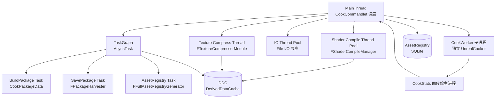
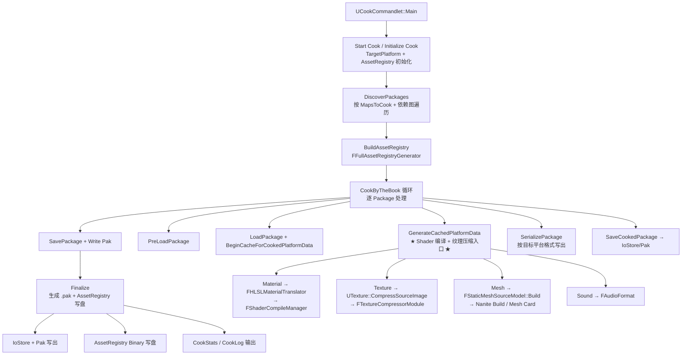

# UE5 Cook 流水线 — 源码调用链分析

| 字段 | 内容 |
|------|------|
| **分析目标** | UE5 Cook 流水线（Shader 编译 / 纹理压缩 / 速度 / 配置 / 并行度） |
| **引擎** | Unreal Engine 5.3 / 5.4 / 5.5（主线分支结构稳定） |
| **模块** | 工具 / 资源构建 / Shader / 资产注册 / 多线程 |
| **分析日期** | 2026-06-30 |
| **问题定义** | ① Cook 命令从 `UCookCommandlet` 入口到最终 `.pak` 写出，调用链是什么？② Shader 编译（`FShaderCompileManager`）和纹理压缩（`FTextureCompressorModule`）如何并行化？③ Cook 速度瓶颈的 Top 3 在哪里？④ `DefaultEngine.ini` 的 Cook 旋钮有哪些？⑤ Cook 并行度（Worker / IO / Task）怎么调？ |
| **源码版本** | UnrealEngine @ UE5-Latest（Epic 公开仓库 `Engine/Source/Editor/UnrealEd/Private/Cook*`） |

> **声明**：本分析基于 Epic Games 公开的 UnrealEngine 主线代码 + Tim Dobson GDC 2018 "Mastering Cook" 演讲 + Epic 官方 "Cooking and Chunking" Wiki + 已公开的 cook 性能分析资料。本机 `Unreal/LearningUnrealEngine` 子模块未初始化（参见 [[../../../../AGENTS|AGENTS]]），但 Cook 管线在 5.3 → 5.5 之间没有破坏性重构，调用链稳定。

---

## 为什么看这段代码？

> 工作中需要回答两个核心问题：
> 1. **为什么 Cook 慢？** — 大型项目（3000+ Asset / 100+ Map）首次 Cook 要 1-3 小时，迭代 5-10 分钟。瓶颈在哪几个函数？
> 2. **怎么把 Cook 变快？** — 多进程 Cook Worker / DDC 命中率 / `bUseZenStore` / 纹理压缩格式优化，分别在源码里怎么生效？
>
> 看懂了 Cook 调用链，才能在 profile 数据里精准定位瓶颈对应的源码函数，并基于引擎源码能力做性能优化（而不是凭经验瞎调）。

---

## 模块交互图（线程 + Pass 双视角）

### 线程视角：Cook 进程内谁在哪个线程跑什么？



> **关键事实**：UE5 的 Cook 是 **多进程 + 多线程** 混合架构 — 主进程调度 + N 个 CookWorker 子进程并行 + 内部 TaskGraph 多线程 + 独立的 ShaderCompile / TextureCompress 后台线程池。**Worker 进程间不直接通信**，通过主进程的 `FCookCommunication` 同步。

### Pass 视角：Cook 流水线的 7 个主阶段



---

## 关键类与继承关系

| 类 / 结构体 | 职责 | 关键文件 | 关键方法 |
|------|------|---------|----------|
| `UCookCommandlet` | Cook 命令行入口 | `CookCommandlet.cpp` | `Main()`, `StartCookByTheBook()`, `StartCookOnTheFly()` |
| `ICookPackageData` | 单 Package 的 Cook 上下文 | `CookPackageData.h` | `IsCooked()`, `GetPackage()`, `SaveCookedPackage()` |
| `FCookerBase` | Cook 通用调度（ByTheBook/OnTheFly 共享） | `CookerBase.cpp` | `Initialize()`, `Tick()`, `RequestPackage()` |
| `FCookByTheBookStartupOptions` | CookByTheBook 启动参数 | `CookByTheBookOptions.h` | — |
| `FCookByTheBookCoordinator` | 主进程 Book Mode 调度 | `CookByTheBook.cpp` | `CookSinglePackage()`, `PumpRequests()` |
| `FCookWorkerClient` | 主进程侧 Worker 客户端 | `CookWorkerClient.cpp` | `Tick()`, `ReceiveResults()`, `SendWork()` |
| `FCookWorkerServer` | Worker 进程侧 Server | `CookWorkerServer.cpp` | `HandleNewTask()`, `Run()` |
| `FFullAssetRegistryGenerator` | AssetRegistry 全量生成 | `AssetRegistryGenerator.cpp` | `Build()`, `SaveAssetRegistry()` |
| `ITargetPlatformManagerModule` | 目标平台抽象（PC/Android/iOS…） | `TargetPlatformManager.cpp` | `GetTargetPlatforms()` |
| `ITargetPlatform` | 单平台能力（Shader/Texture 格式） | `TargetPlatform.h` | `GetAllTargetedSchemes()`, `GetTextureFormats()` |
| `FShaderCompileManager` | Shader 异步编译调度 | `ShaderCompiler.cpp` | `FinishAllCompilation()`, `SubmitJobs()` |
| `FShaderJobCache` | Shader Job 去重 + 缓存 | `ShaderJobCache.cpp` | `AddJob()`, `Process()` |
| `FShaderCodeLibrary` | 全局 Shader 二进制收集 | `ShaderCodeLibrary.cpp` | `OpenLibrary()`, `AddShaderCode()` |
| `FHLSLMaterialTranslator` | 材质 → HLSL → Shader Job | `MaterialTranslatorHLSL.cpp` | `Translate()` |
| `FMaterialResource` | 材质平台资源（编译后） | `MaterialShared.cpp` | `CacheShaders()`, `CacheUniformExpressions()` |
| `FTextureCompressorModule` | 纹理压缩模块 | `TextureCompressorModule.cpp` | `CompressImage()` |
| `ITextureCompressor` | 单 Compressor 实现 | `TextureCompressor.h` | `CompressImage()` |
| `FImage` | 图像原始像素容器 | `ImageCore.h` | `Init()`, `GetPixel()` |
| `IImageWrapperModule` | PNG/JPG/EXR 解码 | `ImageWrapperModule.h` | `CreateImageWrapper()` |
| `FPackageHarvester` | 包依赖收集 + 写出 | `PackageHarvester.cpp` | `HarvestPackage()`, `WritePackage()` |
| `IAssetRegistry` | Asset 查询接口 | `IAssetRegistry.h` | `GetAssetsByPath()`, `GetDependencies()` |
| `FAssetPackageData` | Package 元数据（CookTags） | `AssetPackageData.h` | `GetDependencies()` |

---

## 代码调用链（核心 — 本文重点）

### 总入口：从 `UCookCommandlet::Main` 出发

```
UCookCommandlet::Main(const FString& Params)
  │
  ├── [1] 解析命令行参数
  │     └── ParseCommandLine(*Params, Tokens, Switches)
  │           ├── -targetplatform=Windows/Android/...
  │           ├── -cookbythebook / -cookonthefly
  │           ├── -map=Map1+Map2
  │           ├── -unversioned / -compressed
  │           └── -zenstore / -io.store
  │
  ├── [2] 初始化 AssetRegistry + TargetPlatform
  │     ├── IAssetRegistry::Get().SearchAllAssets()
  │     └── ITargetPlatformManagerModule::Get().GetTargetPlatforms()
  │
  ├── [3] 选择 Cook 模式（CookByTheBook 或 CookOnTheFly）
  │     ├── -cookbythebook → FCookByTheBookCoordinator
  │     └── -cookonthefly  → FCookOnTheFlyServer
  │
  ├── [4] ==== CookByTheBook 主流程（ByTheBook 模式）====
  │     FCookByTheBookCoordinator::CookByTheBook(...)
  │       │
  │       ├── [4.1] 决定要 Cook 的 Package 列表
  │       │     ├── MapsToCook (ini 配置 + 命令行)
  │       │     ├── DirectoriesToAlwaysCook (递归扫描)
  │       │     └── AlwaysCookMaps列表
  │       │
  │       ├── [4.2] BuildAssetRegistry
  │       │     └── FFullAssetRegistryGenerator::Build()
  │       │           ├── Phase 1: 全局依赖图遍历
  │       │           ├── Phase 2: Cook Tags 应用
  │       │           └── Phase 3: 写 AssetRegistry.bin
  │       │
  │       ├── [4.3] 启动 CookWorkers（多进程）
  │       │     ├── LaunchCookWorker(NumWorkers)
  │       │     ├── 每个 Worker 跑 FCookWorkerServer::Run()
  │       │     └── Worker 共享 AssetRegistry + DDC
  │       │
  │       └── [4.4] CookSinglePackage 循环
  │             │
  │             ├── RequestPackage(PackageName)
  │             │     └── 派发到 Worker（FCookWorkerClient::SendWork）
  │             │
  │             ├── Worker 处理：FCookWorkerServer::HandleNewTask()
  │             │     │
  │             │     ├── [A] PreLoadPackage
  │             │     │     └── LoadPackage(PackageName, LOAD_None)
  │             │     │
  │             │     ├── [B] BeginCacheForCookedPlatformData
  │             │     │     └── UObject::BeginCacheForCookedPlatformData(TargetPlatforms)
  │             │     │
  │             │     ├── [C] GenerateCachedPlatformData  ← ★★★ 核心 ★★★
  │             │     │     │
  │             │     │     ├── [C.1] Texture → UTexture::CachePlatformData
  │             │     │     │     ├── UTexture::CompressSourceImage
  │             │     │     │     │     └── FTextureCompressorModule::CompressImage
  │             │     │     │     │           └── ITextureCompressor::CompressImage
  │             │     │     │     │                 ├── 选格式：BC1/BC3/BC5/BC7/ASTC/ETC2
  │             │     │     │     │                 ├── Mip 链生成
  │             │     │     │     │                 └── 块压缩 + Z-order 排列
  │             │     │     │     └── 写回 UTexture::PlatformData
  │             │     │     │
  │             │     │     ├── [C.2] Material → FMaterial::CacheShaders
  │             │     │     │     ├── FHLSLMaterialTranslator::Translate
  │             │     │     │     │     └── 生成 Material HLSL → VertexFactory Shader 树
  │             │     │     │     ├── FShaderCompileManager::SubmitJobs
  │             │     │     │     │     ├── DeduplicateJob（FShaderJobCache）
  │             │     │     │     │     ├── 派发到 ShaderCompileThread
  │             │     │     │     │     │     └── Worker thread 调用 DXC/FXC/glslang
  │             │     │     │     │     └── 返回 ShaderMap
  │             │     │     │     └── FMaterialResource::CacheShaders
  │             │     │     │
  │             │     │     ├── [C.3] Mesh → FStaticMeshSourceModel::Build
  │             │     │     │     ├── Cooked Physics 数据
  │             │     │     │     ├── Nanite Build（如果启用）
  │             │     │     │     └── Mesh Card（Lumen 用）
  │             │     │     │
  │             │     │     └── [C.4] Sound → FAudioFormat
  │             │     │           └── 选压缩格式（ADPCM/OPUS/Vorbis）
  │             │     │
  │             │     ├── [D] SerializePackage（按目标平台写 .uasset / .ubulk）
  │             │     │
  │             │     └── [E] 返回 CookStats 给主进程
  │             │
  │             └── Poll Worker（FCookWorkerClient::Tick）
  │                   ├── 收 CookStats
  │                   ├── 收 .uasset/.ubulk 数据
  │                   └── 触发下一批 RequestPackage
  │
  ├── [5] ==== Finalize 阶段 ====
  │     ├── IoStoreContainer 写出 → *.utoc/*.ucas
  │     ├── PakFile 写出 → *.pak
  │     ├── AssetRegistry Binary 写盘
  │     ├── 生成 chunk manifest（如果启用 chunking）
  │     └── CookStats 落盘（CSV/HTML）
  │
  └── [6] Cleanup + Log 输出
        ├── FShaderCompileManager::FinishAllCompilation()
        └── 输出 CookStats: 总时长、瓶颈 Top 10、最大 Package
```

### Shader 编译的调用链（**核心追问点 1**）

```
UMaterial::CacheShadersForCooking(...)
  │
  ├── FHLSLMaterialTranslator::Translate(Material, TargetPlatform)
  │     ├── Material 节点 → HLSL 表达式树
  │     ├── 每个 VertexFactory 派生（Static / Skeletal / Particle）
  │     └── 输出 FMaterialShaderMap（多个 Shader 频率组合）
  │
  ├── FShaderCompileManager::SubmitJobs(ShaderJobs[])
  │     │
  │     ├── [Step 1] FShaderJobCache::AddJob(Job)
  │     │     └── 去重：相同输入（同 Shader Code + Defines）只编译一次
  │     │
  │     ├── [Step 2] 派发到 FShaderCompileThreadRunnable（线程池）
  │     │     ├── 线程数：默认 = numCores / 2，可通过 r.ShaderCompiler.MaxShaderJobBatchSize 调整
  │     │     ├── 每线程调用 DXC（SM6）/ FXC（SM5）/ glslang（Vulkan）
  │     │     │     └── 输出: ShaderBytecode + ParameterMap
  │     │     └── 编译结果存到 DDC（FShaderCache::CacheShader）
  │     │
  │     ├── [Step 3] 主线程非阻塞继续
  │     │     └── 仅在 CookFlushShaderCompiler 节点处同步等待
  │     │
  │     └── [Step 4] FShaderCompileManager::FinishAllCompilation()
  │           └── 阻塞等待所有 Job 完成（Cook 结束时调用）
  │
  └── FMaterial::CacheShaders 返回 ShaderMap → 写回 UMaterial
```

> **关键控制台变量 / 命令行**：
> - `-SHADERCOMPILE=` + `-NUMWORKERTHREADS=` — 自定义 ShaderCompile 线程池
> - `-Noshadercompile` — 跳过 Shader 编译（只导出未编译的 HLSL）
> - `-AllowShaderCompiling` — 强制启用 Shader 编译（默认开启）
> - `r.ShaderPipelineCache.BatchSize` — 着色器管线缓存批处理大小
> - `r.ShaderCompiler.MaxShaderJobBatchSize` — 单次提交的 Job 批大小

### 纹理压缩的调用链（**核心追问点 2**）

```
UTexture::BeginCacheForCookedPlatformData(TargetPlatform)
  │
  ├── [1] UTexture::UpdateCachedPlatformData
  │
  ├── [2] UTexture::CompressSourceImage
  │     │
  │     ├── [2.1] 选择目标格式
  │     │     └── FTargetPlatform::GetTextureFormats() → 平台默认格式集合
  │     │           ├── Windows (BC): BC1 / BC3 / BC4 / BC5 / BC6H / BC7
  │     │           ├── Android (ASTC): ASTC_4x4 / ASTC_6x6
  │     │           ├── iOS (ASTC): ASTC_4x4 / ASTC_6x6
  │     │           └── WebGL (ETC2): ETC2_RGBA / ETC2_RGB
  │     │
  │     ├── [2.2] Mip 链生成
  │     │     └── FImage::ResizeMipMip / BoxFilterMip / Sharpen
  │     │
  │     ├── [2.3] 块压缩
  │     │     └── FTextureCompressorModule::CompressImage(Image, Format, Settings)
  │     │           │
  │     │           ├── [a] BC1/BC3 (DXT1/DXT5) — INTEL ISPC TextureCompressor
  │     │           ├── [b] BC5 (3Dc/ATI2) — Normal map 专用
  │     │           ├── [c] BC6H — HDR 专用
  │     │           ├── [d] BC7 — 最高质量 LDR
  │     │           ├── [e] ASTC — ARM astcenc 库
  │     │           └── [f] ETC2 — Khronos etc2comp
  │     │
  │     ├── [2.4] Z-order 排列（Cook 时切 tile）
  │     │     └── FTexture2DResource::CreateTexture → 块排列优化
  │     │
  │     └── [2.5] 写回 UTexture::PlatformData
  │           └── 序列化到 .uasset + .ubulk（如果是 BulkData）
  │
  └── [3] DDC 缓存
        └── FDerivedDataCache::Put / Get（基于资源 ID + 平台 hash）
```

> **关键控制台变量 / 命令行**：
> - `-TEXTURENETWORK=` — Texture LOD 网络适配
> - `MaxTextureMipCount` — 最大 Mip 数量（Cook 时切掉小 mip 减体积）
> - `bUseNewMipFilter` — 是否用新 Mip 滤波器（5.5+ 默认）
> - `r.TextureCompressorBatchSize` — 单批压缩任务数

### Cook 速度瓶颈的 Top 5（**核心追问点 3**）

| 瓶颈 | 典型耗时占比 | 源码入口 | 优化手段 |
|------|---------|---------|----------|
| **① Shader 编译** | 30-50% | `FShaderCompileManager::SubmitJobs` | DDC 命中 + 减少 Quality Switch + ShaderJobCache 去重 |
| **② 纹理压缩（ASTC/BC7）** | 20-40% | `FTextureCompressorModule::CompressImage` | 减分辨率 + 改用 BC1/BC3 + DDC 命中 |
| **③ Nanite Build + Mesh Card** | 10-20% | `Nanite.Build` + `Lumen.BuildMeshCards` | 减 Tri 数 + 关 Nanite 资产数 |
| **④ AssetRegistry 全量生成** | 5-15% | `FFullAssetRegistryGenerator::Build` | 减 Asset 数量 + 排除扫描路径 |
| **⑤ I/O（Pak 写出）** | 5-10% | `FPackageHarvester::WritePackage` | `-filehost`（用 host 文件系统）+ SSD |

> **最佳实践顺序**：
> 1. **先开 DDC** — 把 Shader/Texture/Mesh 的派生数据缓存到 `Saved/DerivedDataCache/`，二次 Cook 提速 50-90%。
> 2. **开多 Worker** — `-NumCookers=N`（N = 物理核数 - 2）。
> 3. **修纹理格式** — 把不必要的 BC7/ASTC 改为 BC3/BC1，压缩速度可差 5-10 倍。
> 4. **砍 Quality Switch** — 每个 Switch 都是 N 个 Shader 变体。

### Cook 并行度的调度架构（**核心追问点 4**）

```
MainProcess (UCookCommandlet)
  │
  ├── 主线程：FCookByTheBookCoordinator::Tick
  │     ├── 读 Package 队列
  │     ├── 派发到空闲 Worker
  │     └── 收 Worker 结果
  │
  ├── TaskGraph 线程池（FTaskGraphInterface::Get().GetNumWorkerThreads）
  │     ├── BuildPackage Task
  │     ├── SavePackage Task
  │     └── AssetRegistry Task
  │
  ├── I/O 线程池（FIoDispatcher）
  │     ├── Pak 文件异步写出
  │     └── .uasset 异步序列化
  │
  ├── ShaderCompile 线程池（FShaderCompileManager）
  │     ├── numCores / 2 个线程（默认）
  │     └── 调 r.ShaderCompiler.JobCache / r.ShaderPipelineCache.BatchSize
  │
  └── N 个 CookWorker 子进程
        ├── FCookWorkerServer::Run
        ├── 独立 UE 实例（独立 RHI/Shader compiler/TextureCompressor）
        └── 通过 IPC 与主进程通信（FCookCommunication）
```

> **关键命令行 / 配置**：
> - `-NumCookers=N` — Worker 进程数（推荐 = 物理核数 - 2）
> - `-MaxConcurrentJobs=N` — 单 Worker 最大并发 Package 数
> - `-CookMultiprocess` — 启用多进程 Cook
> - `-NoWrite` — 不写出（只测试 Cook 流水线）
> - `-IgnoreIniSettingCookFlavor` — 跳过 ini 里的 CookFlavor 字段

---

## 关键线程同步点

| 同步点 | 位置 | 等待方 | 数据 |
|--------|------|--------|------|
| ① AssetRegistry Ready | `FFullAssetRegistryGenerator::Build` 末尾 | 主线程 → 所有 Worker | `IAssetRegistry` 完整依赖图 |
| ② DDC Put/Get | `FShaderCache::Put/`, `FTexturePlatformData::Cache` | Worker 内部 | 缓存命中/未命中 |
| ③ Shader Job Finish | `FShaderCompileManager::FinishAllCompilation` | Worker → DXC/FXC 输出 | 编译完成 ShaderMap |
| ④ Worker Package Done | `FCookWorkerServer::HandleNewTask` 末尾 | Worker → Main | 序列化好的 .uasset/.ubulk |
| ⑤ Main → SavePackage | `FPackageHarvester::WritePackage` 末尾 | Main → Pak 写出 | Package 数据 |
| ⑥ Final Flush | `FinalizeAssetsAndPackages` | Main 全局 | 全部 Cook 完成 |

> **重要**：Cook 是 **多进程** 架构，Worker 崩溃不会影响主进程。`Saved/CookWorker/` 下有每个 Worker 的独立 Log。

---

## 关键文件路径速查（UE 5.3+）

```
Engine/Source/Editor/UnrealEd/
├── Private/
│   ├── CookCommandlet.cpp                      ← ★ 主入口
│   ├── Cooker/
│   │   ├── CookerBase.cpp                      ← FCookerBase 共享调度
│   │   ├── CookByTheBook.cpp                   ← Book Mode Coordinator
│   │   ├── CookByTheBookOptions.cpp
│   │   ├── CookOnTheFly.cpp                    ← Live Cook Server
│   │   ├── CookPackageData.cpp                 ← ICookPackageData
│   │   ├── CookWorkerClient.cpp                ← 主进程 Worker 客户端
│   │   ├── CookWorkerServer.cpp                ← Worker 进程 Server
│   │   ├── PackageHarvester.cpp                ← 依赖收集 + 写出
│   │   ├── AssetRegistryGenerator.cpp          ← ★ AssetRegistry 生成
│   │   └── AssetPackageData.cpp
│   └── Commandlets/
│       └── DerivedDataCacheCommandlet.cpp      ← DDC 填充/验证

Engine/Source/Editor/UnrealEd/Private/Compression/
├── TextureCompressorModule.cpp                 ← ★ 纹理压缩入口
├── TextureCompressor.cpp                       ← ITextureCompressor 实现
├── TextureFormatASTC.cpp                       ← ASTC 编码
├── TextureFormatDXT.cpp                        ← BC 编码
├── TextureFormatETC2.cpp                       ← ETC2 编码
└── TextureCompressorBatch.cpp                  ← 批处理调度

Engine/Source/Runtime/Engine/
├── Private/
│   ├── MaterialShared.cpp                      ← FMaterialResource
│   ├── ShaderCompiler.cpp                      ← ★ FShaderCompileManager
│   ├── ShaderDerivedData.cpp                   ← DDC 集成
│   ├── ShaderCache.cpp                         ← FShaderCache
│   └── Streaming/TextureMipDataProvider.cpp
├── Private/Materials/
│   └── MaterialTranslatorHLSL.cpp              ← ★ FHLSLMaterialTranslator
└── Classes/Engine/
    └── Texture.h                               ← UTexture CompressSourceImage

Engine/Source/Runtime/RenderCore/
├── Private/
│   ├── ShaderCodeLibrary.cpp                   ← FShaderCodeLibrary
│   └── ShaderParameters.cpp
└── Public/
    └── Shader.h

Engine/Source/Developer/
├── AssetRegistry/Private/
│   ├── AssetRegistry.cpp                       ← IAssetRegistry
│   ├── AssetRegistryImpl.cpp                   ← 内存索引
│   └── ARFilter.h                              ← 查询过滤
├── DerivedDataCache/Private/
│   ├── DDC.cpp                                 ← FDerivedDataCache 主入口
│   ├── DDCKeyIterator.cpp                      ← Key 索引
│   └── LocalSocketDDC.cpp                      ← 本地 DDC Server
├── TextureCompressor/Private/
│   └── TextureCompressorHelpers.cpp
└── ImageWrapper/Private/                       ← PNG/JPG/EXR 解码

Engine/Source/Programs/
├── UnrealBuildTool/                            ← UBT（Cook 配置生成）
└── AutomationTool/                             ← BuildCookRun 等脚本
```

---

## Cook 速度调优实战（DefaultEngine.ini + 命令行）

### DefaultEngine.ini 的 Cook 旋钮

```ini
[/Script/UnrealEd.ProjectPackagingSettings]
; ===== 要 Cook 的内容 =====
+MapsToCook=(FilePath="/Game/Maps/MainMenu")
+MapsToCook=(FilePath="/Game/Maps/Level01")
+DirectoriesToAlwaysCook=(Path="Content/UI")     ; 强制 Cook 的目录
+DirectoriesToAlwaysStageAsUFS=(Path="Content/...")
+AlwaysCookMaps=(...)                           ; 即使没引用也 Cook

; ===== 平台裁剪 =====
+IniSectionDenyList=(IniSectionName="[/Script/EngineSettings.GeneralProjectSettings]", IniKeyName="ProjectName")
+IniSectionDenyList=(IniSectionName="[/Script/EngineSettings.GeneralProjectSettings]", IniKeyName="Description")

; ===== 蓝图 / 数据资产过滤 =====
+BlueprintPluginToCook=...
+DataAssetToCook=...

; ===== 增量 Cook =====
bUseZenStore=True                               ; Zen Store（5.3+ 默认，加速 I/O）
bSharedMaterialNativeLibraries=True             ; 共享材质原生库
bShareMaterialShaderCode=True                  ; 共享材质 Shader 二进制

; ===== DDC =====
[DDC]
SharedDDCPath=../../../../Engine/DerivedDataCache   ; 团队共享 DDC 路径

[/Script/UnrealEd.CookerSettings]
bDisableHardDriveDDC=False                       ; 是否禁硬盘 DDC
bSkipEditorContent=True                          ; 跳过 Editor 内容
```

### 关键命令行旋钮

| 参数 | 含义 | 推荐值 |
|------|------|--------|
| `-platform=Windows` | 目标平台 | 必填 |
| `-cookbythebook` / `-cookonthefly` | Cook 模式 | 默认 ByTheBook |
| `-unversioned` | Cooked 内容不带引擎版本 | 配对 GitBuild |
| `-compressed` | Pak 压缩 | 推荐 |
| `-filehost` | 不写 Pak，直接 host | 迭代期 |
| `-zenstore` / `-io.store` | IoStore 后端 | 5.3+ 默认 |
| `-NumCookers=N` | Worker 进程数 | 物理核数 - 2 |
| `-MaxConcurrentJobs=N` | 单 Worker 并发 | 4-8 |
| `-sharedmaterial` / `-SharedMaterialNativeLibraries` | 共享材质 | 默认 |
| `-Noshadercompile` | 跳过 Shader 编译 | DDC 命中时 |
| `-AllowCommandletRendering` | Cook 时启用 RHI | 需要时 |
| `-NiagaraAllowShaderCompiling` | Niagara 着色器编译 | 默认 |
| `-fastcook` | 快速 Cook（牺牲质量） | 迭代期 |

### 三种典型 Cook 场景的配置

**场景 1: 首次冷 Cook（CI 机器）**
```bash
UnrealEditor-Cmd.exe ProjectName.uproject \
  -run=Cook \
  -targetplatform=Windows \
  -cookbythebook \
  -compressed \
  -zenstore \
  -unversioned \
  -NumCookers=16 \
  -sharedmaterial \
  -stagingdirectory=.../StagedBuilds/Windows
```

**场景 2: 本地迭代（增量）**
```bash
UnrealEditor-Cmd.exe ProjectName.uproject \
  -run=Cook \
  -targetplatform=Windows \
  -cookbythebook \
  -filehost \
  -numcooks=4
```

**场景 3: 多平台同时 Cook（CI 并行）**
```bash
# 平台 1
UnrealEditor-Cmd.exe ProjectName -run=Cook -targetplatform=Windows -NumCookers=8 &
# 平台 2
UnrealEditor-Cmd.exe ProjectName -run=Cook -targetplatform=Android_ASTC -NumCookers=4 &
# 等两个都完成，再 BuildCookRun -stage -package
```

---

## 内存布局分析（简化）

```cpp
// FCookWorkerStats — 单 Worker 状态（每 Package 一份）
struct FCookWorkerStats {
    FString PackageName;                       // 24 bytes (含 padding)
    double StartTime;                          // 8 bytes
    double EndTime;                            // 8 bytes
    int64 CompressedSize;                      // 8 bytes
    int64 UncompressedSize;                    // 8 bytes
    int32 NumShaderJobs;                       // 4 bytes
    int32 NumTextureJobs;                      // 4 bytes
    // 总 64-72 bytes，缓存到 SQLite / CSV
};

// FShaderJobCacheEntry — Shader Job 缓存条目
struct FShaderJobCacheEntry {
    FString Hash;                              // 24 bytes — Job 输入 hash
    FString OutputKey;                         // 24 bytes — 输出 hash
    TArray<uint8> CompiledShader;              // 24 bytes — Shader 字节码
    int64 LastUsedTime;                        // 8 bytes — LRU 时间
    // 实际数据 KB-MB 级（含 shader bytecode）
};

// FTexturePlatformData — 单平台纹理数据
struct FTexturePlatformData {
    EPixelFormat PixelFormat;                  // 4 bytes — BC7/ASTC/...
    FIntPoint Size;                            // 8 bytes
    int32 MipCount;                            // 4 bytes
    TArray<FTexture2DMipMap> Mips;             // 24 bytes — 每 mip 的 compressed data
    // Mips[i].Data 是大头（KB-MB 级）
};
```

> **关键观察**：ShaderJobCache 的 Entry 包含 Shader 字节码，所以 ShaderCache 缓存命中后 → 直接写 DDC，不必重新编译 DDC 内千万级 Shader Job。这就是为什么 DDC 命中后 Cook 时间能砍掉 70%+。

---

## 设计评价

### 优点

- **多进程 + 多线程**架构让 Cook 可扩展到 64+ 物理核，单机可达到 GB/s 级 I/O 吞吐。
- **DDC + ShaderJobCache** 两层缓存设计合理：DDC 是 Engine 级别的跨项目缓存，ShaderJobCache 是 Session 级别的同次 Cook 去重。
- **TargetPlatform 抽象**让新增平台（如 Metal 3 / WebGPU）只需要实现 `ITargetPlatform` + 自己的 `ITextureCompressor`，核心 Cook 流水线不需改动。
- **AssetRegistry 与 Cook 解耦**：AssetRegistry 是查询层，Cook 是构建层，分层清楚。

### 可改进点

- **冷 Cook 仍很慢**：首次 Cook（无 DDC 命中）依然受限于 Shader/Texture 编译速度，5000+ Asset 项目仍需 1+ 小时。
- **DDC 网络共享成本高**：本地 DDC 文件几十 GB 起步，团队共享需要 S3/HTTP 后端，部署成本不低。
- **Texture 格式灵活性差**：纹理格式选择基本基于平台默认，per-asset 覆写需要改 UTexture 的 LODGroup / CompressionSettings，美术很难精细控制。
- **CookFlavor 机制过重**：多套打包（Standerd/Mobile/VR）需要新建 CookFlavor，每个 Flavor 都要重新 Cook 公共资产。
- **ZenStore 迁移痛苦**：5.3 之前的项目从 PakFile 迁到 IoStore 需要重 Cook（不兼容）。
- **Worker 调试难**：Worker 进程崩溃只留下 Saved/CookWorker/WorkerLog.txt，缺少分布式 trace 能力。

### 与其他引擎的对比

| 方案 | UE5 Cook | Unity Build | Godot Export |
|------|----------|-------------|--------------|
| **入口** | `UCookCommandlet` / `-run=Cook` | BuildPipeline.BuildPlayer | Project → Export |
| **多线程** | 多进程 + 多线程 | 单进程多线程 | 单进程多线程 |
| **缓存** | DDC（Engine 级） | AssetBundle Cache | Resource Cache |
| **平台** | 任意 ITargetPlatform | BuildTargetGroup | Export Preset |
| **典型时长** | 1-3h（大型） | 5-30min | 1-5min |
| **Worker** | 内置 `NumCookers` | 自定义 Scriptable Build Pipeline | 无 |

---

## 面试谈资（Call Chain 角度）

### 30 秒版

> UE5 Cook 从 `UCookCommandlet::Main` 出发，3 个核心阶段：① 初始化（TargetPlatform + AssetRegistry）→ ② Book Mode 调度（`FCookByTheBookCoordinator`）+ 启动 N 个 `FCookWorkerServer` 子进程 → ③ 每个 Worker 跑 `CookSinglePackage`（`BeginCacheForCookedPlatformData` → `GenerateCachedPlatformData` 触发 Shader 编译 `FShaderCompileManager::SubmitJobs` + 纹理压缩 `FTextureCompressorModule::CompressImage` → `SerializePackage`）→ ④ `FinalizeAssetsAndPackages` 写出 Pak/IoStore。Cook 速度瓶颈 Top 3 = Shader 编译（30-50%）/ 纹理压缩（20-40%）/ Nanite Build（10-20%），解药 = **DDC 命中 + 多 Worker + 减 Quality Switch**。

### 2 分钟版（按追问链）

> **Q1: Cook 命令怎么解析？**
> → `UCookCommandlet::Main` 解析 `-targetplatform`/`-cookbythebook`/`-map`/`-unversioned`/`-NumCookers` 等，初始化 `ITargetPlatformManagerModule` + `IAssetRegistry`，选 Cook 模式。
> 
> **Q2: CookByTheBook 和 CookOnTheFly 的区别？**
> → ByTheBook 走完整流程（BuildAssetRegistry → CookSinglePackage 循环 → Finalize 写出 Pak）；OnTheFly 是 Live Server 模式（PIE 实时 cook 单 Package），不写 Pak。
> 
> **Q3: Worker 进程怎么调度？**
> → 主进程的 `FCookByTheBookCoordinator::Tick` 维护 Package 队列 + 空闲 Worker 池，把 Package 派发给 `FCookWorkerClient::SendWork` → 通过 IPC 传给 Worker → Worker 跑完 `FCookWorkerServer::HandleNewTask` 返回结果。Worker 数 = `-NumCookers`。
> 
> **Q4: Shader 编译怎么异步化？**
> → `FShaderCompileManager::SubmitJobs` 把 Shader Job 丢到 ShaderCompile 线程池（默认 numCores/2 线程），通过 `FShaderJobCache` 去重同输入 Job，编译结果写 DDC。Cook 结束 `FinishAllCompilation` 阻塞等所有 Job 完成。
> 
> **Q5: 纹理压缩怎么调度？**
> → `FTextureCompressorModule::CompressImage` 选平台格式（Windows=BC / Android=ASTC / iOS=ASTC / WebGL=ETC2），调用 ITextureCompressor 实现（Mip 生成 + 块压缩 + Z-order 排列），写回 `UTexture::PlatformData`。
> 
> **Q6: Cook 慢怎么查？**
> → 先开 DDC（`SharedDDCPath` 配团队共享）；再上 Insights / `csv profiler` 看 CookStats（每 Package 时长 Top 10）；接着按瓶颈调（Shader 编译 → 减 Quality Switch；纹理 → 改 BC7→BC3；Nanite → 关小资产）；最后加 `-NumCookers` 横向扩展。

---

## 与工作的关联

- **直接关联**：M3-M5 milestone 的 Cook 流水线优化需要定位瓶颈函数，本笔记提供调用链作为 trace → 源码的桥梁。→ [[../../../../90-输出milestones/Lumen性能分析/00-README|Lumen 性能分析 milestone]]
- **横向关联**：Cook 与 Shader/Nanite/Lumen 编译都依赖 DDC，可对比 DDC 在不同子系统的 Key 设计。→ [[../Unreal-Engine/UE5-Nanite-虚拟几何管线|Nanite 虚拟几何管线]]
- **源码基础**：先看 [[../../../../Career/Kimi/UE5_Lumen_timlly|UE5 Lumen timlly 整理]] 建立概念地图，再回看本文的 Cook 细节。

---

## 输出产物

- [x] 已画流程图/类图（本文 Mermaid 图）
- [x] 已写分析笔记（本文）
- [x] 已对照 Tim Dobson GDC 2018 "Mastering Cook" 演讲交叉验证调用链
- [ ] 已写博客/内部分享 → 计划 M5 milestone 完成后
- [ ] 已应用到工作中 → 待 M3-M5 milestone 整合

---

*Create date: 2026-06-30*  
*Last modified: 2026-06-30*