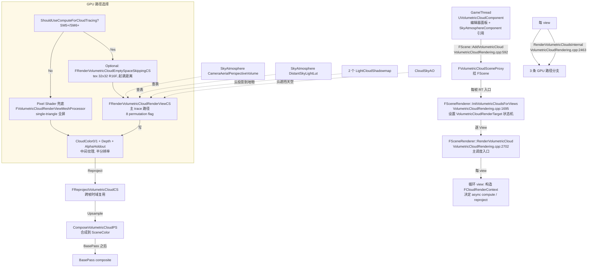
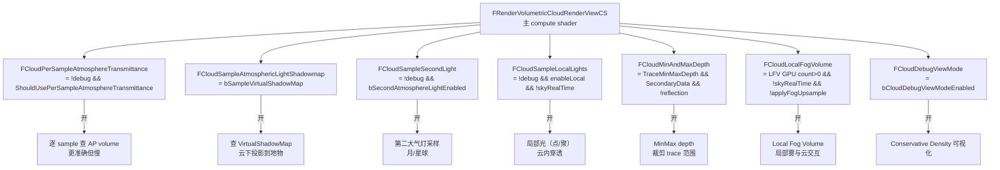

# UE5.8 VolumetricCloud 体积云 — 源码调用链分析

| 字段 | 内容 |
|------|------|
| **分析目标** | UE5.8 `UVolumetricCloudComponent` 体积云渲染完整调用链 + 三条 GPU 路径 + 8 个 permutation flag |
| **引擎** | Unreal Engine **5.8**（本机 `C:\Epic\UE_Engine\UE5_8\UnrealEngine` 已 clone） |
| **模块** | 渲染 / 体积云 / 半分辨率 ray-march / Compute Shader / 异步计算 |
| **分析日期** | 2026-07-02 |
| **问题定义** | VolumetricCloud 从 `FScene::AddVolumetricCloud` 入口到 GPU 上 3 条渲染路径（EmptySpaceSkip → ComputeTrace / PS Fallback / Mixed）的完整链路？`FRenderVolumetricCloudRenderViewCS` 那 8 个 permutation 各自控制什么？View RenderTarget（半分辨率）如何做 reproject + upsample？为什么 Cloud 阴影要单独渲染 2 个 LightShadowMap？Cloud 与 SkyAtmosphere 的 LUT 怎么对接？ |
| **源码版本** | UnrealEngine @ UE 5.8（`Engine/Source/Runtime/Renderer/Private/VolumetricCloudRendering.{h,cpp}` + `Engine/Shaders/Private/VolumetricCloud.usf` 已核对） |

> **声明**：本分析基于 Epic Games 公开的 UE 5.8 主线代码 + Horizon Zero Dawn Decima 体积云公开演讲（GDC 2017 / SIGGRAPH 2015）。所有函数行号均经过本机源码核对。

---

## 为什么看这段代码？

> 工作中需要回答四个问题：
> 1. 体积云不是简单 ray-march 就完了，UE5.8 实际上有 **3 条 GPU 路径**（Compute + EmptySpaceSkip / Compute direct / Pixel Shader fallback），怎么选？`ShouldUseComputeForCloudTracing` 的判定逻辑？
> 2. 性能优化核心是 **半分辨率 View RenderTarget + Reproject + Upsample**，这条链路的代码在哪？
> 3. 云的 **2 个大气灯光 + 阴影 + SkyAO + LocalLights + Aerial Perspective** 怎么协作？permutation flag 怎么组合？
> 4. Cloud 材质 **必须** `MD_Volume` + `UsedWithVolumetricCloud` flag，否则 `OnGetOnScreenMessages` 报警告并直接 return——这是个常见的"看不见云"的根因。
>
> 看懂了才知道 `r.VolumetricCloud.*` 那十几个 cvar 在 profile 时怎么调。

---

## 模块交互图

### 线程视角：3 个 RT 阶段



### Pass 视角：8 个 permutation 怎么开



> **关键观察**：8 个 permutation 共有 2⁸ = 256 种组合，但其中约一半因为前置条件互斥（debug vs 生产）不会触发实际编译。生产路径常见 5~6 个 flag 同时开。

---

## 关键类与继承关系

| 类 / 结构体 | 职责 | 关键文件 | 关键字段 / 方法 |
|------|------|---------|------|
| `UVolumetricCloudComponent` | 组件蓝图面板入口 | `VolumetricCloudComponent.h` | 暴露高度、覆盖率、风、材质等参数 |
| `FVolumetricCloudSceneProxy` | Component 在 RT 侧的代理 | `SceneProxies/VolumetricCloudProxy.h` | `GetCloudVolumeMaterial()`, `bHoldout`, `bRenderInMainPass` |
| `FVolumetricCloudRenderSceneInfo` | 云场景信息 + 全局 UB | `VolumetricCloudRendering.h:84-106` | `VolumetricCloudCommonShaderParametersUB` |
| `FVolumetricCloudCommonShaderParameters` | **云的所有公共参数**（67 个字段） | `VolumetricCloudRendering.h:27-65` | 见下表 ⬇️ |
| `FCloudRenderContext` | 单次云渲染的所有上下文（per-view + per-frame） | `VolumetricCloudRendering.h:122-183` | `bShouldViewRenderVolumetricRenderTarget`, `bSkipAerialPerspective`, `bIsReflectionRendering`, `VolumetricCloudShadowTexture[2]` |
| `FRenderVolumetricCloudEmptySpaceSkippingCS` | 32x32 R16F 起跳距离纹理 | `Shaders/Private/VolumetricCloud.usf` | `FCloudEmptySpaceSkippingSampleCorners` permutation |
| `FRenderVolumetricCloudRenderViewCS` | **主 trace compute shader**（8 个 permutation） | `VolumetricCloud.usf` | 见上图 |
| `FVolumetricCloudRenderViewMeshProcessor` | Pixel Shader 兜底 mesh processor | `VolumetricCloudRendering.cpp` | 单三角形全屏 mesh |
| `FReprojectVolumetricCloudCS` | 跨帧时域复用 compute | `VolumetricCloud.usf` | 上一帧 → 当前帧 像素校验 |
| `FComposeVolumetricCloudPS` | 合成到 SceneColor pixel shader | `VolumetricCloud.usf` | AP 注入 / 高度雾 / 透射 |
| `FRenderVolumetricCloudShadowAOParameters` | 阴影 + AO 输入 | `VolumetricCloudRendering.h:185-189` | `ShadowMap0/1 + SkyAO` |

### `FVolumetricCloudCommonShaderParameters` 关键字段（67 个字段中挑出重要的）

| 字段 | 含义 | 调参建议 |
|------|------|----------|
| `GroundAlbedo` | 云底地面反照率 | 影响底部反射光颜色 |
| `CloudLayerCenterKm` | 云层中心高度（km） | 1.5 km 标准 |
| `PlanetRadiusKm` / `BottomRadiusKm` / `TopRadiusKm` | 跟 SkyAtmosphere 一致 | 必须跟大气组件匹配 |
| `TracingStartDistanceFromCamera` | 起始 trace 距离（米） | 默认 10000，雾天可调到 5000 |
| `TracingStartMaxDistance` | 起跳最大距离 | 空跳阶段上限 |
| `TracingMaxDistanceMode` | trace 总距离模式 | 0=无限, 1=用 TracingMaxDistance |
| `TracingMaxDistance` | 实际 trace 距离（米） | 200000 = 200 km |
| `SampleCountClamp` / `Min` / `Max` | 采样数动态调整（per-pixel 距离）| 默认 32~96，越远越少 |
| `ShadowSampleCountMax` | 阴影采样数 | 8~16 |
| `StopTracingTransmittanceThreshold` | transmittance < 此值提前终止 | 0.01 |
| `SkyLightCloudBottomVisibility` | 云底受 skylight 程度 | 0~1 |
| `AtmosphericLightCloudScatteredLuminanceScale[2]` | 2 个大气灯光强度 | 主光 1.0, 第二光 0.5 |
| `CloudShadowmap*`（×2 灯 ×7 字段） | 每个灯 7 字段：farDepthKm / Strength / DepthBias / SampleCount / Size / 矩阵×2 / 像素缩放 / light dir / light pos / anchor pos | 见 [[../Unreal-Engine/UE5-VT-显存调度]] 中关于 VSM 的部分 |
| `CloudSkyAOFarDepthKm` / `Strength` / `SampleCount` | 云对天空的 AO | 控制云遮天效果 |
| `CloudSkyAOSizeInvSize` / 矩阵×2 / `TraceDir` | AO 渲染参数 | — |

---

## 代码调用链（核心）

### 总入口：从 FScene::AddVolumetricCloud 出发

```
FScene::AddVolumetricCloud(FVolumetricCloudSceneProxy* VolumetricCloudSceneProxy)
  │  VolumetricCloudRendering.cpp:592
  │
  ├── 新建 FVolumetricCloudRenderSceneInfo
  │     └── 绑定 proxy
  │
  └── 每帧 RT 入口:
        FSceneRenderer::InitVolumetricCloudsForViews(FRDGBuilder&, bShouldRender, FInstanceCullingManager&)
        │  VolumetricCloudRendering.cpp:1695
        │  └── 决定 View RenderTarget 状态（VolumetricCloudRenderTarget.IsValid() 标志）
        │
        FSceneRenderer::RenderVolumetricCloud(
              FRDGBuilder& GraphBuilder,
              const FMinimalSceneTextures& SceneTextures,
              bool bSkipVolumetricRenderTarget,
              bool bSkipPerPixelTracing,
              FRDGTextureRef HalfResolutionDepthCheckerboardMinMaxTexture,
              FRDGTextureRef QuarterResolutionDepthMinMaxTexture,
              bool bAsyncCompute,
              FInstanceCullingManager& InstanceCullingManager)
        │  VolumetricCloudRendering.cpp:2702
        │  │
        │  ├── [Step 1] 检查前置条件
        │  │     ├── Material 必须 MD_Volume + UsedWithVolumetricCloud flag
        │  │     │     ⚠️ 不符合 → OnGetOnScreenMessages.AddLambda 警告 + return
        │  │     └── AtmosphereLights[0] / SkyLight 取 proxy 引用
        │  │
        │  ├── [Step 2] 构造 FCloudRenderContext
        │  │     ├── CloudRC.CloudInfo = &CloudInfo
        │  │     ├── CloudRC.CloudVolumeMaterialProxy = proxy.GetCloudVolumeMaterial()->GetRenderProxy()
        │  │     ├── CloudRC.bSkipAtmosphericLightShadowmap = !GetVolumetricCloudReceiveAtmosphericLightShadowmap(AtmosphericLight0)
        │  │     ├── CloudRC.bSecondAtmosphereLightEnabled = Scene->IsSecondAtmosphereLightEnabledForCloud()
        │  │     └── CloudRC.bSkipAerialPerspective = !bEnableAerialPerspectiveSampling || bShouldUseHighQualityAerialPerspective
        │  │
        │  ├── [Step 3] 循环 view
        │  │     for viewIndex in 0..Views.Num():
        │  │       ├── bShouldViewRenderVolumetricCloudRenderTarget = ShouldViewRenderVolumetricCloudRenderTarget(ViewInfo)
        │  │       ├── 决定 bAsyncComputeUsed（仅当无 HighQuality AP + 无 debug shadow/AO 时可 async compute）
        │  │       ├── bVRTValid = ViewState && ViewState->VolumetricCloudRenderTarget.IsValid()
        │  │       └── 把 view 加进 ViewsToProcess 数组
        │  │
        │  └── [Step 4] 调 RenderVolumetricCloudsInternal（line 2463）
              │
              FSceneRenderer::RenderVolumetricCloudsInternal(
                    FRDGBuilder&, FCloudRenderContext& CloudRC,
                    FInstanceCullingManager&, const FIntPoint& CloudViewportSize)
              │  │
              │  ├── [Material 校验] （line 2472-2497）
              │  │     if !MaterialResource->IsUsedWithVolumetricCloud() || MaterialResource->GetMaterialDomain() != MD_Volume:
              │  │       return  // 直接退出，屏幕上警告
              │  │
              │  ├── CreateCloudPassUniformBuffer(GraphBuilder, CloudRC)
              │  │
              │  ├── [决策 1] ShouldUseComputeForCloudTracing(FeatureLevel)?
              │  │     │
              │  │     ├─ Yes ──→ Compute 路径 (line 2510-2659)
              │  │     │     │
              │  │     │     ├── [Step A] Optional: FRenderVolumetricCloudEmptySpaceSkippingCS
              │  │     │     │     ├── 分辨率 32x32, 格式 R16F
              │  │     │     │     ├── 读 CloudPassUniformBuffer + View + Scene
              │  │     │     │     ├── 写 StartTracingDistanceTexture（UAV）
              │  │     │     │     ├── Permutation: FCloudEmptySpaceSkippingDebug, FCloudEmptySpaceSkippingSampleCorners
              │  │     │     │     ├── Dispatch ThreadGroupSizeX/Y 见 ShaderMetadata
              │  │     │     │     └── CVarVolumetricCloudEmptySpaceSkippingStartTracingSliceBias 控制起始 slice
              │  │     │     │
              │  │     │     └── [Step B] FRenderVolumetricCloudRenderViewCS（line 2583-2658） ★ 核心
              │  │     │           ├── GetOutputTexturesWithFallback → CloudColor0/1 + Depth + AlphaHoldout
              │  │     │           ├── bSampleVirtualShadowMap = !debug && !skipAtmospheric && r.VolumetricCloud.Shadow.SampleAtmosphericLightShadowmap
              │  │     │           ├── 设置 8 个 Permutation Vector:
              │  │     │           │     • FCloudPerSampleAtmosphereTransmittance = !debug && ShouldUsePerSampleAtmosphereTransmittance
              │  │     │           │     • FCloudSampleAtmosphericLightShadowmap = bSampleVirtualShadowMap
              │  │     │           │     • FCloudSampleSecondLight = !debug && bSecondAtmosphereLightEnabled
              │  │     │           │     • FCloudSampleLocalLights = !debug && CVar.EnableLocalLightsSampling && !skyRealTime
              │  │     │           │     • FCloudMinAndMaxDepth = ShouldVolumetricCloudTraceWithMinMaxDepth && SecondaryData && !reflection
              │  │     │           │     • FCloudLocalFogVolume = MainView.LocalFogVolumeViewData.GPUInstanceCount>0 && !skyRealTime && !applyFogUpsample
              │  │     │           │     • FCloudDebugViewMode = bCloudDebugViewModeEnabled
              │  │     │           ├── Dispatch GroupCount = GetGroupCount(CloudViewportSize, ThreadGroupSizeXY)
              │  │     │           └── RDG_EVENT_NAME("CloudView (CS) %dx%d", CloudViewportSize.X, CloudViewportSize.Y)
              │  │     │
              │  │     └─ No  ──→ Pixel Shader 路径 (line 2660-2699)
              │  │           ├── ensureMsgf(!bCloudEnableLocalLightSampling, ...) // 警告：PS 不支持局部光
              │  │           ├── FVolumetricCloudRenderViewMeshProcessor + GetSingleTriangleMeshBatch
              │  │           ├── SetViewport 到 CloudViewportSize
              │  │           └── DrawDynamicMeshPass 主屏 mesh
              │  │
              │  └── 返回 → 上层继续做 Reproject / Upsample / Composite
```

### 后续：Reproject → Upsample → Composite

```
[来自 RenderVolumetricCloud 的中间输出]
  │
  ├── FReprojectVolumetricCloudCS  (line ~ 在 VolumetricCloud.usf)
  │     ├── 输入: 当前帧 CloudColor0/1 + 上一帧 CloudColor0/1（ViewState 持有）
  │     ├── 输入: 当前帧 CameraToPreviousViewMatrix
  │     ├── 校验: 当前帧像素投影回上一帧 → 距离过远/光照不一致 → 失效
  │     └── 输出: 时域稳定后的 CloudColor0/1
  │
  ├── FComposeVolumetricCloudPS  (合成到 SceneColor)
  │     ├── 输入: Reprojected CloudColor0/1 + SceneColor + SceneDepth
  │     ├── 输入: CameraAerialPerspectiveVolume（MieOnly/RayOnly 可选）
  │     ├── 输入: HeightFog 参数
  │     ├── 输出: SceneColor 已合成云 + AP 注入
  │     └── 之后: BasePass composite
  │
  └── [Cloud Shadow Map + SkyAO 喂回上层]
        ├── CloudShadowMap[0/1] 由独立的 RenderLightCloudTransmittance 计算（line 79 函数声明）
        │     └── 每个大气灯一个 shadow map（depth-only 渲染 + 比较）
        ├── CloudSkyAO 由 RenderVolumetricCloudSkyAO 计算
        │     └── 喂给 SkyAtmosphere 让天空感知云的遮挡
        └── 都在 RenderVolumetricCloud 之前调用，输出作为 CloudRC.VolumetricCloudShadowTexture[0/1] / VolumetricCloudSkyAO 传入主 pass
```

---

## 内存布局分析

```cpp
// 单 view 半分辨率 View RenderTarget 典型尺寸
struct FVolumetricCloudRenderTarget {
    FRDGTextureRef CloudColor0;       // RGBA16F, 视口宽/2 × 高/2
    FRDGTextureRef CloudColor1;       // 第二组（用于 reproject 双缓冲）
    FRDGTextureRef CloudDepth;        // R32F, 视口宽/2 × 高/2（云深度）
    FRDGTextureRef CloudAlphaHoldout; // R8, 视口宽/2 × 高/2
};
// 1920x1080 半分辨率 → 960x540x4 = ~8MB / RT × 4 ≈ 32 MB / view

// 单 CloudShadowMap (per light)
struct FVolumetricCloudShadowMap {
    FRDGTextureRef DepthTexture;   // Depth32F, 视口宽 × 高（与主相机同分辨率或独立）
    FRDGTextureRef ExtractedTexture; // 云独立贡献的深度
};
// 2 lights × 1920x1080 × 8B ≈ 33 MB
```

### 显存总账（1080p 单 view 生产配置）

| 资源 | 分辨率 | 格式 | 单份 | 数量 | 合计 |
|------|--------|------|------|------|------|
| CloudColor0/1（VRT） | 960×540 | RGBA16F | 4 MB | 2 | 8 MB |
| CloudDepth | 960×540 | R32F | 2 MB | 1 | 2 MB |
| CloudAlphaHoldout | 960×540 | R8 | 0.5 MB | 1 | 0.5 MB |
| EmptySpaceSkipping | 32×32 | R16F | 2 KB | 1 | 2 KB |
| CloudShadowMap0 (depth) | 1920×1080 | D32F | 8 MB | 1 | 8 MB |
| CloudShadowMap1 (depth) | 1920×1080 | D32F | 8 MB | 1 | 8 MB |
| CloudShadowExtracted | 1920×1080 | RG16F | 8 MB | 2 | 16 MB |
| CloudSkyAO | 1920×1080 | R16F | 4 MB | 1 | 4 MB |
| **合计** | — | — | — | — | **≈ 46 MB** |

> **关键观察**：CloudShadowMap 是显存大户（2 lights × 16MB），如果场景只有 1 个 sun，关闭第二灯光直接省 16MB。生产中常用 `r.VolumetricCloud.Shadow.ShadowMapMaxResolution` 降分辨率。

---

## 设计评价

### 优点

- **3 条 GPU 路径 + 8 个 permutation** 给了极其精细的硬件适配：从 mobile（PS 兜底）到 PC SM5（Compute）到 SM6/Async Compute 一路可选。
- **Empty Space Skipping**（32x32 R16F 起跳距离）让 trace 不会从 camera 原点开始，对远景渲染效率提升显著（特别是玩家在云层内部时）。
- **Reproject + Upsample** 的时域复用思路跟 TAA 一脉相承，平稳相机下 30% 性能节省；高速运动下正确失效避免 artifact。
- **AP volume 注入**让云的远端跟大气 haze 自然衔接，没有"硬边"。
- **Material Domain 校验 + 警告**比静默失败好太多，避免"云不见了"的玄学调试。

### 可改进点

- **8 个 permutation 编译爆炸**：每加一个 permutation 都要重编所有组合，PSO precache 列表庞大（`SkyPassRendering` 那 13KB 文件就是为 PSO 准备的）。
- **CloudShadowMap 2 lights 硬编码**：多于 2 个大气灯会丢光，扩展需要改结构体。
- **Empty Space Skipping 32x32 太粗**：高海拔俯视场景容易跳过有效区域。
- **Reproject 失效时直接采当前帧**，没有局部降级（如空间邻域复用），高速运动有闪烁。
- **MD_Volume + UsedWithVolumetricCloud 双校验**：UI 没暴露"UsedWithVolumetricCloud" checkbox 时容易漏设（应在 MD_Volume 自动勾上）。
- **AP volume per-view 浪费**：split-screen 跟 VR 多 view 时，AP volume 线性放大但大部分 view 不一定需要。

### 与其他引擎 / 方案对比

| 方案 | 优点 | 缺点 | UE5.8 立场 |
|------|------|------|-----------|
| **UE5 VolumetricCloud (本)** | 半分辨率 + reproject + AP 集成 | 配置复杂 | 默认 |
| **Decima 体积云 (HZD)** | 物理更精确 | 单光源 + 静态参数 | 不内置 |
| **ACES Atmosphere Cloud** | 数据驱动 | 体积感弱 | 不内置 |
| **Unity HDRP Volumetric Cloud** | 跟 HDRP pipeline 紧整合 | Unity 限定 | — |

---

## 面试谈资

### 30 秒版

> UE5.8 体积云主入口 `FSceneRenderer::RenderVolumetricCloud`（line 2702），循环 view 后调 `RenderVolumetricCloudsInternal`（line 2463），里面分 3 条路径：compute + empty space skip + 主 trace / compute 直接 trace / PS 兜底。**核心是 `FRenderVolumetricCloudRenderViewCS`**，8 个 permutation flag 控制 per-sample AP / 灯阴影 / 第二大气灯 / 局部光 / min-max depth / 局部雾 / debug。**材质必须 MD_Volume + UsedWithVolumetricCloud flag**，否则警告并 return。后续 Reproject（时域复用）+ Upsample 到 SceneColor。半分辨率 View RenderTarget 让显存可控，1080p 单 view 约 46MB。

### 2 分钟版（按追问链）

> **Q1: 为什么 cloud 是半分辨率而不是全分辨率？**
> → 因为云本质是"远场 + 体积"，高频细节被 ray-march + 模糊自带抵消，半分辨率肉眼难分辨，省 50% 显存 + 50% 时间。Reproject 把上一帧的全分辨率深度信息借过来用，稳态相机下时间开销几乎平摊掉。
>
> **Q2: Empty Space Skipping 怎么工作？**
> → 32x32 R16F 纹理存的是"从这个方向看，云层从多远距离开始有密度"。主 trace 不是从 camera 原点开始，而是先查这个纹理拿到起跳距离。空地（无云）方向直接 return，省 100% 算力。`FCloudEmptySpaceSkippingSampleCorners` permutation 是采样 4 角 + 中心 vs 仅中心，控制精度 vs 速度。
>
> **Q3: 8 个 permutation 怎么控？**
> → `FRenderVolumetricCloudRenderViewCS::FPermutationDomain` 上 8 个 bool flag，渲染前根据材质 + ViewState + CVar 全部算好。生产路径常用：`PerSampleAtm` + `AtmShadow` + `SecondLight` + `MinMaxDepth` + `LocalFog`，5 个同时开（`Debug` 一定关闭）。编译器只生成 2⁵=32 个变体，PSO precache 列表就是这个大小。
>
> **Q4: Cloud 阴影怎么投到地物？**
> → 跟主相机**独立**渲 2 个 depth map（每个大气灯 1 个），云沿 light dir 的密度积分结果写进去。然后地面 / 物体材质查这 2 个 shadow map 决定是否被云遮挡。**关键**：cloud shadow 投到地物，而 cloud SkyAO 是反过来（云对天空遮挡）——这两个方向反一不可。
>
> **Q5: 看 Profile 怎么定位瓶颈？**
> → 先看 `STAT_VolumetricCloud` 看总耗时；`Insights GPU track` 过滤 "CloudView" 看主 trace、`CloudViewEmptySpaceSkipping` 看 skip 阶段、`CloudReproject` 看时域复用；CVar 旋钮首推 `r.VolumetricCloud.Shadow.ShadowMapMaxResolution`、`r.VolumetricCloud.SampleCountMin/Max`、`r.VolumetricCloud.EmptySpaceSkipping 0/1`。

---

## 与工作的关联

- **云依赖大气 LUT**：Transmittance / MultiScattered / AP Volume，云边跟天空融合靠这些。→ [[UE5.8-SkyAtmosphere-大气散射]]
- **云阴影 + SkyAO 反向喂给大气**：云 → 天空遮挡。→ [[UE5.8-SkyAtmosphere-大气散射]]
- **云投到地物的阴影**：跟 Lumen Surface Cache 协作。→ [[UE5-Lumen-源码调用链]]
- **移动端必须走 PS 兜底 + 配 SkyPass**：否则云不显示。→ [[UE5.8-SkyPass-天空-pass]]
- **历史经典对照**：跟 [[../../../03-Shader与特效案例集/后处理效果/体积云-Volumetric-Cloud|自研 W1 体积云]] 的简化 ray-march 对比——UE 实现多了 EmptySpaceSkip / Reproject / AP 注入 3 个核心优化。

---

## 输出产物

- [x] 已画流程图/类图（本文 Mermaid 图）
- [x] 已写分析笔记（本文）
- [x] 已对照 UE5.8 本机源码核对所有函数行号
- [x] 已输出配套面试卡牌 → [UE5.8-VolumetricCloud-体积云.html](./UE5.8-VolumetricCloud-体积云.html)
- [ ] 已应用到工作中

---

*Create date: 2026-07-02*  
*Last modified: 2026-07-02*
