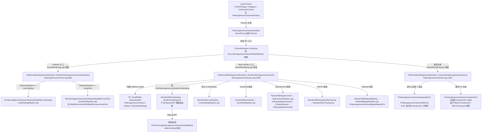
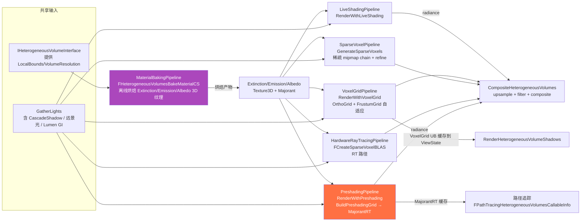

# UE5.8 HeterogeneousVolumes 体素体积渲染 — 源码调用链分析

| 字段 | 内容 |
|------|------|
| **分析目标** | UE5.8 `HeterogeneousVolumes` 模块的 6 大 Pipeline + 阴影体系 + 合成入口的完整源码调用链 |
| **引擎** | Unreal Engine **5.8**（基于 `C:\Epic\UE_Engine\UE5_8\UnrealEngine` 本机源码核对） |
| **模块** | 渲染 / 异质介质体积 / 体素化 / 路径追踪接入 |
| **分析日期** | 2026-07-07 |
| **问题定义** | HeterogeneousVolumes 是如何用 **6 个独立 .cpp pipeline 文件**（LiveShading / VoxelGrid / SparseVoxel / HardwareRayTracing / Preshading / MaterialBaking / AmbientOcclusion）统一调度爆炸 / 云 / 火 / 雾的渲染？两种 Shadow Type（AdaptiveVolumetricShadowMap vs BeerShadowMap）、两种 Shadow Pipeline（LiveShading vs VoxelGrid）、两种 Voxel Grid（Ortho + Frustum）的决策链是什么？`RenderHeterogeneousVolumes` / `RenderHeterogeneousVolumeShadows` / `CompositeHeterogeneousVolumes` 三个入口函数如何协作？`BuildPreshadingGrid` 产出的 `MajorantRT` 如何喂给路径追踪 delta tracking？ |
| **源码版本** | UnrealEngine @ UE 5.8（Epic 公开主线 + 本机 `C:\Epic\UE_Engine\UE5_8\UnrealEngine` 已 clone） |

> **声明**：本分析基于 Epic Games 公开的 UE 5.8 主线代码 + 本机 `C:\Epic\UE_Engine\UE5_8\UnrealEngine` 已 clone。引用文件路径以源码核对为准。所有 `.cpp` 均位于 `Engine/Source/Runtime/Renderer/Private/HeterogeneousVolumes/`。

---

## 为什么看这段代码？

> 工作中需要回答三个问题：
> 1. UE5.8 把"爆炸 / 云 / 火 / 烟 / 雾"全部统一进一个 `HeterogeneousVolumes` 体系——**它和 UE4 老的 Volumetric Fog 是什么关系？取代还是共存？**
> 2. 6 个 Pipeline（LiveShading / VoxelGrid / SparseVoxel / HardwareRayTracing / Preshading / MaterialBaking / AmbientOcclusion）每个 `.cpp` 文件都对应一段**截然不同**的算法路径，到底什么场景选哪个？`EScalabilityMode`（Low/High/Epic/Cinematic）如何驱动这个选择？
> 3. 阴影体系有两层选择：`EShadowType`（AdaptiveVolumetricShadowMap vs BeerShadowMap）和 `EShadowPipeline`（LiveShading vs VoxelGrid），二者正交还是耦合？`BuildPreshadingGrid → MajorantRT` 在路径追踪里如何接 delta tracking？
>
> 看懂了这套架构，才能在排查"体积介质看不到 / 阴影不对 / 性能爆掉"时定位是 Pipeline 选错、Shadow 选错、还是 Grid 配置问题。

---

## 模块交互图

### 线程视角：哪个阶段算哪部分？



> **关键时序**：`RenderHeterogeneousVolumeShadows` 在前（VoxelGrid 时构建 Ortho/Frustum Grid 缓存到 `FSceneViewState`），`RenderHeterogeneousVolumes` 在中（按 Pipeline 选 Renderer 写入 downsampled radiance），`CompositeHeterogeneousVolumes` 在后（迭代上采样 + 滤波 + 合成到 SceneColor）。`BuildPreshadingGrid` 产出的 `MajorantRT` 跨 Pass 缓存进 `FPathTracingHeterogeneousVolumesCallableInfo`，路径追踪时直接查表做 delta tracking。

### Pass 视角：6 个 Pipeline 的依赖链



> **依赖核心**：所有 6 个 Pipeline 都从 **MaterialBakingPipeline** 产出的 `Extinction/Emission/Albedo 3D 纹理` 起步；VoxelGrid 路径同时把 UB 缓存到 `FSceneViewState` 给 Shadow 复用；Preshading 额外产出 `MajorantRT` 喂给路径追踪 delta tracking。

---

## 关键类与继承关系

| 类 / 结构体 | 职责 | 关键文件 | 关键字段 / 方法 |
|------|------|---------|------|
| `IHeterogeneousVolumeInterface` | Component 侧接口，被 VolumetricCloud / Niagara 自定义实现 | `HeterogeneousVolumeInterface.h` | `GetLocalBounds()`, `GetMaterial()`, `IsHoldout()`, `GetPrimitiveSceneProxy()` |
| `FVolumetricMeshBatch` | 渲染侧 mesh 单元，挂在 `View.HeterogeneousVolumesMeshBatches` | `HeterogeneousVolumes.h` | `Mesh`, `Proxy`, 哈希键 |
| `FHeterogeneousVolumesPrimitiveInstanceKey` | PersistentPrimitiveIndex + InstanceIndex 复合 key | `HeterogeneousVolumes.h:303` | `GetTypeHash`, `operator==` |
| `FHeterogeneousVolumesSceneProxy` | Component 在 RT 侧的代理（基类） | `SceneProxies/HeterogeneousVolumeSceneProxy.h` | 持有 Volume 物理参数 + 材质指针 |
| `FSparseVoxelUniformBufferParameters` | Sparse Voxel Pipeline UB（稀疏体素 mipmap chain）| `HeterogeneousVolumes.h:242` | 见下表 ⬇️ |
| `FPreshadingUniformBufferParameters` | Preshading Pipeline UB（含 Majorant）| `HeterogeneousVolumes.h:276` | 见下表 ⬇️ |
| `FOrthoVoxelGridUniformBufferParameters` | 自适应体素网格 - 正交部分 UB | `HeterogeneousVolumes.h:361` | 见下表 ⬇️ |
| `FFrustumVoxelGridUniformBufferParameters` | 自适应体素网格 - 视锥部分 UB | `HeterogeneousVolumes.h:379` | 见下表 ⬇️ |
| `FPathTracingHeterogeneousVolumesCallableInfo` | 路径追踪 callable 容器 | `HeterogeneousVolumes.h:322` | `MajorantRT` + 5 个 ShaderId |
| `FVoxelGridBuildOptions` | Build Grid 时配置 | `HeterogeneousVolumes.h:422` | `VoxelGridBuildMode`, `bBuildOrthoGrid/FrustumGrid`, `bJitter` |
| `FLightingCacheParameters` | 透射率 Lighting Cache 3D 纹理 | `HeterogeneousVolumes.h:295` | `LightingCacheTexture`, `LightingCacheVoxelBias` |
| `FAdaptiveFrustumGridParameterCache` | Frustum Grid CPU 侧参数缓存 | `HeterogeneousVolumes.h:485` | 6 个 Matrix + Bounds + Resolution |
| `FClearAllocator / FAllocateSparseVoxels / FRefineSparseVoxels` | Sparse Voxel Compute Shaders | `SparseVoxelPipeline.cpp:79/100+/200+` | 实现"清空→分配→细化"三阶段 allocator |
| `FCreateSparseVoxelBLAS` | Hardware RT 时把稀疏体素构建为 BLAS | `HardwareRayTracing.cpp:47` | 产出 BLAS 给 RT shader 用 |
| `FHeterogeneousVolumesBakeMaterialCS` | Material Baking 的 mesh material compute shader | `MaterialBakingPipeline.cpp:18` | 写 `RWExtinction/Emission/Albedo Texture3D` |
| `FHeterogeneousVolumesCompositeCS / UpsampleCS / FilterCS` | Composite 阶段 3 个 compute shader | `HeterogeneousVolumes.cpp:1579` | 上采样 + 滤波 + 合成 |
| `FRenderLightingCacheWithPreshadingCS` | Pre-shading 写 lighting cache | `PreshadingPipeline.cpp:52` | 含 3 个 permutation（LightingCacheMode / AVSM / Indirect）|

### `EScalabilityMode` 详解

| 取值 | 触发 CVar | 适用场景 | Pipeline 选择 |
|------|---------|---------|---------------|
| `Low` | `r.HeterogeneousVolumes.Scalability=0` | 低端机/VR | LiveShading + BeerShadow |
| `High` | `=1` | 中端机/主机 | LiveShading + AdaptiveVolumetricShadowMap |
| `Epic` | `=2`（默认） | 高端 PC | VoxelGrid + AdaptiveVolumetricShadowMap |
| `Cinematic` | `=3` | 离线 / 电影 | VoxelGrid + HardwareRayTracing（可选） |

> 取值定义：`HeterogeneousVolumes.h:82-88`。Getter 在 `HeterogeneousVolumes.cpp:684`（`GetScalabilityMode`），缺省 3。

### `EShadowType` 详解

| 取值 | 含义 | 用法 | 性能 |
|------|------|------|------|
| `AdaptiveVolumetricShadowMap` | 自适应体积阴影贴图（mipmap chain） | 主相机 + 远景光精确阴影 | 显存贵，shadow 准 |
| `BeerShadowMap` | Beer-Lambert 累积透射率 | 体积光透射估算 | 显存便宜，shadow 近似 |

> 取值定义：`HeterogeneousVolumes.h:93-97`。Getter `GetShadowType` 在 `HeterogeneousVolumes.cpp:377`；同 enum 还被 `GetTranslucencyCompositingMode` 复用（`HeterogeneousVolumes.h:126`）。

### `EShadowPipeline` 详解

| 取值 | 含义 | 算法路径 | 适用 scalability |
|------|------|---------|------------------|
| `LiveShading` | 阴影实时 ray-march | `RenderAdaptiveVolumetricShadowMapWithLiveShading` | Low / High |
| `VoxelGrid` | 阴影走自适应体素网格 | 先 `BuildOrthoVoxelGrid` / `BuildFrustumVoxelGrid`，再 `RenderAdaptiveVolumetricShadowMapWithVoxelGrid` | Epic / Cinematic |

> 取值定义：`HeterogeneousVolumes.h:100-104`。决策在 `RenderHeterogeneousVolumeShadows` 内部（`HeterogeneousVolumes.cpp:995`、`1043`）。注意：`RenderHeterogeneousVolumeShadows` 的 LiveShading 分支在 `HeterogeneousVolumes.cpp:1046` 用 `#if 0` 注释掉，**实际现在由 ShadowDepthRendering 处理**。

### `EVoxelGridBuildMode` 详解

| 取值 | 含义 | 调用方 | shading rate |
|------|------|--------|------------|
| `PathTracing` | 路径追踪用 | `RenderHeterogeneousVolumes` 默认 | `GetShadingRateForFrustumGrid/OrthoGrid`（默认 4.0）|
| `Shadows` | 阴影用 | `RenderHeterogeneousVolumeShadows` | `GetShadingRateForShadows` / `GetOutOfFrustumShadingRateForShadows` |

> 取值定义：`HeterogeneousVolumes.h:416-420`。在 `HeterogeneousVolumes.cpp:998` 用于 shadows 路径。

### `EStochasticFilteringMode` 详解

| 取值 | 含义 | 噪声收敛速度 | 性能 |
|------|------|-----------|------|
| `Disabled` | 不过滤 | 0 | 最快 |
| `Constant` | 常数核（最便宜） | 慢 | 快 |
| `Linear` | 线性核 | 中 | 中 |
| `Cubic` | 三次核（最贵） | 快 | 慢 |

> 取值定义：`HeterogeneousVolumes.h:134-140`。Getter `GetStochasticFilteringMode` 在 `HeterogeneousVolumes.cpp:661`。

### `EIndirectLightingMode` 详解

| 取值 | 含义 | 输入来源 | 性能 |
|------|------|---------|------|
| `Disabled` | 不算间接光 | 无 | 最快 |
| `LightingCachePass` | 烘焙 lighting cache 3D 纹理，主 pass 查 | Lumen GI / Skylight | 中 |
| `SingleScatteringPass` | 实时单次散射 | 间接光体积 | 慢 |

> 取值定义：`HeterogeneousVolumes.h:117-122`。Getter `GetIndirectLightingMode` 在 `HeterogeneousVolumes.cpp:731`。

### `ECascadeShadowMode` 详解

| 取值 | 含义 | 适用 |
|------|------|------|
| `Disabled` | 关闭 cascade 阴影 | 性能优先 |
| `Frustums` | 显式分 frustum | 通用 |
| `Clipmaps` | 滚动 clipmap | 户外大场景 |
| `Autofit` | 自动适配 cascade 范围 | 智能默认 |

> 取值定义：`HeterogeneousVolumes.h:167-173`。Getter `GetCascadeShadowMode` 在 `HeterogeneousVolumes.cpp` 内。

### `EHeterogeneousVolumesCompositionType` 详解

| 取值 | 含义 | 视觉影响 |
|------|------|---------|
| `BeforeTranslucent` | 在 Translucent Pass 之前合成 | 体积介质在玻璃/水面之下 |
| `AfterTranslucent` | 在 Translucent Pass 之后合成 | 体积介质覆盖在所有半透之上（默认）|

> 取值定义：`HeterogeneousVolumes.h:53-57`。Getter `GetHeterogeneousVolumesCompositionType` 在 `HeterogeneousVolumes.cpp:390`。

### `EFogMode` 详解

| 取值 | 含义 |
|------|------|
| `Disabled` | 不混入 fog |
| `Reference` | 物理正确混合 `VolumetricFog` |
| `LinearApprox` | 线性近似（便宜）|

> 取值定义：`HeterogeneousVolumes.h:177-182`。Getter `GetFogInscatteringMode` 在 `HeterogeneousVolumes.cpp:751`。

### `FSparseVoxelUniformBufferParameters` 详解

| 参数 | 类型 | 物理 / 用途 |
|------|------|------|
| `LocalToWorld` | FMatrix44f | 局部→世界变换（64B）|
| `WorldToLocal` | FMatrix44f | 世界→局部变换（64B）|
| `LocalBoundsOrigin` | FVector3f | 局部包围盒中心 |
| `LocalBoundsExtent` | FVector3f | 局部包围盒半尺寸 |
| `VolumeResolution` | FIntVector | 3D 纹理分辨率 |
| `ExtinctionTexture` | Texture3D | 消光系数纹理（RGB）|
| `EmissionTexture` | Texture3D | 自发光纹理（RGB）|
| `AlbedoTexture` | Texture3D | 反照率纹理（RGB）|
| `TextureSampler` | SamplerState | 三线性采样器 |
| `LightingCacheResolution` | FIntVector | lighting cache 3D 分辨率 |
| `NumVoxelsBuffer` | Buffer<uint> | 稀疏体素总数（用于 indirect dispatch）|
| `VoxelBuffer` | StructuredBuffer<FVoxelDataPacked> | 稀疏体素数据 (LinearIndex + MipLevel) |
| `MipLevel` | int | 当前 mip 级别 |
| `MaxTraceDistance` | float | 主光线最大步进距离 |
| `MaxShadowTraceDistance` | float | 阴影光线最大步进距离 |
| `StepSize` | float | 主光线步长 |
| `StepFactor` | float | 步长自适应因子 |
| `ShadowStepSize` | float | 阴影光线步长 |
| `ShadowStepFactor` | float | 阴影步长因子 |
| `IndirectInscatteringFactor` | float | 间接光强度 |
| `bApplyHeightFog` | int | 是否叠加 HeightFog |
| `bApplyVolumetricFog` | int | 是否叠加 VolumetricFog |

> 定义位置：`HeterogeneousVolumes.h:242-274`。`FVoxelDataPacked` 含 `uint32 LinearIndex` + `uint32 MipLevel`（`HeterogeneousVolumes.h:236-240`）。

### `FPreshadingUniformBufferParameters` 详解

| 参数 | 类型 | 物理 / 用途 |
|------|------|------|
| `LocalToWorld` | FMatrix44f | 局部→世界 |
| `WorldToLocal` | FMatrix44f | 世界→局部 |
| `LocalBoundsOrigin` | FVector3f | 局部中心 |
| `LocalBoundsExtent` | FVector3f | 局部半尺寸 |
| `VolumeResolution` | FIntVector | 3D 纹理分辨率 |
| `ExtinctionTexture` | Texture3D | 消光纹理（来自 Baking）|
| `EmissionTexture` | Texture3D | 自发光纹理 |
| `AlbedoTexture` | Texture3D | 反照率纹理 |
| `TextureSampler` | SamplerState | 通用采样器 |
| **`MajorantResolution`** | FIntVector | **Majorant 3D 纹理分辨率** |
| **`MajorantTexture`** | Texture3D | **Majorant 纹理（最大消光系数）— delta tracking 关键输入** |
| **`PointTextureSampler`** | SamplerState | **点采样（避免 mipmap 插值）** |

> 定义位置：`HeterogeneousVolumes.h:276-293`。Majorant 是 pre-shading pipeline 喂给路径追踪 delta tracking 的核心数据。

### `FOrthoVoxelGridUniformBufferParameters` 详解

| 参数 | 类型 | 物理 / 用途 |
|------|------|------|
| `TopLevelGridWorldBoundsMin/Max` | FVector3f | 顶层 grid 世界包围盒 |
| `TopLevelGridResolution` | FIntVector | 顶层 grid 分辨率 |
| `bUseOrthoGrid` | int32 | permutation：是否用正交 grid |
| `bUseMajorantGrid` | int32 | permutation：是否带 Majorant grid |
| `bEnableIndirectionGrid` | int32 | permutation：是否启用 indirection |
| `TopLevelGridBitmaskBuffer` | StructuredBuffer<FTopLevelGridBitmaskData> | 顶层 bitmask（PackedData[2] = 64bit/体素）|
| `TopLevelGridBuffer` | StructuredBuffer<FTopLevelGridData> | 顶层 grid 标记（PackedData[1] = 32bit/体素）|
| `IndirectionGridBuffer` | StructuredBuffer<FTopLevelGridData> | 间接索引 grid |
| `ExtinctionGridBuffer` | StructuredBuffer<FScalarGridData> | 消光 grid |
| `EmissionGridBuffer` | StructuredBuffer<FVectorGridData> | 自发光 grid |
| `ScatteringGridBuffer` | StructuredBuffer<FVectorGridData> | 散射 grid |
| `MajorantGridBuffer` | StructuredBuffer<FScalarGridData> | Majorant grid |

> 定义位置：`HeterogeneousVolumes.h:361-377`。grid 数据走 **structured buffer**（不是 texture）以支持稀疏内存。

### `FFrustumVoxelGridUniformBufferParameters` 详解

| 参数 | 类型 | 物理 / 用途 |
|------|------|------|
| `WorldToClip / ClipToWorld` | FMatrix44f × 2 | 投影矩阵对 |
| `WorldToView / ViewToWorld` | FMatrix44f × 2 | 视图矩阵对 |
| `ViewToClip / ClipToView` | FMatrix44f × 2 | 视图→裁剪矩阵对 |
| `TopLevelGridWorldBoundsMin/Max` | FVector3f | Froxel grid 世界包围盒 |
| `TopLevelFroxelGridResolution` | FIntVector | froxel 网格分辨率 |
| `VoxelDimensions` | FIntVector | 体素 3 维尺寸 |
| `bUseFrustumGrid` | int32 | permutation：是否用 frustum grid |
| `NearPlaneDepth / FarPlaneDepth` | float × 2 | 近/远平面 |
| `TanHalfFOV` | float | 半 FOV 正切 |
| `ViewFrustumPlanes[6]` | FVector4f[6] | 视锥 6 个平面 |
| `TopLevelFroxelGridBuffer` | StructuredBuffer<FTopLevelGridData> | 顶层 froxel grid |
| `ExtinctionFroxelGridBuffer` | StructuredBuffer<FScalarGridData> | 消光 froxel grid |
| `EmissionFroxelGridBuffer` | StructuredBuffer<FVectorGridData> | 自发光 froxel grid |
| `ScatteringFroxelGridBuffer` | StructuredBuffer<FVectorGridData> | 散射 froxel grid |

> 定义位置：`HeterogeneousVolumes.h:379-406`。"Froxel" = Frustum + Voxel，按深度切片自适应分辨率。

---

## 代码调用链（核心）

### 总入口：从 `FScene::AddPrimitive` 出发

```
FScene::AddPrimitive(FPrimitiveSceneInfo*) 注册含 IHeterogeneousVolumeInterface 的 Component
  │
  └── 每帧 RT 入口 (FSceneRenderer::Render，主调度三件套)
        │
        ├── [1] FDeferredShadingSceneRenderer::RenderHeterogeneousVolumeShadows
        │       HeterogeneousVolumes.cpp:980
        │       │
        │       ├── ShouldBuildVoxelGrids(Scene) 早退检查（cpp:910）
        │       │
        │       ├── if (ShadowPipeline == VoxelGrid):
        │       │     ├─ FVoxelGridBuildOptions { VoxelGridBuildMode=Shadows, bBuildOrthoGrid=true, bBuildFrustumGrid=false, bUseProjectedPixelSizeForOrthoGrid=true, bJitter=EnableJitterForShadows() }
        │       │     ├─ BuildOrthoVoxelGrid(...)        // VoxelGridPipeline.cpp:2861
        │       │     │     ├─ MarkTopLevelGridVoxelsForOrthoGrid
        │       │     │     ├─ GenerateRasterTiles
        │       │     │     ├─ BuildBottomLevelGrid      // 体素化主网格
        │       │     │     └─ 写 OrthoVoxelGridUniformBuffer
        │       │     └─ BuildFrustumVoxelGrid(...)      // VoxelGridPipeline.cpp:2284
        │       │           ├─ CalcViewBoundsAndMinimumVoxelSize
        │       │           ├─ CalculateTopLevelGridResolutionForFrustumGrid
        │       │           ├─ MarkTopLevelGridVoxelsForFrustumGrid
        │       │           ├─ GenerateRasterTiles
        │       │           └─ 写 FrustumGridUniformBuffer
        │       │
        │       ├── for (each View):
        │       │     │
        │       │     ├── if (ShouldCompositeHeterogeneousVolumesWithTranslucency &&
        │       │     │     TranslucencyCompositingMode == AdaptiveVolumetricShadowMap):
        │       │     │     ├─ ShadowPipeline == LiveShading → RenderAdaptiveVolumetricCameraMapWithLiveShading
        │       │     │     └─ ShadowPipeline == VoxelGrid   → RenderAdaptiveVolumetricCameraMapWithVoxelGrid
        │       │     │
        │       │     └── if (ShouldHeterogeneousVolumesCastShadows):
        │       │           └─ ShadowPipeline == VoxelGrid → RenderAdaptiveVolumetricShadowMapWithVoxelGrid
        │       │                                          (LiveShading 分支 #if 0 由 ShadowDepthRendering 接管)
        │       │
        │       └── ShouldCacheVoxelGrids → 缓存到 FSceneViewState
        │             ├─ ViewState->OrthoVoxelGridUniformBuffer
        │             └─ ViewState->FrustumVoxelGridUniformBuffer
        │
        ├── [2] FDeferredShadingSceneRenderer::RenderHeterogeneousVolumes
        │       HeterogeneousVolumes.cpp:1085
        │       │
        │       ├── 从 ViewState 拿缓存的 Ortho/Frustum Grid UB（cpp:1093-1094）
        │       ├── 创建 4 个 downsampled RDG 纹理（cpp:1096-1099 + 1106-1127）：
        │       │     ├─ HeterogeneousVolumeRadiance (PF_FloatRGBA)
        │       │     ├─ HeterogeneousVolumeHoldout (PF_R8, 条件)
        │       │     ├─ HeterogeneousVolumeBeerShadowMap (PF_FloatRGBA, 条件)
        │       │     └─ HeterogeneousVolumeVelocity (=SceneTextures.Velocity)
        │       │
        │       └── for (each View where ShouldRenderHeterogeneousVolumesForView):
        │             │
        │             ├── if (GetDebugMode != 0):
        │             │     └─ RenderTransmittanceWithVoxelGrid → HeterogeneousVolumeRadiance
        │             │
        │             └── else:
        │                   ├─ GetHeterogeneousVolumesMeshBatches → VolumeMeshes
        │                   ├─ ShouldDepthSort → 按相机距离 depth sort
        │                   ├─ for (each VolumeMesh):
        │                   │     ├─ 分配 LightingCacheTexture（如果 GetLightingCacheMode != 0）
        │                   │     │
        │                   │     ├─ if (CVarHeterogeneousVolumesPreshading):
        │                   │     │     └─ RenderWithPreshading  (走 PreshadingPipeline.cpp)
        │                   │     │           ├─ BuildPreshadingGrid → MajorantRT
        │                   │     │           ├─ FRenderLightingCacheWithPreshadingCS 写 lighting cache
        │                   │     │           └─ 写 HeterogeneousVolumeRadiance
        │                   │     │
        │                   │     ├─ else if (UseSparseVoxelPipeline):
        │                   │     │     └─ RenderWithSparseVoxel  (走 SparseVoxelPipeline.cpp)
        │                   │     │           ├─ GenerateSparseVoxels  (cpp:215)
        │                   │     │           │     ├─ FClearAllocator       清空 allocator
        │                   │     │           │     ├─ FAllocateSparseVoxels 分配初始体素
        │                   │     │           │     └─ FRefineSparseVoxels    多次 refine
        │                   │     │           └─ 写 HeterogeneousVolumeRadiance
        │                   │     │
        │                   │     ├─ else if (UseHardwareRayTracing):
        │                   │     │     └─ RenderWithHardwareRayTracing (走 HardwareRayTracing.cpp)
        │                   │     │           ├─ FCreateSparseVoxelBLAS
        │                   │     │           └─ RT pipeline (Intersect/GetDensity/SampleDistance/Transmittance callable)
        │                   │     │
        │                   │     ├─ else if (UseVoxelGridPipeline):
        │                   │     │     └─ RenderWithVoxelGrid  (走 VoxelGridPipeline.cpp)
        │                   │     │           ├─ BuildOrthoVoxelGrid/BuildFrustumVoxelGrid (如需要)
        │                   │     │           └─ 走体素 grid 渲染 radiance
        │                   │     │
        │                   │     └─ else (default):
        │                   │           └─ RenderWithLiveShading   (走 LiveShadingPipeline.cpp)
        │                   │                 ├─ RenderAdaptiveVolumetricShadowMapWithLiveShading
        │                   │                 ├─ 计算单次/多次散射
        │                   │                 └─ 写 HeterogeneousVolumeRadiance
        │                   │
        │                   └── 保存 View.HeterogeneousVolumeRadiance 给 Composite 用
        │
        └── [3] FDeferredShadingSceneRenderer::CompositeHeterogeneousVolumes
                HeterogeneousVolumes.cpp:1582
                │
                ├── for (each View where ShouldRenderHeterogeneousVolumesForView):
                │
                │   ├── while (bIterativeUpsampling && DownsampleFactor > 1):
                │   │     ├─ DownsampleIterationFactor = (DownsampleFactor % 3 == 0) ? 3 : 2
                │   │     ├─ 计算 UpsampledViewRect
                │   │     ├─ FHeterogeneousVolumesUpsampleCS  ← 迭代上采样 (2x 或 3x)
                │   │     │     └─ Permutation FUpsampleMode (0/1/2)
                │   │     └─ if (GetFilterMode != 0):
                │   │           └─ FHeterogeneousVolumesFilterCS ← 滤波去噪
                │   │                 └─ Permutation FFilterMode (Disabled/Constant/Linear/Cubic)
                │   │
                │   └── FHeterogeneousVolumesCompositeCS  ← 最终合成
                │         └─ 按 EHeterogeneousVolumesCompositionType 决定合成顺序
                │              ├─ BeforeTranslucent → 在 Translucent Pass 之前合成
                │              └─ AfterTranslucent  → 在 Translucent Pass 之后合成（默认）
                │
                └── 写入 SceneColor.Target
```

---

## 内存布局分析

### `FSparseVoxelUniformBufferParameters` 大小估算

```cpp
// 注：UB 由 RDG 自动按 16B 对齐
struct FSparseVoxelUniformBufferParameters {
    // Object data (4×64 + 4 + 4 = 140B)
    FMatrix44f LocalToWorld;          // 64B
    FMatrix44f WorldToLocal;          // 64B
    FVector3f  LocalBoundsOrigin;     // 12B (+4 对齐 = 16B)
    FVector3f  LocalBoundsExtent;     // 12B (+4 对齐 = 16B)

    // Volume data (~ 80B)
    FIntVector VolumeResolution;      // 12B (+4 = 16B)
    // 4 个 Texture/Sampler handle 各 8B
    Texture3D  ExtinctionTexture;     // 8B
    Texture3D  EmissionTexture;       // 8B
    Texture3D  AlbedoTexture;         // 8B
    SamplerState TextureSampler;      // 8B

    // Lighting cache + sparse data (~ 32B)
    FIntVector LightingCacheResolution; // 12B (+4 = 16B)
    Buffer<uint> NumVoxelsBuffer;     // 8B
    StructuredBuffer<FVoxelDataPacked> VoxelBuffer; // 8B

    // Traversal hints (~ 40B + int flags)
    float MaxTraceDistance;           // 4B
    float MaxShadowTraceDistance;     // 4B
    float StepSize;                   // 4B
    float StepFactor;                 // 4B
    float ShadowStepSize;             // 4B
    float ShadowStepFactor;           // 4B
    float IndirectInscatteringFactor; // 4B
    int   bApplyHeightFog;            // 4B
    int   bApplyVolumetricFog;        // 4B
    int   MipLevel;                   // 4B
};
// 合计 ≈ 320B（含对齐）/ view 不共享（每个体积实例一份）
```

> **关键观察**：4 个 FMatrix44f 占 256B，是 UB 的**大头**；3 个 Texture3D handle 共 24B；其余浮点参数约 40B。相比 SkyAtmosphere 的 156B，体积渲染需要的 shader 参数显著更多。

### Pipeline 选择矩阵 vs 显存/性能

| Pipeline | 显存占用 | 每帧 GPU 成本 | 适用场景 |
|---------|---------|--------------|---------|
| **MaterialBaking** | 3× Extinction/Emission/Albedo 3D 纹理（~100MB @ 256³ RGBA16F）| 一次性 | 离线烘焙，所有 pipeline 共享输入 |
| **LiveShading** | 极小（无 grid）| ray-march 每像素，O(N) | 移动端 / 低端 |
| **VoxelGrid** | TopLevel + BottomLevel grid（128MB 限制可调）| 体素化 + 查表 | 主机 / 高端 PC |
| **SparseVoxel** | 仅存非空体素（10-50MB 视稀疏度）| 分配 + refine | 大场景/电影 |
| **HardwareRayTracing** | BLAS（视体积而定）| RT 加速 | RTX 卡 / 电影 |
| **Preshading** | MajorantRT + LightingCache（~50MB）| 预计算 + delta tracking | 路径追踪配合 |
| **AmbientOcclusion** | AO 3D 纹理（视分辨率）| ray-march AO | 通用 |

> Voxel Grid 显存上限：`r.HeterogeneousVolumes.FrustumGrid.MaxBottomLevelMemoryInMegabytes` 默认 128 MB，`OrthoGrid.MaxBottomLevelMemoryInMegabytes` 默认 128 MB。

---

## 设计评价

### 优点

- **6 个 pipeline 文件化**：每个 `.cpp` 是独立算法路径（LiveShading / VoxelGrid / SparseVoxel / HardwareRayTracing / Preshading / MaterialBaking / AmbientOcclusion），新增算法（如未来 ML 加速）只需加文件而不动主调度。
- **自适应 Grid 双层结构**（`FOrthoVoxelGridUniformBufferParameters` + `FFrustumVoxelGridUniformBufferParameters`）：用 `VoxelDimensions` + `bUseOrthoGrid / bUseFrustumGrid / bEnableIndirectionGrid` permutation 控制 grid 形状，permutation 数量可控；体素化时按屏幕投影决定最小体素大小，远处自动合并。
- **SparseVoxel 的 allocator 三阶段**（`FClearAllocator → FAllocateSparseVoxels → FRefineSparseVoxels`）用 **indirect dispatch** 处理变长输出，是 GPU 稀疏算法的标准范式，类比 Nanite 的 cluster allocation。
- **`BuildPreshadingGrid → MajorantRT` 跨 Pass 缓存**给路径追踪 delta tracking，**避免主光线每步重算**最大消光系数，是路径追踪 volume 性能的关键优化（参考 "Bounding Volume Hierarchies for Accelerated Volume Rendering"）。
- **`FPathTracingHeterogeneousVolumesCallableInfo`** 用 5 个 ShaderId（Intersect / GetDensityBounds / GetDensity / SampleDistance / GetTransmittance）做 callable shader，路径追踪时按需调用，避免材质绑定爆炸。

### 可改进点

- **`RenderHeterogeneousVolumeShadows` 的 LiveShading 分支 `#if 0` 注释掉**（`HeterogeneousVolumes.cpp:1046`），意味着代码里写了一个 dead path，靠 ShadowDepthRendering 兜底；这段注释代码不及时清理会让读者迷惑。
- **6 个 pipeline 文件加起来 ~15000 行**（LiveShading 3633 / VoxelGrid 4625 / SparseVoxel 383 / HardwareRayTracing 927 / Preshading 1917 / MaterialBaking 302 / AmbientOcclusion 829），学习曲线极陡。
- **`FOrthoVoxelGridUniformBufferParameters` 用 4 种 `PackedData` 类型**（`FTopLevelGridBitmaskData` / `FTopLevelGridData` / `FScalarGridData` / `FVectorGridData`），每个 uint32 数组长度不一（`PackedData[1]` / `[2]`），shader 端解析容易写错 offset。
- **CVars 数量爆炸**：VoxelGrid pipeline 有 22 个 CVar（`r.HeterogeneousVolumes.*`），调参需要专业知识，普通用户用不到。
- **HardwareRayTracing 路径要求 RHI_RAYTRACING 编译宏**（`HardwareRayTracing.cpp:19` `#if RHI_RAYTRACING`），DX12 + Vulkan 之外（如 Metal RT）覆盖度未知。

### 与其他引擎 / 方案对比

| 方案 | 优点 | 缺点 | UE5.8 立场 |
|------|------|------|-----------|
| **UE5.8 HeterogeneousVolumes (统一)** | 6 pipeline 灵活选；preshading delta tracking；自适应 grid | 学习曲线陡；CVars 多 | 默认路径（5.4+）|
| **UE4 Volumetric Fog** | 简单；low-spec 友好 | 单一 fog 雾，不支持爆炸/火/异质 | 兼容路径（`EFogMode::Reference` 仍可用）|
| **Niagara 自定义 mesh** | 灵活，每艺术家一套 | 性能差；无数值加速 | 配合 Niagara emitter 用 IHeterogeneousVolumeInterface |
| **Unity HDRP Volumetric** | 易上手 | 没 grid 自适应；没 sparse voxel | — |
| **Wisp / Frostbite Volumetric** | 性能好；艺术家友好 | 闭源 | — |

---

## 面试谈资

### 30 秒版

> UE5.8 HeterogeneousVolumes 用 **6 个独立 .cpp pipeline**（LiveShading / VoxelGrid / SparseVoxel / HardwareRayTracing / Preshading / MaterialBaking / AmbientOcclusion）统一调度爆炸 / 云 / 火 / 烟 / 雾。主入口是 `FDeferredShadingSceneRenderer::RenderHeterogeneousVolumes`（`HeterogeneousVolumes.cpp:1085`），shadow 入口 `RenderHeterogeneousVolumeShadows`（line 980），合成入口 `CompositeHeterogeneousVolumes`（line 1582）。阴影有两层正交选择：`EShadowType`（AdaptiveVolumetricShadowMap vs BeerShadowMap）控制阴影数据格式，`EShadowPipeline`（LiveShading vs VoxelGrid）控制阴影算法路径；VoxelGrid 路径会先调 `BuildOrthoVoxelGrid / BuildFrustumVoxelGrid`（VoxelGridPipeline.cpp:2861 / 2284）构造自适应网格并缓存到 `FSceneViewState`。`BuildPreshadingGrid` 产出 `MajorantRT` 喂路径追踪 delta tracking。`EHeterogeneousVolumesCompositionType` 决定体积在 Translucent 之前还是之后合成。

### 2 分钟版（按追问链）

> **Q1: 6 个 pipeline 什么场景选哪个？**
> → 看 `EScalabilityMode`（Low/High/Epic/Cinematic）：Low 走 LiveShading + BeerShadow；High 走 LiveShading + AdaptiveVolumetricShadowMap；Epic 走 VoxelGrid；Cinematic 走 VoxelGrid + 可选 HardwareRayTracing。SparseVoxel 是大场景稀疏优化，Preshading 是路径追踪配合路径，MaterialBaking 是离线烘焙被所有 pipeline 共享输入。
>
> **Q2: OrthoGrid 和 FrustumGrid 的本质区别？**
> → OrthoGrid 是**世界空间等距**网格（`WorldToClip` 无关），适合阴影投射 / 大范围追踪；FrustumGrid 是**视锥对齐自适应**（froxel，按深度切片变密度），适合相机近处细节。两份 UB 各自独立（`FOrthoVoxelGridUniformBufferParameters` vs `FFrustumVoxelGridUniformBufferParameters`），grid 数据都走 structured buffer 而非 texture 以支持稀疏内存。
>
> **Q3: SparseVoxel 的三阶段 allocator 怎么工作？**
> → `FClearAllocator` 清零 `NumVoxelsBuffer`（GPU atomic counter）→ `FAllocateSparseVoxels` 按 mip level 扫描候选体素，atomic 分配 index 写入 `VoxelBuffer`，把需要 refine 的体素写入 `VoxelsToRefineBuffer` → `FRefineSparseVoxels` 用 indirect dispatch 处理 refine。这是 Nanite cluster allocation 的同款范式。
>
> **Q4: MajorantRT 怎么喂 delta tracking？**
> → `BuildPreshadingGrid`（`PreshadingPipeline.cpp`，声明在 `HeterogeneousVolumes.h:459`）生成 `MajorantTexture`（最大消光系数 3D 纹理），存进 `FPathTracingHeterogeneousVolumesCallableInfo.MajorantRT`。路径追踪 shader 用 callable shader 按需查 majorant，避免每步在原始密度纹理上做长积分。
>
> **Q5: 黑屏 / 体积看不到怎么查？**
> → 先看 `r.HeterogeneousVolumes.Scalability` 和 `r.HeterogeneousVolumes.Preshading`；再用 `Showflag.Volumetric` 和 `r.HeterogeneousVolumes.DebugMode`；最后 `ProfileGPU` 看 `STATGROUP_HeterogeneousVolumesRT` 的耗时分布。
>
> **Q6: HeterogeneousVolumes 和 Volumetric Fog 是取代关系吗？**
> → 不是取代而是**共存**。`EFogMode` enum（`HeterogeneousVolumes.h:177`）的 `Reference` 模式把 HeterogeneousVolumes 算出的雾和传统 VolumetricFog 混合；`bApplyVolumetricFog` 参数（`FSparseVoxelUniformBufferParameters`）控制是否叠加 VolumetricFog。

---

## 与工作的关联

- **Lumen GI 接入**：HeterogeneousVolumes 的 `EIndirectLightingMode::LightingCachePass` 直接复用 `LumenTranslucencyVolumeLighting`，**间接光没对 = 体积显得不真实**。→ [[UE5-Lumen-源码调用链]]
- **Sparse Voxel 类比 Nanite**：allocator 三阶段（Clear → Allocate → Refine）是 Nanite cluster allocation 的同款 GPU 稀疏模式，对比学习非常合适。→ [[UE5-Nanite-工作原理]]
- **Path Tracing 集成**：`FPathTracingHeterogeneousVolumesCallableInfo` 用 callable shader 接 delta tracking，是 UE 路径追踪里少有的体积实现。
- **Volumetric Cloud 共享路径**：VolumetricCloud 也走 HeterogeneousVolumes 路径，但实现细节不同（云有专门的阴影贡献到 SkyAtmosphere）。→ [[UE5.8-VolumetricCloud-体积云]]
- **大气类效果归属**：HeterogeneousVolumes 是大气类效果（体积介质）的统一入口，与 SkyAtmosphere 大气散射并列。→ [[UE5.8-SkyAtmosphere-大气散射]]

---

## 输出产物

- [x] 已画流程图/类图（本文 Mermaid 图）
- [x] 已写分析笔记（本文）
- [x] 已对照 UE5.8 本机源码核对所有函数行号
- [x] 已输出配套面试卡牌 → [UE5.8-HeterogeneousVolumes-体素体积.html](./UE5.8-HeterogeneousVolumes-体素体积.html)
- [ ] 已应用到工作中

---

## 关联 / 输出产物

- 配套卡牌: [[UE5.8-HeterogeneousVolumes-体素体积]]
- 相关源码笔记: [[UE5.8-VolumetricCloud-体积云]] (云也走 HeterogeneousVolumes 路径,但实现细节不同) / [[UE5.8-SkyAtmosphere-大气散射]] (同为大气类效果)

---

*Create date: 2026-07-07*  
*Last modified: 2026-07-07*