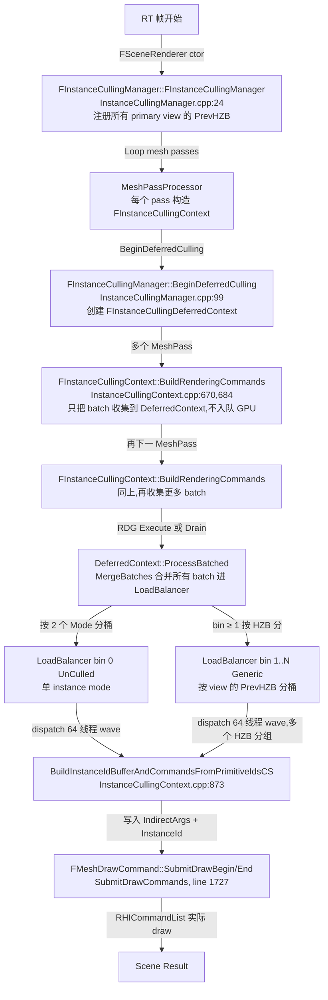

# UE5.8 InstanceCulling / GPUScene GPU 裁剪 — 源码调用链分析

| 字段 | 内容 |
|------|------|
| **分析目标** | UE5.8 `FInstanceCullingManager` / `FInstanceCullingLoadBalancer` / `FInstanceCullingMergedContext` GPU 裁剪流水线的完整源码调用链 |
| **引擎** | Unreal Engine **5.8**（基于 `C:\Epic\UE_Engine\UE5_8\UnrealEngine` 本机源码核对）|
| **模块** | 渲染 / Instance Culling / GPUScene / RDG |
| **分析日期** | 2026-07-07 |
| **问题定义** | InstanceCulling 是如何替代 UE4 CPU per-instance culling 的？`FInstanceCullingLoadBalancerBase` 的 32-bit word 紧凑布局 (`FPackedBatch` / `FPackedItem`) 是怎么编码 InstanceDataOffset / NumInstances / Payload / BatchPrefixSum 的？`FInstanceCullingManager::BeginDeferredCulling` 如何把多个 mesh pass 的 BuildRenderingCommands 合并到一个 GPU pass？HZB 是怎样被划分到不同 bin 的？ |
| **源码版本** | UnrealEngine @ UE 5.8（Epic 公开主线 + 本机 `C:\Epic\UE_Engine\UE5_8\UnrealEngine` 已 clone） |

> **声明**：本分析基于 Epic Games 公开的 UE 5.8 主线代码 + 本机 `C:\Epic\UE_Engine\UE5_8\UnrealEngine` 已 clone。引用文件路径以源码核对为准：`Engine/Source/Runtime/Renderer/Public/InstanceCulling/InstanceCullingContext.h`、`Engine/Source/Runtime/Renderer/Private/InstanceCulling/{InstanceCullingManager,InstanceCullingLoadBalancer,InstanceCullingMergedContext,InstanceCullingOcclusionQuery}.{h,cpp}`。

---

## 为什么看这段代码？

> 工作中需要回答三个问题：
> 1. UE5 的 GPU 裁剪是如何替代 UE4 CPU 逐 instance 裁剪的？`BeginDeferredCulling` 这个 batching 入口到底解决了什么性能瓶颈？（ISMC、PC、ISM 在主线程每帧遍历 instance 数据 → 改成分批 RDG dispatch + GPU 端处理）
> 2. `FInstanceCullingLoadBalancerBase::PackItem` / `PackBatch` 是怎么把 `(InstanceDataOffset, NumInstances, Payload, BatchPrefixSum)` 塞进两个 32-bit word 的？这是面试**最容易挖**的 bit-packing 题目。
> 3. HZB 是怎么按 view（primary + 阴影 view）拆 bin 的？为什么 bin 0 给 UnCulled、bin 1 起给 HZB，`GetBinIndex` 的逻辑细节是什么？
>
> 看懂了 InstanceCulling 的数据流和 bit packing，才能在理解 Nanite `FCoarseMeshCullingTask` / Substrate / Lumen Surface Cache 共享 GPUScene 时，正确推演它们的 instance pipeline 是怎么复用的。

---

## 模块交互图

### 线程视角：每个阶段谁负责什么？



> **关键时序**：`BeginDeferredCulling` 只在**首次 BuildRenderingCommands 之前**调用一次。整个 InitViews 期间所有 mesh pass 都把自己的 culling batch **异步收集**到同一个 `FInstanceCullingDeferredContext`，**直到 RDG Execute / Drain 触发 `ProcessBatched`** 一次性把所有 batch 合并上传到 GPU → 单个 dispatch 完成所有 view × all bin 的 culling。

### Pass 视角：LoadBalancer → Cull Pass → DrawCommand 发射链

```mermaid
graph LR
    A[BuildRenderingCommands<br/>每个 MeshPass 调用一次] -->|AddBatchItem| B[FInstanceCullingDeferredContext<br/>::Batches TArray]
    B -->|按 PrevHZB 分桶| C[LoadBalancers TStaticArray]
    C -->|bin 0| D0[UnCulled LB<br/>单 instance / 不裁剪]
    C -->|bin 1..N| D1[Generic LB 按 HZB<br/>HZB occlusion cull]
    D0 -->|PackItem/PackBatch| E0[FPackedItem + FPackedBatch<br/>32-bit word 紧凑结构]
    D1 -->|PackItem/PackBatch| E1[FPackedItem + FPackedBatch<br/>同结构但按 HZB 分]
    E0 -->|Upload StructuredBuffer SRV| F0[BuildInstanceIdBufferAndCommandsCS<br/>FSingleInstanceModeDim=UnCulled<br/>FCullInstancesDim=false]
    E1 -->|Upload StructuredBuffer SRV| F1[BuildInstanceIdBufferAndCommandsCS<br/>FSingleInstanceModeDim=Generic<br/>FCullInstancesDim=true<br/>r.InstanceCulling.OcclusionCull 启用]
    F0 -->|HZB/InstanceOcclusionQueryBuffer| G[InstanceCullingOcclusionQuery]
    F1 -->|HZB/InstanceOcclusionQueryBuffer| G
    F0 -->|写 IndirectArgs + InstanceId| H[SetupDrawCommands<br/>InstanceCullingContext.cpp:1453]
    F1 -->|写 IndirectArgs + InstanceId| H
    H -->|Pack 1:1 对应 MeshDrawCommand| I[SubmitDrawCommands<br/>InstanceCullingContext.cpp:1727]
    I -->|FMeshDrawCommand::SubmitDrawBegin/End| J[RHICommandList.ExecuteIndirect]
    J -->|GPU 实际绘制| K[Scene Result]
```



> **数据 DAG 核心**：所有 mesh pass 的 batch 在 CPU 阶段只是**记账**——真正合并发生在 `ProcessBatched → MergeBatches` 的零碎的 `LoadBalancer::Add()` 调用上。最终只产生一个 `BuildInstanceIdBufferAndCommandsCS` dispatch（每个 bin 一个），剩下的 IndirectArgs 写回 + primitive cull + draw 就是普通的 mesh draw pipeline。

---

## 关键类与继承关系

| 类 / 结构体 | 职责 | 关键文件 | 关键字段 / 方法 |
|------|------|---------|------|
| `FInstanceCullingManager` | 每个 FSceneRenderer 持有一个,负责 batching 和分配 indirect args | `Renderer/Private/InstanceCulling/InstanceCullingManager.h:44` | `BeginDeferredCulling` line 99; `DeferredContext` line 96; `RegisterView` line 49; `GetBinIndex` line 88; `AllowBatchedBuildRenderingCommands` line 94 |
| `FInstanceCullingContext` | 单个 mesh pass 的 culling context(收集阶段的句柄) | `Renderer/Public/InstanceCulling/InstanceCullingContext.h:75` | `BuildRenderingCommands` line 178,191; `SetupDrawCommands` line 217; `SubmitDrawCommands` line 226; `LoadBalancers` line 339 |
| `FInstanceCullingDeferredContext` | 多 context 合并容器(`FInstanceCullingMergedContext` 子类) | `Renderer/Private/InstanceCulling/InstanceCullingContext.cpp:616` | `ProcessBatched` line 633; `DrawIndirectArgsBuffer` line 626; `InstanceDataBuffer` line 627 |
| `FInstanceCullingMergedContext` | 跨 view / 跨 pass 的 batch 合并器 | `Renderer/Private/InstanceCulling/InstanceCullingMergedContext.h:9` | `MergeBatches` line 83; `AddBatch` line 86; `FBatchItem` line 14; `FContextBatchInfoPacked` line 24 |
| `FInstanceCullingLoadBalancerBase` | GPU dispatch 数据打包的基类 | `Renderer/Private/InstanceCulling/InstanceCullingLoadBalancer.h:19` | `FPackedBatch` line 33; `FPackedItem` line 46; `PackBatch` line 38; `PackItem` line 53; `ThreadGroupSize = 64` line 22 |
| `TInstanceCullingLoadBalancer<Allocator>` | 模板子类,持有实际 `Batches/Items` TArray | `InstanceCullingLoadBalancer.h:120` | `Add(offset, num, payload)` line 134; `Upload()` line 174; `FinalizeBatches()` line 202 |
| `FInstanceProcessingGPULoadBalancer` | type alias for `TInstanceCullingLoadBalancer<>` | `InstanceCullingManager.h:21` | `using TInstanceCullingLoadBalancer<>` 直接继承 |
| `FInstanceCullingOcclusionQueryRenderer` | per-instance occlusion mask 生产器(HZB + software query) | `Renderer/Private/InstanceCulling/InstanceCullingOcclusionQuery.h:20` | `Render` line 28; `MarkInstancesVisible` line 40; `MaxViews = 8` line 77 (uint8 8 位 mask) |
| `EBatchProcessingMode` (枚举) | `Generic=0` / `UnCulled=1` | `Renderer/Public/InstanceCulling/InstanceCullingContext.h:60` | `Generic`, `UnCulled`, `Num=2` |
| `FPayloadData` (struct) | 每个 draw command 的 payload 元数据 | `InstanceCullingContext.h:277` | `bDynamicInstanceDataOffset_IndirectArgsIndex` 位域 line 279 + 4×uint |
| `FCompactionData` (struct) | GPU compaction meta,用于 instance order preservation | `InstanceCullingContext.h:300` | `NumInstances_NumViews` 8-bit NumViews + 24-bit NumInstances 位域 |
| `FMeshDrawCommandInfo` (struct) | 1:1 与保留 MeshDrawCommand,记录 indirect 偏移 | `InstanceCullingContext.h:264` | `bUseIndirect:1`, `IndirectArgsOffsetOrNumInstances:31`, `NumBatches:15`, `BatchDataStride:17` |
| `FInstanceCullingDrawParams` (UB struct) | shader 端读取的最终参数(IndirectArgs + InstanceId + SceneUB) | `InstanceCullingContext.h:33` | `DrawIndirectArgsBuffer` line 34; `InstanceIdOffsetBuffer` line 35; `InstanceDataByteOffset` line 36 |
| `FInstanceCullingGlobalUniforms` | global uniform buffer,装 payload table 指针 | `InstanceCullingContext.h:23` | `InstanceIdsBuffer` line 24; `PageInfoBuffer` line 25; `BufferCapacity` line 26 |
| `FBatchedPrimitiveParameters` | mobile UB-view 路径的 batched primitive buffer | `InstanceCullingContext.h:29` | `Data: Buffer<float4>` line 30 |

### `FInstanceCullingLoadBalancerBase::FShaderParameters` 详解

| 参数 | RDG 类型 | 作用 |
|------|---------|------|
| `BatchBuffer` | `StructuredBuffer<FPackedBatch>` SRV | GPU 端读每个 batch 的 `(FirstItem, NumItems)` — 一个 thread group 处理一个 batch |
| `ItemBuffer` | `StructuredBuffer<FPackedItem>` SRV | GPU 端读每个 item 的 `(InstanceDataOffset, NumInstances, Payload, BatchPrefixSum)` — thread 0..63 各领一条 |
| `NumBatches` | `uint32` | dispatch 的 group 数(= batch 数),用于 `FComputeShaderUtils::GetGroupCountWrapped` |
| `NumItems` | `uint32` | 总 item 数,用于 shared memory 预计算 |
| `NumGroupsPerBatch` | `uint32` | 每个 batch 可启动多 group(默认 1),给 warp 不足的情况做加速 |

### `FPackedBatch` / `FPackedItem` 字段详解(本笔记最重要的位域表)

| 字段 | 类型 | 字面含义 | 字面值 | 备注 |
|------|------|---------|--------|------|
| `FPackedBatch::FirstItem_NumItems` | `uint32` | 高位 FirstItem + 低 7 位 NumItems | `FirstItem << NumInstancesItemBits \| NumItems & Mask` | 一个 batch 内的 item 数量上限 127(`(1<<7)-1`),包含 ThreadGroupSize 满 case |
| `FPackedItem::InstanceDataOffset_NumInstances` | `uint32` | 高 25 位 Offset + 低 7 位 NumInstances | 同上公式 | Offset 上限 `2^25` = 33M instance,远超常见场景 |
| `FPackedItem::Payload_BatchPrefixOffset` | `uint32` | 高 26 位 Payload + 低 6 位 BatchPrefixSum | `Payload<<PrefixBits \| BatchPrefixSum & PrefixBitMask` | `PrefixBits=6` 来自 `ILog2(ThreadGroupSize)` —— 单 thread 编号 0..63 |

---

## 代码调用链(核心)

### 总入口:从 RT 帧开始到实际 GPU 裁剪

```
FSceneRenderer::FSceneRenderer(...) [SceneRendering.cpp]
  │
  ├── ctor:
  │     FInstanceCullingManager::FInstanceCullingManager(GraphBuilder, InScene, InSceneUniforms, InViewDataManager)
  │       InstanceCullingManager.cpp:24
  │       ├── 收集所有 primary view 的 PrevHZB 到 ViewPrevHZBs (.cpp:29-37)
  │       ├── DummyUniformBuffer = FInstanceCullingContext::CreateDummyInstanceCullingUniformBuffer(GraphBuilder)
  │       └── bIsEnabled = GPUScene.IsEnabled()
  │
  └── FSceneRenderer::InitViews(...) → 调用 MeshPassProcessor:
        for (each mesh pass):
          const FInstanceCullingContext Context(PassName, ShaderPlatform, InstanceCullingManager, ...)
            pass.BuildRenderingCommands(GraphBuilder, GPUScene, &DrawParams)
              │
              ├── 第一次 BuildRenderingCommands 调用 → 检测到 IsDeferredCullingActive() 为 false
              │   → 自动调 FInstanceCullingManager::BeginDeferredCulling
              │       └── 创建 FInstanceCullingDeferredContext
              │         (.cpp:99-122)
              │         ├── TraceGameTime: TRACE_CPUPROFILER_EVENT_SCOPE
              │         ├── Scene.AddGPUSkinCacheAsyncComputeWait(GraphBuilder)  // 同步 skin cache
              │         ├── ViewDataManager.FlushRegisteredViews(GraphBuilder) // 上传 view matrix 到 GPU
              │         ├── 检查 AllowBatchedBuildRenderingCommands 和 instance 数量
              │         └── DeferredContext = FInstanceCullingContext::CreateDeferredContext(...)
              │
              ├── 后续 BuildRenderingCommands 调用:
              │     → InstanceCullingContext.cpp:684-686
              │     → EAsyncProcessingMode::DeferredOrAsync 路径
              │     → DeferredContext->AddBatch(GraphBuilder, this, InstanceCullingDrawParams)
              │         InstanceCullingMergedContext.cpp:162
              │         ├── 解 BinIndex(根据 PrevHZB) → GetBinIndex(line 173)
              │         ├── 区分 SyncPrerequisitesFunc 存在否
              │         │   ├── 有 → AsyncBatches.Add (延迟 sync)
              │         │   └── 无 → AddBatchItem (立即 add)
              │         ├── AddBatchItem(.cpp:191): 按 Mode 累加 TotalBatches/TotalItems/TotalIndirectArgs 等
              │         └── checkf(!Batches.FindByPredicate(dup Result))  // 同一个 InstanceCullingDrawParams 不能被两次注册
              │
              └── cull: FInstanceCullingContext::BuildRenderingCommandsInternal(line 695)
                    ├── bCullInstances = InstanceCullingManager && r.CullInstances != 0
                    ├── FPackedBatch / FPackedItem builder
                    └── 见 ⬇️ 内层流程
```

### 内层:从 BuildRenderingCommandsInternal 到 GPU dispatch

```
FInstanceCullingContext::BuildRenderingCommandsInternal
  InstanceCullingContext.cpp:695
  │
  ├── 如果 DeferredContext->bProcessed == false(还没 Execute):
  │     InstanceCullingDrawParams->DrawIndirectArgsBuffer = DeferredContext->DrawIndirectArgsBuffer
  │     InstanceCullingDrawParams->InstanceIdOffsetBuffer = DeferredContext->InstanceDataBuffer
  │     InstanceCullingDrawParams->InstanceCulling = DeferredContext->UniformBuffer
  │     InstanceCullingDrawParams->BatchedPrimitive = DeferredContext->BatchedPrimitive
  │     → return (此处不设 bHasAnyIndirectDraw,等 Process 时写)
  │
  ├── WaitForSetupTask() 等 async setup
  │
  ├── if !HasCullingCommands() → 用 DummyUniformBuffer,直接 return
  │
  ├── bCullInstances = (InstanceCullingManager != nullptr) && (r.CullInstances != 0)
  │
  ├── SetupDrawCommands(VisibleMeshDrawCommandsInOut, ...)
  │     InstanceCullingContext.cpp:1453
  │     │
  │     ├── if (bMultiView || bForceGenericProcessing)
  │     │   SingleInstanceProcessingMode = Generic       // 多 view 强制 culled path(line 1472)
  │     │
  │     ├── for each LoadBalancer in LoadBalancers[0..1]:
  │     │     LoadBalancer = new FInstanceProcessingGPULoadBalancer (line 1482)
  │     │
  │     ├── 扫描 VisibleMeshDrawCommands:
  │     │     ├── bFetchInstanceCountFromScene / bAlwaysUseIndirectDraws 检查
  │     │     ├── 状态 bucket 匹配的 command merge 进同一 indirect slot
  │     │     └── 当前 bHasAnyIndirectDraw = true
  │     │
  │     ├── AddInstancesToDrawCommand 调用 LoadBalancer->Add(Offset, Num, Payload)
  │     │     InstanceCullingLoadBalancer.h:134
  │     │     把 NumInstanceDataEntries 拆到 ≤ ThreadGroupSize 的 item 中(line 139)
  │     │     满 batch 后调 PackBatch(line 159)
  │     │
  │     └── MeshDrawCommandInfos / IndirectArgs / PayloadData / InstanceIdOffsets 全部 fill
  │
  └── SubmitDrawCommands(...) 不直接发 GPU - 由后续 RDG Execute / 渲染管线驱动
        InstanceCullingContext.cpp:1727
        │
        ├── if !VisibleMeshDrawCommands.Num() → 直接 return
        ├── if (IsEnabled()):
        │     ├── 设置 SceneArgs.PrimitiveIdsBuffer / InstanceCullingStaticSlot UB
        │     └── for each DrawCommand:
        │           FMeshDrawCommand::SubmitDrawBegin(...)
        │           FMeshDrawCommand::SubmitDrawEnd(...)
        │             │
        │             └── 内部走 SubmitMeshDrawCommandsRange
        │                 → 每个 command 走到 RHICommandList.DrawIndexedPrimitive
        └── else: 旧路径 SubmitMeshDrawCommandsRange

─── RDG Execute / Drain 触发 ───────────────────────────────────────
FInstanceCullingDeferredContext::ProcessBatched(...)
  InstanceCullingContext.cpp / InstanceCullingManager 触发
  │
  ├── MergeBatches() (InstanceCullingMergedContext.cpp:30)
  │     ├── for AsyncBatchItem: WaitForSetupTask + AddBatchItem
  │     ├── for each BinIndex: LoadBalancers[BinIndex].ReserveStorage
  │     ├── for each BatchIndex:
  │     │     ├── 取 InstanceCullingContext,合并 IndirectArgs/DrawCommandDescs/PayloadData/ViewIds 到 merged arrays
  │     │     ├── 按 BinIndex AppendData 到 merged LoadBalancer(line 124)
  │     │     └── Compute BatchInfo.IndirectArgsOffset/InstanceDataWriteOffset/CompactionDataOffset
  │
  ├── BuildInstanceIdBufferAndCommandsFromPrimitiveIdsCS dispatch
  │     .cpp:873-1083
  │     ├── PermutationVector:
  │     │   ├── FSingleInstanceModeDim = (Mode == UnCulled) line 889
  │     │   └── FCullInstancesDim = bCullInstances && Mode != UnCulled line 890
  │     └── 每个 bin 一个 dispatch:
  │           LoadBalancer[BinIndex].Upload(GraphBuilder)
  │             └── AddPass<BuildInstanceIdBufferAndCommandsFromPrimitiveIdsCS>(...)
  │
  └── result UB InstanceCullingGlobalUniforms 暴露给 mesh draw 路径

─── 后续帧 ───────────────────────────────────────────────────────
FSceneRenderer::RenderMain() (具体调用方)
  InstancedStaticMesh / MeshDraw 路径
  → 读到 FInstanceCullingDrawParams 里填好的 IndirectArgsByteOffset
  → ExecuteIndirect(IndirectArgsBuffer, ByteOffset)
  → 真正的渲染发生在 GPUScene 端的 Primitive + Instance Transform 阶段(见 [[UE5-Nanite-虚拟几何的几何]])
```

---

## 内存布局分析(本笔记最关键)

### 1. `FPackedBatch` / `FPackedItem` 紧凑布局

LoadBalancer 的核心设计是**把 CPU 端记账用的多个 uint32 字段塞进 32-bit word**,让 GPU shader 用一次 `uint` 读取就能拿到全部信息:

```cpp
// 关键常量(InstanceCullingLoadBalancer.h:22-30)
static constexpr uint32 ThreadGroupSize      = 64U;
static constexpr uint32 PrefixBits           = 6U;  // = ILog2(64)
static constexpr uint32 PrefixBitMask        = (1U << PrefixBits) - 1U;   // 0x3F = 63
static constexpr uint32 NumInstancesItemBits = PrefixBits + 1U;            // 7U
static constexpr uint32 NumInstancesItemMask = (1U << NumInstancesItemBits) - 1U; // 0x7F = 127
```

#### FPackedBatch (1 个 uint32)

```
┌───────────────────────────────────────────────────────────────────────────┐
│  bits 31 ... 7              │  bits 6 ... 0                                │
│  FirstItem (25 bits)        │  NumItems (7 bits) max = 127                │
│  max = 2^25 = 33,554,432   │  注: 7 位允许单 item 满 ThreadGroupSize=64  │
└───────────────────────────────────────────────────────────────────────────┘
```

> **为什么是 7 bit 而不是 6?** NumInstancesItemBits = PrefixBits + 1 = 7 是允许单个 item 拥有 `ThreadGroupSize=64` 个 instance 的扩展(比如一个 primitive 是一个 ISMC collection 一次性画 64 个 instance)。Batch 内可以有多个 item 但**总 instance 不能超 64**(因为一个 batch 是一个 thread group)。

#### FPackedItem (2 个 uint32)

```
uint32 InstanceDataOffset_NumInstances
┌───────────────────────────────────────────────────────────────────────────┐
│  bits 31 ... 7              │  bits 6 ... 0                                │
│  InstanceDataOffset (25 bits) │  NumInstances (7 bits) max = 127          │
│  max = 2^25 = 33,554,432     │  满足 thread group ≤ 64 边界              │
└───────────────────────────────────────────────────────────────────────────┘

uint32 Payload_BatchPrefixOffset
┌───────────────────────────────────────────────────────────────────────────┐
│  bits 31 ... 6                 │  bits 5 ... 0                            │
│  Payload (26 bits)              │  BatchPrefixSum (6 bits) max = 63       │
│  max = 2^26 ≈ 67M              │  即 wave 内 thread 编号 0..63           │
└───────────────────────────────────────────────────────────────────────────┘
```

> **数学对照**:
> - `NumInstancesItemBits = 7`,因此每 word 剩余 25 位给 Offset。
> - `PrefixBits = 6`,因此 `Payload` 拿到 26 位(`PrefixBits` **和 `NumInstancesItemBits` 不冲突**,因为这是两个独立的 word)。
> - 这种"两个 word 各自独立 pack"的设计让 shader 端一次 load 拿到 `(Offset, Num)`、一次 load 拿到 `(Payload, ThreadIdx)`。

#### PackItem 实现细节

```cpp
FPackedItem PackItem(uint32 InstanceDataOffset, uint32 NumInstances,
                     uint32 Payload, uint32 BatchPrefixSum)
{
    checkSlow(NumInstances < (1U << NumInstancesItemBits));         // < 128
    checkSlow(InstanceDataOffset < (1U << (32U - NumInstancesItemBits))); // < 2^25
    checkSlow(BatchPrefixSum < (1U << PrefixBits));                  // < 64
    checkSlow(Payload < (1U << (32U - PrefixBits)));                 // < 2^26
    return FPackedItem {
        (InstanceDataOffset << NumInstancesItemBits) | (NumInstances & NumInstancesItemMask),
        (Payload << PrefixBits) | (BatchPrefixSum & PrefixBitMask)
    };
}
```

> **关键不变量**:
> - 一个 batch 是一个 thread group(64 threads)。`CurrentBatchPrefixSum` 在 `Add()` 内持续累加,每加一项就把累计值 pack 到 item 的低 6 位(line 148)。
> - `CurrentBatchPackedPrefixSum` 用**字段挤压**——把每个 item 的 prefix sum 串到一个 uint32 上(shader 端可以一次性 index 出来原始 prefix sum 表)。这是一个少见但精巧的技巧:num items 较少时(<=5,32-bit/6-bit=5),整个 packed prefix sum 可以装在一个 uint 里,然后 shader 用 `bitfieldExtract` 提取。
> - 详见 line 146-149:
>   ```cpp
>   if (CurrentBatchNumItems * PrefixBits < sizeof(CurrentBatchPackedPrefixSum) * 8U)
>   {
>       CurrentBatchPackedPrefixSum |= CurrentBatchPackedPrefixSum << (PrefixBits * CurrentBatchNumItems);
>   }
>   ```

### 2. FPackedItem 一周内能装多少个 unique payload?

| 字段 | 位数 | 容量 |
|------|------|------|
| `NumInstances` | 7 | 128 (但 batch 合计 ≤ 64) |
| `InstanceDataOffset` | 25 | 33,554,432 instances |
| `Payload` | 26 | 67,108,864 unique slots |
| `BatchPrefixSum` | 6 | 64 (对应 ThreadGroupSize) |

> **典型 1080p 主视**:
> - TotalInstances ~50K
> - IndirectArgs 一个 batch ~16 bytes
> - 假设 1000 个 batch,每个 batch 4 个 item → 4000 items
> - GPU 显存占用 = 1000 × 4B + 4000 × 8B ≈ 36KB (FPackedBatch + FPackedItem)
> - 加上每个 mesh draw 的 IndirectArgs (~16 bytes × draws 数) ≈ 几百 KB

### 3. FCompactionData / FPayloadData 次级位域

`InstanceCullingContext.h:277` `FPayloadData`:

```cpp
struct FPayloadData {
    uint32 bDynamicInstanceDataOffset_IndirectArgsIndex; // bit 31 是 flag,低 31 位是 index
    uint32 InstanceDataOffset;
    uint32 RunInstanceOffset;
    uint32 CompactionDataIndex;
};
```
16 字节/条,32 位高 1 位 `bDynamicInstanceDataOffset` + 31 位 `IndirectArgsIndex`(上限 2G)。

`InstanceCullingContext.h:300` `FCompactionData`:

```cpp
struct FCompactionData {
    static const uint32 NumViewBits = 8;
    uint32 NumInstances_NumViews;  // 高 24 位 NumInstances + 低 8 位 NumViews (≤ 256)
    uint32 BlockOffset;
    uint32 IndirectArgsIndex;
    uint32 SrcInstanceIdOffset;
    uint32 DestInstanceIdOffset;
};
```
20 字节/条 —— 用于 instance order preservation。NumViews 上限 256 远超 MaxViews=8 的 occlusion mask。

### 4. `FMeshDrawCommandInfo` 位域

```cpp
struct FMeshDrawCommandInfo {
    uint32 bUseIndirect                       : 1U;    // 1 位
    uint32 IndirectArgsOffsetOrNumInstances   : 31U;   // 31 位
    uint32 InstanceDataByteOffset;
    uint32 NumBatches                         : 15u;
    uint32 BatchDataStride                    : 17u;
};
```
16 字节,2 word + 2 dword。Bit-field packing 通过 MSB aligned layout,所以 bUseIndirect 占用第一个 word 的 bit31。

### 5. 显存总览(估算)

| 资源 | 大小 | 数量 | 合计 |
|------|------|------|------|
| `FPackedBatch` SRV | 4 B/条 | ~1000 | ~4 KB |
| `FPackedItem` SRV | 8 B/条 | ~4000 | ~32 KB |
| `IndirectArgs` | 16 B/draw | ~5000 | ~80 KB |
| `DrawIndirectArgsBuffer`(RDG) | 同上 | 1 | ~80 KB |
| `InstanceDataBuffer` / `InstanceIdOffsetBuffer`(RDG) | 4 B/instance | 50K instances | ~200 KB |
| `PayloadData` | 16 B/条 | ~1000 | ~16 KB |
| `DrawCommandCompactionData` | 20 B/条 | ~200 | ~4 KB |
| `InstanceOcclusionQueryBuffer` | 1 B/instance | 50K | ~50 KB |
| **合计(典型 1080p 主视)** | — | — | **≈ 0.5 MB** |

> **观察**:InstanceCulling 这套 buffer 总占用 < 1 MB,但解锁了 **CPU per-instance 遍历 → GPU 单 dispatch** 的根本转变。NVMe 时代 CPU 遍历 50K instances 在主线程上千 tick × per draw 的成本(分别取 transform / bounds),转移到 GPU 后瓶颈变成了 GPU 端 memory read 的 latency。

---

## 设计评价

### 优点

- **Batching 设计优雅**:`BeginDeferredCulling → AddBatch → ProcessBatched` 三段式把"哪个 mesh pass 生成什么"与"何时合并/何时上传"完全解耦,允许多 mesh pass 并行 build,也允许 GPU cull 阶段 await 上传。
- **Bit-packing 极致紧凑**:`FPackedBatch`/`FPackedItem` 各 32-bit word,把 4-5 个字段压成 2 次 SRV read。面试题核心。
- **按 HZB 分 bin**:支持 split-screen / 4 primary view(每 view 自己的 PrevHZB)分别 dispatch,这是 GPU 端 occlusion culling 的天然并行边界。
- **Permutation vector**:`FSingleInstanceModeDim` / `FCullInstancesDim` 让同一个 CS 编译出 4 个变体,UnCulled 路径完全跳过 cull write back。
- **Mobile path fallback**:`bUsesUniformBufferView` + `BATCHED_INSTANCE_DATA_STRIDE` 走 UB-view 而非 structured buffer,适配移动端 GPU。

### 可改进点

- **HZB 必须 atlas**:`InstanceCullingContext.h:102-103` 注释明确说"only one PrevHZB target is allowed across all passes currently, so either must be atlased or otherwise the same"。如果一个 scene 同时需要多个独立 HZB(比如 VR 左右眼 + 阴影),要么 atlas 共享、要么禁用 occlusion culling(`r.InstanceCulling.OcclusionCull 0`)。
- **Bin 分配是线性**:`GetBinIndex` 把 HZB 按 primary view 顺序分配,view 数增加时 dispatch 数线性增长(典型 4 view + 1 shadow = 5 bins)。如果换成 hash-based 合并会更省 dispatch。
- **cull 在 GPU 上写 IndirectArgs + InstanceId**:这意味着每帧需要 clear/重置这些 buffer,buffer re-alloc 在 streaming 场景下可能引入 stall(典型 5 个 mesh pass × 8 个 bin = 40 次 buffer update)。
- **`PackItem` 的 payload 字段语义模糊**:看源码头注释只有 "generic batch info",实际是 `FInstanceCullingDrawParams::PayloadData` 表的 index,需要看 `BuildInstanceIdBufferAndCommandsCS` 才能反推。

### 与其他引擎 / 方案对比

| 方案 | 优点 | 缺点 | UE5.8 立场 |
|------|------|------|-----------|
| **UE4 CPU per-instance culling** | 实现简单、可调试 | CPU 主线程遍历,主线程 stall;instance 多了成瓶颈 | 废除 |
| **UE5.8 InstanceCulling (本系统)** | GPU 端 cull,批 dispatch 减 RHI 调用 | HZB 必须 atlas;首次搭建复杂 | 主线 |
| **Nanite 虚拟几何 cull** | 三角形级 cull,LOD 自动 | 与本系统并行,共享 GPUScene 但 instance 处理走另一路 | 互补(Nanite mesh 不走 InstanceCulling) |
| **Unity Entities DOTS Hybrid Renderer** | DOTS-friendly,EC 设计 | 跟 GPU culling 还隔一层 | — |
| **id Tech 7 GPU culling** | 类似 Job+Binning,但更早做 | Meshlet 颗粒度更细 | — |

---

## 面试谈资

### 30 秒版

> UE5.8 的 InstanceCulling 用一个 `FInstanceCullingManager` 按 FSceneRenderer 管理所有 instance draw — 它在 InitViews 一开始调用 `BeginDeferredCulling` 创建 `FInstanceCullingDeferredContext`,然后**所有 mesh pass 的 BuildRenderingCommands 都只往这个 context add batch**,直到 RDG Execute 才一次性 merge。Merge 时按 2 个 `EBatchProcessingMode` (`Generic` / `UnCulled`) 和 HZB 分桶到多个 `TInstanceCullingLoadBalancer`。每个 load balancer 把 instance 元数据用 **bit-packing** 塞进 `FPackedBatch` (一个 word: 25-bit FirstItem + 7-bit NumItems) 和 `FPackedItem` (两个 word: 25-bit Offset + 7-bit Num, 26-bit Payload + 6-bit BatchPrefixSum)。`ThreadGroupSize = 64`,一个 batch 就是一个 wave 的 64 个 thread,GPU 端只用 2 次 SRV read 就能拿到所有字段。HZB occlusion mask 由 `FInstanceCullingOcclusionQueryRenderer` 产出,每个 view 占 1 bit,最多 8 view。

### 2 分钟版(按追问链)

> **Q1: InstanceCulling 解决了 UE4 的什么性能瓶颈?**
> → UE4 的 ISMC / ISM 都靠 CPU 主线程遍历 instance 数据做每 instance cull + draw call emit,instance 多了就成了 frame time 瓶颈。InstanceCulling 把这部分搬到 GPU:`BeginDeferredCulling` 让所有 mesh pass 不再各自 dispatch cull,而是共享一个 `FInstanceCullingDeferredContext` 收集 batch,RDG Execute 时合并到一个 / 几个 dispatch。另外 GPU 端 cull 还能利用 HZB 实时 occlusion,这些 CPU 是做不到的。
>
> **Q2: 那为什么 LoadBalancer 用 32-bit word 紧凑 pack?**
> → 因为 `StructuredBuffer<FPackedItem>` 的每个 entry 是一次 SRV load;如果用 4 个 uint 装 4 个字段(InstanceDataOffset / NumInstances / Payload / BatchPrefixSum),shader 一次 load 只能读 1 个字段,反而要 4 次 load。Bit-packing 让 shader 端一次 load 拿到所有信息,然后用 `bitfieldExtract` 拆位(shader 端 HLSL 支持)。
>
> **Q3: BatchPrefixSum 那个 6 位 prefix 到底是什么?**
> → 每个 batch 是一个 thread group(64 threads),`ThreadIdx` 就是 thread 在 wave 里的编号(0..63)。`BatchPrefixSum` 是当前 item 在这个 batch 里累积了多少 instance —— GPU shader 拿到 `(Offset, Num, BatchPrefixSum)`,就可以算出"我的 thread 从 InstanceData[Offset+ThreadIdx] 开始,处理 Num-BatchPrefixSum 个 instance"。
>
> **Q4: HZB bin 是怎么分的?**
> → Bin 0 给 `EBatchProcessingMode::UnCulled`(单 instance 不需要 cull),bin ≥ 1 给 `EBatchProcessingMode::Generic`(需要 occlusion cull)。每个 bin 对应一个 LoadBalancer,每个 LoadBalancer 一个 dispatch。`GetBinIndex(Mode, HZB)` 根据 HZB 在 `ViewPrevHZBs` 里的位置映射成 bin index(找不到 → -1 错误)。`MergeBatches` 时按 BinIndex 累加到对应 LoadBalancer。
>
> **Q5: `BeginDeferredCulling` 后必须做什么?**
> → 必须调 `ViewDataManager.FlushRegisteredViews(GraphBuilder)` 把所有 view matrix 上传到 GPU,然后调用 `Scene.AddGPUSkinCacheAsyncComputeWait(GraphBuilder)` 同步 skin cache —— 因为 culling 要拿 skin 后的 transform。同时检查 `AllowBatchedBuildRenderingCommands = GPUScene.IsEnabled() && !ImmediateMode && CVar`。
>
> **Q6: FInstanceCullingManager 在哪一阶段被销毁?**
> → `~FInstanceCullingManager()` 是默认实现(空函数,line 40),真正销毁发生在 FSceneRenderer 实例离开 scope —— 因为 FInstanceCullingManager 是值成员。它持有的 `FInstanceCullingDeferredContext` 是 RDG-allocation,跟随 GraphBuilder。

---

## 关联知识库

- **GPUScene 共享数据**:ISMC / ISM / Nanite 的 primitive transform 都走 GPUScene → 见 [[UE5-Nanite-虚拟几何的几何]]
- **HZB / PageTable 思想**:VT 的 PageTable 和 HZB 都是 "data-driven mip-pyramid lookup",VT 的 page request 跟 HZB cull 的 lookup 思路一致 → 见 [[UE5-VT-虚拟贴图]]
- **HZB Occlusion 自分级**:InstanceCulling 的 occlusion mask 由 `FInstanceCullingOcclusionQueryRenderer` 用 HZB 计算,这跟 Nanite 的 visibility buffer 用同样的 HZB — 见 UE5 culling system overview
- **Mobile UB-view 路径**:`BATCHED_INSTANCE_DATA_STRIDE=256`、`BATCHED_PRIMITIVE_DATA_STRIDE=512` 来自 `Shaders/Shared/SceneDefinitions.h:119-120`

---

## 输出产物

- [x] 已画流程图 / 类图(本文 2 个 Mermaid 图)
- [x] 已写分析笔记(本文)
- [x] 已对照 UE5.8 本机源码核对所有函数行号
- [x] 已输出配套面试卡牌 → [UE5.8-InstanceCulling-GPU裁剪.html](./UE5.8-InstanceCulling-GPU裁剪.html)
- [ ] 已应用到工作中

---

## 关联 / 输出产物

- 配套卡牌: [[UE5.8-InstanceCulling-GPU裁剪]]
- 相关源码笔记: [[UE5-Nanite-虚拟几何的几何]] (Nanite 也是 GPU-driven,共享 GPUScene) / [[UE5-VT-虚拟贴图]] (VT 的 PageTable 与本系统的 HZB 思路类似)

---

*Create date: 2026-07-07*  
*Last modified: 2026-07-07*
