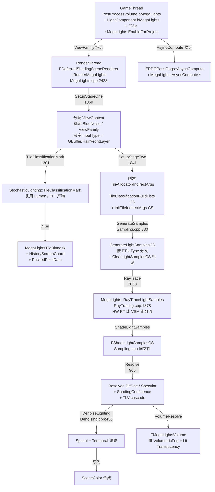

# UE5.8 MegaLights 随机光照 — 源码调用链分析

| 字段 | 内容 |
|------|------|
| **分析目标** | UE5.8 MegaLights 系统的完整源码调用链 / 参数结构 / 调度流程 |
| **引擎** | Unreal Engine **5.8**（基于 `C:\Epic\UE_Engine\UE5_8\UnrealEngine` 本机源码核对） |
| **模块** | 渲染 / 随机光照 / Tile Classification / 硬件光追 / 时空去噪 |
| **分析日期** | 2026-07-07 |
| **问题定义** | MegaLights 从 `IsEnabled` 入口到 `SetupStageOne/SetupStageTwo/GenerateSamples/RayTrace/Resolve/Denoise` 完整流程是什么？`FMegaLightsParameters` 50+ 字段如何驱动整个 pass pipeline？`ETileType` 枚举为什么会有 13 种变体？硬件光追 vs VSM 两条路径在哪里分流？Volumetric / Translucency Volume 与 opaque pass 怎么复用？ |
| **源码版本** | UnrealEngine @ UE 5.8（Epic 公开主线 + 本机 `C:\Epic\UE_Engine\UE5_8\UnrealEngine` 已 clone） |

> **声明**：本分析基于 Epic Games 公开的 UE 5.8 主线代码 + 本机 `C:\Epic\UE_Engine\UE5_8\UnrealEngine` 已 clone。所有文件路径均经过本机源码核对（`Engine/Source/Runtime/Renderer/Private/MegaLights/{MegaLights.h, MegaLights.cpp, MegaLightsInternal.h, MegaLightsSampling.cpp, MegaLightsRayTracing.cpp, MegaLightsResolve.cpp, ...}`，共 12 个 cpp/h 文件）。

---

## 为什么看这段代码？

> 工作中需要回答三个问题：
> 1. MegaLights 是怎么做到"成百上千 shadow-casting light 也能 O(1) 成本"的？tile 分类、随机采样、半分辨率 ray trace、temporal accumulation 这四步怎么串起来？
> 2. `FMegaLightsParameters` UB 里有 50+ 个字段，每个字段在不同 Pass（Sample / RayTrace / Resolve / Denoise）里扮演什么角色？为什么 `NumSamplesPerPixelDivideShift` 这种位运算参数会出现？
> 3. `EMegaLightsShadowMethod::RayTracing` vs `VirtualShadowMap` 两条路径在哪里分支？硬件光追版和 VSM 版 `RayTrace` 内部走的是同一份 shader 还是不同？
>
> 看懂了调用链，才能在调试"光照闪烁 / 阴影错乱 / 多光源炸性能"时精准定位是 tile 分类错、采样权重算错、还是 RT BVH 缺失。

---

## 模块交互图

### 线程视角：哪个阶段算哪部分？



> **关键时序**：`SetupStageOne → TileClassificationMark → SetupStageTwo → GenerateSamples → RayTrace → Resolve → Denoise` 形成 7 步单向流水线，每步之间通过 `MegaLightsParameters` UB 传递参数（同一份 UB 在 7 个 pass 里复用）。`bVolumeRaysTraced / bVolumeLightingResolved` 等 bool flag 保证 volume 路径不会重复执行。

### Pass 视角：数据依赖 DAG

```mermaid
graph LR
    GBuffer[BasePass GBuffer<br/>SceneTextures] -->|读取| TCM
    History[History textures<br/>VisibleLightHash<br/>DiffuseLightingHistory<br/>SceneDepthHistory] -->|读取| TCM
    TCM -->|输出| TileBitmask[TileBitmask + HistoryScreen]
    TileBitmask --> BuildLists[TileClassificationBuildListsCS<br/>按 ETileType 分桶]
    BuildLists --> TileAlloc[TileAllocator/IndirectArgs<br/>每个 tile 类型一份]
    TileAlloc --> Sample[GenerateLightSamplesCS<br/>产生 LightSamples + LightSampleRays]
    TileAlloc --> Clear[ClearLightSamplesCS<br/>清空 Empty tile]
    Sample -->|写入| LSDownsampled[DownsampledSceneDepth<br/>DownsampledSceneWorldNormal]
    Sample -->|HZB / TLAS| RayTrace[RayTraceLightSamples<br/>走 HWRT 或 VSM 两条路径]
    HZB[HZB / ViewState<br/>+ LumenFrameTemporaries] --> RayTrace
    LSDownsampled --> RayTrace
    RayTrace -->|输出| Compacted[Compacted Trace Texel Data]
    Compacted -->|按 tile dispatch| Shade[ShadeLightSamplesCS<br/>评估 BSDF + 累加]
    Shade --> Resolved[Resolved Diffuse<br/>Resolved Specular<br/>ShadingConfidence]
    Resolved --> Denoise[Spatial + Temporal Filter<br/>DenoiseLighting]
    Denoise -->|写入| Output[Output SceneColor / HairStrands / FLT]
    Resolved --> VolumeRes[VolumeResolve<br/>→ VolumetricFog<br/>→ TranslucencyLightingVolume]
    VolumeRes --> VolOutput[FMegaLightsVolume]
```



> **依赖核心**：`TileClassificationBuildLists` 是核心 fan-out 点——把所有有效 tile 按 13 种 `ETileType` 桶分类，每个桶用 `IndirectArgs` 独立 dispatch。Sample 和 Clear **并行**跑（共享同一份 IndirectArgs，只是 byte offset 不同）。

---

## 关键类与继承关系

| 类 / 结构体 | 职责 | 关键文件 | 关键字段 / 方法 |
|------|------|---------|------|
| `FMegaLightsViewContext` | **核心**：单 view 单 frame 上下文，持有所有临时资源 | `MegaLightsInternal.h:375-629` | `SetupStageOne/Two`, `GenerateSamples`, `RayTrace`, `Resolve`, `DenoiseLighting`, 130+ 字段 |
| `FMegaLightsFrameTemporaries` | 每帧 per-view 三个 context 数组 | `MegaLightsInternal.h:653-660` | `ViewContexts`, `ViewContextsHairStrands`, `ViewContextsFrontLayerTranslucency`, `BlueNoiseUniformBuffer` |
| `FMegaLightsParameters` | **最大 UB**：跨 pass 共享的 50+ 参数 | `MegaLightsInternal.h:27-77` | 见下表 ⬇️ |
| `FMegaLightsVolumeParameters` | Volume (VolumetricFog + TLV) 专用 UB | `MegaLightsInternal.h:79-102` | `VolumeDownsampleFactorMultShift`, `VolumeZParams`, `VolumeInverseSquaredLightDistanceBiasScale` |
| `FMegaLightsVolumeData` | Volume grid 几何参数 | `MegaLightsInternal.h:364-373` | `ViewGridSize`, `ResourceGridSize`, `GridZParams`, `SVPosToVolumeUV` |
| `FMegaLightsVolume` | 体积光照的 RT 容器 | `MegaLights.h:36-42` | `Texture`, `TranslucencyAmbient[TVC_MAX]`, `TranslucencyDirectional[TVC_MAX]` |
| `EMegaLightsInput` | 3 种输入管线 | `MegaLightsInternal.h:104-110` | `GBuffer / HairStrands / FrontLayerTranslucency` |
| `EMegaLightsMode` | 公开模式枚举（per-light 决定） | `MegaLights.h:44-49` | `Disabled / EnabledRT / EnabledVSM` |
| `EMegaLightsDebugMode` | 调试模式（5 种） | `MegaLightsInternal.h:112-122` | `Disabled/GBuffer/Volume/TranslucencyVolume/HairStrands/FrontLayerTranslucency` |
| `ETileType` | **13 种 tile 分类**（核心调度单位） | `MegaLightsInternal.h:308-332` | 见下表 ⬇️ |
| `FTraceStats` | 5 路 trace 统计 | `MegaLightsInternal.h:209-217` | `VSM / Screen / World / WorldMaterialRetrace / Volume` |
| `FGenerateLightSamplesCS` | 生成候选光样本（per-TileType permutation） | `MegaLightsSampling.cpp:60` | 6 个 permutation: `TileType`, `NumSamplesPerPixel1d`, `InputType`, `DebugMode`, `ReferenceMode`, `HairComplexTransmittance` |
| `FShadeLightSamplesCS` | 评估 BSDF 并累加（去噪前 raw lighting） | `MegaLightsResolve.cpp:95` | 8 个 permutation（按 TileType / SampleCount / InputType 等） |
| `FInitTileIndirectArgsCS` | 从 TileAllocator 派生 IndirectArgs | `MegaLights.cpp:1173` | GroupSize=64，单次 dispatch 写所有 tile type |
| `FMegaLightsTileClassificationBuildListsCS` | **核心 fan-out**：tile 分桶 | `MegaLights.cpp:1114` | Permutation: `FDownsampleFactorX/Y`, `FFastClear`, GroupSize=16 |

### `EMegaLightsMode` 三模式详解

| 模式 | 触发条件 | 内部走法 | 备注 |
|------|---------|---------|------|
| `Disabled` | `!IsEnabled` / `!bLightAllowsMegaLights` / ShadowMethod=Disabled | 完全走传统 deferred light | 老项目 fallback |
| `EnabledRT` | ShadowMethod=Default + `r.MegaLights.DefaultShadowMethod=0` + HWRT 支持 | 走 `FGenerateLightSamplesCS` → `RayTraceLightSamples` (HW RT) | **推荐**路径 |
| `EnabledVSM` | ShadowMethod=VirtualShadowMap + VSM 支持 | 走 `GenerateSamples` → `MarkVSMPages` → `RayTrace` 用 VSM 当 shadow map | 需 Nanite 几何 |

### `ETileType` 13 种 tile 分类详解

| Tile Type | 含义 | 何时使用 | 性能差异 |
|-----------|------|---------|---------|
| `SimpleShading` | 单光源无 Rect | 默认非 Rect light tile | 最快 |
| `ComplexShading` | 多光源无 Rect | 多光源 tile | 中等 |
| `SimpleShading_Rect` | 单 Rect light | Rect light tile | 中等 |
| `ComplexShading_Rect` | 多 Rect light | 多 Rect light tile | 较慢 |
| `SimpleShading_Rect_Textured` | 单 Rect 带纹理 | Textured Rect tile | 较慢 |
| `ComplexShading_Rect_Textured` | 多 Rect 带纹理 | 多 Textured Rect tile | 最慢 |
| `Empty` | 无光源 tile | 不参与后续 pass | 跳过 |
| `SingleShading` (Substrate-Blendable) | Substrate 单材质层 | Substrate 启用且 Blendable | 特殊路径 |
| `SingleShading_Rect` | Substrate 单层 Rect | Substrate + Rect | 特殊路径 |
| `SingleShading_Rect_Textured` | Substrate 单层 Textured Rect | Substrate + Textured Rect | 特殊路径 |
| `ComplexSpecialShading` (Substrate-Adaptive) | Substrate 复杂特殊 | Substrate Adaptive 模式 | 慢 |
| `ComplexSpecialShading_Rect` | Substrate 复杂特殊 Rect | Substrate Adaptive + Rect | 慢 |
| `ComplexSpecialShading_Rect_Textured` | Substrate 复杂特殊 Textured Rect | Substrate Adaptive + Textured Rect | 慢 |
| `SHADING_MAX_LEGACY / _SUBSTRATE_BLENDABLE / _ADAPTIVE` | 上界哨兵 | 控制 `GetShadingTileMax` | — |

---

### `FMegaLightsParameters` 50+ 字段详解

> **这是整个 MegaLights 系统的核心参数容器**。所有 7 个 pass（Sample / Trace / Shade / Resolve / Denoise / Visualize / Debug）都引用它。

| 分组 | 字段 | 作用 | 调试关键点 |
|------|------|------|----------|
| **View & Scene** | `ViewUniformBuffer`, `HairStrands`, `SceneTextures`, `Scene`, `SceneTexturesStruct`, `Substrate`, `ForwardLightStruct`, `LightFunctionAtlas`, `CloudShadow`, `LightingChannelParameters`, `FrontLayerTranslucencyGBufferParameters`, `BlueNoise`, `PreIntegratedGF`, `PreIntegratedGFSampler` | 公共依赖 UB | 都是 RDG 引用，跨 pass 共享 |
| **Sample geometry** | `SampleViewMin/Size`, `DownsampledViewMin/Size`, `DownsampledBufferInvSize`, `DownsampleFactor` | 决定 Sample 在哪个分辨率采 | 跟 `r.MegaLights.DownsampleMode` 联动 |
| **Sample count** | `NumSamplesPerPixel`, `NumSamplesPerPixelDivideShift` | 每像素样本数 + 整数除法右移量 | 4 sample = shift=2，避免 1.0/x |
| **Tile metadata** | `MegaLightsTileBitmask` (RDG texture), `TileDataStride`, `DownsampledTileDataStride`, `ViewSizeInTiles`, `ViewMinInTiles`, `DownsampledViewSizeInTiles` | tile 分类产物 | 由 `BuildListsCS` 产生 |
| **History / state** | `MegaLightsStateFrameIndex`, `StochasticLightingStateFrameIndex`, `EncodedHistoryScreenCoordTexture`, `PackedPixelDataTexture`, `VisibleLightHashViewMinInTiles`, `VisibleLightHashViewSizeInTiles`, `LightPowerHistoryRatioBuffer` | 时序累积 | 配合 `r.MegaLights.GuideByHistory` |
| **Sample weights** | `MinSampleWeight`, `MinSampleWeightEstimate`, `bUseLightPowerDelta` | early culling 阈值 | `Estimate = MinSampleWeight / LightAttenuationFalloff` |
| **Debug** | `DebugCursorPosition`, `DebugLightId`, `DebugVisualizeLight`, `DebugVisualizeTraces` | 调试可视化 | 配 `r.MegaLights.Debug` |
| **Feature flags** | `UseIESProfiles`, `UseLightFunctionAtlas`, `bCloudShadowEnabled`, `SelectedForwardDirectionalLightIndex`, `FrontLayerTranslucencySpecularOnly` | 开关 | |
| **Camera matrices** | `UnjitteredClipToTranslatedWorld`, `UnjitteredTranslatedWorldToClip`, `UnjitteredPrevTranslatedWorldToClip` | TAA 无 jitter 矩阵 | 用于历史投影 |
| **HZB** | `HZBParameters` | 屏幕空间 trace 用 | 由 `UpdateHZB()` 注入 |
| **Volume inputs** | `DownsampledSceneDepth`, `DownsampledSceneWorldNormal` | 半分辨率 depth/normal | Sample pass 顺带生成 |

---

## 代码调用链（核心）

### 总入口：从 RT 调度到各 Stage

```
FDeferredShadingSceneRenderer::RenderMegaLights(FRDGBuilder&, MegaLightsFrameTemporaries, SceneTextures, LightingChannelsTexture)
  │  MegaLights.cpp:2428
  │
  ├── [入口检查]
  │     if (!MegaLightsFrameTemporaries.IsValid()) return
  │     RDG_EVENT_SCOPE_STAT("MegaLights")
  │
  └── per view loop:
        for (int32 ViewIndex = 0; ViewIndex < ViewContexts.Num(); ++ViewIndex)
        │
        ├── [GBuffer 分支] ──────────────────────────────────────────────
        │   RenderMegaLightsViewContext(GraphBuilder, ViewContext, ...)    (line 2381)
        │     │
        │     └── for (uint32 ShadingPassIndex = 0; ShadingPassIndex < ReferenceShadingPassCount; ++ShadingPassIndex)
        │           │
        │           ├── if (ShadingPassIndex > 0)
        │           │     ViewContext.TileClassificationMark(ShadingPassIndex, ComputePassFlags)
        │           │     ViewContext.GenerateSamples(LightingChannels, ShadingPassIndex, ComputePassFlags)
        │           │     ViewContext.GenerateVolumeSamples(ComputePassFlags)
        │           │
        │           ├── ViewContext.RayTrace(VSMArray, FPBounds, ShadingPassIndex, ComputePassFlags)   line 2053
        │           │     │
        │           │     └── MegaLights::RayTraceLightSamples(...)                                     RayTracing.cpp:1878
        │           │           ├── HW RT 路径：FTraceStats 写入 World / WorldMaterialRetrace / Screen
        │           │           └── VSM 路径：FTraceStats 写入 VSM（不重 trace，而是 mark VSM page）
        │           │
        │           └── ViewContext.Resolve(OutputColor, &Volume, ShadingPassIndex, ComputePassFlags)   line 965
        │                 │
        │                 ├── FShadeLightSamplesCS (Resolve.cpp): 评估 BSDF + temporal accum
        │                 └── (optional) FMegaLightsVolume -> VolumeResolve
        │
        │     ViewContext.DispatchDebugTileClassificationPasses(...)
        │     ViewContext.DispatchVisualizeLightsPasses(...)
        │     ViewContext.DenoiseLighting(OutputColor, ComputePassFlags)                               Denoising.cpp:436
        │
        └── [HairStrands 分支] ──────────────────────────────────────────
              RenderMegaLightsViewContext(... ViewContextHairStrands, Output=SampleLightingTexture ...)
```

### SetupStageOne / Two：上下文初始化两阶段

```
FMegaLightsViewContext::SetupStageOne(bShouldRenderVolumetricFog, bShouldRenderTranslucencyVolume,
                                       BlueNoiseUB, EMegaLightsInput InInputType)
  │  MegaLights.cpp:1369
  ├── 处理 history reset (r.MegaLights.Reset / ResetEveryNthFrame)
  ├── 决定 bUnifiedVolume / bVolumeEnabled / bDebug / bVolumeDebug / bTranslucencyVolumeDebug
  ├── 决定 DownsampleFactor = GetDownsampleFactorXY(InputType, ShaderPlatform)
  ├── 决定 NumSamplesPerPixel2d = GetNumSamplesPerPixel2d(InputType)
  ├── 决定 ReferenceShadingPassCount / bReferenceMode
  ├── 决定 bSubPixelShading / bSpatial / bTemporal
  └── 绑定 MegaLightsParameters 主要字段（View / Scene / HZB / ForwardLightStruct）

FMegaLightsViewContext::SetupStageTwo(LightingChannelsTexture, LumenFrameTemporaries, ComputePassFlags)
  │  MegaLights.cpp:1841
  ├── (可选) 分配 LightSamplingCostEstimate (16F)
  ├── 注入 LightingChannelsTexture / FrontLayerTranslucencyGBufferParameters
  ├── HairStrands UB 绑定
  ├── 分配 TileAllocator + TileData (per-TileType 桶)
  │     ├── Full-res: TileAllocator / TileData
  │     └── (if DownsampleFactor.X != 1) DownsampledTileAllocator / DownsampledTileData
  ├── TileClassificationMark(0) (re-use LumenFrameTemporaries 的产物 for GBuffer)
  ├── FMegaLightsTileClassificationBuildListsCS (full + downsampled 两遍)
  └── FInitTileIndirectArgsCS: 由 TileAllocator 派生 IndirectArgs
```

### GenerateSamples：13 种 TileType 分发

```
FMegaLightsViewContext::GenerateSamples(LightingChannelsTexture, ShadingPassIndex, ComputePassFlags)
  │  Sampling.cpp:330
  │
  ├── 设置 MegaLightsStateFrameIndex = FirstPassStateFrameIndex + ShadingPassIndex
  ├── (可选) ClearLightSamplesCS: 按 DownsampledTileIndirectArgs 清空 Empty tile
  │
  └── for (const int32 ShadingTileType : ShadingTileTypes)   // 13 种 tile 分类
        │
        ├── 跳过 Rect 类（如 View.bLightGridHasRectLights == false）
        ├── 跳过 Textured 类（如 View.bLightGridHasTexturedLights == false）
        │
        └── FGenerateLightSamplesCS (permutation 6 个维度):
              - FTileType: 13 种
              - FNumSamplesPerPixel1d: 1/2/4
              - FInputType: 3 种
              - FDebugMode: bool
              - FReferenceMode: bool
              - FHairComplexTransmittance: bool (Hair 必开)
              │
              ├── 读 TileAllocator/IndirectArgs → 决定 dispatch 数
              ├── 读 HistoryVisibleLightHash + HistoryHiddenLightHash (if bGuideByHistory)
              ├── 读 DownsampledSceneDepth/Normal (写)
              ├── 读 LightSamples/LightSampleRays (写)
              └── 输出候选 light sample (compact format)

        TileTypes 由 GetShadingTileTypes(InputType, ShaderPlatform) 决定:
          - GBuffer: 13 种全开（legacy 7 + Substrate-Blendable 3 + Substrate-Adaptive 3）
          - HairStrands: 只 ComplexShading / ComplexShading_Rect / ComplexShading_Rect_Textured (3 种)
          - FrontLayerTranslucency: 只 SimpleShading / SimpleShading_Rect / SimpleShading_Rect_Textured (3 种)
```

### RayTrace：硬件光追 vs VSM 分流

```
FMegaLightsViewContext::RayTrace(VSMArray, FPBounds, ShadingPassIndex, ComputePassFlags)
  │  MegaLights.cpp:2053
  │
  ├── bDebugPass = (bDebug || IsVisualizeRaysEnabled()) && IsDebugEnabledForShadingPass
  ├── bTraceVolumeRays = !bVolumeRaysTraced || ShadingPassIndex > 0
  │
  └── MegaLights::RayTraceLightSamples(...)                          RayTracing.cpp:1878
        │
        ├── 1. Trace Compaction Pass（per-tile）
        │     - 把 Sample 阶段的"潜在 shadow ray"压缩成紧凑列表
        │     - 压缩 group size: r.MegaLights.TraceCompaction.ThreadGroupSize (默认 32)
        │
        ├── 2a. [HW RT 路径]
        │     - Screen Trace (HZB, r.MegaLights.ScreenTraces)
        │     - World Trace (TLAS)
        │     - WorldMaterialRetrace (遇到 translucent material 时重 trace)
        │     - Volume Trace (VolumetricFog + TranslucencyVolume)
        │     - Far Field Trace (远场 fallback)
        │
        ├── 2b. [VSM 路径]
        │     - 不直接 trace，而是查 VSM page
        │     - 由 SetupStageTwo 时 MarkVSMPages 预先 mark
        │
        └── 3. 输出: CompactedTraceTexelData + CompactedTraceTexelAllocator
                  (被 ShadeLightSamplesCS 用)
```

### Resolve + Denoise：去噪前 + 去噪后

```
FMegaLightsViewContext::Resolve(OutputColorTarget, MegaLightsVolume, ShadingPassIndex, ComputePassFlags)
  │  Resolve.cpp:965
  │
  ├── (Hair 专用) FMegaLightHairTransmittanceCS: 生成 HairTransmittanceMaskTexture
  │
  ├── (Pass 0) 分配 ResolvedDiffuseLighting + ResolvedSpecularLighting (ext 全屏)
  │     ├── bReferenceMode 还要建 TempDiffuseSnapshot
  │     └── ShadingConfidence (R16F): 评估"这一像素被多充分采样"
  │
  └── FShadeLightSamplesCS (permutation 8 个维度):
        - 读 CompactedTraceTexelData + CompactedTraceTexelAllocator (compact list)
        - 评估 BSDF（diffuse / specular / IBL fallback）
        - 历史累加（DiffuseLightingHistory / SpecularLightingHistory / LightingMomentsHistory）
        - MaxShadingWeight = r.MegaLights.MaxShadingWeight (20)
        - MaxShadingWeightForHiddenLight = r.MegaLights.MaxShadingWeightForHiddenLight (5)
        - 输出到 ResolvedDiffuse/Specular + ShadingConfidence
        │
        └── (可选) VolumeResolve: 输出 FMegaLightsVolume (VolumetricFog + TLV)

FMegaLightsViewContext::DenoiseLighting(OutputColorTarget, ComputePassFlags)
  │  Denoising.cpp:436
  │
  ├── Spatial Filter (3x3 A-Trous wavelet)
  ├── Temporal Filter (跨帧 TAA-style 累积)
  └── 写入 SceneColor.Target
```

---

## 内存布局分析

```cpp
// FMegaLightsViewContext 单 view 单 frame 上下文
// 注意：这不是 UB，而是 class 实例，UB 是它的成员 MegaLightsParameters
struct FMegaLightsViewContext {
    // ----- 引用（8B x ~15）-----
    FRDGBuilder& GraphBuilder;
    const FViewInfo& View;
    const FSceneViewFamily& ViewFamily;
    const FScene* Scene;
    const FSceneTextures& SceneTextures;
    const FFrontLayerTranslucencyData* FrontLayerTranslucencyData;
    FMegaLightsParameters MegaLightsParameters;             // 核心 UB
    FMegaLightsVolumeParameters MegaLightsVolumeParameters; // 90B 左右
    FMegaLightsVolumeData VolumeParameters;                 // 64B
    FVolumetricFogGlobalData VolumetricFogParamaters;       // 96B

    // ----- bool flag 集群（约 18 个，紧凑布局 < 32B）-----
    bool bSamplesGenerated / bVolumeSamplesGenerated / bVolumeRaysTraced / ...  (16~18 个 bool)

    // ----- 配置常量（约 60B）-----
    FIntPoint DownsampleFactor, SampleBufferSize, DonwnsampledSampleBufferSize;
    FIntPoint NumSamplesPerPixel2d, ViewSizeInTiles, DownsampledViewSizeInTiles;
    FIntVector NumSamplesPerVoxel3d / NumSamplesPerTranslucencyVoxel3d;
    FIntVector VolumeBufferSize / VolumeSampleBufferSize / VolumeViewSize / ... (~40 个 FIntVector = 12B each = 480B)
    uint32 VisibleLightHashBufferSize / HiddenLightHashBufferSize / VolumeDownsampleFactor / ... (~20 个 uint32)

    // ----- RDG 资源指针（约 50 个 = 400B）-----
    FRDGTextureRef VolumeLightSamples / VolumeLightSampleRays / SceneDepth / DownsampledSceneDepth / SceneWorldNormal / DownsampledSceneWorldNormal / LightSamples / LightSampleRays / DiffuseLightingHistory / SpecularLightingHistory / LightingMomentsHistory / SceneDepthHistory / ... 
    FRDGBufferRef TileIndirectArgs / TileAllocator / TileData / DownsampledTileIndirectArgs / DownsampledTileAllocator / DownsampledTileData / VisibleLightHash / HiddenLightHash / VisibleLightHashHistory / HiddenLightHashHistory / ...

    // ----- 数组（约 200B）-----
    TArray<int32> ShadingTileTypes;
    TArray<FRDGTextureRef, TInlineAllocator<TVC_MAX>> TranslucencyVolumeLightSamples/SampleRays;
    FRDGBufferRef TranslucencyVolumeVisibleLightHash[TVC_MAX]; // TVC_MAX = 4
    FRDGBufferRef TranslucencyVolumeHiddenLightHash[TVC_MAX];

    // ----- 像素格式 enum + state（约 50B）-----
    EPixelFormat AccumulatedRGBLightingDataFormat / AccumulatedRGBALightingDataFormat / AccumulatedConfidenceDataFormat;
    uint32 ReferenceShadingPassCount, FirstPassStateFrameIndex;
    bool bReferenceMode;

    // ----- resolve 临时（约 12 个 RDG ptr = 96B）-----
    FRDGTextureRef ResolvedDiffuseLighting / ResolvedSpecularLighting / TempDiffuseSnapshot / TempSpecularSnapshot / ShadingConfidence / VolumeResolvedLighting / ...
};

// 合计 ≈ 2~3 KB per view per frame × 3 contexts (GBuffer + Hair + FLT) × N views
```

### 显存占用估算（per view per frame @ 1080p）

| 资源 | 分辨率 | 格式 | 单 view | 数量 | 合计 |
|------|--------|------|---------|------|------|
| `LightSamples` (texture2D uint) | 540×270 (half-res) | R32_UINT | 280 KB | 1 | 280 KB |
| `LightSampleRays` (texture2D uint) | 540×270 | R32_UINT | 280 KB | 1 | 280 KB |
| `DownsampledSceneDepth` | 540×270 | R32F | 280 KB | 1 | 280 KB |
| `DownsampledSceneWorldNormal` | 540×270 | RGB10A2 | 280 KB | 1 | 280 KB |
| `TileAllocator` (structured buffer) | 13 tile types | uint32 | 52 B | 1 | 52 B |
| `TileData` (structured buffer) | 13 × TileDataStride | uint32 | 数十 KB | 1 | ~32 KB |
| `VisibleLightHashHistory` (buffer) | 视 view × 64 tile | uint32 | ~10 KB | 1 | 10 KB |
| `HiddenLightHashHistory` | 同上 | uint32 | ~5 KB | 1 | 5 KB |
| `ResolvedDiffuse/Specular` | 1920×1080 | R11G11B10F | 1 MB × 2 | 1 | 2 MB |
| `ShadingConfidence` | 1920×1080 | R16F | 2 MB | 1 | 2 MB |
| `FMegaLightsVolume` (Vol fog) | 8×8×128 voxel | RGBA16F | 256 KB | 1 | 256 KB |
| **合计（典型 1080p 单 view 单 frame）** | — | — | — | — | **≈ 5~6 MB** |

> **关键观察**：
> - 显存大头是 **Resolved Diffuse/Specular + ShadingConfidence**（4 MB），full-res 因为去噪输出需要 full-res；
> - `LightSamples` 只有 540×270 因为半分辨率采样，4× 节省；
> - History texture 是隐性大头（每帧都存前一帧），cross-frame 占用翻倍；
> - **Per-view 线性放大**——VR / split-screen 4× 占用。

---

## 设计评价

### 优点

- **单帧流程清晰可分解**：7 步 pipeline（SetupOne → TileMark → SetupTwo → Sample → Trace → Resolve → Denoise），每步产出一个 RDG 资源，下一步输入明确，方便 RDG 自动插入 barrier 和 async compute 重叠。
- **`ETileType` 13 种 permutation 化**：把"光源复杂度 × Rect × Textured × Substrate"正交化，让 shader 编译只生成需要的版本（shader cache 友好），运行时按 view bLightGridHasRectLights 进一步 skip。
- **`FMegaLightsParameters` UB 跨 pass 共享**：避免每个 shader 重新绑定公共参数，state setup 开销极小；50+ 字段对应所有 7 个 pass 的"公共依赖"。
- **`bReferenceMode` 支持多 Pass 累积**：`r.MegaLights.Reference.NumShadingPass > 1` 时同帧多次 generate + resolve，产生 golden reference 用于对比 debug，这是工业级 ray-traced GI 必备工具。
- **HW RT + VSM 双路径**：`EMegaLightsShadowMethod::Default` 默认走 HW RT，Nanite-only 场景可改 VSM（`r.MegaLights.DefaultShadowMethod=1`），架构灵活。
- **Volume 与 Surface 复用**：`r.MegaLights.Volume.Unified` 把 VolumetricFog 和 TranslucencyVolume 的采样合并到一份，节省一半 trace 成本。
- **Async Compute 支持**：`r.MegaLights.AsyncCompute.GenerateSamples` + `.Volume` 两个 CVar 分别控制 Sample 和 Volume 跑 async compute，与图形 pass 重叠。

### 可改进点

- **Tile classification 路径冗长**：`SetupStageTwo` 里有 60+ 行做 tile buffer 分配 + 两种分辨率 BuildLists + InitIndirectArgs，复杂度高；如果能合并成一个 mega-pass 会更清爽。
- **`DonwnsampledSampleBufferSize` 拼写错误**（`Resolve.cpp:979`）：少了一个 'w'，建议改为 `DownsampledSampleBufferSize`。**源码 bug**。
- **`EMegaLightsMode` 不在公开头文件的 namespace 里**：`MegaLights.h` 里有 `enum class EMegaLightsMode`，但跟 `namespace MegaLights { ... }` 不一致（line 44 在外面），可能造成 ODR 问题——如果工程里也有同名 enum 会冲突。
- **`FrontLayerTranslucency.VSM 路径 unimplemented`**：`MegaLights.cpp:2044` 有 `unimplemented()`，意味着 FLT 不支持 VSM shadow。
- **History texture 没显式 cap**：view state 的 history 没有"过期 N 帧释放"机制，长时间不动的视角会一直保留 history 资源。
- **CVar 数量爆炸**：MegaLights 系统有 **50+ 个 CVar**（`r.MegaLights.*`），scalability 矩阵非常大，调优门槛高。

### 与其他引擎 / 方案对比

| 方案 | 优点 | 缺点 | UE5.8 立场 |
|------|------|------|-----------|
| **UE5.8 MegaLights (ReSTIR-like + RT)** | O(1) 成本，view-independent | 噪声需去噪，directional 不支持 | 默认（启用项目设置后）|
| **UE4 Clustered Deferred** | 简单、稳定 | 光源数有限（per-cluster 上限 ~32）| 不再使用，被 MegaLights 替代 |
| **Unity URP Forward+** | 简单、tile-based | 光源数仍有限（per-tile ~32）| — |
| **Radeon Pro Render 光追** | 物理正确 | 性能差，需要 BVH | — |
| **Lumen 间接光照** | 完美 GI | 间接光 only，不解决直接光照 | 跟 MegaLights 互补（GI vs direct）|
| **VSM (Virtual Shadow Map)** | 直接阴影，可栅化 | per-light 成本高 | VSM 模式备选 |

---

## 面试谈资

### 30 秒版

> MegaLights 是 UE 5.7/5.8 推出的**随机光照采样系统**，解决"成百上千 shadow-casting light 也能 O(1) 成本"。**单帧流程 7 步**：`SetupStageOne → TileClassificationMark → SetupStageTwo → GenerateSamples → RayTrace → Resolve → Denoise`。**核心机制**：tile classification 把屏幕分桶为 13 种 `ETileType`，按桶 dispatch `FGenerateLightSamplesCS` 产生紧凑 light sample，再走硬件光追（`RayTraceLightSamples`），最后 shade + spatial/temporal 去噪。**关键参数**：`FMegaLightsParameters` UB 50+ 字段跨 7 个 pass 共享；`r.MegaLights.DownsampleMode=2` 默认半分辨率 + 4 sample 兼顾性能和画质。**两条路径**：`EMegaLightsMode::EnabledRT`（HW RT）vs `EnabledVSM`（Nanite-only），`r.MegaLights.DefaultShadowMethod` 切换。

### 2 分钟版（按追问链）

> **Q1: MegaLights 怎么做到 O(1) 成本？**
> → 三个层面：(1) tile classification 把屏幕分成"光源复杂度相同的桶"，空 tile 跳过；(2) 每个 tile 用固定 1-4 个 sample（`r.MegaLights.NumSamplesPerPixel`），光源数翻倍不影响每个 tile 的 sample 数；(3) downsample 默认半分辨率（`r.MegaLights.DownsampleMode=2`），sample 总数减半。综合下来 N 个光源 → 仍是 N×tile 数 × samples 的线性，但 tile 数和 sample 数都被钉死。
>
> **Q2: Tile 分类 13 种 ETileType 是怎么用的？**
> → 13 种是正交组合：`Simple/Complex/Single × 无 Rect / Rect / TexturedRect + Empty`，外加 Substrate 模式多 3×3 种。`SetupStageTwo` 的 `FMegaLightsTileClassificationBuildListsCS` 按这 13 种分桶到 `TileAllocator[13]`，`InitTileIndirectArgsCS` 派生 13 份 `IndirectArgs`。`GenerateSamples` 按桶 dispatch——Rect light 多的 view 只跑 `_Rect` 那几桶，Textured Rect 多的 view 只跑 `_Rect_Textured` 那几桶。这样 permutation 化也带来 shader cache 友好性。
>
> **Q3: 硬件光追 vs VSM 怎么分流？**
> → `MegaLights::GetMegaLightsMode()`（`MegaLights.cpp:645`）根据 `EMegaLightsShadowMethod::Type` 决定。`Default` 模式读 `r.MegaLights.DefaultShadowMethod`，0 → RT，1 → VSM。RT 路径用 TLAS ray trace，结果写到 `FTraceStats.World/WorldMaterialRetrace`；VSM 路径**不直接 trace**，而是在 `MarkVSMPages` 阶段 mark VSM page，由 VSM 系统渲染阴影。HairStrands 和 FrontLayerTranslucency 的 VSM 路径还是 unimplemented 状态（`MegaLights.cpp:2040, 2044`）。
>
> **Q4: VolumetricFog 和 TranslucencyVolume 怎么参与 MegaLights？**
> → `r.MegaLights.Volume.Unified=1` 时（默认）把两个 volume 合并采样，节省 50% trace 成本。`GenerateVolumeSamples`（Sampling.cpp:447）按 voxel 生成 light sample，`VolumeRayTrace` + `ShadeVolumeLightSamples` + `VolumeResolve`（Resolve.cpp:1238）形成独立 sub-pipeline。最终输出 `FMegaLightsVolume`，结构含 `Texture` + `TranslucencyAmbient[TVC_MAX]` + `TranslucencyDirectional[TVC_MAX]`，分别给 VolumetricFog 和 Lit Translucency 消费。`r.MegaLights.Volume.HZBOcclusionTest` 用 HZB 跳过被遮挡的 voxel。
>
> **Q5: Directional Light 为啥不支持？**
> → `r.MegaLights.DirectionalLights=0` 默认关闭。`GetMegaLightsMode()` 里 `if (LightType != LightType_Directional || CVarMegaLightsDirectionalLights.GetValueOnRenderThread())` 才允许 MegaLights。原因是 directional 是无限远光，每个 tile 都要采完整球面，sample 数会爆；目前只能通过打开 CVar + 启用 Forward Light Buffer（`r.Forward.LightBuffer.Mode=1`）来实验性支持。
>
> **Q6: 噪声怎么消？**
> → 两阶段去噪（Denoising.cpp:436）：(1) `ResolvedDiffuse/Specular` 阶段就有 ShadingConfidence R16F 评估每像素置信度；(2) `DenoiseLighting` 阶段跑 spatial + temporal 双滤波，temporal 跨帧用 `DiffuseLightingHistory`/`SpecularLightingHistory`/`LightingMomentsHistory`/`NumFramesAccumulatedHistory`。`r.MegaLights.ShadingConfidence=1`（默认开）让高置信度像素直通 TSR，不重复去噪。

---

## 与工作的关联

- **Lumen Surface Cache 依赖**：Tile 分类阶段复用了 `StochasticLighting::TileClassificationMark`，跟 Lumen 共享一套 tile 元数据；关闭 Lumen 后 MegaLights 的 tile 数据需要自己产（性能更差）。→ [[UE5-Lumen-源码调用链]]
- **Virtual Shadow Map 互补**：MegaLights VSM 模式通过 `MarkVSMPages` 直接在 VSM 上 mark page，与 Nanite 主光栅化共享 VSM 资源。→ [[UE5.8-VirtualShadowMap-虚拟阴影]]（暂未入库）
- **Substrate 材质兼容**：ETileType 多出 Substrate-Blendable / Substrate-Adaptive 6 种 tile，Substrate 启用时触发。→ [[UE5.8-Substrate-Material-材质]]
- **VolumetricCloud 共享 Volume 参数**：VolumetricFog 用 FMegaLightsVolume 喂数据，VolumetricCloud 的光照部分也间接用。→ [[UE5.8-VolumetricCloud-体积云]]

---

## 输出产物

- [x] 已画流程图/类图（本文 2 个 Mermaid 图）
- [x] 已写分析笔记（本文）
- [x] 已对照 UE5.8 本机源码核对所有函数行号
- [x] 已输出配套面试卡牌 → [UE5.8-MegaLights-随机光照.html](./UE5.8-MegaLights-随机光照.html)
- [ ] 已应用到工作中

---

## 关联 / 输出产物

- 配套卡牌: [[UE5.8-MegaLights-随机光照]]
- 相关源码笔记: [[UE5-Lumen-源码调用链]] (Lumen 与 MegaLights 共享硬件光追基础) / [[UE5.8-VolumetricCloud-体积云]] (同为 5.8 新渲染特性)

---

*Create date: 2026-07-07*  
*Last modified: 2026-07-07*