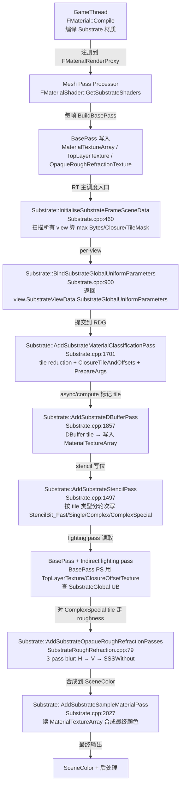
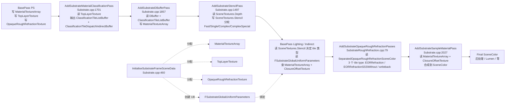

# UE5.8 Substrate 材质系统 — 源码调用链分析

| 字段 | 内容 |
|------|------|
| **分析目标** | UE5.8 Substrate（Strata 继任者）从材质分类到 Opaque Rough Refraction 的完整 pipeline、tile 分类机制、stencil bit 分配、`FSubstrateGlobalUniformParameters` 与 `FSubstrateSceneData`/`FSubstrateViewData` 的关系 |
| **引擎** | Unreal Engine **5.8**（基于 `C:\Epic\UE_Engine\UE5_8\UnrealEngine` 本机源码核对） |
| **模块** | 渲染 / 材质 / GBuffer 替代 / Substrate Closure 图 |
| **分析日期** | 2026-07-07 |
| **问题定义** | Substrate 如何把像素分成 4 类 tile（Simple / Single / Complex / ComplexSpecial）？StencilBit_Fast/Single/Complex/ComplexSpecial 四个 16/32/64/80 stencil bit 怎么配合分类 pass？`FSubstrateGlobalUniformParameters` 14+ 字段分别对应哪个 GPU 资源？Opaque Rough Refraction 是 basepass 内的特殊 tile 还是独立 post pass？`FSubstrateSceneData::PersistentMaxBytesPerPixel` 与 `EffectiveMaxBytesPerPixel` 为什么拆成两个？ |
| **源码版本** | UnrealEngine @ UE 5.8（Epic 公开主线 + 本机 `C:\Epic\UE_Engine\UE5_8\UnrealEngine` 已 clone） |

> **声明**：本分析基于 Epic Games 公开的 UE 5.8 主线代码 + 本机 `C:\Epic\UE_Engine\UE5_8\UnrealEngine` 已 clone。引用文件路径以源码核对为准（`Engine/Source/Runtime/Renderer/Private/Substrate/Substrate.{h,cpp}`、`SubstrateRoughRefraction.cpp`、`SubstrateVisualize.cpp`、`Engine/Source/Runtime/RenderCore/Public/Rendering/SubstrateDefinitions.h`）。

---

## 为什么看这段代码？

> 工作中需要回答三个问题：
> 1. UE5.8 的 Substrate 取代了哪个老的材质系统？（答：取代 legacy GBuffer slot model 和 Strata-pre，把材质建模从"固定 GBuffer 槽位"换成"无限层 closure 图"）。4 类 tile 的判定逻辑在哪个 shader / 哪个 CVar？
> 2. `FSubstrateGlobalUniformParameters` 里 `MaterialTextureArray` / `TopLayerTexture` / `OpaqueRoughRefractionTexture` / `ClosureOffsetTexture` / `SampledMaterialTexture` 这几个纹理各自存什么？为什么拆这么多？
> 3. Opaque Rough Refraction 究竟在 basepass 期间独立走、还是 basepass 之后做 post？`StencilBit_Fast=0x10 / Single=0x20 / Complex=0x40 / ComplexSpecial=0x80` 四个 stencil bit 跟 tile 类型怎么对应？
>
> 看懂 Substrate 才能在排查 "材质黑边 / 折射错位 / 分类失败导致全 Complex tile 性能崩" 时精准定位是 classification pass 没算对、还是 closure tile 索引没生成、还是 refraction 没合成。

---

## 模块交互图

### 线程视角：哪个阶段算哪部分？



> **关键时序**：BasePass 先把材质树写到 `MaterialTextureArray`，然后 Classification pass 在 tile 粒度上分桶，DBuffer + Stencil + Lighting 各按 tile 单独 dispatch，Opaque Rough Refraction 是 **basepass 期间**独立 tile 的合成（在 final lighting 之后），Sample Material pass 才是真"采样材质到 SceneColor"的最后一步。

### Pass 视角：5 个 Pass 的依赖链



> **依赖核心**：`InitialiseSubstrateFrameSceneData` 是**唯一不依赖其他 Pass**的资源分配入口；其余 5 个 Pass 都依赖它产生的 `FSubstrateSceneData` 资源。`OpaqueRoughRefraction` 不是 post pass —— 它的输入是 BasePass 期间被分类为 `EOpaqueRoughRefraction` tile 的像素，输出在 `AddSubstrateSampleMaterialPass` 之前的 final lighting 阶段。

---

## 关键类与继承关系

| 类 / 结构体 | 职责 | 关键文件 | 关键字段 / 方法 |
|------|------|---------|------|
| `FSubstrateCommonParameters` | Substrate 通用的 6 个标量 UB，包含 tile-shading 必要配置 | `Substrate.h:23-32` | `MaxBytesPerPixel`、`MaxClosurePerPixel`、`bRoughDiffuse`、`PeelLayersAboveDepth`、`bRoughnessTracking`、`bStochasticLighting` |
| `FSubstrateBasePassUniformParameters` | BasePass PS 用的 Substrate 子集 + UAV | `Substrate.h:34-41` | `Common`、2 个 slice 索引、2 个 UAV（MaterialTextureArray / OpaqueRoughRefractionTexture） |
| `FSubstrateForwardPassUniformParameters` | Forward / Mobile 用 Substrate UB | `Substrate.h:43-49` | `Common` + FirstSliceStoringSubstrateSSSData + 2 个只读 SRV |
| `FSubstrateTileParameter` | 单 tile dispatch 用的 buffer + offset | `Substrate.h:51-57` | `TileListBuffer` SRV、`TileListBufferOffset`、`TileEncoding`、`TileIndirectBuffer`（IndirectArgs） |
| `FSubstrateGlobalUniformParameters` | **核心 14+ 字段 UB**，所有 Substrate pass 共享 | `Substrate.h:63-75` | 见下表 ⬇️（RENDERER_API 标记跨模块可见） |
| `FSubstratePublicParameters` | 外部 shader 可见的只读 Substrate UB | `Substrate.h:77-82` | `Common` + FirstSliceStoringSubstrateSSSData + TopLayer / MaterialTexture SRV |
| `FSubstratePublicGlobalUniformParameters` | `FSubstratePublicParameters` 的全局 UB wrapper | `Substrate.h:84-87` | 仅含 `Public` 子结构 |
| `FSubstrateSceneData` | **场景级** Substrate 资源 + 状态，跨所有 view 共享 | `Substrate.h:89-141` | 21 个字段：PersistentMaxBytesPerPixel vs EffectiveMaxBytesPerPixel、`MaterialTextureArray`/`TopLayerTexture`/`OpaqueRoughRefractionTexture` RDG refs、closure slice 索引、`SubstratePublicGlobalUniformParameters` |
| `FSubstrateViewData` | **per-view** Substrate 状态 + dispatch buffer | `Substrate.h:144-170` | `MaxBytesPerPixel`、`UsesTileTypeMask`（8bit，1 bit/tile type）、`TileCount`、`TileEncoding`、`ClassificationTileListBuffer`、`ClosureTileBuffer`、4 个 dispatch/indirect buffers |
| `FSubstrateViewDebugData` | Substrate pixel/system debug readback 队列 | `Substrate.h:175-194` | `PixelMaterialDebugDataReadbackQueries`、`SystemInfoDebugDataReadbackQueries`、Transient debug buffers |
| `EStencilPassStage` enum | 控制 Stencil pass 调度时机的 4 个阶段 | `Substrate.h:200-205` | `None` / `Standalone` / `StandaloneAdaptive` / `DuringIndirectLighting` |
| `FSubstrateTilePassVS` | 共享 tile VS，所有 tile dispatch 都用 | `Substrate.h:235-258` | 3 个 permutation：`FEnableDebug`、`FEnableTexCoordScreenVector`、`FClassificationTileSize16` |
| `FSubstrateTileType` (in `SubstrateDefinitions.h`) | tile 类型枚举（4 主 + 5 衍生 = 9 类） | `RenderCore/.../SubstrateDefinitions.h` | `ESimple` / `ESingle` / `EComplex` / `EComplexSpecial` / `EOpaqueRoughRefraction` / `EOpaqueRoughRefractionSSSWithout` / `EDecalSimple` / `EDecalSingle` / `EDecalComplex` |

### `FSubstrateCommonParameters` 6 参数详解

| 参数 | 类型 | 含义 | 调试 |
|------|------|------|------|
| `MaxBytesPerPixel` | uint32 | 当前 view/scene 的每像素 closure 数据最大字节数（材质编译期给出，scene 内取 max） | 大 → 内存吃紧；小 → 材质会被截断 |
| `MaxClosurePerPixel` | uint32 | 每像素最大 closure 数（closure = 一个材质的着色层） | UE 限制 ≤8（static_assert 在 `Substrate.cpp:102`），但实际 closure 树深度无限 |
| `bRoughDiffuse` | uint32 | 是否启用 rough diffuse 模式（0/1） | 控制 Slab BSDF 的 Lambert 近似开关 |
| `PeelLayersAboveDepth` | uint32 | debug 用的 layer 剥皮深度（`r.Substrate.Debug.PeelLayersAboveDepth` 注入） | 调试时逐步剥开 closure 层查看 |
| `bRoughnessTracking` | uint32 | 是否让上层 roughness 传递影响下层（模拟散射） | 默认 1，由 `r.Substrate.Debug.RoughnessTracking` 控制 |
| `bStochasticLighting` | uint32 | 启用 stochastic light sampling 减少 light count（`r.Substrate.StochasticLighting.Active` 注入） | 性能优化项 |

### `FSubstrateGlobalUniformParameters` 14 字段详解

| 参数 | 类型 / 含义 | 用途 |
|------|------|------|
| `Common` | `FSubstrateCommonParameters`（6 字段） | 上述 6 字段 |
| `SliceStoringDebugSubstrateTreeData` | int32 | debug 用的 closure tree dump slice（默认 -1） |
| `FirstSliceStoringSubstrateSSSData` | int32 | 第一个 SSS slice 索引（>0 时启用 SSS 拆分） |
| `TileSize` | uint32 | tile 边长（`SUBSTRATE_TILE_SIZE = 8`） |
| `TileSizeLog2` | uint32 | tile 边长的 log2（用于位移运算替代除法） |
| `TileCount` | FIntPoint | (width/SUBSTRATE_TILE_SIZE, height/SUBSTRATE_TILE_SIZE) |
| `MaterialTextureArray` | `Texture2DArray<uint>` | **核心**：所有 closure 数据按 uint packed 写入的 2D 纹理数组，slice 索引 = closure stack |
| `TopLayerTexture` | `Texture2D<SUBSTRATE_TOP_LAYER_TYPE>` | 顶层材质 BSDF（normal/roughness/baseColor 等），分类 pass 直接读它 |
| `OpaqueRoughRefractionTexture` | `Texture2D<float3>` | 单独存储需要折射的 opaque 像素的 RGB，rough refraction pass 读 |
| `ClosureOffsetTexture` | `Texture2D<uint>` | closure 索引的偏移表，告诉 shader "从这个 closure 索引开始读 closure tile buffer" |
| `ClosureTileBuffer` | `Buffer<uint>` SRV | closure tile 列表（仅 Complex / ComplexSpecial 用） |
| `ClosureTileCountBuffer` | `Buffer<uint>` SRV | 每个 tile 的 closure 计数 |
| `SampledMaterialTexture` | `Texture2D<uint4>` | Sample Material pass 输出的材质数据最终 buffer |

---

## 代码调用链（核心）

### 总入口：从 `InitialiseSubstrateFrameSceneData` 出发

```
Substrate::InitialiseSubstrateFrameSceneData(FRDGBuilder& GraphBuilder, FScene& Scene, FViewFamilyInfo& ViewFamily, TConstArrayView<FViewInfo*> AllViews, EShaderPlatform ShaderPlatform)
  │  Substrate.cpp:460
  │
  ├── 重置 FSubstrateSceneData（保留 PersistentMax* / UsesTileTypeMask）
  │
  ├── 扫描所有 view 算:
  │     ViewsMaxBytesPerPixel / ViewsMaxClosurePerPixel
  │     PersistentMaxBytesPerPixel（仅 primary view，跨帧单调递增）
  │     UsesTileTypeMask |= 每个 view 的 mask
  │     bUseDBufferPass / bNeedsClosureOffsets / bNeedsUAV
  │
  ├── 选择 Material Buffer 分配模式（CVar `r.Substrate.AllocationMode`）:
  │     0: 按当前 view 需求分配（最紧）
  │     1: max(views, persistent) — 只增不减，避免 realloc 抖动（默认）
  │     2: 按 platform setting 分配
  │
  ├── 分配 RDG 资源:
  │     - MaterialTextureArray (Texture2DArray<uint>, MaterialBufferSizeXY, EffectiveMaxBytesPerPixel slices)
  │     - TopLayerTexture (Texture2D<SUBSTRATE_TOP_LAYER_TYPE>, MaterialBufferSizeXY)
  │     - OpaqueRoughRefractionTexture (Texture2D<float3>, MaterialBufferSizeXY)
  │     - ClosureOffsetTexture (Texture2D<uint>, TileCount)
  │     - SampledMaterialTexture (Texture2D<uint4>, ViewRect)
  │
  └── 为每个 view 创建 FSubstrateGlobalUniformParameters 并 cache 到 View.SubstrateViewData.SubstrateGlobalUniformParameters

  ─── 后续帧 RT 主调度 ─────────────────────────────────────
  Substrate::BindSubstrateGlobalUniformParameters(const FViewInfo& View)
  │  Substrate.cpp:900
  └── 返回 view.SubstrateViewData.SubstrateGlobalUniformParameters（零拷贝）

  Substrate::AddSubstrateMaterialClassificationPass(FRDGBuilder&, FSceneTextures&, TArray<FViewInfo>&)
  │  Substrate.cpp:1701
  ├── RDG_EVENT_SCOPE("Substrate::MaterialClassification")
  ├── [Stage 1: Tile Reduction]
  │     FSubstrateMaterialTileClassificationPassCS
  │       - Permutations: FCmask / FWaveOps / FDecal / FClassificationTileSize16
  │       - 读 TopLayerTexture (SRV) + TopLayerCmaskTexture (decode from CMask)
  │       - 写 MaterialTextureArray header (clear)
  │       - 写 ClassificationTileDrawIndirectBuffer
  │       - 写 ClassificationTileListBuffer (per tile type)
  │       - 写 ClassificationTileDispatchIndirectBuffer
  ├── [Stage 2: Closure tile dispatch args conversion]
  │     AddSubstrateMaterialClassificationIndirectArgsPass(GraphBuilder, View, PassFlags)
  │       Substrate.cpp:1678
  ├── [Stage 3: ClosureTile + Offset 计算]
  │     对 ComplexSpecial 和 Complex tile:
  │       FSubstrateClosureTilePassCS  (permutation: FWaveOps)
  │         - 读 ClassificationTileListBuffer[TileType]
  │         - 写 ClosureOffsetTexture
  │         - 写 ClosureTileCountBuffer (UAV, clear 后递增)
  │         - 写 ClosureTileBuffer
  └── [Stage 4: Dispatch args 转换]
        FSubstrateClosureTilePrepareArgsPassCS
          - 转换 → ClosureTileDispatchIndirectBuffer / PerThread / Raytracing

  Substrate::AddSubstrateDBufferPass(FRDGBuilder&, FSceneTextures&, TArray<FViewInfo>&)
  │  Substrate.cpp:1857
  ├── Blendable GBuffer 路径:
  │     FSubstrateDBufferPassPS（pixel shader，3 个 GBufferA/B/C blend）
  │     ⚠️ 注意：这种路径是给 Substrate Blendable GBuffer 模式用的（向后兼容老 GBuffer pipeline）
  └── 非 Blendable 路径（默认）:
        FSubstrateDBufferPassCS（compute shader）— 3 个 tile type 单独 dispatch:
          - EDecalSimple (TilePermutation=0)
          - EDecalSingle (TilePermutation=1)
          - EDecalComplex (TilePermutation=2)
        每 tile type 从 ClassificationTileListBuffer 取列表，
        通过 TileIndirectBuffer dispatch。
        ⚠️ 注意：CVar `r.Substrate.DBufferPass.DedicatedTiles` 决定是否走专用 decal tile（仅 console platform）

  Substrate::AddSubstrateStencilPass(FRDGBuilder&, FScene*, TArray<FViewInfo>&, FMinimalSceneTextures&, FSubstrateSceneData&)
  │  Substrate.cpp:1497
  ├── if !SubstrateSceneData.bWriteStencil: return
  ├── StencilBit_Fast    = 0x10 (对应 Simple)
  ├── StencilBit_Single   = 0x20 (对应 Single)
  ├── StencilBit_Complex  = 0x40 (对应 Complex)
  ├── StencilBit_ComplexSpecial = 0x80 (对应 ComplexSpecial)
  │     ⚠️ 这 4 个值必须跟 SceneRenderTargets.h 的 STENCIL_SUBSTRATE_* bitmask 同步
  │     ⚠️ "trailing bits" 选择是为了不跟 shadow mask 的 stencil bit 冲突
  └── 分轮 dispatch:
        if GetSubstrateUsesTileType(View, EComplexSpecial): AddSubstrateInternalClassificationTilePass(..., EComplexSpecial)
        if GetSubstrateUsesTileType(View, EComplex):       AddSubstrateInternalClassificationTilePass(..., EComplex)
        if GetSubstrateUsesTileType(View, ESingle):        AddSubstrateInternalClassificationTilePass(..., ESingle)
        if GetSubstrateUsesTileType(View, ESimple):        AddSubstrateInternalClassificationTilePass(..., ESimple)
        每轮递增对应 stencil bit，lighting pass 用 stencil mask 决定走哪个 shader permutation

  Substrate::AddSubstrateOpaqueRoughRefractionPasses(FRDGBuilder&, FSceneTextures&, TArrayView<FViewInfo>)
  │  SubstrateRoughRefraction.cpp:79
  ├── if !IsOpaqueRoughRefractionEnabled(Views): return
  │     ⚠️ ⚠️ 不是 post pass！这是 basepass 期间 tile-type 级别的合成
  ├── [Pass 1: Horizontal Blur]
  │     ESubstrateTileType = EOpaqueRoughRefraction
  │     FOpaqueRoughRefractionPS (permutation: FEnableBlur=true)
  │       - 读 SeparatedOpaqueRoughRefractionSceneColor
  │       - BlurDirection = (1, 0)
  │       - 写 TempTexture
  │     ⚠️ 用 FSubstrateTilePassVS + TileIndirectBuffer dispatch（仅 OR-Refraction tile 工作）
  ├── [Pass 2: Vertical Blur]
  │     FOpaqueRoughRefractionPS (FEnableBlur=true)
  │       - 读 TempTexture
  │       - BlurDirection = (0, 1)
  │       - 加性混合 (BO_Add, BF_One, BF_One) 到 SceneColorTexture
  └── [Pass 3: SSS Without Rough Refraction]
        ESubstrateTileType = EOpaqueRoughRefractionSSSWithout
        FOpaqueRoughRefractionPS (FEnableBlur=false)
          - 读 SeparatedOpaqueRoughRefractionSceneColor
          - BlurDirection = (0, 0)
          - 加性混合到 SceneColorTexture

  Substrate::AddSubstrateSampleMaterialPass(FRDGBuilder&, const FScene*, FMinimalSceneTextures&, TArray<FViewInfo>&)
  │  Substrate.cpp:2027
  ├── FSubstrateSampleMaterialPassCS (permutation: FWaveOps)
  │     - 读 MaterialTextureArray (SRV) + ClosureOffsetTexture + TopLayerTexture
  │     - 写 RWMaterialData（synthesized color）
  └── 这是真正把"材质树数据"采样合成到 SceneColor 的最后一步
```

---

## 内存布局分析

```cpp
// 核心 Substrate UB — 跨 view / 跨 pass 共享
struct FSubstrateGlobalUniformParameters {
    FSubstrateCommonParameters Common;             // 6 个 uint32 = 24B
    int32  SliceStoringDebugSubstrateTreeData;     // 4B
    int32  FirstSliceStoringSubstrateSSSData;      // 4B
    uint32 TileSize;                                // 4B
    uint32 TileSizeLog2;                            // 4B
    FIntPoint TileCount;                            // 8B
    // —— 边界对齐（UB shader param 强制 16B 对齐）
    FRDGTextureSRV MaterialTextureArray;            // 8B (SRV ref)
    FRDGTextureSRV TopLayerTexture;                 // 8B
    FRDGTextureSRV OpaqueRoughRefractionTexture;    // 8B
    FRDGTextureSRV ClosureOffsetTexture;            // 8B
    FRDGBufferSRV  ClosureTileBuffer;               // 8B
    FRDGBufferSRV  ClosureTileCountBuffer;          // 8B
    FRDGTextureSRV SampledMaterialTexture;          // 8B
};
// 总计 ≈ 100B（含对齐） — 一份 uniform buffer < 1KB
```

### Substrate 核心 RDG 资源显存估算（典型 1080p 单 view）

| 资源 | 分辨率 / 切片 | 格式 | 单份大小 | 数量 | 合计 |
|------|------|------|---------|------|------|
| `MaterialTextureArray` | MaterialBufferSizeXY ≈ 1920×1080，~16 slices | `R32_UINT` (uint packed) | ≈ 1 slice = 8 MB; 16 slices = 128 MB | 1（场景级） | **≈ 128 MB**（按 default allocation） |
| `TopLayerTexture` | MaterialBufferSizeXY | `SUBSTRATE_TOP_LAYER_TYPE`（通常 32B/texel） | 1920×1080×32B ≈ 66 MB | 1 | **≈ 66 MB** |
| `OpaqueRoughRefractionTexture` | MaterialBufferSizeXY | `RGB11F`/`PF_FloatRGB` | 1920×1080×6B ≈ 12 MB | 1 | **≈ 12 MB** |
| `ClosureOffsetTexture` | TileCount (1920/8 × 1080/8 = 240×135) | `R32_UINT` | 240×135×4B ≈ 130 KB | 1 | ≈ 130 KB |
| `SampledMaterialTexture` | ViewRect (1920×1080) | `RGBA8` (uint4) | 1920×1080×16B ≈ 33 MB | 1 | **≈ 33 MB** |
| `ClassificationTileListBuffer` | view tile count × 4 tile types | `R32_UINT` | ~130 KB | 1 per view | ≈ 130 KB |
| **合计（典型 1080p 单 view）** | — | — | — | — | **≈ 240 MB** |

> **关键观察 1**：`MaterialTextureArray` 是**内存大头**，16 slice × uint32 packed data 是 Substrate 对比 legacy GBuffer（~6 个 GBuffer RT）多出来的代价，但换来的是**无限层 closure + roughness-aware lighting + stochastic light sampling**。
>
> **关键观察 2**：`PersistentMaxBytesPerPixel` vs `EffectiveMaxBytesPerPixel` 拆分很关键 —— Persistent 是**跨帧单调递增的"历史最大值"**，Effective 是**当前帧实际需求**。AllocationMode=1 时用 `max(views, persistent)` 决定 slice 数，避免每帧 realloc（realloc 是大卡顿源）。

### Stencil Bit 布局

```
bit 0-3   : 通用 / 阴影 mask（其他系统用）
bit 4 (0x10) : StencilBit_Fast           → Simple tile
bit 5 (0x20) : StencilBit_Single          → Single tile
bit 6 (0x40) : StencilBit_Complex         → Complex tile
bit 7 (0x80) : StencilBit_ComplexSpecial  → ComplexSpecial tile
bit 8-31  : 其他 shadow / decal mask
```

> ⚠️ 为什么 stencil bit 选 `0x10` 起步而不是 `0x01`？—— `Substrate.h:209` 注释明确：**trailing bits 不跟 shadow mask 的 stencil bit 冲突**。如果用低 4 bit，`incr/decr` 操作（比如 shadow mask 的 `+=1 / -=1`）会污染 Substrate 的 4 个分类 bit，导致 lighting pass 误判 tile 类型。

---

## 设计评价

### 优点

- **Tile 分类 → 4 档 shader permutation**：Simple 用 fast path（单层近似）、ComplexSpecial 走完整 closure eval，每像素 shader 成本按 tile 复杂度分摊。Screen 上 70%+ 是 Simple tile 时性能接近 legacy GBuffer。
- **roughness-aware lighting + stochastic sampling**：`bRoughnessTracking` + `bStochasticLighting` 让 Substrate 不需要为每个 light 单独 dispatch，rough 像素用近似、smooth 像素用精确。
- **Persistent vs Effective BytesPerPixel 拆分**（`Substrate.cpp:466-471`）：这是非常聪明的"反 realloc 抖动"设计 —— 即使某帧切到简单场景，slice 数也不减少（避免 GPU resource realloc 卡顿）。
- **StencilBit_Fast/Single/Complex/ComplexSpecial 4 个独立 stencil bit** 让 lighting pass 可以用 stencil mask 决定走哪个 shader permutation，**不需要额外 dispatch**（O(1) 决定）。
- **`RENDERER_API` on `FSubstrateGlobalUniformParameters`**：注释明确说"workaround other modules doing 'private include' of the Renderer module"——承认了 Renderer 模块的 public/private 边界不清晰，但通过 RENDERER_API 兜底让外部模块能直接用，**减少了 #include 摩擦**。

### 可改进点

- **4 类 tile 太少 vs Strata 的 8 类**：Strata 时代有 8 个 closure slot，Substrate 简化为 4 类 tile，**信息丢失** —— ComplexSpecial 实际可能塞了 20+ 层的 closure 树，shader cost 高。
- **`SUBSTRATE_MAX_CLOSURE_COUNT ≤ 8` static_assert**（`Substrate.cpp:102`）：但实际 Substrate 文档说"无限层"，这里只看 `UsesTileTypeMask` 是 8bit（1 bit/tile type），跟"无限 closure 数"语义不冲突，但 debug 时容易误解。
- **OpaqueRoughRefraction 是 3 个独立 Raster pass**：H → V → SSS 必须串行，不能合并（每个 PS 用不同 BlendState + 不同 RT），D3D12 上是 3 个 PSO 切换。对小 tile 区域不友好。
- **`MegaLights` + `OpaqueRoughRefraction` 不兼容**：`SubstrateRoughRefraction.cpp:96` 有 `UE_LOGF(LogRenderer, Warning, ...)` 硬警告 —— 启用 MegaLights 时 rough refraction 可能错乱。
- **`bStochasticLighting` 默认 0**：`r.Substrate.StochasticLighting.Active` 默认关闭，stochastic 路径要走必须先开 `r.Substrate.StochasticLighting`（read-only platform setting）。
- **`FSubstrateViewData::Reset` 的 UsesTileTypeMask 保留**（`Substrate.cpp:107-108`）：意图是"防止 false negative"，但**首次 frame 永远 mask=0**，需要等第 2 帧才能正确分类，造成 1 帧的"全部 ComplexSpecial tile"伪影。

### 与其他引擎 / 方案对比

| 方案 | 优点 | 缺点 | UE5.8 立场 |
|------|------|------|-----------|
| **Legacy GBuffer slot model (UE4/UE5 默认)** | 简单、8 个固定 GBuffer | 8 层 closure 硬上限，roughness 跟 slab 解耦 | **被 Substrate 取代** |
| **Strata (UE5.0-5.3)** | 8 类 closure + 4 类 tile | 跟 legacy GBuffer 兼容不彻底 | Substrate = Strata + 重写 + 无限层 |
| **Substrate (UE5.4+)** | 无限层 closure + 4 tile + roughness tracking | MaterialTextureArray 显存吃紧 | **默认材质系统**（UE5.8） |
| **Unity URP Lit** | Forward+，无 GBuffer | 材质功能相对弱 | — |
| **Filament** | Material model 完整 | mobile 优化好，desktop 弱 | — |
| **RE Engine (Capcom)** | 4 tile + closure graph 概念相似 | 平台锁定 | 概念借鉴 |

---

## 面试谈资

### 30 秒版

> Substrate 是 UE5.8 的**默认材质系统**，取代 legacy GBuffer slot model 和 Strata。核心是用 **closure 图 + 4 类 tile**（Simple/Single/Complex/ComplexSpecial）替代固定 GBuffer 槽位，每像素材质数据打包到 `MaterialTextureArray`（Texture2DArray of uint），lighting 时按 tile 类型分档 shader permutation。`FSubstrateGlobalUniformParameters` 14+ 字段把所有这些资源（MaterialTextureArray、TopLayerTexture、OpaqueRoughRefractionTexture、ClosureOffsetTexture、4 个 stencil bit）打包成一个 UB 跨 view/pass 共享。分类入口是 `Substrate::AddSubstrateMaterialClassificationPass`（`Substrate.cpp:1701`），Refraction 入口是 `AddSubstrateOpaqueRoughRefractionPasses`（`SubstrateRoughRefraction.cpp:79`），**不是 post pass**，是 basepass 期间 tile-level 合成。关键设计：`PersistentMaxBytesPerPixel` vs `EffectiveMaxBytesPerPixel` 拆分避免 realloc 卡顿；StencilBit_Fast/Single/Complex/ComplexSpecial = `0x10/0x20/0x40/0x80` 用 trailing bits 避免污染 shadow mask。

### 2 分钟版（按追问链）

> **Q1: Substrate 跟 UE4 老 GBuffer 系统的本质区别是什么？**
> → 老 GBuffer 是"固定槽位"（GBufferA=normal, GBufferB=albedo, ...），最多 8 层材质混合，超出就截断。Substrate 用 **closure 图** 描述材质（任意深度的树），每像素把所有 closure 数据打包到 `MaterialTextureArray`（uint packed），shader 端用 closure index + 偏移查表。代价是显存（典型 1080p 单 view ≈ 240 MB）换无限层 + roughness-aware lighting。
>
> **Q2: 4 类 tile 怎么判定？**
> → 在 `AddSubstrateMaterialClassificationPass`（`Substrate.cpp:1701`）里：先读 `TopLayerTexture` 的每个 8×8 tile，按"这个 tile 是否有 complex closure / 是否需要 ComplexSpecial"分桶到 `ClassificationTileListBuffer`。分桶后用 `ClassificationTileDispatchIndirectBuffer` dispatch，**每个 tile type 单独 dispatch**。Stencil pass 再分 4 轮写 StencilBit_Fast/Single/Complex/ComplexSpecial，lighting pass 用 stencil mask O(1) 选 shader permutation。
>
> **Q3: Opaque Rough Refraction 究竟在哪做？**
> → 在 basepass 期间独立做，**不是 post pass**。BasePass 把需要折射的像素单独写到 `OpaqueRoughRefractionTexture`（不带 alpha），分类时把它们分到 `EOpaqueRoughRefraction` tile。`AddSubstrateOpaqueRoughRefractionPasses`（`SubstrateRoughRefraction.cpp:79`）做 3 个 PSO 切换：H blur → V blur → SSS 加性合成。输入是 `SeparatedOpaqueRoughRefractionSceneColor`（不是 SceneColor），所以不会污染主 SceneColor。
>
> **Q4: 性能瓶颈在哪？**
> → **MaterialTextureArray** 是显存大头（~128 MB / 1080p），按 `EffectiveMaxBytesPerPixel` slices × 8MB/slice 估算。GPU 端是 **ComplexSpecial tile 数量** —— 如果场景大量多层材质（皮肤、头发、复合涂层），ComplexSpecial 会撑爆；用 `r.Substrate.AsyncClassification 1` 让 classification 走 async compute 可缓解。
>
> **Q5: 排查 "Substrate 全屏 ComplexSpecial / 性能崩" 怎么查？**
> → 看 `r.Substrate.AllocationMode`（0=紧、1=只增、2=平台）—— AllocationMode=0 + 切场景会触发 realloc 卡顿；用 1。`stat scenerendering` 看 MaterialTextureArray 占用；`profilegpu` 看 `Substrate::MaterialClassification` pass 耗时；`r.Substrate.Debug.ClearMaterialBuffer 1` 验证分类是否成功。

---

## 与工作的关联

- **Lumen 在 Substrate 材质下走 ComplexSpecial tile**：Lumen 的 Surface Cache 跟 MaterialTextureArray 协同，complex 材质反射用 Lumen 算 → [[UE5-Lumen-源码调用链]]
- **Nanite 几何同样适用 Substrate**：Nanite 不会绕过 Substrate，材质分类 pass 对 Nanite 像素也跑 → [[UE5-Nanite-虚拟几何的几何]]
- **VolumetricCloud 依赖 OpaqueRoughRefractionTexture**：volumetric 阴影查这张纹理合成云下折射 → [[UE5.8-VolumetricCloud-体积云]]
- **Substrate Blendable GBuffer 是兼容老 pipeline 的过渡模式**：跟 legacy GBuffer 互操作但有 3 个 RT 限制（`Substrate.cpp:1889-1891`），非默认路径。

---

## 输出产物

- [x] 已画流程图/类图（本文 2 个 Mermaid 图）
- [x] 已写分析笔记（本文）
- [x] 已对照 UE5.8 本机源码核对所有函数行号
- [x] 已输出配套面试卡牌 → [UE5.8-Substrate-材质系统.html](./UE5.8-Substrate-材质系统.html)
- [ ] 已应用到工作中

---

## 关联 / 输出产物

- 配套卡牌: [[UE5.8-Substrate-材质系统]]
- 相关源码笔记: [[UE5-Lumen-源码调用链]] (Lumen 在 Substrate 材质下走 ComplexSpecial tile) / [[UE5-Nanite-虚拟几何的几何]] (Nanite 几何同样适用 Substrate)

---

*Create date: 2026-07-07*  
*Last modified: 2026-07-07*