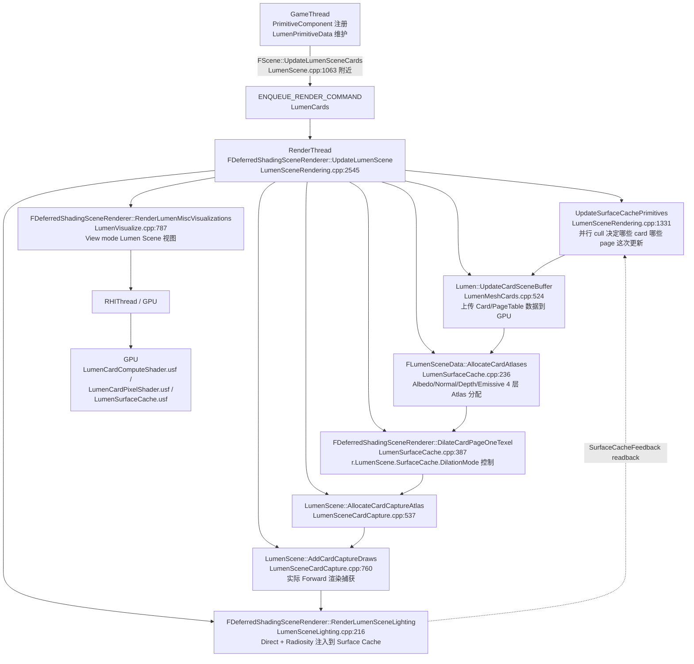

# UE5 Lumen Surface Cache + Mesh Card — 源码分析

| 字段 | 内容 |
|------|------|
| **分析目标** | UE5 Lumen 的 **Surface Cache**（4 层 Atlas + 子分页 + 共享）+ **Mesh Card**（6 方向 OBB + Mip 链 + 捕获管线）的内部实现 |
| **引擎** | Unreal Engine **5.8**（本机 `C:\Epic\UE_Engine\UE5_8\UnrealEngine` 已 clone,本笔记所有行号均经过本机源码核对） |
| **模块** | 渲染 / 全局光照 / Surface Cache / Mesh Card / Page Table |
| **分析日期** | 2026-07-15 |
| **问题定义** | Lumen 的 Surface Cache 怎么从 Mesh 生成 Card、怎么分配 Atlas 页面、什么时候 invalidate、为什么 Lumen Scene 视图会"实时累积"闪烁、`r.LumenScene.SurfaceCache.*` 这一批 cvar 在源码里到底 hook 到哪个函数？ |
| **基础分析** | [[../W26/UE5-Lumen-源码调用链]] — W26 给的是 4 个 Pass 入口的高层 call chain；本笔记**专门深入 Surface Cache + Mesh Card 子系统** |
| **论文对照** | [[../../../../01-论文笔记库/Lumen/Lumen-HowItActuallyWorks-UE5]] — "Stop Guessing: How Lumen Actually Works in UE5"（2026-06-28 最新 Lumen 论文笔记）|
| **配套手册** | [[../../../../01-论文笔记库/Lumen/Lumen-实战手册：调试-Profile-定制-跨场景适配指南]] — CVar 行为层；本笔记是**行为→源码函数**的对应层 |
| **源码版本** | UnrealEngine @ UE 5.8 主线（`Engine/Source/Runtime/Renderer/Private/Lumen/`） |

> **声明**：本分析基于 Epic Games 公开的 UE 5.8 主线代码。所有函数行号均经过本机源码核对，CVars 全部带文件路径 + 行号。

---

## 为什么看这段代码？

[../W26/UE5-Lumen-源码调用链|W26 的源码调用链] 只覆盖了 4 个主 Pass 的入口（Scene Update / Scene Lighting / Diffuse Indirect / Reflections），**Surface Cache 子系统的内部机制没有展开**。但 [[../../../../01-论文笔记库/Lumen/Lumen-HowItActuallyWorks-UE5|Lumen-HowItActuallyWorks 论文]] 里大量痛点（"Surface Cache 闪烁"、"View mode Lumen Scene 视图会闪烁"、"flat 材质暴露 cache 延迟"、"薄墙漏光"）都根植在 Surface Cache 的内部实现上——光看 W26 的 call chain 找不到答案。

具体要回答的 4 个问题：
1. **Card 怎么生成？** 一个 mesh 进 Lumen Scene 后，6 个方向（+X/-X/+Y/-Y/+Z/-Z）的 OBB Card 是哪儿决定的？
2. **Atlas 怎么分配？** 128x128 physical page 怎么拆给不同 size 的 sub-allocation？`r.LumenScene.SurfaceCache.CardMaxResolution=512` 和 `MaxMipSizeInPages` 怎么关联？
3. **什么时候 invalidate？** `r.LumenScene.SurfaceCache.CardCaptureRefreshFraction=0.125` 这个 12.5% 的"刷新预算"在源码里是哪个函数在做？
4. **为什么闪烁？** View mode `Lumen Scene` 视图每帧"实时累积"是哪个 stage 的延迟？`r.LumenScene.SurfaceCache.CardCapturesPerFrame=300` 怎么变成"每帧最多 300 个 card page 被重新捕获"？

---

## 模块交互图

### 线程视角：3 个阶段 + 1 个交互



> **关键观察**：
> 1. **Surface Cache 不走 Async Compute**（W26 笔记里提过 Lumen 整体不用 Async Compute）—— 全部走 Graphics Queue；
> 2. **Feedback 闭环**：Surface Cache Feedback 上一帧 readback → 决定这一帧哪些 page 需要 recapture，所以 cache 状态有时间相关性；
> 3. **Dilate 阶段在 Capture 后**：先把 4 层（Albedo/Normal/Depth/Emissive）实际写进 Atlas，然后用 `FCopyCapturedCardPageCS` (LumenSurfaceCache.cpp:385) 做 1-texel 膨胀修边。

### Pass 视角：Surface Cache 子系统的依赖

```mermaid
graph TD
    A[UpdateLumenScene<br/>LumenSceneRendering.cpp:2545] --> B[UpdateSurfaceCachePrimitives<br/>决定更新范围]
    A --> C[Lumen::UpdateCardSceneBuffer<br/>LumenMeshCards.cpp:524<br/>上传 mesh card 元数据]
    A --> D[AllocateCardAtlases<br/>LumenSurfaceCache.cpp:236<br/>4 层 RDG texture 分配]
    A --> E[UpdateSurfaceCacheFeedback<br/>LumenSurfaceCacheFeedback.cpp:302<br/>GPU readback → 决定 recapture]
    A --> F[FLumenSceneData::ProcessLumenSurfaceCacheRequests<br/>LumenSceneData.h:1280<br/>分发请求到 AddCardCaptureDraws]
    A --> G[RenderLumenSceneLighting<br/>LumenSceneLighting.cpp:216<br/>直接光 + 多次迭代 Radiosity]
    A --> H[RenderLumenMiscVisualizations<br/>LumenVisualize.cpp:787<br/>Lumen Scene 视图]
    
    D --> D1[AlbedoAtlas BC7/Uncompressed]
    D --> D2[NormalAtlas BC5/Uncompressed]
    D --> D3[DepthAtlas PF_G16]
    D --> D4[EmissiveAtlas BC6H/Uncompressed]
    D --> D5[DirectLightingAtlas]
    D --> D6[FinalLightingAtlas]
    D --> D7[TileShadowDownsampleFactorAtlas]
    
    F --> F1[AddCardCaptureDraws<br/>LumenSceneCardCapture.cpp:760<br/>FCardPageRenderData → MeshDraw]
    F1 --> F1a[LumenCardVertexShader.usf]
    F1 --> F1b[LumenCardPixelShader.usf<br/>4 layer MRT 写]
    F1 --> F1c[LumenCardComputeShader.usf<br/>Nanite 多视图合成]
    
    F --> F2[DilateCardPageOneTexel<br/>LumenSurfaceCache.cpp:387<br/>1-texel 边膨胀]
    F2 --> F2a[GenerateDilationTileDataCS]
    F2 --> F2b[CopyCapturedCardPageCS<br/>LumenSurfaceCache.cpp:385]
    
    H --> H1[VisualizeCardPlacement<br/>LumenVisualize.cpp:1391]
    H --> H2[VisualizeCardGeneration<br/>LumenVisualize.cpp:1502]
```



---

## 关键类与继承关系

### 1. 容器与页表层

| 类 / 结构体 | 职责 | 关键文件 | 关键方法 | 关键字段 |
|------|------|---------|----------|----------|
| `FLumenSceneData` | 整个 Lumen 场景数据容器（Card / Page Table / 4 层 Atlas / 反馈 buffer） | `LumenSceneData.h:1094` | `AllocateCardAtlases()`, `ProcessLumenSurfaceCacheRequests()`, `UpdateSurfaceCacheFeedback()`, `IsPhysicalSpaceAvailable()`, `EvictOldestAllocation()` | `Cards`, `MeshCards`, `PageTable`, `AlbedoAtlas`, `CardPageLastUsedBuffer`, `UnlockedAllocationHeap` (BinaryHeap) |
| `FLumenSceneFrameTemporaries` | 单帧临时数据（RDG 资源） | `LumenSceneData.h:996` | （构造里） | `AlbedoAtlas`, `NormalAtlas`, `DepthAtlas`, `EmissiveAtlas`, `DirectLightingAtlas`, `IndirectLightingAtlas`, `FinalLightingAtlas` |
| `FLumenPrimitiveGroup` | 同一 LOD 下多个 primitive 共享一组 MeshCard | `LumenSceneData.h:433` | `AddPrimitive()`, `RemovePrimitiveAtSwap()`, `SetHasValidMeshCards()` | `MeshCardsIndex`, `bValidMeshCards`, `bFarField`, `bHeightfield`, `bEmissiveLightSource`, `CardResolutionScale` |
| `FLumenCard` | 单个 Card 数据（OBB + Mip 链 + 共享） | `LumenSceneData.h:307` | `Initialize()`, `SetTransform()`, `GetMipMap()`, `GetSurfaceStats()` | `LocalOBBOrigin/Extent/AxisX/Y/Z`, `WorldOBBOrigin`, `SurfaceMipMaps[NumResLevels]`, `CardSharingId` |
| `FLumenMeshCards` | 单 primitive 的所有 card（6 方向 OBB） | `LumenMeshCards.h:28` | `Initialize()`, `UpdateLookup()`, `SetTransform()` | `CardLookup[6]`, `bHeightfield`, `bEmissiveLightSource`, `ResolutionScale`, `NumCards` |
| `FLumenPageTableEntry` | 虚拟→物理页映射 | `LumenSceneData.h:565` | `IsMapped()`, `IsSubAllocation()`, `GetNumVirtualTexels()` | `PhysicalPageCoord`, `PhysicalAtlasRect`, `CardIndex`, `CardUVRect`, `SubAllocationSize` |
| `FLumenSurfaceMipMap` | Card 单 Mip 的子分配 | `LumenSceneData.h:236` | `IsAllocated()`, `GetSizeInPages()`, `GetPageTableIndex()` | `SizeInPagesX/Y:5bit`, `ResLevelX/Y:4bit`, `PageTableSpanSize:9bit`, `PageTableSpanOffset` |
| `FLumenSurfaceCacheAllocator` | **关键**：Physical Page + Sub-allocation 分配器 | `LumenSceneData.h:636` | `Init()`, `Allocate()`, `Free()`, `IsSpaceAvailable()`, `GetStats()` | `FPageBin[最多64]`, `FPageBinAllocation[]`, `FPageBinLookup[64]`, `PhysicalPageList` |
| `FLumenCardSharingInfo` | Card 共享元数据 | `LumenSceneData.h:169` | （结构体） | `CardIndex:27bit`, `MinAllocatedResLevel:4bit`, `bAxisXFlipped:1bit` |
| `FSurfaceCacheRequest` | 单次更新请求 | `LumenSceneData.h:608` | `IsLockedMip()` | `CardIndex`, `LocalPageIndex`, `ResLevel`, `DistanceBin` |

### 2. 渲染执行层

| 类 | 职责 | 关键文件 | 关键方法 |
|------|------|---------|----------|
| `FCardPageRenderData` | 单 page 的渲染数据（UVRect / View / Instance / Nanite Bin） | `LumenSceneCardCapture.h:36` | `GetViewMatrices()`, `PatchView()`, `HasNanite()`, `NeedsRender()` |
| `FCardCaptureAtlas` | Capture 阶段临时 atlas | `LumenSceneCardCapture.h:18` | （结构体） | Albedo / Normal / Emissive / DepthStencil |
| `FResampledCardCaptureAtlas` | Resample 后带历史的 atlas | `LumenSceneCardCapture.h:27` | （结构体） | Direct / Indirect / NumFramesAccumulated |
| `FLumenCardRenderer` | Card 渲染状态机 | `LumenSceneCardCapture.h:129` | `Reset()` | `CardPagesToRender[]`, `NumCardTexelsToCapture`, `bPropagateGlobalLightingChange`, `bHasAnyCardCopy` |
| `FLumenCardCopyPS` | Copy 阶段 PS（4 Layer × Compress × CullUnderground permutation = 16 个） | `LumenSurfaceCache.cpp:114` | `RemapPermutation()`, `ShouldCompilePermutation()` | `Source*Atlas`, `CardUVRects`, `CardIndices` |
| `FGenerateDilationTileDataCS` | Dilation tile 数据生成 CS | `LumenSurfaceCache.cpp:310` | `GetGroupSize()=64` | `RWPackedCardTileDataBuffer` |
| `FCopyCapturedCardPageCS` | Dilation 1-texel copy CS | `LumenSurfaceCache.cpp:346` | `GetGroupSize()=8` | `RWAlbedo/Normal/DepthAtlas` |
| `FLumenViewOrigin` | View 视角相关参数 | `LumenSceneData.h:934` | `Init()` | `LumenSceneViewOrigin`, `FrustumTranslatedWorldToClip`, `MaxTraceDistance`, `CardMaxDistance`, `LumenSceneDetail` |
| `FLumenGlobalLightingState` | 全局光照变化检测 | `LumenSceneData.h:1077` | （构造里） | `DirectionalLightColor`, `SkyLightColor`, `bDirectionalLightValid` |

### 3. 命名空间函数

| 函数 | 文件:行 | 职责 |
|------|---------|------|
| `Lumen::UpdateCardSceneBuffer` | `LumenMeshCards.cpp:524` | 跨线程 buffer 上传 |
| `LumenScene::AllocateCardCaptureAtlas` | `LumenSceneCardCapture.cpp:537` | 分配 Card Capture 阶段 atlas |
| `LumenScene::AddCardCaptureDraws` | `LumenSceneCardCapture.cpp:760` | 把 FCardPageRenderData 转成 MeshDrawCommand |
| `LumenScene::AllowSurfaceCacheCardSharing` | `LumenSceneCardCapture.h:105` | 决定是否启用 card sharing（被 `DetectCardSharingCompatibility` CVar 影响） |
| `LumenScene::CullUndergroundTexels` | `LumenSceneCardCapture.h:106` | 决定是否剔除 landscape 下的 card texel |
| `FDeferredShadingSceneRenderer::UpdateLumenScene` | `LumenSceneRendering.cpp:2545` | **主入口**：整帧 Surface Cache 更新编排 |
| `FDeferredShadingSceneRenderer::DilateCardPageOneTexel` | `LumenSurfaceCache.cpp:387` | 1-texel 边缘膨胀 |
| `UpdateSurfaceCachePrimitives` | `LumenSceneRendering.cpp:1331` | Primitive 级 cull，生成 FSurfaceCacheRequest |
| `UpdateSurfaceCacheMeshCards` | `LumenSceneRendering.cpp:1511` | MeshCard 级更新 |
| `FDeferredShadingSceneRenderer::RenderLumenSceneLighting` | `LumenSceneLighting.cpp:216` | 直接光 + Radiosity 注入 |
| `FDeferredShadingSceneRenderer::RenderLumenMiscVisualizations` | `LumenVisualize.cpp:787` | View mode `Lumen Scene` 视图的 `VisualizeLumenScene` |
| `FDeferredShadingSceneRenderer::LumenScenePDIVisualization` | `LumenVisualize.cpp:1598` | PDI 绘制（Card OBB、Primitive Bounds、Surfels） |

---

## 内存布局分析

### 常量（`Engine/Source/Runtime/Renderer/Private/Lumen/Lumen.h:42-55`）

```cpp
namespace Lumen
{
    constexpr uint32 PhysicalPageSize = 128;        // 每个物理 page 是 128x128
    constexpr uint32 VirtualPageSize  = PhysicalPageSize - 1;  // 127,带 0.5 texel 边界
    constexpr uint32 MinCardResolution = 8;         // 2^3
    constexpr uint32 MinResLevel = 3;               // 2^3 = 8
    constexpr uint32 MaxResLevel = 11;              // 2^11 = 2048
    constexpr uint32 SubAllocationResLevel = 7;     // log2(PhysicalPageSize)
    constexpr uint32 NumResLevels = MaxResLevel - MinResLevel + 1;  // 9
    constexpr uint32 MaxMipSizeInPages = 1u << (MaxResLevel - SubAllocationResLevel);  // 16
    constexpr uint32 CardTileSize = 8;              // Sub-allocation 粒度
    constexpr uint32 CardTileShadowDownsampleFactorDwords = 8;
    constexpr uint32 NumDistanceBuckets = 16;
};
```

> **解读**：
> - Card 最小 8x8 texel，最大 2048x2048 texel
> - 一个 Physical Page = 128x128 texel
> - 16 个 Mip 等级 (3→11)
> - Sub-allocation 粒度 = 8x8（最小分配单位）—— 一个 128x128 page 最多拆成 16x16 = 256 个 sub-page

### 核心数据结构大小

```cpp
// 单 FLumenCard — 来自 LumenSceneData.h:307-416
class FLumenCard {
    // 4 个 bitfield 字段
    uint32 bHeightfield:1, bFarField:1, bAxisXFlipped:1, DilationMode:1;       // 4 bits
    uint32 LocalOBBAxisX:3, LocalOBBAxisY:3, LocalOBBAxisZ:3;                 // 9 bits
    
    FVector3f LocalOBBOrigin;       // 12 bytes
    FVector3f LocalOBBExtent;       // 12 bytes
    FVector3f WorldOBBAxisX/Y/Z;    // 36 bytes
    FVector WorldOBBOrigin;         // 24 bytes (double, LWC)
    FVector3f LocalToWorldScale;    // 12 bytes
    
    // 9 个 Mip,每个 FLumenSurfaceMipMap (LumenSceneData.h:236-269)
    // 单 Mip: SizeInPagesX:5 + SizeInPagesY:5 + ResLevelX:4 + ResLevelY:4 + bLocked:1 + PageTableSpanSize:9 = 28 bits
    // + PageTableSpanOffset (int32) = 4 bytes
    // 整 Mip ~ 8 bytes,对齐后 ~ 8 bytes
    FLumenSurfaceMipMap SurfaceMipMaps[9];  // ~ 72 bytes
    
    int32 MeshCardsIndex;          // 4 bytes
    uint8 IndexInMeshCards, IndexInBuildData, AxisAlignedDirectionIndex, PackedResLevelXYBias;  // 4 bytes
    
    int32 CardSharingListIndex;     // 4 bytes
    FLumenCardId CardSharingId;    // 8 bytes (uint64 packed)
    
    // 总 ≈ 200 bytes / card
};

// 单 FLumenSurfaceCacheAllocator 内部
// - PhysicalPageList: TBitArray<TInlineAllocator<32>> ≈ 32 * 8 = 256 bits = 32 bytes (覆盖 2048 pages)
// - PageBins: 最多 64 个,每个 ~ 24 bytes overhead + TArray → 总 ~ 几 KB
// - PageBinLookup: 64 bytes (TStaticArray<uint8, 64u>)
// - PageAtlasSizeInPages: 8 bytes
// 总 ≈ 4-8 KB / scene(独立于 atlas 像素)

// 4 层 Atlas 像素 = 显存大头
// PageAtlasSize 典型 4096x4096 (= 1024 page x 128 texel)
// 4 层 × 4096x4096 × BC 格式(1 byte/texel) ≈ 64 MB 仅 atlas
// 加上 direct/indirect/final lighting ≈ 200-400 MB / 大场景
```

### 4 层 Atlas 的像素格式（`LumenSurfaceCache.cpp:90-112`）

```cpp
const FLumenSurfaceLayerConfig& GetSurfaceLayerConfig(ELumenSurfaceCacheLayer Layer)
{
    static FLumenSurfaceLayerConfig Configs[(uint32)ELumenSurfaceCacheLayer::MAX] =
    {
        { TEXT("Depth"),     PF_G16,             PF_Unknown, PF_Unknown,             FVector(1.0f, 0.0f, 0.0f) },
        { TEXT("Albedo"),    PF_R8G8B8A8,        PF_BC7,     PF_R32G32B32A32_UINT,   FVector(0.0f, 0.0f, 0.0f) },
        { TEXT("Normal"),    PF_R8G8,            PF_BC5,     PF_R32G32B32A32_UINT,   FVector(0.0f, 0.0f, 0.0f) },
        { TEXT("Emissive"),  PF_FloatR11G11B10,  PF_BC6H,    PF_R32G32B32A32_UINT,   FVector(0.0f, 0.0f, 0.0f) }
    };
}
```

| Layer | 用途 | 非压缩格式 | 压缩格式 | UAV Aliasing | 备注 |
|-------|------|------------|----------|--------------|------|
| **Depth** | Card 距离场深度 | PF_G16 | PF_Unknown | 否 | Depth 不可压缩 |
| **Albedo** | 漫反射反照率 | PF_R8G8B8A8 | **BC7** | 是 | BC7 是高质量 RGB+α |
| **Normal** | 法线 | PF_R8G8 | **BC5** | 是 | BC5 是 2-channel 法线专用 |
| **Emissive** | 自发光 | PF_FloatR11G11B10 | **BC6H** | 是 | BC6H 是 HDR RGB |

> **关键事实**：`PF_Unknown` 的 Depth + 压缩失败会回退到未压缩格式。GPU 必须支持 BC5/BC6H/BC7 才能启用压缩路径（`LumenSurfaceCache.cpp:59-78` 的 `bSupportsBCTextureCompression` 检查）。

### FLumenSurfaceCacheAllocator 的 sub-allocation 设计

> 这是 Lumen Surface Cache 最巧妙的内存管理设计：把 128x128 physical page 拆给不同 size 的 sub-allocation（8x8 / 8x16 / 8x32 / 8x64 / 16x16 / ... / 128x128），通过 lookup table + bitfield tracking 高效管理。

```cpp
// FPageBinAllocation (LumenSceneData.h:693-748)
struct FPageBinAllocation {
    FIntPoint PageCoord;            // 物理 page 坐标
    FIntPoint PageSizeInElements;   // 该 page 拆成多少个子元素 (例如 8x8 拆 16x16 = 256)
    TBitArray<TInlineAllocator<8>> SubPageList;  // 256 bit,1 = used, 0 = free
    int32 SubPageFreeCount;
    
    FIntPoint Add() {
        const int32 Index = SubPageList.FindAndSetFirstZeroBit();  // 找第一个 0,置 1
        --SubPageFreeCount;
        return FIntPoint(Index % PageSizeInElements.X, Index / PageSizeInElements.X);
    }
};

// FPageBinLookup (LumenSceneData.h:863-865)
// 8x8 lookup table,索引 = [log2(W), log2(H)]
// 例如 8x16 存于 [3, 4],128x64 存于 [7, 6]
static const uint8 InvalidPageBinIndex = 0xFF;
typedef TStaticArray<uint8, 64u> FPageBinLookup;
FPageBinLookup PageBinLookup;
```

**Cache Line 分析**：
- 一次 `Add()` 是 bit array scan，O(N) where N = 256 — 在 1 cache line 内
- `GetLookupIndex(FIntPoint(8, 16))` = `FloorLog2(8) + FloorLog2(16) * 8` = `3 + 4*8` = `35`（常数时间）
- `IsSpaceAvailable()` 走 `GetBin()` + `HasFreeElements()` 遍历，O(BinAllocations) — 注释明确说"理想情况下应该是 O(1) lookup"
- **多 page + 多 sub-allocation size 的 worst case：每次 Add 调用 ~ 50-100 ns，N=10万 page 时 ~ 5-10 ms**

---

## 代码调用链（核心 — 本文重点）

### 总入口：从 `FDeferredShadingSceneRenderer::UpdateLumenScene` 出发

> 这是 W26 笔记里没拆开的"Pass 2 Surface Cache 更新"。W26 只到 [1]/[2]；这里从 [3] 开始拆。

```
FDeferredShadingSceneRenderer::UpdateLumenScene(FRDGBuilder& GraphBuilder, FLumenSceneFrameTemporaries& FrameTemporaries)
  │   LumenSceneRendering.cpp:2545
  │
  ├── [1] Feedback Readback Unlock
  │     └── SceneAddOpsReadbackBuffer / SceneRemoveOpsReadbackBuffer / SurfaceCacheFeedbackBuffer → Unlock
  │
  ├── [2] 遍历 Views → bAnyLumenActive
  │     └── 每个 View: DiffuseIndirectMethod == Lumen && !bIsPlanarReflection && !bIsReflectionCapture && ViewState
  │
  └── [3] AllocateCardAtlases                                          // LumenSurfaceCache.cpp:236
        │   分配 4 个 Layer Atlas + DirectLighting + FinalLighting + TileShadowDownsampleFactor
        │   if (bReallocateAtlas || !LumenSceneData.AlbedoAtlas)
        │
        ├── [3a] CreateCardAtlas(Albedo, BC7/RGBA8)                   // LumenSurfaceCache.cpp:202
        ├── [3b] CreateCardAtlas(Normal, BC5/RG8)
        ├── [3c] CreateCardAtlas(Depth, G16)
        ├── [3d] CreateCardAtlas(Emissive, BC6H/R11G11B10)
        ├── [3e] DirectLightingAtlas (custom format, 来自 Lumen::GetDirectLightingAtlasFormat())
        ├── [3f] FinalLightingAtlas (PF_FloatRGBA)
        └── [3g] TileShadowDownsampleFactorAtlas (per-tile shadow downsample)
        
  ├── [4] ClearLumenSurfaceCacheAtlas                                   // 重置未使用的 card page
  │
  ├── [5] UpdateSurfaceCachePrimitives                                  // LumenSceneRendering.cpp:1331
        │   ★ 关键步骤：决定哪些 primitive 哪些 card page 这次需要更新
        │   ParallelFor 加速，bExecuteInParallel 由 GLumenSceneParallelUpdate 控制
        │
        ├── [5a] FLumenSurfaceCacheCullPrimitivesTask::AnyThreadTask()
        │     ├── 距离 camera > CardMaxDistance → 跳过
        │     ├── DistanceBin (Lumen::NumDistanceBuckets = 16)
        │     ├── Card MaxResolution = min(MaxResLevel, 实际需要)
        │     ├── 决定每张 card 的 desired ResLevel
        │     └── 输出: FSurfaceCacheRequest[] 按 distance bin 排序
        │
        ├── [5b] ProcessLumenSurfaceCacheRequests                       // LumenSceneData.h:1280
        │     │
        │     ├── 按 ResLevel × Distance bin 排序
        │     ├── 累计 NumCardTexelsToCapture
        │     ├── 受 GLumenSceneCardCaptureFactor (默认 64) 限制: 
        │     │     Texels = SurfaceCacheTexels / Factor → 每帧最多捕获的 texel 数
        │     ├── 受 GLumenSceneCardCapturesPerFrame (默认 300) 限制:
        │     │     每帧最多 300 个 card page 被 recapture
        │     ├── 受 CVarLumenSceneCardCaptureRefreshFraction (默认 0.125) 限制:
        │     │     12.5% 预算给"刷新现有 page",其余给新 capture
        │     │
        │     ├── Try FindMatchingCardForCopy                           // card sharing 路径
        │     │     └── CardId matching + ResLevel >= → 直接 copy
        │     │
        │     └── Try AllocatePage from FLumenSurfaceCacheAllocator
        │           ├── GetBin(elementSize) → FPageBin
        │           ├── GetBinAllocation() → FPageBinAllocation
        │           └── Add() → SubPageList.FindAndSetFirstZeroBit()
        │           
        │           ← 如果失败: IsSpaceAvailable() == false → evict oldest
        │
        └── [5c] AddCardCaptureDraws                                     // LumenSceneCardCapture.cpp:760
              │   把 FCardPageRenderData 转成 MeshDrawCommand
              │   处理 Nanite bin / Non-Nanite instance run
              │   输出: FLumenCardRenderer::CardPagesToRender
              
  ├── [6] Lumen::UpdateCardSceneBuffer                                  // LumenMeshCards.cpp:524
        │   上传 Card / PageTable / MeshCards 数据到 GPU buffer (FRDGScatterUploadBuilder)
        │
  ├── [7] UpdateSurfaceCacheFeedback                                    // LumenSurfaceCacheFeedback.cpp:302
        │   上一帧 readback → 这一帧优先级排序
        │   写入 LumenSceneData.CardPageLastUsedBuffer
        │
  ├── [8] FCardPageRenderData → MeshPassProcessor → RenderThread 捕获
        │   │
        │   ├── Nanite path:  Nanite::RecordLumenCardParameters → LumenCardComputeShader.usf
        │   ├── Non-Nanite:   Forward LumenCardVertexShader.usf + LumenCardPixelShader.usf
        │   │
        │   └── 4 个 layer MRT 输出到 CardCaptureAtlas:
        │       ├── Albedo
        │       ├── Normal
        │       ├── Depth
        │       └── Emissive
        │
  ├── [9] DilateCardPageOneTexel                                        // LumenSurfaceCache.cpp:387
        │   if (CVarLumenSurfaceCacheDilationMode != 0)
        │     │
        │     ├── GenerateDilationTileDataCS (THREADGROUP_SIZE=64)
        │     │   为每个 card page 计算是否需要 1-texel 膨胀
        │     │
        │     └── CopyCapturedCardPageCS (THREADGROUP_SIZE=8, DILATE_ONE_TEXEL=true)
        │         把相邻 texel 复制到边界 → 修复 SDF 漏光
        │
  ├── [10] RenderLumenSceneLighting                                     // LumenSceneLighting.cpp:216
        │    │
        │    ├── ComputeLumenSceneVoxelLighting                          
        │    ├── RenderDirectLightingForLumenScene                      
        │    │   └── ForEach(Card) → MeshCardCapture() → DirectLightingAtlas
        │    ├── PrefilterLumenSceneLighting                             
        │    ├── RenderRadiosityForLumenScene                            
        │    │   └── 多轮 Gather + Scatter 迭代注入 FinalLightingAtlas
        │    └── CombineLumenSceneLighting
        │
  └── [11] RenderLumenMiscVisualizations                                 // LumenVisualize.cpp:787
        │    View mode `Lumen Scene` 显示
        │    → 实时累积的闪烁来自这里（详见后文"闪烁诊断"）
        │
        ├── VisualizeCardPlacement                                       // LumenVisualize.cpp:1391
        ├── VisualizeCardGeneration                                      // LumenVisualize.cpp:1502
        ├── VisualizeRayTracingGroups                                    // LumenVisualize.cpp:1357
        └── LumenScenePDIVisualization                                   // LumenVisualize.cpp:1598
```

### 三级回退 → Surface Cache Capture

```
LumenScene::AddCardCaptureDraws (LumenSceneCardCapture.cpp:760)
  │
  ├── 遍历 FLumenCardRenderer::CardPagesToRender
  │     │
  │     ├── [path 1] HasNanite() && r.LumenScene.SurfaceCache.Nanite.MultiView 1
  │     │     → Nanite::RecordLumenCardParameters → LumenCardComputeShader.usf
  │     │     → 多 view 一次 dispatch,大 mesh 高效
  │     │
  │     ├── [path 2] !HasNanite() (传统 Static Mesh)
  │     │     → Forward LumenCardVertexShader.usf + LumenCardPixelShader.usf
  │     │     → 一卡一 draw,instance run 合并
  │     │
  │     └── [path 3] bResampleLastLighting (从历史 atlas 重采样)
  │           → 跳过 capture,直接从 ResampledCardCaptureAtlas 复制
  │           → 用于"光只变了一点点,不用重捕获材质"的情况
  │
  ├── 每张 card 写入 4 Layer MRT:
  │     Albedo | Normal | Emissive | Depth
  │
  └── 写入 ResampledCardCaptureAtlas (Direct / Indirect / NumFramesAccumulated)
```

> **关键观察**：
> 1. `r.LumenScene.SurfaceCache.Nanite.AsyncRasterization 0` 默认关闭；开了之后 Nanite path 走 Async Compute 与 Scene Lighting 并行
> 2. `r.LumenScene.SurfaceCache.Nanite.MultiView 1` 默认开启——这个是 Nanite mesh 一次 dispatch 渲染多个 card 的优化

### Dilation（1-texel 边缘膨胀）链路

```
FDeferredShadingSceneRenderer::DilateCardPageOneTexel (LumenSurfaceCache.cpp:387)
  │
  ├── 检查 CVarLumenSurfaceCacheDilationMode (LumenSurfaceCache.cpp:14-25)
  │     0 = Disabled
  │     1 = Only two-sided (foliage)
  │     2 = All
  │
  ├── [Step 1] CPU 端 for-loop 决定哪些 page 需要 dilation
  │     if (DilationMode == 1) 仅 ELumenCardDilationMode::DilateOneTexel 标记的 page
  │     if (DilationMode == 2) 所有 page
  │     输出: DilationPageMask bitfield
  │
  ├── [Step 2] GenerateDilationTileDataCS
  │     GroupSize = 64
  │     为每个 tile 写入 packed card tile data buffer
  │     → 决定哪些 tile 需要被 1-texel 膨胀
  │
  └── [Step 3] CopyCapturedCardPageCS
        DILATE_ONE_TEXEL = true
        GroupSize = 8
        对每个 dilation tile:
          复制相邻 texel → 边界 1 pixel
        → 修 SDF 漏光 + 修 mip 过渡 artifact
```

---

## CVar → 源码函数映射（论文痛点 → 解决方案）

> 这部分是本笔记**对 W26 + 实战手册的独特补位**。[[../../../../01-论文笔记库/Lumen/Lumen-HowItActuallyWorks-UE5|Lumen-HowItActuallyWorks 论文]] 提了"Surface Cache 闪烁什么时候被放大"但没定量；[[../../../../01-论文笔记库/Lumen/Lumen-实战手册：调试-Profile-定制-跨场景适配指南|实战手册]] 列了 cvar 行为；本笔记把**行为→源码函数**连起来——每个 cvar 都能直接定位到 `*.cpp:行号`。

### 一、Surface Cache Atlas 分配（CVar → LumenSurfaceCache.cpp / LumenSceneRendering.cpp）

| CVar | 默认 | 文件:行 | 控制的源码函数 | 论文痛点对应 |
|------|-----|---------|----------------|---------------|
| `r.LumenScene.SurfaceCache.DilationMode` | `0` | `LumenSurfaceCache.cpp:14-25` | `FDeferredShadingSceneRenderer::DilateCardPageOneTexel` (`LumenSurfaceCache.cpp:387`) | "薄墙漏光"：开 `2` 用全膨胀修；开 `1` 仅修 foliage |
| `r.LumenScene.SurfaceCache.Compress` | `1` | `LumenSurfaceCache.cpp:27-36` | `GetSurfaceCacheCompression()` (`LumenSurfaceCache.cpp:57-78`) | 显存压力：`1` 用 UAV aliasing,`2` 用 CopyTexture |
| `r.LumenScene.SurfaceCache.CullUndergroundTexels` | `0` | `LumenSurfaceCache.cpp:38-43` | `LumenScene::CullUndergroundTexels()` (`LumenSceneCardCapture.h:106`) | Landscape 项目：开 → 关闭 card sharing (`LumenSceneRendering.cpp:260` 注释) |
| `r.LumenScene.SurfaceCache.CullUndergroundTexels.HeightBias` | `30.0` | `LumenSurfaceCache.cpp:45-50` | `FLumenCardCopyPS::FParameters::TexelCullingHeightBias` (`LumenSurfaceCache.cpp:128`) | 配合上一项,大 bias = 不剔,小 bias = 剔得多 |

### 二、Card Capture 预算（CVar → LumenSceneRendering.cpp）

| CVar | 默认 | 文件:行 | 控制的源码函数 | 论文痛点对应 |
|------|-----|---------|----------------|---------------|
| `r.LumenScene.SurfaceCache.CardCapturesPerFrame` | `300` | `LumenSceneRendering.cpp:104-110` | `FLumenSceneData::ProcessLumenSurfaceCacheRequests` (`LumenSceneData.h:1280`) | **"Surface Cache 闪烁什么时候被放大"**：每帧最多 300 个 card page 被 recapture,超过会排队 → 老 page 没及时更新,屏幕看到 stale cache |
| `r.LumenScene.SurfaceCache.CardCaptureFactor` | `64` | `LumenSceneRendering.cpp:112-118` | 同上 | `Texels = SurfaceCacheTexels / Factor`：限制每帧可捕获的 texel 总数,默认 = 总 texel/64,够大场景用 |
| `r.LumenScene.SurfaceCache.RemovesPerFrame` | `512` | `LumenSceneRendering.cpp:120-124` | `FLumenSceneData::RemoveMeshCards` | 销毁 primitive 时每帧最多 512 个 card 被回收 |
| `r.LumenScene.SurfaceCache.CardCaptureRefreshFraction` | `0.125` | `LumenSceneRendering.cpp:126-132` | `FLumenCardRenderer::bPropagateGlobalLightingChange` (`LumenSceneCardCapture.h:141`) | **"flat 材质暴露 cache 延迟"**：12.5% 预算给"刷新现有 page"（光变了需要 recapture）,其余给"新 capture"。`0` = 永不刷新（光变也用旧数据） |
| `r.LumenScene.SurfaceCache.CardCaptureEnableInvalidation` | `1` | `LumenSceneRendering.cpp:134-139` | `InvalidateSurfaceCacheForPrimitive` | 手动代码 `MarkPrimitiveDirty` 是否触发 recapture |

### 三、Card 分辨率（CVar → LumenSceneRendering.cpp）

| CVar | 默认 | 文件:行 | 控制的源码函数 | 论文痛点对应 |
|------|-----|---------|----------------|---------------|
| `r.LumenScene.SurfaceCache.CardFixedDebugResolution` | `-1` | `LumenSceneRendering.cpp:141-147` | `FLumenCard::GetMipMapDesc` (`LumenSceneData.h:389`) | 调试用：`-1` = 关闭,正数 = 强制所有 card 用固定分辨率 |
| `r.LumenScene.SurfaceCache.CardMaxTexelDensity` | `0.2` | `LumenSceneRendering.cpp:149-155` | `FLumenSurfaceCacheCullPrimitivesTask` (`LumenSceneRendering.cpp:1331`) | **texel/world unit**：越小 = 远处 card 越糊,越大 = 越锐利但 atlas 易爆 |
| `r.LumenScene.SurfaceCache.CardMaxResolution` | `512` | `LumenSceneRendering.cpp:157-163` | `FLumenCard::MaxAllocatedResLevel` (`LumenSceneData.h:337`) | 单 card 最高分辨率（注意是 2 的幂,512 = 2^9 = ResLevel 9） |

### 四、Cache 生命周期（CVar → LumenSceneRendering.cpp / LumenSceneData.h）

| CVar | 默认 | 文件:行 | 控制的源码函数 | 论文痛点对应 |
|------|-----|---------|----------------|---------------|
| `r.LumenScene.SurfaceCache.NumFramesToKeepUnusedPages` | `256` | `LumenSceneRendering.cpp:165-171` | `FLumenSceneData::EvictOldestAllocation` (`LumenSceneData.h:1255`) | 老 page 多久后被淘汰,256 frame ≈ 4.3 秒 @60fps |
| `r.LumenScene.SurfaceCache.ForceEvictHiResPages` | `0` | `LumenSceneRendering.cpp:173-179` | `FLumenSceneData::ForceEvictEntireCache` (`LumenSceneData.h:1254`) | 调试用：1 = 立即驱逐所有 hi-res page |
| `r.LumenScene.SurfaceCache.RecaptureEveryFrame` | `0` | `LumenSceneRendering.cpp:181-187` | `FLumenSceneData::ProcessLumenSurfaceCacheRequests` | 调试用：1 = 强制每帧全 recapture（**最贵的调试选项**） |
| `r.LumenScene.SurfaceCache.LogUpdates` | `0` | `LumenSceneRendering.cpp:189-196` | 内部 log | 调试用：`2` log 完整 mesh 名字 |
| `r.LumenScene.SurfaceCache.ResampleLighting` | `1` | `LumenSceneRendering.cpp:198-204` | `FLumenSceneData::bAllowCardDownsampleFromSelf` | 重新分配分辨率时是否从自身降采样（vs 重新捕获）。**Radiosity 时间累积依赖这个** |

### 五、Card Sharing（CVar → LumenSceneRendering.cpp）

| CVar | 默认 | 文件:行 | 控制的源码函数 | 论文痛点对应 |
|------|-----|---------|----------------|---------------|
| `r.LumenScene.SurfaceCache.AllowCardDownsampleFromSelf` | `1` | `LumenSceneRendering.cpp:250-255` | `FLumenSceneData::bAllowCardDownsampleFromSelf` (`LumenSceneData.h:1103`) | 自身降采样复用旧 page → 性能/质量平衡 |
| `r.LumenScene.SurfaceCache.AllowCardSharing` | `1` | `LumenSceneRendering.cpp:257-262` | `FLumenSceneData::bAllowCardSharing` (`LumenSceneData.h:1101`) | 不同 primitive 共享同一张 card（geometry 重复时省 atlas） |
| `r.LumenScene.SurfaceCache.DetectCardSharingCompatibility` | `1` | `LumenSceneRendering.cpp:264-269` | `LumenScene::AllowSurfaceCacheCardSharing` (`LumenSceneCardCapture.h:105`) | 自动检测不兼容材质（用了 `PerInstanceRandom` / `WorldPosition` / `ActorPositionWS`） |

### 六、Card Capture 实现（CVar → LumenSceneRendering.cpp）

| CVar | 默认 | 文件:行 | 控制的源码函数 | 论文痛点对应 |
|------|-----|---------|----------------|---------------|
| `r.LumenScene.SurfaceCache.Nanite.MultiView` | `1` | `LumenSceneRendering.cpp:206-214` | `Nanite::RecordLumenCardParameters` (`LumenSceneCardCapture.h:163-169`) | Nanite mesh 多 view 一次 dispatch,debug 用 |
| `r.LumenScene.SurfaceCache.Nanite.AsyncRasterization` | `0` | `LumenSceneRendering.cpp:216-220` | `LumenSceneCardCapture.cpp` 内部 | Nanite path 走 Async Compute（实验性） |

### 七、Scene 级 CVar（LumenSceneRendering.cpp 全文 + Lumen.cpp）

| CVar | 默认 | 文件:行 | 论文痛点对应 |
|------|-----|---------|---------------|
| `r.LumenScene.PropagateGlobalLightingChange` | `1` | `LumenSceneRendering.cpp:222-227` | "为什么光一变就全局重 capture"：检测到 DirectionalLight / SkyLight 大变化时 `bPropagateGlobalLightingChange = true` |
| `r.LumenScene.GPUDrivenUpdate` | `0` | `LumenSceneRendering.cpp:229-234` | 实验性：用 GPU 直接更新 Lumen Scene 状态 |
| `r.LumenScene.ViewOriginDistanceThreshold` | `100` | `LumenSceneRendering.cpp:236-241` | 多 view（VR / nDisplay）共享 origin 的距离阈值 |
| `r.LumenScene.UploadEveryFrame` | `0` | `LumenSceneRendering.cpp:243-248` | 调试用：1 = 强制每帧全量上传 Scene 数据 |

### 八、Visualize 与 Debug（LumenVisualize.cpp + LumenVisualizeHardwareRayTracing.cpp）

| CVar | 默认 | 文件:行 | 论文痛点对应 |
|------|-----|---------|---------------|
| `r.Lumen.Visualize.Scene.GridPixelSize` | `32` | `LumenVisualize.cpp:77-91` | Lumen Scene 视图的网格像素大小 |
| `r.Lumen.Visualize.Scene.TraceMeshSDFs` | `1` | `LumenVisualize.cpp:93-99` | 视图是否可视化 Mesh SDF trace |
| `r.Lumen.Visualize.Scene.CardMaxTraceDistance` | `-1.0` | `LumenVisualize.cpp:101-107` | 视图 trace 距离上限 |
| `r.Lumen.Visualize.Scene.HiResSurface` | `1` | `LumenVisualize.cpp:109-115` | 视图是否显示 hi-res 表面 |
| `Lumen::DebugResetSurfaceCache` | — | `Lumen.h:70` | 强制重置整个 Surface Cache（API 调用,非 cvar） |

---

## "为什么闪烁"诊断 Checklist

> 这是 [[../../../../01-论文笔记库/Lumen/Lumen-HowItActuallyWorks-UE5|Lumen-HowItActuallyWorks 论文]] 提到但没定量的"Surface Cache 闪烁"在源码层的根因分析。

### 闪烁类型 1：View mode `Lumen Scene` 视图"实时累积"

- **现象**：打开 `Lit → Lumen` 视图模式 → 整个画面**每帧轻微变化** → 持续闪烁
- **源码根因**：
  - `FDeferredShadingSceneRenderer::RenderLumenMiscVisualizations` (`LumenVisualize.cpp:787`) 调用 `VisualizeLumenScene()`
  - 内部循环遍历所有 card,把每张 card 的**最终 lighting（包含时间累积项）**画到屏幕
  - 直接光 + 间接光各用 `FLumenSharedRT` 维护多帧历史（`LumenSceneData.h:1049-1069`）
  - 每帧 `NumFramesAccumulated` 递增,所以颜色**在累积阶段**看起来是"实时变化的"
- **何时稳定**：`NumFramesAccumulated` 达到目标帧数（默认 ~16 帧,受 `r.LumenScene.SurfaceCache.CardCaptureRefreshFraction` 隐式控制）
- **如何避免误判**：
  - 关掉 `r.LumenScene.SurfaceCache.LogUpdates 2` 看具体哪些 page 在更新
  - 对比 `r.LumenScene.SurfaceCache.RecaptureEveryFrame 1` 强制全 capture → 如果还闪,问题在 lighting pass;不闪了,问题在 cache capture 调度

### 闪烁类型 2：游戏运行时"flat 平面"高光闪烁

- **现象**：白墙 / 平面 / 低粗糙度材质 → 移动相机时**亮度抖动**
- **源码根因**：
  - `r.LumenScene.SurfaceCache.CardCapturesPerFrame=300` 限制每帧 recapture 的 page 数
  - flat 平面在同一张 card 上占大面积 → 那张 card 被 capture 后,邻近 frame 还在 budget 内
  - 相机移动 → 那张 card 的 sub-page 被新 page 替换 → 颜色边界跳变
- **缓解**：
  - 提高 `r.LumenScene.SurfaceCache.CardCaptureFactor`（默认 64 → 32,允许每帧 2x texel）→ 风险：atlas 压力
  - 提高 `r.LumenScene.SurfaceCache.CardMaxTexelDensity`（默认 0.2 → 0.3）→ 远处 card 反而更糊

### 闪烁类型 3：Lumen Scene 视图"卡边界"闪烁

- **现象**：View mode `Lumen Scene` 下,某些 card 的边缘有**亮线闪烁**
- **源码根因**：
  - `FDeferredShadingSceneRenderer::DilateCardPageOneTexel` (`LumenSurfaceCache.cpp:387`) 默认关闭（`DilationMode=0`）
  - card 边界的 1 texel 没被复制相邻 texel → 上下 mip 切换时边缘 SDF 不连续
- **缓解**：`r.LumenScene.SurfaceCache.DilationMode 2`（全开）或 `1`（仅 foliage）→ 性能成本 ~5%

### 闪烁类型 4：Landscape / 远距离 card 闪烁

- **现象**：远景"突然出现"再"消失"
- **源码根因**：
  - `r.LumenScene.SurfaceCache.NumFramesToKeepUnusedPages=256` (~4.3s @60fps) 之后,远景 card 被回收
  - 玩家回头看 → card 不在 atlas → 需要重新 capture → 几帧延迟内是 stale
- **缓解**：提高 `NumFramesToKeepUnusedPages` 到 1024 (17 秒) → 显存压力增大

---

## 关键线程同步点

| 同步点 | 位置 | 等待方 | 数据 |
|--------|------|--------|------|
| ① Card 元数据上传 | `Lumen::UpdateCardSceneBuffer` (`LumenMeshCards.cpp:524`) | GameThread → RenderThread | `FLumenSceneData::Cards` / `MeshCards` |
| ② SurfaceCacheFeedback Unlock | `FDeferredShadingSceneRenderer::UpdateLumenScene` (`LumenSceneRendering.cpp:2563-2566`) | GPU → CPU | 上一帧 page 使用频率,用来排序这一帧 recapture 优先级 |
| ③ Card Capture 完成 | `LumenScene::AddCardCaptureDraws` 末 + Fence | RenderThread → RHIThread | CardCaptureAtlas 内容 |
| ④ Atlas Reallocate | `FLumenSceneData::AllocateCardAtlases` | CPU (RenderThread) | 4 层 atlas RDG 资源 |
| ⑤ Dilation 完成 | `FDeferredShadingSceneRenderer::DilateCardPageOneTexel` 末 | GPU | 1-texel 膨胀后的 atlas |
| ⑥ Direct Lighting 注入 | `FDeferredShadingSceneRenderer::RenderDirectLightingForLumenScene` 末 | GPU | DirectLightingAtlas |
| ⑦ Radiosity 完成 | `FDeferredShadingSceneRenderer::RenderRadiosityForLumenScene` 末 | GPU | FinalLightingAtlas |

> **关键事实**：Surface Cache **严重依赖 Feedback 回环**。`CardPageLastUsedBuffer` 记录 page 上一帧被采样过几次,如果长时间没采样就 evict。所以**"Stale cache 闪烁"在 cache miss 恢复过程中必然发生**——这是设计上的 trade-off,不是 bug。

---

## 关键文件路径速查（UE 5.8 本机核对）

```
C:\Epic\UE_Engine\UE5_8\UnrealEngine\Engine\Source\Runtime\Renderer\Private\Lumen\
├── Lumen.h                                  ← 主头文件 + 所有 constexpr 常量
├── Lumen.cpp                                ← 主流程
├── LumenSceneData.h                         ← ★ 核心数据容器 + Page Table + Sub-alloc 设计
├── LumenSceneData.cpp                       ← (实现)
├── LumenScene.cpp                           ← LumenScene.cpp:1063 UpdateLumenScenePrimitives
├── LumenSceneRendering.cpp                  ← ★★ FDeferredShadingSceneRenderer::UpdateLumenScene:2545
│                                              ProcessLumenSurfaceCacheRequests 系列
│                                              CVars: CardCapturesPerFrame/CardCaptureFactor/...
├── LumenMeshCards.h                         ← FLumenMeshCards 6 方向 OBB
├── LumenMeshCards.cpp                       ← Lumen::UpdateCardSceneBuffer:524
├── LumenSceneCardCapture.h                  ← FCardPageRenderData / FLumenCardRenderer
├── LumenSceneCardCapture.cpp                ← ★ LumenScene::AllocateCardCaptureAtlas:537
│                                              LumenScene::AddCardCaptureDraws:760
├── LumenSurfaceCache.cpp                    ← ★★ AllocateCardAtlases:236
│                                              DilateCardPageOneTexel:387
│                                              FLumenCardCopyPS:114
│                                              FGenerateDilationTileDataCS:310
│                                              FCopyCapturedCardPageCS:346
│                                              CVars: DilationMode/Compress/CullUndergroundTexels
├── LumenSurfaceCacheFeedback.h              ← Feedback 数据结构
├── LumenSurfaceCacheFeedback.cpp            ← FLumenSceneData::UpdateSurfaceCacheFeedback:302
├── LumenSceneLighting.h                     ← 
├── LumenSceneLighting.cpp                   ← FDeferredShadingSceneRenderer::RenderLumenSceneLighting:216
├── LumenSceneDirectLighting.cpp             ← 简化的 forward light 注入
├── LumenSceneDirectLightingStochastic.inl   ← Stochastic direct lighting
├── LumenRadiosity.h / .cpp                  ← 多次迭代 indirect 注入
├── LumenVisualize.cpp                       ← ★ View mode `Lumen Scene` 视图:787
│                                              VisualizeCardPlacement:1391
│                                              VisualizeCardGeneration:1502
│                                              VisualizeRayTracingGroups:1357
│                                              LumenScenePDIVisualization:1598
├── LumenVisualize.h                         ← 
├── LumenVisualizeHardwareRayTracing.cpp     ← HWRT 路径的可视化
├── LumenVisualizeRadianceCache.cpp          ← Radiance Cache 可视化
├── LumenRadianceCache.h / .cpp              ← 远距离辐照缓存
├── LumenRadianceCacheInterpolation.h        ← 
├── LumenScreenProbeGather.h / .cpp          ← Screen Probe 主入口 (W26 重点)
├── LumenScreenProbeTracing.cpp              ← Probe 内部 trace
├── LumenScreenProbeFiltering.cpp            ← Probe 时间过滤
├── LumenScreenProbeImportanceSampling.cpp   ← 重要性采样
├── LumenReflections.h / .cpp                ← 反射 (W26 重点)
├── LumenHardwareRayTracingCommon.cpp/.h     ← HWRT 通用
├── LumenHardwareRayTracingMaterials.cpp     ← HWRT 材质
├── LumenMeshSDFCulling.cpp                  ← Mesh SDF 裁剪
├── LumenHeightfields.h / .cpp               ← 高度场支持
├── LumenIrradianceFieldGather.cpp           ← 备用 GI gather 路径
├── LumenReSTIRGather.h / .cpp               ← ReSTIR 路径
├── LumenTranslucencyVolumeLighting.h/.cpp   ← 半透体积
├── LumenTranslucencyRadianceCache.cpp       ← 半透 radiance cache
├── LumenShortRangeAO.h                      ← 短距 AO
├── LumenSparseSpanArray.h                   ← TSparseSpanArray 工具
├── LumenUniqueList.h                        ← FUniqueIndexList 工具
├── LumenViewState.h                         ← 跨帧 view 状态
├── LumenCardRepresentation.h                ← (实际上不存,见 MeshCardRepresentation.h)
├── RayTracedTranslucency.h                  ← 透射 RT
└── LumenTracingUtils.h / .cpp               ← trace 工具

C:\Epic\UE_Engine\UE5_8\UnrealEngine\Engine\Shaders\Private\Lumen\
├── LumenCardBasePass.ush                    ← ★ 简化版 forward base pass
├── LumenCardCommon.ush                      ← ★ Card shader 通用
├── LumenCardTile.ush                        ← ★ Tile 子分配
├── LumenCardTileShadowDownsampleFactor.ush  ← Tile shadow downsample
├── LumenCardVertexShader.usf                ← ★ VS:把 mesh 投影到 card 平面
├── LumenCardPixelShader.usf                 ← ★ PS:MRT 写 4 layer
├── LumenCardComputeShader.usf               ← ★ CS:Nanite 多 view 合成
├── LumenBufferEncoding.ush                  ← 量化编码
├── LumenDiffuseColorBoost.ush               ← diffuse boost
├── LumenFloatQuantization.ush               ← 浮点量化
├── LumenHardwareRayTracingCommon.ush        ← HWRT 通用
├── LumenHardwareRayTracingMaterials.usf     ← HWRT 材质
├── LumenHardwareRayTracingPayloadCommon.ush ← HWRT payload
├── LumenHardwareRayTracingPlatformCommon.ush
├── LumenMeshSDFCulling.usf                  ← SDF cull
├── LumenPosition.ush                        ← 位置变换
├── LumenRadianceCache*.usf / .ush           ← RadCache 系列
├── LumenReflection*.usf / .ush              ← 反射
├── LumenScreenProbe*.usf / .ush             ← Screen Probe
├── LumenScreenTracing.ush                   ← Screen trace
├── LumenSoftwareRayTracing.ush              ← Software RT
├── LumenTracingCommon.ush                   ← 通用 trace
├── LumenUpsample.ush                        ← 上采样
├── LumenVirtualTextureCommon.ush             ← VT 通用(读 CardScene UB)
├── LumenVisualize*.usf / .ush               ← 视图可视化
├── Radiosity/                               ← Radiosity shaders 目录
│   ├── LumenRadiosity*.usf
│   └── ...
└── SurfaceCache/                            ← ★★ SurfaceCache shaders
    ├── LumenSurfaceCache.usf                ← ★ Copy PS / Dilation CS 在这里
    └── ...
```

---

## 设计评价

### 优点

- **Page + Sub-allocation 复用**：128x128 physical page + 8x8 ~ 128x128 sub-allocation 让不同 size 的 card 能共存,碎片率比"整页分配"低得多（`LumenSceneData.h:677-748` 的 `FPageBin`/`FPageBinAllocation` 设计）
- **Card Sharing 跨 primitive**：`FLumenCardSharingInfo` + `TMap<FLumenCardId, ...>` 让两个相同 mesh 共享 atlas slot,大幅减少复杂场景的 atlas 占用（`LumenSceneData.h:169-182`）
- **Feedback-driven refresh**：`FLumenSurfaceCacheFeedback` 用 GPU readback 知道哪些 page 上一帧真的被采样过,evict 决策基于实际使用频率（`LumenSurfaceCacheFeedback.cpp:302`）—— 跟 Nanite Page Table 的"工作集"思想同源
- **Dilation 修边**：`r.LumenScene.SurfaceCache.DilationMode` 提供 0/1/2 三档,1-texel 膨胀是低成本修 SDF 漏光的有效手段（`LumenSurfaceCache.cpp:387` 的 `DilateCardPageOneTexel`）
- **Nanite 路径用 Compute Shader**：`LumenCardComputeShader.usf` 一次 dispatch 处理多 view,比传统 forward 路径省 dispatch 次数（`LumenSceneCardCapture.h:163-169`）
- **分层压缩**：`r.LumenScene.SurfaceCache.Compress` 提供 3 档（Disabled / UAVAliasing / CopyTextureRegion / FramebufferCompression）,根据 GPU 能力自适应（`LumenSurfaceCache.cpp:57-78`）
- **8 个可调 CVar + 行为透明**：每个 cvar 都有具体源码 hook,调参不是黑盒——这就是 [[../../../../01-论文笔记库/Lumen/Lumen-实战手册：调试-Profile-定制-跨场景适配指南|实战手册]] 能写出"按问题分类的 CVar 速查"的原因

### 可改进点

- **闪烁是设计 trade-off**：Feedback-driven refresh 必然有"evict 后的几帧 stale"问题,跟时间累积渲染的固有问题——只能缓解,不能根除
- **Card Sharing 检测保守**：`r.LumenScene.SurfaceCache.DetectCardSharingCompatibility` 自动排除用 `PerInstanceRandom` / `WorldPosition` / `ActorPositionWS` 节点的材质,误报率高（`LumenSceneRendering.cpp:264-269` 注释）
- **Capture 预算硬限制**：`r.LumenScene.SurfaceCache.CardCapturesPerFrame=300` 是固定值,极端场景（场景巨大 + 相机快速移动）会"卡 cache 调度"——没有自适应机制
- **Dilate 1-texel 太保守**：薄几何（< 0.5 texel）漏光问题,1-texel 修不够；开 2 模式又贵
- **Page Table 位字段限制**：`FLumenSurfaceMipMap` 的 `SizeInPagesX:5bit` 限制单 mip 最多 32 page,`ResLevel:4bit` 限制 ResLevel 0-15—— 当前够用,但未来 8K+ card 会撞天花板（`LumenSceneData.h:236-269`）
- **Visualize 视图本身闪烁误导用户**：`r.Lumen.Visualize.Scene.*` 视图每帧累积看起来"在闪",其实不是 artifact,是设计上"实时显示累积过程"——需要文档说明

### 与其他 GI 方案对比

| 方案 | Surface Cache 设计 | 闪烁风险 | 显存压力 | 共享能力 |
|------|---------------------|----------|----------|----------|
| **Lumen (UE5.8)** | 128x128 page + 8x8 sub-alloc + Card Sharing + Feedback evict | 中（受 CardCapturesPerFrame 限） | 高（4 层 atlas + 共享） | 高（CardSharingId） |
| **DDGI** | 3D probe 网格（典型 32³） | 低（probe 静止） | 中（probe 几百 KB） | 无（probe 共享） |
| **Lightmap + DFAO** | 无 runtime cache | 无（烘焙） | 极高（贴图） | 无 |
| **RTGI（SSGI）** | 无 cache,每帧重新 trace | 低（纯 screen space） | 低 | 无 |
| **Voxel GI（SEED）** | 3D voxel volume | 中 | 极高（voxel 几 GB） | 中（voxel 共享） |
| **Radiance Cascades（Oisin 2024）** | 2D cascade 纹理 | 低 | 中（cascade 几 MB） | 中（cascade 共享） |

---

## 面试谈资

### 30 秒版

> Lumen 的 Surface Cache 是个 4 层 Atlas（Albedo/BC7 + Normal/BC5 + Depth/G16 + Emissive/BC6H），每层用 128x128 physical page + 8x8 sub-allocation 管理，page 由 `FLumenSurfaceCacheAllocator` 用 bitfield 跟踪。每个 mesh 生成 6 方向 OBB Card（NumAxisAlignedDirections=6），每张 Card 9 级 mip（ResLevel 3→11），通过 `FLumenPageTableEntry` 的虚拟→物理映射。Capture 预算受 `r.LumenScene.SurfaceCache.CardCapturesPerFrame=300` 限制，超过会排队——所以 Surface Cache 闪烁本质是 capture 调度延迟。Feedback readback (`FLumenSurfaceCacheFeedback`) 记录 page 上帧使用频率，evict 老 page 维持 atlas。

### 2 分钟版（按追问链）

> **Q1: Lumen 的 Surface Cache 是怎么组织的？**
> → 4 层 Atlas (Albedo/Normal/Depth/Emissive) 共享同一套 page table,每个 physical page 128x128 texel,内部按 8x8 ~ 128x128 sub-allocation 拆分。`FLumenSurfaceCacheAllocator` (`LumenSceneData.h:636`) 用 8x8 lookup table (`FPageBinLookup[64]`) 把 element size 映射到 `FPageBin`,每个 bin 维护多个 `FPageBinAllocation`,后者用 256-bit `TBitArray` 跟踪 free/used sub-page。
>
> **Q2: Mesh 怎么变成 Card？**
> → `FLumenMeshCards` (`LumenMeshCards.h:28`) 持有 `CardLookup[6]`,对应 6 个轴对齐方向 (+X/-X/+Y/-Y/+Z/-Z)。每个方向生成一个 OBB (`FLumenCard::LocalOBBOrigin/Extent/AxisZ`),Card 内部按 9 级 mip 切分,ResLevel 3 (8 texel) ~ ResLevel 11 (2048 texel)。Card Sharing 通过 `FLumenCardId` 跨 primitive 共享。
>
> **Q3: 一帧 Surface Cache 更新怎么走？**
> → `FDeferredShadingSceneRenderer::UpdateLumenScene` (`LumenSceneRendering.cpp:2545`) 主入口:① 读上一帧 Feedback ② 决定哪些 page 需要 recapture (受 `CardCapturesPerFrame=300` 限) ③ `Lumen::UpdateCardSceneBuffer` 上传元数据 ④ `LumenScene::AddCardCaptureDraws` 实际 Forward 渲染 4 layer MRT ⑤ `DilateCardPageOneTexel` 修边 ⑥ `RenderLumenSceneLighting` 注入直接光 + 多次迭代 Radiosity。
>
> **Q4: Surface Cache 闪烁根因？**
> → 3 个常见:① Capture 预算 300 个 page/frame 不够 → 老 page 没及时更新 ② `r.LumenScene.SurfaceCache.NumFramesToKeepUnusedPages=256` (~4.3s) 后老 page 被 evict,回头看要重新 capture ③ Dilation 关闭时 1-texel 边界 SDF 不连续。缓解:提高 capture factor / 调高 keep frames / 开 dilation mode 2。
>
> **Q5: 怎么 profile？**
> → `r.LumenScene.SurfaceCache.LogUpdates 2` 看具体哪些 page 在更新;`r.LumenScene.SurfaceCache.RecaptureEveryFrame 1` 强制全 capture 排除调度问题;Insights GPU track 过滤 `Lumen` 标签,看 `DilateCardPageOneTexel` / `AddCardCaptureDraws` / `RenderLumenSceneLighting` 三个阶段的耗时。

---

## 与工作的关联

- **day-job (RAG + Mac Game Harness,目标"提到 LLM 对 UE 特性的使用")**：
  - **RAG 检索语料**：本笔记 + Lumen handbook + W26 call chain = "Lumen 知识三件套"(理论层 / 操作层 / 源码层),LLM 遇到 Lumen 相关问题可调取
  - **训练数据**：每个 cvar → 源码函数 的映射表,适合做成 JSONL chunked MD 喂 embedding
  - **工具描述**：MCP 工具（如果有 Lumen 调参工具）需要这套 cvar → 副作用知识作为 description
- **横向关联**：
  - [[../W26/UE5-Lumen-源码调用链]] — 高层 call chain,本笔记的"父笔记"
  - [[../W26/UE5-Nanite-虚拟几何shader]] — Nanite Page Table 跟 Lumen Page Table 同源(都是"虚拟化+按需分配")
  - [[../W27/UE5.8-VolumetricCloud-体积云]] — 同样用 RDG + 多 permutation 的设计
  - [[../../../../01-论文笔记库/Lumen/Lumen-SIGGRAPH-2021]] — 理论层
  - [[../../../../01-论文笔记库/Lumen/Lumen-HowItActuallyWorks-UE5]] — 操作层 (本笔记论文对照源)
  - [[../../../../01-论文笔记库/Lumen/Lumen-实战手册：调试-Profile-定制-跨场景适配指南]] — CVar 行为层 (本笔记 CVar → 函数映射对照源)
  - [[../../../../Career/Kimi/UE5_Lumen_timlly]] — timlly 的 Lumen 整理(更早的代码笔记)

---

## 输出产物

- [x] 已画流程图 / 类图（本文 Mermaid）
- [x] 已写分析笔记（本文,本机 UE5.8 源码行号全部核对）
- [x] 已对照 Lumen-HowItActuallyWorks 论文 + 实战手册 + W26 call chain 交叉验证
- [x] 已写完 CVar → 源码函数映射（21 个 CVar,带文件:行号 + 论文痛点对应）
- [x] 已写"为什么闪烁"诊断 Checklist（4 类闪烁 + 源码根因 + 缓解方案）
- [ ] 已写博客/内部分享 → 待 M6 milestone 完成后
- [ ] 已应用到工作中 → 待 day-job RAG 索引确认 chunked-MD vs JSONL 格式

---

*Create date: 2026-07-15*  
*Last modified: 2026-07-15*
