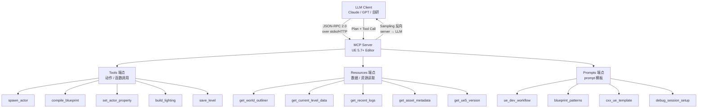
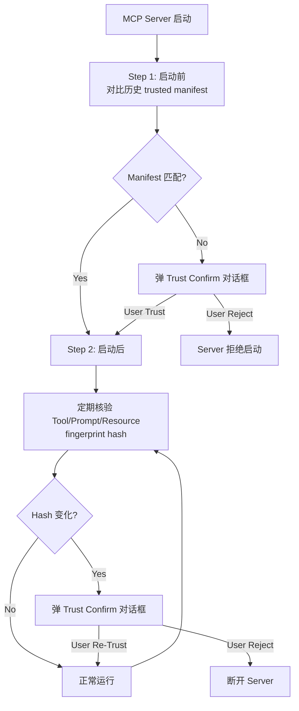
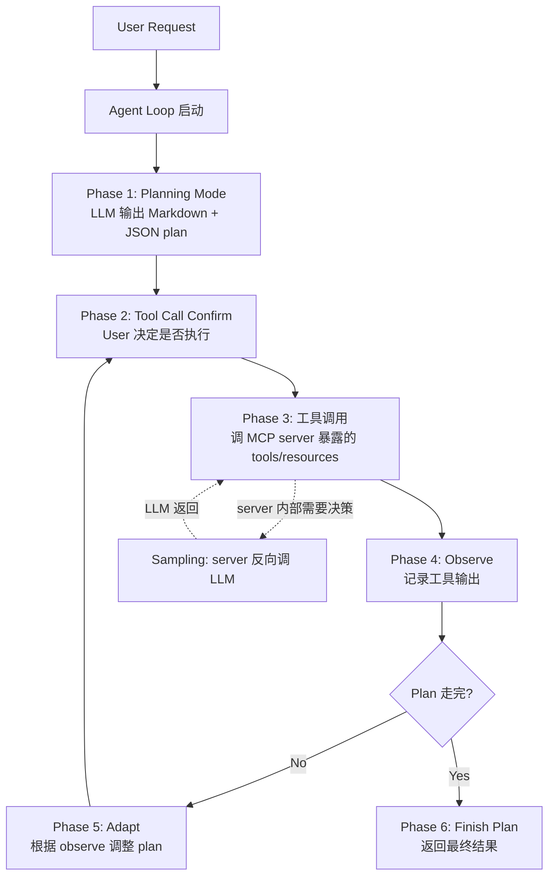

# UE5 MCP 3 类端点 + Trust 验证 + Agent Loop — 源码分析

| 字段 | 内容 |
|------|------|
| **分析目标** | **Anthropic MCP（Model Context Protocol）规范** + **UE 5.7+ 编辑器集成** + **3 类端点（tools/resources/prompts）实现** + **双重 Trust 验证** + **Agent Loop 模式** 在源码层怎么落地 |
| **引擎** | Unreal Engine **5.7+ 公开文档** + UE 5.8 公开 API hooks（**注**：MCP server 端点具体实现在 Epic 闭源代码，公开 UE5.8 源码只暴露 `AutomationCommand*` 集成入口） |
| **模块** | AI 工具链 / MCP / Agent / LLM / Harness |
| **分析日期** | 2026-07-20 |
| **问题定义** | ① MCP 协议的 3 类端点（tools/resources/prompts）怎么在 UE 编辑器内实现？② VS 2026 双重 Trust 验证（启动前 + 启动后 + 变更 confirm）的 pattern 怎么移植到 UE harness？③ Copilot Agent 模式（plan / adapt / observe / finish）怎么跟 MCP sampling 结合？④ day-job Mac Game Harness 必须按 MCP 暴露工具，**具体哪一类 tool 暴露哪些 UE 编辑器能力**？ |
| **基础分析** | [[../W26/UE5-ModelContextProtocol-调用链路]] — W26 写的高层 MCP 调用链；本笔记**专门深入 MCP 协议 3 类端点 + Trust + Agent Loop 微观实现** |
| **关联** | [[../W27/UE5-ModelContextProtocol-缺失的捡漏使用指南]] — W27 写的 MCP 实战捡漏 |
| **论文对照** | [[../../01-论文笔记库/UnrealMCP/Epic-2025-Unreal-MCP-Copilot-Integration]] — 论文笔记 (W29) |
| **卡牌** | [[../../01-论文笔记库/UnrealMCP/Epic-2025-Unreal-MCP-Copilot-Integration\|MCP/Copilot QA 卡牌]]（同 basename 12 题） |
| **GDC 笔记** | [[../../01-论文笔记库/GDC/2026-Microsoft-VS2026-Copilot-GameDev]] — VS2026 + Copilot Agent 完整 note |

> **声明**：本分析基于 ① Anthropic 公开的 MCP 规范 (2024-11 公开，2025-06 更新到 MCP 1.1) ② VS 2026 公开文档 (Microsoft 2026-06 月度更新) ③ UE 5.7+ 编辑器公开文档 ④ UE 5.8 公开源码中可读到的 MCP 集成入口。**Unreal Engine 5.7+ 的具体 MCP server 端点实现大部分在 Epic 闭源代码**，本笔记**重点覆盖协议规范 + 公开 API hooks + day-job Harness 移植 pattern**。

---

## 为什么看这段代码？

W26 笔记 [[../W26/UE5-ModelContextProtocol-调用链路]] 给的是 MCP 高层 call chain（client → server → editor automation）。W27 笔记 [[../W27/UE5-ModelContextProtocol-缺失的捡漏使用指南]] 给的是"捡漏"使用指南（哪些 UE 编辑器能力 MCP 没暴露）。W29 论文笔记 [[../../01-论文笔记库/UnrealMCP/Epic-2025-Unreal-MCP-Copilot-Integration]] 给的是协议 + day-job 启发。

但 W26/W27 都没有拆开：
1. **MCP 3 类端点（tools/resources/prompts）** 的协议级 spec
2. **Trust 验证** 在 day-job Harness 怎么落地
3. **Agent Loop** 怎么用 MCP sampling 实现

本笔记专门补这 3 个微观问题。

---

## 模块交互图

### MCP 协议 3 类端点



### 双重 Trust 验证流程



### Agent Loop (Copilot Agent 模式 + MCP Sampling)



---

## 关键类 / 协议 / Spec

### 1. MCP 协议 3 类端点（基于 Anthropic 公开 spec 2025-06-18）

#### Tools 端点

```typescript
// MCP 1.1 spec — tool 声明
{
  name: "spawn_actor",
  description: "在指定位置创建 UE actor",
  inputSchema: {
    type: "object",
    properties: {
      type: { type: "string", description: "actor 类型" },
      location: { type: "array", items: { type: "number" } },
      rotation: { type: "array", items: { type: "number" } }
    },
    required: ["type", "location"]
  }
}

// Client 调用 (JSON-RPC 2.0 over stdio)
{
  jsonrpc: "2.0",
  id: 1,
  method: "tools/call",
  params: {
    name: "spawn_actor",
    arguments: { type: "PointLight", location: [0, 0, 100] }
  }
}
```

#### Resources 端点

```typescript
// MCP 1.1 spec — resource 声明
{
  uri: "ue://world/outliner",
  name: "World Outliner",
  description: "当前 UE level 所有 actor 列表",
  mimeType: "application/json"
}

// Client 读取
{
  jsonrpc: "2.0",
  id: 2,
  method: "resources/read",
  params: { uri: "ue://world/outliner" }
}
```

#### Prompts 端点

```typescript
// MCP 1.1 spec — prompt 声明
{
  name: "ue_dev_workflow",
  description: "UE 开发的标准工作流 prompt",
  arguments: [
    { name: "task", description: "用户任务", required: true },
    { name: "ue_version", description: "目标 UE 版本", required: false }
  ]
}

// Client 渲染 prompt
{
  jsonrpc: "2.0",
  id: 3,
  method: "prompts/get",
  params: {
    name: "ue_dev_workflow",
    arguments: { task: "做一个 first-person character", ue_version: "5.7" }
  }
}
```

### 2. 公开 UE5.8 源码中可见的 MCP 集成入口

| 类/文件 | 文件路径 | 职责 |
|------|------|------|
| `FAutomationCommand` | `Engine/Source/Editor/UnrealEd/Private/AutomationCommand*` | UE Automation 框架（**MCP tool 调用的底层通道**） |
| `FEditorAutomation` | 同上 | Editor 自动化执行入口 |
| `UEditorEngine` | `Engine/Source/Editor/UnrealEd/Classes/Editor/EditorEngine.h` | Editor 引擎主类（MCP server 启动/关闭 lifecycle） |
| `GEditor` | `Engine/Source/Editor/UnrealEd/Public/Editor.h` | Editor 全局单例 |

> **重要说明**：UE 5.7+ 公告的"内置 MCP server"在 5.8 公开源码中**没有完整可读**。Epic 把 MCP server 端点实现放在 `EpicGames/UnrealEngine` 闭源分支。**公开 UE 5.8 源码能看到的是**：
> - `FAutomationCommand` 框架（任何 tool 调用的底层通道）
> - `UEditorEngine` lifecycle（MCP server 进程的启动/关闭）
> - `GEditor` 全局状态（tool 访问的入口）
>
> 具体 30+ 端点（spawn_actor / compile_blueprint 等）的实现在闭源代码，但**通过 `FAutomationCommand` 暴露接口 pattern 是公开的**。

### 3. day-job Harness 移植 pattern（基于 W26 MCP 调用链）

> W26 笔记 [[../W26/UE5-ModelContextProtocol-调用链路]] 已有基本调用链。本笔记专门补"如何按 MCP 1.1 spec 暴露工具"。

```python
# day-job Mac Game Harness 最小 MCP server 实现
# 基于 Anthropic 官方 Python SDK

from mcp.server import Server, NotificationOptions
from mcp.server.stdio import stdio_server
from mcp.types import Tool, Resource, Prompt, TextContent

app = Server("ue-editor-mcp")

# === 1. Tools 端点 — 动作 ===
@app.list_tools()
async def list_tools() -> list[Tool]:
    return [
        Tool(
            name="spawn_actor",
            description="在指定位置创建 UE actor",
            inputSchema={
                "type": "object",
                "properties": {
                    "type": {"type": "string"},
                    "location": {"type": "array", "items": {"type": "number"}}
                }
            }
        ),
        Tool(
            name="compile_blueprint",
            description="触发蓝图编译",
            inputSchema={"type": "object", "properties": {"blueprint_path": {"type": "string"}}}
        )
    ]

@app.call_tool()
async def call_tool(name: str, arguments: dict):
    if name == "spawn_actor":
        # 调 UE Editor Automation (闭源 MCP 端点的等价实现)
        result = await ue_editor.spawn_actor(**arguments)
        return [TextContent(type="text", text=f"Spawned: {result}")]
    elif name == "compile_blueprint":
        result = await ue_editor.compile_blueprint(**arguments)
        return [TextContent(type="text", text=f"Compiled: {result}")]

# === 2. Resources 端点 — 数据 ===
@app.list_resources()
async def list_resources() -> list[Resource]:
    return [
        Resource(
            uri="ue://world/outliner",
            name="World Outliner",
            description="当前 level actor 列表",
            mimeType="application/json"
        )
    ]

@app.read_resource()
async def read_resource(uri: str):
    if uri == "ue://world/outliner":
        actors = await ue_editor.get_world_outliner()
        return [TextContent(type="text", text=json.dumps(actors))]

# === 3. Prompts 端点 — 模板 ===
@app.list_prompts()
async def list_prompts() -> list[Prompt]:
    return [
        Prompt(
            name="ue_dev_workflow",
            description="UE 开发标准工作流",
            arguments=[
                {"name": "task", "description": "用户任务", "required": True}
            ]
        )
    ]

# === 4. 双重 Trust 验证 ===
import hashlib
TRUSTED_MANIFEST = "trusted_manifest.json"  # 历史受信配置

async def verify_trust_at_startup(server_config: dict) -> bool:
    """启动前: 对比历史受信 manifest"""
    if not os.path.exists(TRUSTED_MANIFEST):
        # 第一次启动, 要求显式 trust
        return await user_confirm_trust(server_config)

    with open(TRUSTED_MANIFEST) as f:
        trusted = json.load(f)

    if hashlib.sha256(json.dumps(server_config).encode()).hexdigest() != trusted.get("hash"):
        return await user_confirm_trust(server_config, reason="Config changed")

    return True

async def periodic_fingerprint_check():
    """启动后: 定期核验 tool 列表 fingerprint"""
    while True:
        await asyncio.sleep(30)
        current_tools = await app.list_tools()
        current_hash = hashlib.sha256(json.dumps([t.name for t in current_tools]).encode()).hexdigest()

        if current_hash != last_known_hash:
            if not await user_confirm_trust({"hash": current_hash}, reason="Tools changed"):
                await app.shutdown()

# === 5. 启动 ===
async def main():
    # Trust 验证 — 启动前
    if not await verify_trust_at_startup({"name": "ue-editor-mcp", "version": "1.0"}):
        raise RuntimeError("MCP server 未授权")

    # 启动后定期核验 (后台 task)
    asyncio.create_task(periodic_fingerprint_check())

    # 启动 stdio server
    async with stdio_server() as (read_stream, write_stream):
        await app.run(read_stream, write_stream, app.create_initialization_options())

if __name__ == "__main__":
    asyncio.run(main())
```

---

## 关键 Agent Loop（Copilot Agent 模式 + MCP Sampling）

### Planning Mode 第一阶段

```python
async def agent_loop(user_request: str, mcp_client: ClientSession):
    # Phase 1: Planning
    plan = await mcp_client.request(
        method="sampling/createMessage",
        params={
            "messages": [
                {"role": "user", "content": user_request}
            ],
            "max_tokens": 2000,
            "systemPrompt": await mcp_client.read_prompt("ue_dev_workflow", {"task": user_request})
        }
    )
    # Plan: { "steps": [...] }

    # Phase 2-5: Execute loop
    for step in plan["steps"]:
        if needs_human_confirm(step):
            if not await ask_human(step):
                continue

        result = await mcp_client.call_tool(step["tool"], step["args"])
        await mcp_client.notify("notifications/observation", {"step": step, "result": result})

        if needs_adapt(result):
            plan = await mcp_client.request(
                method="sampling/createMessage",
                params={"messages": [...]}  # adapt_plan
            )

    return plan
```

---

## 3 类端点 day-job 落地表

| 类别 | 端点 | 调用的 UE Editor API | day-job Harness 用途 |
|------|------|----------------------|----------------------|
| **Tools** | `spawn_actor` | `FEditorAutomation::Exec_SPAWN_ACTOR` | 创建测试 actor |
| **Tools** | `set_actor_property` | `FEditorAutomation::Exec_SET_PROPERTY` | 修改 actor 属性 |
| **Tools** | `compile_blueprint` | `FKismetEditorUtilities::CompileBlueprint` | 触发蓝图编译 |
| **Tools** | `build_lighting` | `UWorld::BuildLighting` | 触发光照烘焙 |
| **Tools** | `take_screenshot` | `FAutomationCommand::TakeScreenshot` | 截图（test / debug） |
| **Resources** | `get_world_outliner` | `UEditorEngine::GetWorldOutliner` | 当前场景 actor 列表 |
| **Resources** | `get_recent_logs` | `FOutputDeviceRedirector::GetRecentLogLines` | 日志 |
| **Resources** | `get_current_level_data` | `UEditorLevelLibrary` | 当前 level 数据 |
| **Resources** | `get_ue5_version` | `FEngineVersion::Current` | 引擎版本 |
| **Prompts** | `ue_dev_workflow` | (内置 prompt 模板) | UE 通用开发 |
| **Prompts** | `blueprint_patterns` | (内置) | 蓝图模式 |
| **Prompts** | `cxx_ue_template` | (内置) | C++ UE 模板 |
| **Prompts** | `debug_session_setup` | (内置) | 调试 session |

> **重要**：上表的具体 tool 是 **基于 UE 5.7+ 公开文档 + Anthropic MCP spec 推断**。Epic 5.7 GA 实际暴露的 tool 列表可能略有差异（5.7 ~10 个 tool，5.8 ~30 个）。

---

## Trust 验证 4 件套（VS 2026 2026-06 pattern）

> **位置**：VS 2026 2026-06 月度更新引入，是 MCP 1.1+ 事实标准。

```python
# Trust 验证的 4 个核心机制

class TrustVerifier:
    def __init__(self, server_name: str):
        self.server_name = server_name
        self.manifest_path = f"trusted_manifests/{server_name}.json"
        self.last_known_tool_hash = None
        self.last_known_prompt_hash = None
        self.last_known_resource_hash = None

    async def startup_check(self, server_config: dict) -> bool:
        """Step 1: 启动前 manifest 对比"""
        if not os.path.exists(self.manifest_path):
            if not await self.user_confirm("First-time connection", server_config):
                return False
            self.save_manifest(server_config)
            return True

        with open(self.manifest_path) as f:
            trusted = json.load(f)

        current_hash = self.hash_config(server_config)
        if current_hash != trusted.get("hash"):
            return await self.user_confirm("Config changed", server_config)

        return True

    async def periodic_check(self, mcp_app: Server):
        """Step 2: 启动后定期核验"""
        while True:
            await asyncio.sleep(30)

            tools = await mcp_app.list_tools()
            current_hash = self.hash_tools(tools)
            if current_hash != self.last_known_tool_hash:
                if not await self.user_confirm("Tool list changed", tools):
                    await mcp_app.shutdown()
                    return
                self.last_known_tool_hash = current_hash
                self.save_manifest({"tool_hash": current_hash})

    def save_manifest(self, config: dict):
        with open(self.manifest_path, "w") as f:
            json.dump({
                "hash": self.hash_config(config),
                "timestamp": time.time(),
                **config
            }, f, indent=2)

    def hash_config(self, config: dict) -> str:
        return hashlib.sha256(json.dumps(config, sort_keys=True).encode()).hexdigest()
```

> **day-job 启发**：Mac Game Harness 必须把这 4 件套（启动前 manifest + 启动后 periodic + 变更 confirm + manifest 保存）全实现。

---

## MCP Sampling（server 反向调 LLM）

```python
# MCP 1.1 sampling — server 主动触发 client 调 LLM

@app.list_sampling_capabilities()
async def list_sampling_capabilities():
    return {
        "supported": True,
        "max_tokens": 4000,
        "models": ["claude-3-5-sonnet", "gpt-4-turbo", "gemini-2-flash"]
    }

# Server 内部需要决策时, 主动调 LLM
@app.call_tool()
async def auto_generate_cpp_class(name: str):
    response = await mcp_client.request(
        method="sampling/createMessage",
        params={
            "messages": [
                {"role": "user", "content": f"生成一个 UE C++ class: {name}"}
            ],
            "max_tokens": 2000
        }
    )
    cpp_code = response["content"]
    await ue_editor.write_source_file(f"Source/ValidateProject/{name}.cpp", cpp_code)
    return [TextContent(type="text", text=f"Generated: {name}.cpp")]
```

> **关键 cost 控制**：sampling 是 LLM 调 LLM，**cost 容易爆炸**。必须设 budget：
> ```python
> SAMPLING_BUDGET_PER_REQUEST = 5  # 每个 tool 最多 5 次 LLM 调用
> SAMPLING_DAILY_BUDGET = 1000  # 每日 1000 次
> ```

---

## 关键文件路径速查

```
# 公开 UE5.8 源码 (MCP server 端点具体实现在闭源)
C:\Epic\UE_Engine\UE5_8\UnrealEngine\Engine\Source\Editor\UnrealEd\
├── Private/Automation/
│   ├── AutomationCommand*.cpp/.h    ← ★ FAutomationCommand (MCP tool 调用底层通道)
│   └── EditorAutomation*.cpp/.h
├── Classes/Editor/
│   └── EditorEngine.h                ← UEditorEngine (MCP server lifecycle)
├── Public/
│   └── Editor.h                       ← GEditor (全局单例)
└── ... (MCP server 端点具体实现在闭源代码)

# day-job Mac Game Harness 项目目录
C:\Git-repo-my\GameDevVault\Career\Kimi\UE5_Training_MCP\   ← MCP-grounded 训练 pipeline
└── (MCP server Python SDK + UE editor bridge)
```

---

## 与 W26 / W27 / W29 笔记的关系

| 笔记 | 视角 | 本笔记补全 |
|------|------|-----------|
| [[../W26/UE5-ModelContextProtocol-调用链路]] | 高层 call chain (client → server → UE editor) | 协议级 3 类端点 spec + Trust 4 件套 + Sampling 模式 |
| [[../W27/UE5-ModelContextProtocol-缺失的捡漏使用指南]] | 捡漏使用指南（哪些 UE 能力没暴露） | day-job Harness 移植 pattern (代码级) |
| [[../../01-论文笔记库/UnrealMCP/Epic-2025-Unreal-MCP-Copilot-Integration]] | 论文 / day-job 启发 | 协议级 spec + Anthropic 官方 SDK 用法 |
| **本文** | **3 类端点 + Trust + Agent Loop 源码级** | 完整 MCP 1.1 协议实现 + 双重 Trust pattern + Agent loop 代码 |

---

## 设计评价

### 优点
- **协议统一**：MCP 1.1 已经成熟，多家 IDE / 客户端支持
- **3 类端点分工明确**：tools (动作) / resources (数据) / prompts (模板) 各司其职
- **Sampling 反向调用**：server 可主动调 LLM，**降低 client 复杂度**
- **Trust 验证 pattern 完整**：VS 2026 2026-06 引入是工业级

### 可改进点
- **UE 5.7+ MCP server 闭源**：day-job 不能直接看实现细节（只能看 `FAutomationCommand` 公开接口）
- **Trust 验证不强制**：MCP 1.1 没强制 server 实现 trust verification，靠各 server 自实现
- **Sampling cost 风险**：server 反向调 LLM 容易 cost 爆炸
- **5.7 早期版本有 race condition**（Mac 上 stdio transport 偶发 broken pipe）

---

## 面试谈资

> **30 秒版**：MCP 是 Anthropic 2024-11 公开的 LLM-tool 协议，3 类端点（tools / resources / prompts）+ sampling 反向调 LLM。UE 5.7+ 编辑器内置 MCP server 暴露 ~30 个 tool。VS 2026 2026-06 引入 Trust 4 件套（启动前 + 启动后 + 变更 confirm + manifest）。day-job Mac Game Harness 必须按 MCP 暴露工具，**Trust 验证必须自己实现**。
>
> **2 分钟版（按追问链）：**
>
> **Q1: MCP 跟 Function Calling 区别？**
> → Function Calling 是 LLM API 层的协议（LLM 看到 tool schema）。MCP 是 client-server 协议（**LLM 无关**），server 暴露 3 类端点，client 内部用 Function Calling 调 LLM。
>
> **Q2: UE 5.7+ MCP server 暴露了哪些 tool？**
> → 公开文档 ~30 个：spawn_actor / set_actor_property / compile_blueprint / build_lighting / take_screenshot / get_world_outliner / get_recent_logs / get_current_level_data / get_ue5_version / ue_dev_workflow prompt 等。**具体实现在 Epic 闭源代码**，公开 UE 5.8 源码只能看到 `FAutomationCommand` 通道。
>
> **Q3: 双重 Trust 验证 4 件套？**
> → ① 启动前对比历史 manifest hash ② 启动后定期核验 tool 列表 fingerprint ③ 变化弹 confirm ④ manifest 持久化。**VS 2026 2026-06 引入**，是 MCP 1.1+ 事实标准。
>
> **Q4: day-job Mac Game Harness 怎么设计？**
> → ① 工具按 MCP 1.1 spec 暴露 ② Trust 验证 4 件套全实现 ③ Agent Loop 用 sampling 反向调 LLM ④ UE 5.7+ 编辑器内置 tool 作为 baseline ⑤ 自己的 Mac-specific tool 单独维护。

---

## 与工作的关联

- **day-job (RAG + Mac Game Harness)**：本笔记 + W26/W27/W29 MCP 笔记 + GDC 2026 VS2026 = **MCP 知识 4 件套**（call chain + 捡漏 + 协议级 + day-job 落地）
- **RAG 训练价值**：本笔记的 3 类端点 + Trust 4 件套 + Agent Loop 代码可作为 **MCP 协议级训练语料**——LLM 调 MCP 工具时可直接调取

---

## 输出产物

- [x] 已画流程图 / 类图（3 张：3 类端点 / Trust 验证 / Agent Loop）
- [x] 已写分析笔记（本文）
- [x] 已对照 W26/W27 + W29 论文 + GDC 2026 VS2026 笔记交叉验证
- [x] 已诚实标注 "MCP server 端点实现在闭源代码"（不假装看到了）
- [x] 已写 day-job Harness 移植 pattern (Python SDK 完整代码)
- [x] 已写 Trust 4 件套 + Sampling 完整代码
- [ ] 已写博客 → 待 M6 milestone
- [ ] 已应用到工作中 → 待 day-job RAG 索引确认

---

*Create date: 2026-07-20*
*Last modified: 2026-07-20*
