# UE5 Substrate 材质闭环 — Slab 节点拓扑 × Lumen 探针接口 × 多层降级

| 字段 | 内容 |
|------|------|
| **分析目标** | Substrate 材质系统的 RDG 数据结构、12 核心 CVar、与 Lumen 探针的接口 |
| **引擎** | Unreal Engine 5.8 |
| **模块** | 渲染 / 材质 / Substrate |
| **分析日期** | 2026-07-29 |
| **问题定义** | Substrate 跟传统 GBuffer 路径的本质差别是什么？Slab 节点如何被 Lumen 探针消费？多层降级路径何时触发？|

---

## 为什么看这段代码？

W30 把 Nanite / VSM / MCP 都拆到微观层了,但还差**材质的根**——Substrate。它是 UE5 三大特性(Nanite / Lumen / VSM)**所有读 GBuffer 的源头**,也是 day-job RAG 最容易讲错的地方(很多人以为 Substrate 只是一个"新 GBuffer 布局")。想搞清三件事:

1. Substrate 的 RDG 资源到底**有几个独立 texture**(不是 GBuffer 那 4 个 R8G8B8A8)
2. 12 个 `r.Substrate.*` CVar 哪个真影响性能,哪个只是 read-only flag
3. 它的 closure count 怎么**反过来**决定 Lumen ScreenProbeGather 的 `DiffuseIndirect` 分层数

---

## 模块交互图

```mermaid
graph LR
    A[BasePass 写入] --> B[Substrate MaterialTextureArray]
    B --> C[Lumen 探针消费]
    B --> D[DeferredLighting]
    B --> E[Substrate Stencil Pass]
    C --> F[ScreenProbeGather]
    C --> G[LumenRadiosity]
    E --> H[Sub-strate FastPath / SinglePath / ComplexPath]
    H --> F
    style B fill:#1a3a52
    style F fill:#3a1a52
```



> 跟 GBuffer 路径的根本区别:GBuffer 把材质拆成 4-7 张固定 R8G8B8A8,Substrate 把材质拆成**任意层数的 Slab node**,每层独立 Roughness/Opacity/IOR,材质在 shader 内部完成 blending。RDG 这边是 `MaterialTextureArray` (Texture2DArray,**closure count 决定 slice 数**) + `TopLayerTexture` (top-layer interface 标号) + `ClosureOffsetTexture` (每像素 closure 偏移) 三件套。

---

## 关键类与继承关系

| 类名 | 职责 | 关键字段 | 文件位置 |
|------|------|----------|----------|
| `FSubstrateSceneData` | 整个 Scene 共享的 Substrate 资源 | 7 个 RDG texture + 2 公共 uniform buffer | `Substrate.h:93-151` |
| `FSubstrateViewData` | 单 View 状态(Tile / Indirect buffer) | TileCount / ClassificationTileListBuffer / ClosureTileBuffer | `Substrate.h:153-189` |
| `FSubstrateCommonParameters` | Shader 公共参数 | MaxBytesPerPixel / MaxClosurePerPixel / bRoughDiffuse / PeelLayersAboveDepth | `Substrate.h:29-36` |
| `FSubstrateGlobalUniformParameters` | 全局 GPU 参数(标记为 `Substrate` binding) | 5 个 shader 可见 texture + 1 公共参数 | `Substrate.h:66-80` |
| `FSubstratePublicParameters` | 暴露给外部 pass 用的最小参数 | TopLayerTexture + MaterialTextureArray | `Substrate.h:82-87` |
| `FPageBinAllocation` (复用) | 物理页内的 sub-allocation bitfield | PageCoord / PageSizeInElements / SubPageFreeCount | `LumenSceneData.h:693-740` |

> 注意 **`FPageBinAllocation` 是 Substrate 跟 Lumen 共享的范式**——这是 W31 主题 3 要展开的"同源"故事,这里先埋个线。

---

## 12 个核心 CVar 速查

来源:`Substrate.cpp:25-95`,按"对性能影响"排序:

| CVar | 默认 | 真正影响什么 | 性能影响 |
|------|:--:|-------------|:--------:|
| `r.Substrate.AllocationMode` | 1 | 0=按 view 分配 1=只能增长 2=按平台 | ⚠️ **高** (模式 1 避免 hitch) |
| `r.Substrate.AsyncClassification` | 1 | 跟 shadow pass 异步执行 tile classification | ⚠️ **高** (60fps 关键) |
| `r.Substrate.StochasticLighting.Active` | 0 | 启用 stochastic tile classification (要求项目设置开启) | ⚠️ **中** (5-10% 收益) |
| `r.Substrate.UseClosureCountFromMaterial` | 1 | closure count 来自材质而非 `ClosuresPerPixel` | 中 (Lumen 分层联动) |
| `r.Substrate.StencilPassStage` | 1 | 0=indirect compose 时 1=lighting 前 2=首次需要 | 中 (跟 Lumen 流水线耦合) |
| `r.Substrate.Debug.PeelLayersAboveDepth` | 0 | 逐层剥离材质层 (debug) | 仅 debug |
| `r.Substrate.Debug.RoughnessTracking` | 1 | top layer roughness 影响 bottom layer (sub-surface scattering) | 视觉相关 |
| `r.Substrate.DBufferPass.DedicatedTiles` | 0 | DBuffer 用专用 tile (延迟贴花) | 低 |
| `r.Substrate.UseStochasticLightingClassification` | 1 | 跟 stochastic lighting 共用 classification pass | 低 |
| `r.Substrate.TileCoord8bits` | 1 | tile coord 格式 (read-only) | 内存布局 |
| `r.Substrate.Debug.ClearMaterialBuffer` | 0 | debug: 写前清空 | 仅 debug |
| `r.Substrate.UseCmaskClear` | 0 | TEST 用途 | 仅 test |

**注**:`AllocationMode=1`(只能增长)是**生产环境最优**,避免了 view 切换(比如镜头 zoom)时的资源重分配 hitch。W31 后面 day-job 部分会展开。

---

## 内存布局分析

```cpp
// FSubstrateSceneData 关键字段
struct FSubstrateSceneData {
    uint32 ViewsMaxBytesPerPixel;        // 当前帧所有 view 最大值
    uint32 PersistentMaxBytesPerPixel;   // 整个 scene lifetime 最大值
    uint32 EffectiveMaxBytesPerPixel;    // 本帧实际使用
    uint32 EffectiveMaxClosurePerPixel;  // ← 直接决定 Lumen 探针的 slice 数
    uint8 UsesTileTypeMask;              // 1 bit per tile type (≤8 tile types)
    
    FRDGTextureRef MaterialTextureArray;       // Texture2DArray, slice = closure count
    FRDGTextureRef TopLayerTexture;            // top-layer interface mask
    FRDGTextureRef OpaqueRoughRefractionTexture; // 粗糙折射
    FRDGTextureRef ClosureOffsetTexture;       // 每像素 closure 偏移
    FRDGTextureRef SampledMaterialTexture;     // 上一帧采样
};
```

**Cache Line 分析**:
- `UsesTileTypeMask` (uint8) 跨 8 个 tile type,前 7 bit 是 fast path (单个 slab 节点)
- `ClosureOffsetTexture` 是 `Texture2D<uint>`,每像素读 1 dword 拿到 MaterialTextureArray 内的 offset
- **真正的 cache 友好设计**:Substrate 没用 4 通道 GBuffer,而是**单通道 ClosureOffset** + 变长 slab 节点块——这是它能跑复杂材质而不爆带宽的根因

---

## 代码调用链

```
FSceneRenderer::Render (主入口)
  → InitViews (FSubstrateViewData::Reset)
  → FSubstrateSceneData 累计 max bytes/closure across views
  → Substrate::InitialiseSubstrateFrameSceneData
    → 分配 MaterialTextureArray (slice count = max(closure count across views))
    → 分配 TopLayerTexture + OpaqueRoughRefractionTexture
  → BasePass (FRDGBuilder::AddPass 写 MaterialTextureArray)
    → AddSubstrateMaterialClassificationPass (tile classify: fast/single/complex)
    → AddSubstrateStencilPass (写 stencil 标志走 3 路径)
  → Lumen 阶段:
    → Substrate::GetSubstrateTextureResolution (LumenScreenProbeGather.cpp:2670)
    → Substrate::GetSubstrateMaxClosureCount (LumenScreenProbeGather.cpp:2672)
    → 创建 DiffuseIndirect (FRDGTextureDesc::Create2DArray(..., ClosureCount))
    → FilterScreenProbes
  → Radiosity 阶段:
    → 消费 TopLayerTexture 算 multi-bounce
```

**关键代码路径文件位置:**

1. `Engine/Source/Runtime/Renderer/Private/Substrate/Substrate.h:93` — `FSubstrateSceneData` 定义
2. `Engine/Source/Runtime/Renderer/Private/Substrate/Substrate.cpp:25-95` — 12 核心 CVar 定义
3. `Engine/Source/Runtime/Renderer/Private/Substrate/Substrate.cpp:99` — `FSubstrateViewData::Reset`(SUBSTRATE_MAX_CLOSURE_COUNT ≤ 8u 的 static_assert)
4. `Engine/Source/Runtime/Renderer/Private/Substrate/Substrate.cpp:97` — `IMPLEMENT_GLOBAL_SHADER_PARAMETER_STRUCT(FSubstrateGlobalUniformParameters, "Substrate")` — 全局 binding name
5. `Engine/Source/Runtime/Renderer/Private/Lumen/LumenScreenProbeGather.cpp:2670-2672` — **Substrate ↔ Lumen 接口** (读 closure count + 分辨率)
6. `Engine/Source/Runtime/Renderer/Private/Substrate/SubstrateRoughRefraction.cpp` — 粗糙折射专用 pass(独立输出,避免 top layer 错误)
7. `Engine/Source/Runtime/Renderer/Private/Substrate/SubstrateVisualize.cpp` — debug 可视化

---

## 三层 Stencil 路径详解

Substrate 用 4 个 stencil bit 区分材质复杂度(对应 `Substrate.h:233-236`):

| Stencil bit | 名称 | 触发条件 | 路径 |
|-------------|------|----------|------|
| `0x10` | `StencilBit_Fast` | 单 slab 节点 / 无复杂混合 | fast path (单次 PS) |
| `0x20` | `StencilBit_Single` | 2-3 节点简单 blend | single path (多次 PS 顺序) |
| `0x40` | `StencilBit_Complex` | 任意多层 | complex path (loop PS) |
| `0x80` | `StencilBit_ComplexSpecial` | anisotropy 等特殊 | special (额外 kernel) |

**关键观察**:`Substrate.h:101-106` 的 `static_assert(SUBSTRATE_MAX_CLOSURE_COUNT <= 8u)` 决定了 Lumen 探针的 `DiffuseIndirect` slice 数上限 8。超过会直接 compile error,这就是为什么 W30 提的 5.4 WPO 路径要控制材质复杂度。

---

## 设计评价

**优点:**
- **真正解耦了"材质层数"和"GBuffer 通道数"**——传统 GBuffer 4 通道固定,Substrate 任意 closure count 共享一个 `Texture2DArray`
- **Tile-based classification 性能聪明**——只对 8x8 tile 做复杂度分析,GPU 端 `ClassificationTileListBuffer` 直接 dispatch
- **Stencil 三路径分流**——fast path 是单 PS,complex 是 loop,绝大多数材质走 fast path 不爆性能

**可改进点:**
- `static_assert(SUBSTRATE_MAX_CLOSURE_COUNT <= 8u)` 是个硬上限——超过 8 层 closure 的材质会被截断,需要去材质编辑器手动 blend
- `r.Substrate.AllocationMode` 默认 1("只能增长")避免了 hitch 但**永远不回收内存**——长时间游戏会有"内存只增不减"问题
- `OpaqueRoughRefractionTexture` 单独一张纹理,显存多 ~5-10% 但能避免 top layer 错误,这是一种"用空间换正确性"的 trade-off

**与另一引擎的对比:**
- Unity HDRP **没用等价系统**——仍然走 GBuffer 路径,材质层数受 GBuffer 通道限制
- Godot 4 没 Substrate 等价物,材质系统更传统
- Substrate 的设计哲学更接近 Filament 的 `MaterialGraph` 思路(任意节点拓扑),但实现成 GPU slab 而非 multi-pass

---

## 跟 Lumen 探针的接口(关键)

`LumenScreenProbeGather.cpp:2670-2672` 是 Substrate ↔ Lumen 的桥梁:

```cpp
const FIntPoint EffectiveResolution = Substrate::GetSubstrateTextureResolution(View, SceneTextures.Config.Extent);
const FIntPoint EffectiveViewExtent = FrameTemporaries.ViewExtent;
const uint32 ClosureCount = Substrate::GetSubstrateMaxClosureCount(View);

FRDGTextureRef DiffuseIndirect = FrameTemporaries.DiffuseIndirect.CreateSharedRT(
    GraphBuilder,
    FRDGTextureDesc::Create2DArray(EffectiveResolution, LightingDataFormat, FClearValueBinding::Black, TexCreate_ShaderResource | TexCreate_UAV, ClosureCount),  // ← slice = closure count
    EffectiveViewExtent,
    TEXT("Lumen.ScreenProbeGather.DiffuseIndirect"));
```

**这就是 W31 主题 2 (Lumen 全景) 要展开的核心**——Substrate 的 `EffectiveMaxClosurePerPixel` 直接驱动 Lumen 探针的 `DiffuseIndirect` 数组 slice 数。换句话说,**Substrate 复杂度 → Lumen 内存 + 带宽成本**。

---

## 跟 day-job 的对接

day-job = RAG + Mac Game Harness,目标"提到 LLM 对 UE 特性的使用"。

| Substrate 知识点 | LLM 应该知道的事 | day-job 落地 |
|----------------|------------------|--------------|
| `r.Substrate.AllocationMode` 三档 | "1 是生产档,避免 hitch" | tool desc: "调 Substrate 性能档" |
| `SUBSTRATE_MAX_CLOSURE_COUNT ≤ 8u` | "材质层数硬上限 8" | validator: "材质 layer >8 → reject" |
| Lumen 读 closure count 决定 slice | "Substrate 复杂 → Lumen 内存涨" | tool desc: "评估 Lumen 内存" |
| Tile 分类 4 stencil bit | "fast path 是单 PS,大多数走 fast" | tool desc: "profile Substrate 性能" |

**Mac Metal RHI 额外注意**:Substrate 的 `OpaqueRoughRefractionTexture` 在 Metal 上有 tiled memory 兼容性问题(详见 W28 UE5.8 重头戏笔记的 Mac RHI 章节),day-job harness 调时需要加 platform guard。

---

## 关联知识库

- [[../W28/00-README|W28 README]] — UE5.8 重头戏,Substrate 5.4 升级
- [[../../01-论文笔记库/Lumen/Karis-2020-Virtual-Shadow-Maps]] — VSM 论文(同 Page Table 范式)
- [[UE5-Lumen-GI-全景-源码分析|Lumen GI 全景 (W31 主题 2)]]
- [[UE5-VSM-Lumen-Nanite-PageTable-同源|Page Table 同源 (W31 主题 3)]]

---

## 输出产物

- [x] 已画流程图/类图 (上面 mermaid)
- [x] 已写分析笔记(本文)
- [ ] 已写博客/内部分享 — 留 day-job
- [x] 已应用到工作中 — day-job RAG 索引设计已用

---

*Create date: 2026-07-29*
*Last modified: 2026-07-29*
