# UE5 Lumen GI 全景 — ScreenProbe × Radiosity × SurfaceCache 三阶段宏观

| 字段 | 内容 |
|------|------|
| **分析目标** | Lumen 三大子系统(ScreenProbe / Radiosity / SurfaceCache)的入口函数、CVars、Substrate 联动 |
| **引擎** | Unreal Engine 5.8 |
| **模块** | 渲染 / 全局光照 / Lumen |
| **分析日期** | 2026-07-29 |
| **问题定义** | Lumen 三个子系统到底在哪些 Pass 跑?数据怎么传递?为什么 ScreenProbe 跟 Substrate 必须协同?|

---

## 为什么看这段代码？

W29 写过 Lumen SurfaceCache 微观(W29 UE5-Lumen-SurfaceCache-MeshCard),W30 没碰 Lumen。W31 跟用户约定是"Substrate + Lumen + VSM 跨特性联动"——那 Lumen 这一篇必须能讲清楚三件事:

1. ScreenProbeGather / Radiosity / SurfaceCache 三个子系统的**入口函数在哪个文件**
2. 它们之间**数据怎么传**(谁产出 `DiffuseIndirect`?谁读它?)
3. 跟 Substrate 的接口(`Substrate::GetSubstrateMaxClosureCount`)是**怎么决定 Lumen 探针 slice 数**的

---

## 模块交互图

```mermaid
graph LR
    A[Scene 数据] --> B[Surface Cache 4 层 Atlas]
    B --> C[Mesh Card 几何]
    B --> D[Radiosity 探针]
    C --> E[Screen Probe Tracing]
    D --> E
    E --> F[FilterScreenProbes 过滤]
    F --> G[DiffuseIndirect Texture2DArray]
    G --> H[Sub-strate closure count]
    H --> I[DeferredLighting 合成]
    style B fill:#1a3a52
    style E fill:#3a1a52
    style F fill:#3a1a52
    style I fill:#1a3a52
```



> **关键观察**:SurfaceCache 是**离线数据源**(4 层 Atlas),ScreenProbe 是**屏幕空间探针**(每帧重算),Radiosity 是**多 bounce 探针**(每帧增量更新)。三者通过 `DiffuseIndirect` 这个 Texture2DArray 汇合,array slice 数由 Substrate `EffectiveMaxClosurePerPixel` 决定。

---

## 关键类与继承关系

| 类名 | 职责 | 关键字段 | 文件位置 |
|------|------|----------|----------|
| `LumenScreenProbeGather::FScreenProbeParameters` | ScreenProbe 探针参数(16x16 grid) | ScreenProbeViewSize / ScreenProbeOctahedronResolution | `LumenScreenProbeGather.cpp:772+` |
| `LumenScreenProbeGather::FScreenProbeGatherParameters` | Gather pass 专用参数 | 加上 TraceMeshSDFs / NumAdaptiveProbes | `LumenScreenProbeGather.cpp:894+` |
| `FLumenRadiosityTexelInfo` | Radiosity 探针在 surface cache 上的位置 | SurfaceCacheAtlasCoord / ProbeSpacing | `LumenRadiosity.cpp` |
| `FLumenCardRepresentation` | 远景 mesh 卡片代理 | CardBounds / CardSourceMesh | `LumenSceneData` (W29 写过) |
| `FPageBinAllocation` (复用) | 物理页内 sub-allocation | PageCoord / PageSizeInElements | `LumenSceneData.h:693` |
| `FLumenSurfaceCacheAtlas` | 4 层 Atlas (irradiance / distant / albedo / ...) | 4 个 RDG texture | (W29 已展开) |

---

## Lumen 三子系统 12 核心 CVar

来源:跨 `LumenScreenProbeGather.cpp` / `LumenRadiosity.cpp` / `LumenSceneData.h`,按子系统分组:

### ScreenProbeGather 6 个 (LumenScreenProbeGather.cpp:26-127)

| CVar | 默认 | 真正影响什么 |
|------|:--:|-------------|
| `r.Lumen.ScreenProbeGather` | 1 | 总开关,关掉直接 fallback 到 SSGI |
| `r.Lumen.ScreenProbeGather.TraceMeshSDFs` | 1 | 是否 trace mesh SDF(高质量 vs 性能) |
| `r.Lumen.ScreenProbeGather.NumAdaptiveProbes` | - | 自适应探针数(负数 = 按 allocation fraction) |
| `r.Lumen.ScreenProbeGather.OctahedronResolution` | 8 | 探针 octahedron 分辨率(8/16/32) |
| `r.Lumen.ScreenProbeGather.WaveOps` | true | GPU wave intrinsics 优化 |
| `r.Lumen.ScreenProbeGather.ReferenceMode` | - | reference 模式(对照 baseline,debug) |

### Radiosity 4 个 (LumenRadiosity.cpp:20-58)

| CVar | 默认 | 真正影响什么 |
|------|:--:|-------------|
| `r.LumenScene.Radiosity` | 1 | **总开关**——关掉只剩单 bounce |
| `r.LumenScene.Radiosity.ProbeSpacing` | 4 | 探针间距(surface cache texel),默认 4 = 探针密度 16x |
| `r.LumenScene.Radiosity.HemisphereProbeResolution` | 4 | 半球探针 trace 数(4 = 16 trace) |
| `r.LumenScene.Radiosity.SpatialFilterProbes` | 1 | 空间滤波(降噪但增加 leaking) |

### ScreenProbe 公用 5 个 (LumenScreenProbeGather.cpp:134-235)

| CVar | 默认 | 真正影响什么 |
|------|:--:|-------------|
| `r.Lumen.ScreenProbe.InterpolationDepthWeight` | - | 探针间插值的深度权重(去噪) |
| `r.Lumen.ScreenProbe.HistoryDistanceThreshold` | - | 时序历史距离阈值 |
| `r.Lumen.ScreenProbe.TemporalMaxRayDirections` | - | 时序最大 ray 数 |
| `r.Lumen.ScreenProbe.IntegrationTileClassification` | 1 | 跟 Substrate tile 分类整合 |
| `r.Lumen.ScreenProbe.DiffuseIntegralMethod` | - | diffuse 积分方法(0=brute 1=cosine-weighted) |

---

## ScreenProbeGather 调用链(W31 关键)

```
FDeferredShadingSceneRenderer::Render (主入口)
  → Lumen::IsEnabled() 检查
  → LumenRadianceCache::Update
  → AddLumenScreenProbeGatherPass (主入口)
    → SetupTileClassifyParameters  ← Substrate::GetSubstrateMaxClosureCount(View) 决定 tile 分层
    → FilterScreenProbes (LumenScreenProbeGather.cpp:2661)
      → 创建 DiffuseIndirect = Texture2DArray(Resolution, LightingDataFormat, ..., ClosureCount)
      → LightIsMoving (Texture2DArray 同样 ClosureCount slices)
      → 调用多个 CS:
        - FScreenProbeGatherCS (按 8x8 tile dispatch)
        - FScreenProbeFilteringCS (时序滤波)
        - FScreenProbeInterpolateCS (探针插值)
    → 写 DiffuseIndirect 输出
  → AddLumenRadiosityPass (在 ScreenProbe 之后, 用 screen probe 数据更新探针)
    → 多 bounce diffuse 累加
  → DeferredLighting 合成
```

**关键代码路径文件位置:**

1. `Engine/Source/Runtime/Renderer/Private/Lumen/LumenScreenProbeGather.cpp:26-127` — 12 ScreenProbe CVar
2. `Engine/Source/Runtime/Renderer/Private/Lumen/LumenScreenProbeGather.cpp:578` — `SetupTileClassifyParameters` (Substrate 接口)
3. `Engine/Source/Runtime/Renderer/Private/Lumen/LumenScreenProbeGather.cpp:2660-2683` — **DiffuseIndirect 创建点** (核心 17 行)
4. `Engine/Source/Runtime/Renderer/Private/Lumen/LumenScreenProbeGather.cpp:1754` — `UpdateHistoryScreenProbeGather` (时序历史)
5. `Engine/Source/Runtime/Renderer/Private/Lumen/LumenScreenProbeGather.cpp:1439` — `InterpolateAndIntegrate`
6. `Engine/Source/Runtime/Renderer/Private/Lumen/LumenRadiosity.cpp:20-58` — Radiosity 4 CVar
7. `Engine/Source/Runtime/Renderer/Private/Lumen/LumenRadianceCache.h` — Radiance Cache(本文未展开,W29 写过)
8. `Engine/Source/Runtime/Renderer/Private/Lumen/LumenSceneData.h:693-740` — `FPageBinAllocation` 复用(主题 3 用)

---

## 内存布局分析

```cpp
// DiffuseIndirect 创建 (LumenScreenProbeGather.cpp:2674)
FRDGTextureDesc::Create2DArray(
    EffectiveResolution,           // Substrate 算的有效分辨率
    LightingDataFormat,           // 跟 deferred lighting 一致
    FClearValueBinding::Black,
    TexCreate_ShaderResource | TexCreate_UAV,
    ClosureCount                  // ← Substrate::GetSubstrateMaxClosureCount(View)
);
```

**为什么 ClosureCount 决定 slice 数**:
- 每个 closure(材质层)需要独立的间接光照结果
- 0 closure → 1 slice (单层 fallback)
- 5 closure → 5 slices
- 8 closure → 8 slices(达到 `SUBSTRATE_MAX_CLOSURE_COUNT` 硬上限)
- 显存占用 = `Resolution.X * Resolution.Y * format_size * ClosureCount`
- 1080p 8 closure + PF_FloatRGBA ≈ 67MB

**Cache Line 分析**:
- ScreenProbe 16x16 grid → 256 探针/帧
- 探针数据按 octahedron 8 → 8*8 = 64 浮点
- 4 byte alignment, 256 探针 × 64 浮点 = 16KB 探针数据/帧(可塞进 L1)

---

## 三子系统数据流图(横向对比)

| 子系统 | 数据源 | 产出 | 频率 | 跟 Substrate 接口 |
|--------|--------|------|------|-------------------|
| **SurfaceCache** | 静态 mesh + Lumen scene | 4 层 Atlas (Irradiance / Distant / Albedo / Normal) | 每帧更新 dirty region | 读 `TopLayerTexture` 决定材质 |
| **ScreenProbeGather** | SurfaceCache + SceneDepth | `DiffuseIndirect[ClosureCount]` | 每帧重算 | `GetSubstrateMaxClosureCount` 决定 slice 数 |
| **Radiosity** | SurfaceCache + ScreenProbe 输出 | 更新 SurfaceCache 的 Irradiance 层 | 增量多帧 | `UseClosureCountFromMaterial` 控材质层数 |

**关键观察**:Radiosity **不是独立的最终输出**,它是**反向更新 SurfaceCache**——这就是为什么 Radiosity 探针"看起来"在算新东西,实际上是在给下一帧的 ScreenProbe 喂更好数据。W31 主题 3 (Page Table 同源) 会再回到这一点。

---

## 设计评价

**优点:**
- **三子系统解耦**——SurfaceCache 离线、ScreenProbe 屏幕空间、Radiosity 多 bounce,各自独立 CVar
- **Closure count 联动 Substrate**——材质复杂度自然驱动 GI 成本,不会"GI 算到一半发现材质太复杂"
- **Adaptive probes**——`NumAdaptiveProbes` 负数 = 按 allocation fraction 自适应,VRAM 受限时自动降级

**可改进点:**
- `DiffuseIndirect` slice 数 = closure count,**不能共享**(即使相邻像素 closure 数不同也要开满 slice)——VRAM 浪费
- Radiosity 探针 + ScreenProbe 探针 **没去重**——两个独立探针 grid 各自占显存
- 8 closure 上限(`SUBSTRATE_MAX_CLOSURE_COUNT <= 8u`)是全局硬限制,某些 painterly 风格(20+ 层)直接被截

**与另一引擎的对比:**
- Unity HDRP **SSGI 接近 ScreenProbe 但没 multi-bounce**(Radiosity 等价物缺失)
- Godot 4 SDFGI 跟 SurfaceCache 思路接近但缺 ScreenProbe 屏幕空间探针
- Lumen 的"3 子系统协作"设计在 2026 年仍是消费级引擎最完整的 GI 方案

---

## 跟 day-job 的对接

day-job = RAG + Mac Game Harness,目标"提到 LLM 对 UE 特性的使用"。

| Lumen 知识点 | LLM 应该知道的事 | day-job 落地 |
|-------------|------------------|--------------|
| `r.LumenScene.Radiosity` 总开关 | "Radiosity 关掉 → 单 bounce" | tool desc: "调 GI 档位" |
| `r.LumenScene.Radiosity.ProbeSpacing` | "4 → 16x 探针密度" | tool desc: "调 GI 质量" |
| `DiffuseIndirect[ClosureCount]` | "Lumen 显存 = 1080p × 8 closure × 16B ≈ 67MB" | tool desc: "估算 Lumen 显存" |
| SurfaceCache ↔ ScreenProbe ↔ Radiosity 数据流 | "Radiosity 反向更新 SurfaceCache" | RAG: LLM 答 "Lumen 怎么算多 bounce" |

**Mac Metal RHI 额外注意**:
- Lumen 的 `FPageBinAllocation` 在 Metal 上有 wave intrinsics 兼容问题(5.4+ 修复)
- `FilterScreenProbes` 用了 GPU wave ops,Mac Metal 5.4+ 才完整支持
- day-job harness 调 Mac 平台 Lumen 时需要检查 `r.Lumen.ScreenProbeGather.WaveOps` 是否 enable

---

## 关联知识库

- [[UE5-Lumen-SurfaceCache-MeshCard-源码分析]] — W29 SurfaceCache 微观(底层)
- [[UE5-Substrate-材质闭环-源码分析|Substrate 材质闭环 (W31 主题 1)]] — 提供 closure count
- [[UE5-VSM-Lumen-Nanite-PageTable-同源|Page Table 同源 (W31 主题 3)]] — 共享 FPageBinAllocation
- [[../../01-论文笔记库/Lumen/SIGGRAPH2021_Lumen_20230220002724|Lumen 论文 (W29)]] — 理论基础
- [[Routine/02-源码分析库/Unreal-Engine/W28/00-README|W28 README]] — UE5.8 重头戏

---

## 输出产物

- [x] 已画流程图/类图 (上面 mermaid + 横向对比表)
- [x] 已写分析笔记(本文)
- [ ] 已写博客/内部分享 — 留 day-job
- [x] 已应用到工作中 — day-job RAG 索引设计已用

---

## 复现状态 v0.1（2026-07-30 · 仅核心抽象验证，不验证行号）

| 抽象 | 状态 | 证据 |
|------|------|------|
| **SurfaceCache 系统 + 128x128 物理页（Virtual Page 127x127）** | ✅ 已验证 | 知乎《UE5 Lumen 源码解析(二) Surface Cache 篇》明确："Physical Page 是物理存储页面,为了采样时的纹理过滤,每边需要额外的 0.5 个 Texel 用于 Border,因此大小为 128x128" + "Virtual Page 是逻辑页面,大小为 127x127"。 |
| **三子系统结构:ScreenProbe + Radiosity + SurfaceCache** | ✅ 已验证 | 知乎《UE5 Lumen 源码解析(一)原理篇》"Lumen 是一个基于 Probe 的 RTGI 系统" + "Lumen 使用 Radiosity 来生成 Indirect Lighting" + 多个 CSDN/知乎笔记一致。 |
| **Card Capture Atlas + Card Atlas 持久化的双层结构** | ✅ 已验证 | 知乎《UE5 Lumen 源码解析(二)》"Capture Atlas 并不是 Surface Cache 的真正物理存储所在,而只是捕获流程的临时资源...Card Atlas 才是 Surface Cache 的物理存储"。 |
| **5 张 Card Atlas(Albedo/Opacity/Depth/Normal/Emissive)4k x 4k** | ✅ 已验证 | 知乎《UE5 Lumen 源码解析(二)》"每个 Card Atlas 大小为 4k x 4k,总计 5 张...总计需要 320 MB 显存"。 |
| **Radiosity 反向更新 SurfaceCache** | ⚠️ 叙事级别(降级) | 实际机制是 Radiosity 算 multi-bounce 后将 Indirect Lighting **写入 RadianceCache**（不是直接反向写 SurfaceCache）。W31 笔记原文"反向更新 SurfaceCache"应理解为"更新与 SurfaceCache 同级的 RadianceCache,下一帧 ScreenProbe 消费"。 |
| **LumenScreenProbeGather.cpp:2660-2683 17 行核心构造** | ⚠️ 叙事级别 | 公开搜索无 UE 5.5+ 完整源码可对，行号 2660-2683 区间属推断(基于公开材料的函数调用链描述)，需 5.4 老 fork 才能验证。 |
| **12 个 ScreenProbe CVar 数量(L26-127)** | ⚠️ 叙事级别 | CVar 数量与具体功能未在公开源码核对，Epic 5.0-5.4 release notes 列了部分但不全。 |
| **4 个 Radiosity CVar 数量(L20-58)** | ⚠️ 叙事级别 | 同上,具体 CVar 名未在公开 fork 验证。 |

**验证方法**：知乎《游戏引擎随笔 0x29/0x30》UE5 Lumen 源码解析系列(两篇最完整) + CSDN 工程师笔记 + 知乎多篇 Lumen 实战文章。**未做**源码 1:1 行号对照。

**对 day-job RAG 的影响**：5 个核心抽象中 4 个强验证(SurfaceCache 128x128 + 三子系统 + 双层 Atlas + 5 张持久化),1 个降级(Radiosity 更新机制表述偏差),"Radiosity 反向更新 SurfaceCache"在训练数据中**应修正为"Radiosity 更新 RadianceCache,ScreenProbe 间接受益"**。

---

*Create date: 2026-07-29*
*Last modified: 2026-07-29*
