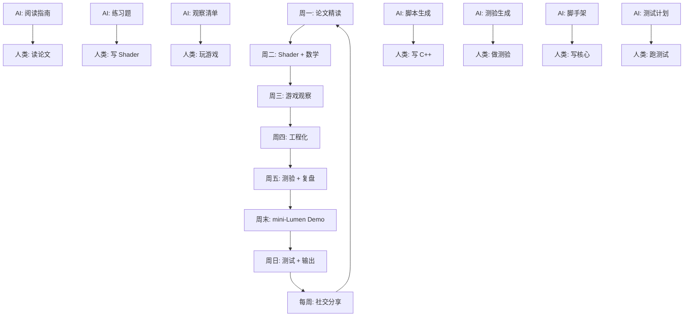

# Lumen 主题 — AI 任务总览

> 这是 Lumen 学习周期的「AI 任务控制塔」。每天打开对应日期的文件，执行 AI 任务，然后切换到人类任务。  
> **核心原则**：AI 只做脚手架，你来做硬工作。

---

## 快速导航

| 日期 | 主题 | AI 任务文件 | 人类核心任务 |
|------|------|------------|-------------|
| [[周一]] | 前沿技术输入 | [[01_Monday/AI-Tasks]] | 精读论文 + 源码追踪 |
| [[周二]] | 专项技能突破 | [[02_Tuesday/AI-Tasks]] | Shader 编程 + 数学推导 |
| [[周三]] | 强制休息/游玩 | [[03_Wednesday/AI-Tasks]] | 带开发者视角玩游戏 |
| [[周四]] | 工程化与工具链 | [[04_Thursday/AI-Tasks]] | C++ 实践 + 工具开发 |
| [[周五]] | 轻量复盘 | [[05_Friday/AI-Tasks]] | 测验 + 整理 + 规划 |
| [[周末]] | 项目实战 | [[06_Weekend/AI-Tasks]] | Demo 制作 + 博客输出 |
| [[周日]] | 项目收尾 | [[07_Sunday/AI-Tasks]] | 集成测试 + 复盘 |
| [[每周]] | 外部接触 | [[08_Weekly/AI-Tasks]] | 技术社交 + 开源贡献 |

---

## AI 执行纪律

### 每日启动流程（1 分钟）

1. 打开今日 AI 任务文件
2. 检查 "今日 AI 禁区" 列表
3. 按顺序执行 AI 任务，记录输出
4. 切换到人类任务，AI 退居参考位

### 人类验收标准

每个 AI 任务的输出必须经过你的检查：

- [ ] **准确性**：AI 有没有添加你不知道的技术细节？
- [ ] **完整性**：有没有遗漏你自己的关键想法？
- [ ] **风格**：润色后的文字是否还像你的声音？
- [ ] **理解**：你能向一个同事解释 AI 输出的每个要点吗？

如果不能通过验收，打回 AI 修正或手动修改。

---

## 本周 Lumen 学习地图

---

## 相关参考

- [[../References/AI-Augmentation-Reference]] — AI 辅助学习完整参考手册
- [[../../../99-Templates/论文笔记]] — 论文笔记模板
- [[../../../99-Templates/源码分析]] — 源码分析模板
- [[../../../Lumen-Quiz-Demo.html]] — Lumen 交互测验（HTML）
- [[../../../01-论文笔记库/Lumen-SIGGRAPH-2021]] — Lumen 论文笔记（示例）
- [[../../../02-引擎源码分析库/Unreal-Engine/UE5-VT-显存调度]] — VT 源码分析（示例）

---

## 每周更新日志

| 周 | 主题 | 状态 |
|----|------|------|
| W1 | Lumen 基础：论文 + 三层结构 | 🔄 进行中 |
| W2 | SDF 深入：生成算法 + 优化 | ☐ 待开始 |
| W3 | Radiance Cache：更新策略 + 球谐 | ☐ 待开始 |
| W4 | 集成实战：mini-Lumen 完整版 | ☐ 待开始 |

---

*This is a living document. Update it as the Lumen topic progresses.*
